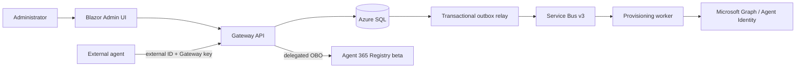

# A365 Custom Gateway development guide

`AGENTS.md` is the binding repository instruction file. Read it and the current
implementation checkpoint before making changes.

For bootstrap work, read the canonical
`.agents/skills/a365-bootstrap-delivery/SKILL.md` and its required references
completely, then use its bounded local ledger. Resume the ignored
`.agent-runtime/bootstrap-delivery/CURRENT.json` when it exists. After a Git pull
or fresh clone where that local file is absent, use the tracked
`docs/agent-continuation.md` checkpoint as the source-continuation fallback and
initialize the local ledger exactly as the canonical skill directs. Never
reconstruct current work from chat or troubleshooting history. Git transfers
neither `.agent-runtime/` nor retained legacy `.agents/runtime/` state. The
end-to-end gate is Plan, Build, OfflineValidate, Deploy, LiveValidate,
UpdateCheckpoint, then Complete. Unit tests alone never complete this gate.
A source change invalidates Build and every later gate; a documentation-only
change invalidates UpdateCheckpoint and Complete.

For delegated work, record one owner and an exact non-overlapping file or
read-only boundary, validation, stopping condition, and starting checkpoint.
The delegate records a structured handoff before reporting; the coordinator
records a receipt before relying on it. Delegate events never replace the
coordinator's current objective or gate.

## Product overview

The Gateway lets tenant administrators deploy one Azure control plane for many
external agents. Each registration receives a generated external ID, a one-time
Gateway key, a selected reusable Agent Identity blueprint, and a distinct child
Agent ID.

The API is the authorization and Registry boundary. The worker owns idempotent
Agent Identity provisioning and final verification. The Admin UI never performs
provider mutations directly.

## Non-negotiable design rules

- Preserve the N:N registration/blueprint/child/key binding.
- Preserve seven persisted workflow stage values and the v3 queue boundary.
- Keep Registry user-only, OBO-based, and limited to one POST with exact-ID
  recovery.
- Keep the API OBO path managed-identity assertion only.
- Use Entra-only SQL authentication and private network execution.
- Store only salted Gateway-key verifiers; never replay a clear key response.
- Treat provider calls and Service Bus delivery as retryable/ambiguous unless exact
  evidence proves otherwise.
- Keep Prompt Shields and Purview optional and registration-scoped.
- Keep Know Your Data fixed Group scope separate from blueprint Individual DLP.
- Never claim Microsoft completion, policy propagation, or runtime verdict from
  local state or configuration readback alone.

## Development workflow

1. Read `docs/implementation-status.md` and the relevant guide.
2. Inspect the current worktree and preserve unrelated changes.
3. Validate Microsoft contracts against current official documentation when an API,
   role, permission, version, or preview surface is involved.
4. Implement the smallest coherent change with focused tests.
5. Run broader Release, source, formatting, and documentation checks.
6. Update concise documentation when behavior or operator workflow changed.

Local tests and source checkpoints are source evidence, not deployment evidence
or live-readiness proof. Current authorized readback from the exact target is
required for deployment and live-function claims.

Do not copy volatile deployment IDs, digests, or queue counts into tracked public
files. Keep exact live evidence in ignored or access-controlled operator storage;
`docs/operations/development-deployment-status.md` records only the non-sensitive
live outcome. Concise verified test/build summaries may appear in
`docs/implementation-status.md` and `docs/agent-continuation.md` when needed for a
bounded handoff. Public READMEs explain only the durable user path.

## Bootstrap boundary

Windows users run `.\gateway.cmd setup`; macOS and Linux users run
`./gateway setup`. The canonical engine is `bootstrap/bootstrap.ps1`; lower-level
scripts are not alternate public installers. Bootstrap state is ignored, contains
safe identifiers only, and must not be deleted to force progress.

Full evaluation is the Quick-development default and prepares optional protection
capabilities with explicit acknowledgements. Core Gateway omits those dependencies.
Settings configures protection governance after bootstrap verification. Unavailable
optional authority must not close ordinary registration; choosing an unavailable
profile fails closed.

The protection redesign is implemented and offline-validated in source, but is not
deployed. Bootstrap now offers capability-only Full evaluation, Core Gateway, and
Custom presets; it prepares shared admission/infrastructure/authority and never
selects a SIT or authors KYD/DLP policy. Staging and production keep Registry beta
closed. Every registration creation requires a signed-in delegated
`Gateway.Administrator`, and actual Registry completion remains that
Administrator's user-only OBO action.

Role-aware Gateway Settings owns SIT inventory/selection, fixed KYD Group and
blueprint Individual DLP authoring/readback, defaults, and per-registration
protections. Its operations use dedicated `gateway-protection-admin-v1`, never the
registration queue. The immutable Admin UI image packages the downloadable Windows
companion; downloading it does not run it, and companion evidence is
non-authoritative until exact capability-bound provider verification of the
Purview automation identity, Key Vault, and certificate.

DLP `Ready` independently requires capability Installed, exact policy readback,
propagation, token roles, and runtime allow-and-block verdict evidence, plus current
SIT generation, exact blueprint/provider IDs, and timestamps. KYD remains fixed
enterprise-AI-apps Group, DLP remains blueprint Individual, and both remain on the
Application plane and fail closed.

Live E2E still requires fresh exact-target authority, a clean deployment, exactly
two new blueprints with one delegated-Administrator-created external registration
each, then independent observability, Prompt Shields, and DLP validation.

## Sensitive data

Never read or expose `.secret`/`.secrets`, clear Gateway keys, tokens, assertions,
authorization headers, certificate/PFX values, prompts, responses, or raw provider
bodies. Tests use synthetic non-secret values. Logs and errors contain safe
identifiers and correlation IDs only.

## Completion

A source change is complete after affected tests, full relevant gates, and
documentation pass. A deployment claim additionally requires authorized exact live
readback. A registration is `Active` only after final provider verification. Preview
dependencies remain described as preview even when development evidence succeeds.
