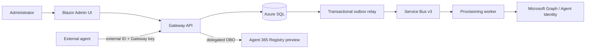

# A365 Custom Gateway development guide

`AGENTS.md` is the binding repository instruction file. Read it and the current
implementation checkpoint before making changes.

For bootstrap work, read the canonical
`.agents/skills/a365-bootstrap-delivery/SKILL.md` and its required references
completely, then use its bounded local ledger. Resume the ignored
`.agent-runtime/bootstrap-delivery/CURRENT.json` when it exists. After a Git pull
or fresh clone where that local file is absent, use the tracked
`docs/agent-continuation.md` checkpoint as the source-continuation fallback and
initialize the local ledger exactly as the canonical skill directs. Never
reconstruct current work from chat or troubleshooting history. Git transfers
neither `.agent-runtime/` nor retained legacy `.agents/runtime/` state. The
end-to-end gate is Plan, Build, OfflineValidate, Deploy, LiveValidate,
UpdateCheckpoint, then Complete. Unit tests alone never complete this gate.

## Product overview

The Gateway lets tenant administrators deploy one Azure control plane for many
external agents. Each registration receives a generated external ID, a one-time
Gateway key, a selected reusable Agent Identity blueprint, and a distinct child
Agent ID.

The API is the authorization and Registry boundary. The worker owns idempotent
Agent Identity provisioning and final verification. The Admin UI never performs
provider mutations directly.

## Non-negotiable design rules

- Preserve the N:N registration/blueprint/child/key binding.
- Preserve seven persisted workflow stage values and the v3 queue boundary.
- Keep Registry user-only, OBO-based, and limited to one POST with exact-ID
  recovery.
- Keep the API OBO path managed-identity assertion only.
- Use Entra-only SQL authentication and private network execution.
- Store only salted Gateway-key verifiers; never replay a clear key response.
- Treat provider calls and Service Bus delivery as retryable/ambiguous unless exact
  evidence proves otherwise.
- Keep Prompt Shields and Purview optional and registration-scoped.
- Keep Know Your Data fixed Group scope separate from blueprint Individual DLP.
- Never claim Microsoft completion, policy propagation, or runtime verdict from
  local state or configuration readback alone.

## Development workflow

1. Read `docs/implementation-status.md` and the relevant guide.
2. Inspect the current worktree and preserve unrelated changes.
3. Validate Microsoft contracts against current official documentation when an API,
   role, permission, version, or preview surface is involved.
4. Implement the smallest coherent change with focused tests.
5. Run broader Release, source, formatting, and documentation checks.
6. Update concise documentation when behavior or operator workflow changed.

Do not copy volatile deployment IDs, digests, or queue counts into tracked public
files. Keep exact live evidence in ignored or access-controlled operator storage;
`docs/operations/development-deployment-status.md` records only the non-sensitive
live outcome. Concise verified test/build summaries may appear in
`docs/implementation-status.md` and `docs/agent-continuation.md` when needed for a
bounded handoff. Public READMEs explain only the durable user path.

## Bootstrap boundary

Windows users run `.\gateway.cmd setup`; macOS and Linux users run
`./gateway setup`. The canonical engine is `bootstrap/bootstrap.ps1`; lower-level
scripts are not alternate public installers. Bootstrap state is ignored, contains
safe identifiers only, and must not be deleted to force progress.

The recommended minimal profile deploys the core Gateway. Optional Prompt Shields
and Purview can be configured after base verification. Their unavailable authority
must not close ordinary registration; choosing an unavailable profile fails closed.

## Sensitive data

Never read or expose `.secret`/`.secrets`, clear Gateway keys, tokens, assertions,
authorization headers, certificate/PFX values, prompts, responses, or raw provider
bodies. Tests use synthetic non-secret values. Logs and errors contain safe
identifiers and correlation IDs only.

## Completion

A source change is complete after affected tests, full relevant gates, and
documentation pass. A deployment claim additionally requires authorized exact live
readback. A registration is `Active` only after final provider verification. Preview
dependencies remain described as preview even when development evidence succeeds.
