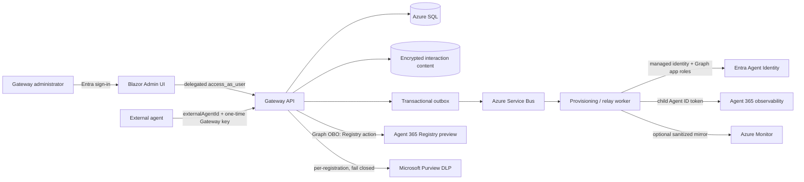
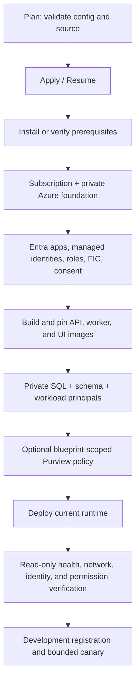

# A365 Custom Gateway

A365 Custom Gateway is an N:N broker for externally hosted AI agents. One Gateway
accepts many independent registrations. Each registration gets a generated external
agent ID and one-time Gateway API key, maps to one distinct Microsoft Entra Agent
ID, and selects one reusable Agent Identity blueprint.

Ordinary data-plane clients call the Gateway with their Gateway key. They do not
provide a managed-identity object ID or acquire an Entra token. The Gateway worker
uses managed identity plus one reusable FIC per blueprint to obtain each child Agent
ID's Agent 365 token. Agent 365 observability defaults on, sanitized Azure Monitor
mirroring is optional/off, and Purview remains independent per registration.

## Start here

- [`AGENTS.md`](AGENTS.md): shared safety/resume rules for Codex, Claude, Copilot,
  and humans.
- [`docs/implementation-status.md`](docs/implementation-status.md): current product,
  source, test, deployment, blocker, next-action, and completion checkpoint.
- [`docs/agent-guides/admin-ui.md`](docs/agent-guides/admin-ui.md): Admin UI contract.
- [`docs/agent-guides/provisioning.md`](docs/agent-guides/provisioning.md): Entra /
  Agent 365 workflow and rollout contract.
- [`docs/operations/development-deployment-status.md`](docs/operations/development-deployment-status.md):
  timestamped live-development evidence.
- [`docs/operations/entra-setup-runbook.md`](docs/operations/entra-setup-runbook.md):
  Entra roles, delegated scopes, OBO FIC, consent, and verification.
- [`docs/operations/upgrade-strategy.md`](docs/operations/upgrade-strategy.md): SQL,
  inert deployment, canary, and recovery sequence.
- [`bootstrap/README.md`](bootstrap/README.md): clean-subscription, resumable first
  deployment of the complete Gateway foundation and workloads.

Those documents distinguish current local source from deployed development state.
An operation page or passing local test does not independently prove a Microsoft
resource exists.

## Architecture at a glance



The control plane owns registrations, blueprint selection, feature configuration,
provisioning status, and credential lifecycle. The data plane accepts bounded
activity and completed prompt/response submissions. SQL-backed idempotency and rate
limits bind every request to one registration and key; accepted work enters the
transactional outbox before Service Bus delivery. Prompt/response content is never
rendered in the Admin UI and is stored only in the encrypted content store according
to the documented retention boundary.

## Current workflow v3

```mermaid
sequenceDiagram
    participant A as Administrator
    participant UI as Admin UI
    participant API as Gateway API
    participant W as Worker
    participant E as Entra / Graph
    participant R as Agent 365 Registry

    A->>UI: Register external agent
    UI->>API: Registration + selected/new blueprint
    API-->>UI: External ID + one-time Gateway key
    API->>W: gateway-provisioning-v3
    W->>E: Resolve blueprint, FIC, child Agent ID, OtelWrite
    W-->>API: Pause at 71% for delegated action
    UI->>API: Complete Registry action as signed-in Administrator
    API->>R: One creator-bound POST through OBO
    API-->>W: Persist accepted ID; enqueue final verification at 85%
    W->>E: Reverify identity, permissions, FIC, and token exchange
    W-->>API: Mark registration Active at 100%
```

The seven persisted stages are:

1. Resolve Blueprint
2. Ensure Blueprint Principal
3. Configure Gateway Federation
4. Create Agent Identity
5. Assign Agent 365 Access
6. Register in Agent 365 preview Registry
7. Verify Agent 365 Connection

The worker executes stages 1--5 and pauses at 71%. A signed-in
`Gateway.Administrator` uses the operation page's required action. The Gateway API
exchanges that user's API token for Microsoft Graph through OBO with exactly the
admin-consented delegated scopes `AgentRegistration.ReadWrite.All` and
`AgentRegistration.Read.All`. The API app authenticates as a confidential client
with a managed-identity signed assertion/FIC; it does not store a client secret.

Development now supports an explicitly configured continuous demo mode: registration
is admitted without an operator-opened exact-ID window, and the signed-in
Administrator UI invokes delegated Registry completion automatically when stage 6
becomes required. Staging and production remain closed by default and retain the
exact-bound, expiring external-ID and operation-ID controls. The continuous mode
does not bypass authentication, role checks, OBO, SQL locking, or the one-POST
Registry boundary.

The API records a creator-bound planned Registry ID, emits at most one Registry
POST, and persists the safe ID returned with HTTP 201 immediately (using the planned
ID only if the successful response omits one). The CLI-compatible payload includes
that `id` and the reviewed preview-provider `managedByAppId`; the Gateway external
ID is `sourceAgentId`, and the administrator `oid` is `createdBy`. The preview
Registry's immediate exact GET is not a reliable creation proof. Acceptance
completes stage 6 at 85% and queues only final worker verification. The worker does
not call Registry in v3; it independently verifies blueprint, principal, FIC, child
identity, OtelWrite assignment, and the two-stage Agent 365 token exchange before
`Active`.

An unknown POST outcome is reconciled only by exact GET of the persisted planned
ID; the POST is never repeated. A transient read permits creator-bound GET-only
repetition, while mismatch or nonrecoverable ambiguity is manual. Safe retry
preserves verified completed rows and never repeats a completed Registry boundary.

## Repository map

| Path | Responsibility |
|---|---|
| `src/Gateway.AdminUi` | Role-aware Blazor control plane and typed API client |
| `src/Gateway.Api` | Authenticated control/data-plane HTTP boundary and safe Problem Details |
| `src/Gateway.Application` | Commands, queries, validation, and orchestration policies |
| `src/Gateway.Domain` / `src/Gateway.Contracts` | Persistence-independent model and public contracts |
| `src/Gateway.Agent365` | Entra Agent Identity, Registry, token exchange, and OTLP adapters |
| `src/Gateway.Purview` | Graph v1.0 Purview policy evaluation adapter |
| `src/Gateway.Infrastructure` | SQL, locks, idempotency, rate limits, outbox, Service Bus, and Blob storage |
| `src/Gateway.Provisioning.Worker` | Idempotent workflow stages and data-plane relay |
| `src/ExternalAgent.Sample` | Minimal external client for bounded ingestion verification |
| `bootstrap` | Clean-subscription prerequisite, identity, infrastructure, build, deploy, and verify workflow |
| `deploy` / `tools` | Reviewed update, migration, canary, and incident-support operations |
| `tests` | Unit, UI, E2E, security, runtime, integration, and architecture gates |

## Current checkpoint

The continuous development path is **Active end to end** for both blueprint modes.
`gateway-e2e-auto-20260828` created blueprint
`79a71594-6435-4c64-a7bf-5f472a475792`, child Agent ID
`640f3b3a-1ff2-4ab5-b1a4-cfac59dd35de`, and Registry record
`9451d70c-71b6-45eb-9db5-4be8f05c6d04`; its safe retry operation
`6395ab47-e6c8-4584-8867-36c5c09f9475` completed at 100% after an explicit Graph
404 propagation retry. `gateway-e2e-purview-control-20260828` reused blueprint
`29fa5cc5-c42b-4bdc-8f99-d85a5b91ad01`, created child Agent ID
`954fec63-53a7-4556-abaa-67acf11956c8`, and completed operation
`099248a5-e1a3-4c50-a456-d0a04a6f1933` with Registry record
`b2bf22e4-3d2c-49b4-8ead-a003d2496dab`.

Both agents are visible and Available in Microsoft 365 Admin Center on platform
`A365CustomGateway`. Gateway activity and interaction requests return HTTP 202, the
v3 queue drains to zero active/scheduled, and the earlier live canary separately
proves two-stage child-token exchange and Agent 365 OTLP HTTP 200. Current queue
counts are v3 `0/0/9`, retained v2 `0/0/3`, and historical `0/0/2`; all DLQ entries
remain immutable evidence. The latest exact SQL snapshot predates the two continuous
canaries and is not represented as a current database count.

Purview DLP is now proven against the reusable blueprint boundary. The policy uses
`EnforcementPlanes Application` with the blueprint client ID as
`policyLocationApplication`; the distinct child Agent ID and blueprint remain in
`aiAgentInfo` for attribution. A benign completed interaction returned
`purviewProcessing: AuditLogged`, while a synthetic credit-card prompt returned
`status: Failed` and `purviewProcessing: Blocked` without queuing observability.
The live scope is intentionally mixed: `uploadText` is evaluated inline and
`downloadText` is submitted offline. The current completed-pair endpoint therefore
proves prompt DLP, not a pre-model response gate.

Historical v1/v2 and failed v3 attempts remain immutable evidence and must not be
replayed or deleted. SQL finalization remains unapplied. See the implementation and
deployment status documents for exact digests, correlations, test counts, retained
IDs, and the next safe action.

## Build and test

```powershell
dotnet build src/A365Gateway.slnx -c Release
dotnet test tests/Gateway.UnitTests -c Release
dotnet test tests/Gateway.AdminUi.Tests -c Release
dotnet test tests/Gateway.ObservabilityRuntime.Tests -c Release
dotnet test tests/Gateway.IntegrationTests -c Release
dotnet test tests/Gateway.EndToEndTests -c Release
dotnet test tests/Gateway.ArchitectureTests -c Release
dotnet test tests/Gateway.SecurityTests -c Release
dotnet format src/A365Gateway.slnx --verify-no-changes
```

Use the latest verified counts in the implementation status; do not copy counts
forward after source changes.

## Clean-subscription deployment

Use the repository-root [`bootstrap/`](bootstrap/README.md) entry point for a new
subscription or a deleted resource group. It installs/checks prerequisites, creates
the missing Azure foundation, configures Entra and a typed Agent ID seed blueprint,
builds immutable images, initializes an empty database, deploys the Admin UI, and
runs fail-closed read-back verification:

```powershell
Copy-Item bootstrap/config.example.json bootstrap/config.json
bootstrap/bootstrap.cmd -Mode Plan -Config bootstrap/config.json
bootstrap/bootstrap.cmd -Mode Apply -Config bootstrap/config.json -OpenBrowser
```

`config.json` is non-secret and should remain local. Runtime bootstrap state is
under ignored `.bootstrap/`. The tool has no destroy path and does not read
`.secrets`. Full Registry creation remains development-only because Microsoft's
direct create API is beta and unsupported for production.



The bootstrap is locally source-validated and resumable, but a disposable
clean-subscription `Apply` has not yet been captured as live evidence. That is the
next bootstrap proof point; do not infer it from the already-running development
resource group.

## Local UI

```powershell
dotnet run --project src/Gateway.AdminUi
```

Development URLs are normally `https://localhost:7198` and
`http://localhost:5261`. The Codex in-app browser may reject the workstation
development certificate even when an external browser trusts it.

## External-agent sample

[`src/ExternalAgent.Sample`](src/ExternalAgent.Sample) is a bounded console client,
not a mock AI loop. After a registration is `Active`, run it with the registration's
public external ID and the accountable tenant user's object ID:

```powershell
dotnet run --project src/ExternalAgent.Sample -- `
  --api-base-url https://ca-gateway-api-dev.mangodune-074310c6.koreacentral.azurecontainerapps.io/ `
  --external-agent-id agent-example `
  --tenant-user-object-id 00000000-0000-0000-0000-000000000000
```

The client reads the one-time Gateway key from a non-echoing prompt or redirected
standard input; never place the key in command arguments, environment variables, a
file, or documentation. It sends one activity (which drives sanitized OTel export)
and one AI-interaction message, expects HTTP 202 for both, and renders only safe
status/correlation evidence. HTTP 202 proves Gateway ingestion; Agent 365 landing
still requires the separate documented Defender `CloudAppEvents` verification.

## Security

`.secrets` is authorized private runtime configuration. Existing tooling may read
required values only through the non-echoing deployment path. Never print, log,
copy, document, alter, transmit, or commit its contents. Never persist or expose
clear Gateway keys, Microsoft tokens, managed-identity assertions, authorization
headers, prompts, or responses.

## Known boundaries

- Direct Agent 365 Registry creation is a beta, Global-cloud preview and is not
  claimed as production-supported. Development may opt in; staging/production
  remain closed by default.
- The current completed prompt/response API can enforce inline policy on the prompt
  and submit the response for offline evaluation. It is not a pre-model or
  response-before-release gate.
- Automated Microsoft-resource deletion/reconciliation, production multi-replica
  failover proof, SQL finalization, and full production capacity/backup/incident
  sign-off remain open work.
- Historical ambiguous operations and dead-letter messages are evidence. They must
  not be replayed, attached, disposed, or deleted as cleanup.
