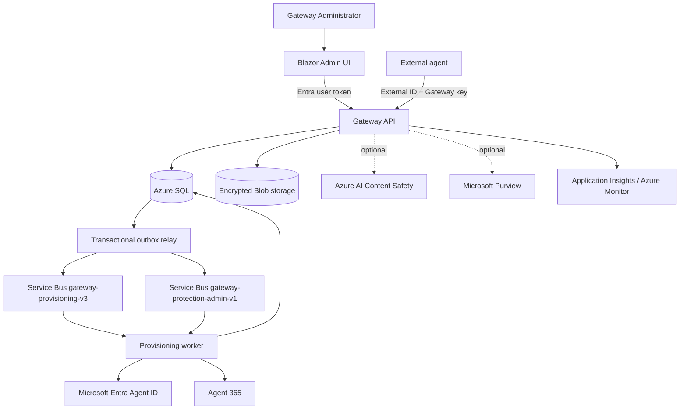

# A365 Custom Gateway

Contributors and automation follow the
[end-to-end execution contract](docs/agent-guides/end-to-end-execution.md):
bootstrap, deployment and independent live acceptance are distinct required
milestones for an end-to-end delivery. A source/test pass is not that delivery.

A365 Custom Gateway gives external agents one controlled path into Microsoft Agent
365. An administrator deploys the Gateway, registers an external agent against a
reusable Agent ID blueprint, and receives a Gateway external ID plus a one-time
ingress key. The agent then submits activity and interaction data through the
Gateway API without receiving an Entra token or managed-identity identifier.

Version `0.1.0-beta.2` is a prerelease source contract, not proof that this checkout
is deployed. The current source is ahead of the deployment evidence recorded in
[development deployment status](docs/operations/development-deployment-status.md),
and a Purview DLP allow/block pair has not been live-proven on a deployed build.

> **Delivery unfinished; follow the current continuation checkpoint.** Windows
> executor deployment integration is implemented and offline-validated, but the
> current installation has not completed deployment or independent live acceptance.
> Begin with [agent continuation](docs/agent-continuation.md) for the exact next
> action and validated evidence. This checkout is not a completed Full evaluation release.

The supported fresh-subscription installer is the repository-root `gateway`
launcher. It configures, plans, deploys, and verifies the complete Gateway. The
terminal launcher also supports checkpoint-aware Resume. A restarted Setup browser
process offers read-only review and a separate confirmation before remaining steps.
Completed mutations must not be replayed to force progress.

> The Agent 365 Registry dependency is currently a beta capability that Microsoft
> does not support for production use. **Quick development** defaults this
> deployment-wide capability on but requires explicit beta acknowledgement.
> Staging and production remain closed.

## Quick start

You need an Agent-365-enabled Microsoft Entra tenant, an Azure subscription, and an
administrator who can approve the Azure, Entra, and Agent ID changes shown by the
installer. On the workstation, install Git, the .NET 10 SDK, PowerShell 7, and Azure
CLI 2.76 or later.

Use an unused project namespace for a fresh deployment. Deleting an Azure resource
group does not delete its Entra applications. Plan checks the selected tenant's
API, Admin UI, selected Purview automation names, and API audience before What-If;
an existing identity without the exact bootstrap ownership marker blocks Plan.
This check never adopts or deletes an application.

Core Gateway setup and deployment run on Windows, macOS, and Linux. **Full
evaluation and Custom with Purview enabled require a Windows x64 workstation**:
Plan validates local executor packaging with Microsoft-signed PowerShell **7.6.5**
and Microsoft-signed ExchangeOnlineManagement **3.10.1**. Packaging follows
`PSModulePath` order and pins the exact installed manifest; another installed copy
is allowed, but an invalid or ambiguous first candidate is never skipped.
Generic PowerShell 7 is insufficient for that path. On macOS/Linux select
Core Gateway or Custom with Purview disabled before Plan.
Bootstrap prepares optional Purview identities, RBAC, certificate, Key Vault,
dedicated administration queue, and runtime prerequisites without choosing a
classifier or authoring policy.
Security & Compliance PowerShell operations using `Connect-IPPSSession` require
Windows for both interactive and unattended certificate authentication. Gateway
Settings offers a bounded Windows companion for the administrator connection.
Its independent provider verification and policy automation also need the supported
Windows executor; deployment and live proof remain unfinished.

```bash
git clone https://github.com/patrick-shim/a365-custom-gateway.git
cd a365-custom-gateway
az login
./gateway setup
```

On Windows, use `.\gateway.cmd setup` instead, from the required PowerShell 7.6.5
session when Purview is selected. Current executor packaging preserves its reviewed
IIS configuration automatically. When resuming an older accepted source snapshot
that fails while transforming its read-only `web.config`, use:

```powershell
$env:IsTransformWebConfigDisabled = 'true'
.\gateway.cmd setup
```

This session-only MSBuild setting preserves the executor's already-authored
[IIS configuration](src/Gateway.Purview.Executor/web.config). Its self-contained
executable and hosting model are explicit; automatic transformation otherwise tries
to rewrite the read-only file copied from the accepted source snapshot. Keep this
setting when restarting Setup to resume that deployment. It does not change the
reviewed configuration or relax source/checkpoint verification. See Microsoft's
[IIS publishing guidance](https://learn.microsoft.com/aspnet/core/host-and-deploy/iis/web-config?view=aspnetcore-10.0).

Keep the root [Directory.Build.props](Directory.Build.props) with the source: the
Admin UI container build requires it even when a local `dotnet build` succeeds
without it.

Setup opens a temporary browser UI on `127.0.0.1`, discovers the subscriptions
visible to the current Azure CLI session, and loads the selected subscription's
physical Azure regions into a dropdown. The
dropdown shows the friendly label and exact Azure name together—for example,
`Korea Central · koreacentral`—and stores only the canonical name. Setup writes the
reviewed non-secret `bootstrap/config.json`, proves the configured Azure SQL tier is
available in the selected region, runs an authenticated Azure What-If plan, and
waits for explicit confirmation before deployment. Complete any Microsoft sign-in
or consent windows that open during setup or deployment.

Setup offers three capability presets. **Full evaluation** is selected by default
for Quick development and includes Agent 365 Registry beta, Prompt Shields
infrastructure, and Purview prerequisites; each applicable beta, cost/quota, and
authority acknowledgement is explicit. **Core Gateway** omits Prompt Shields and
Purview. **Custom** selects those two independently. Registry beta remains closed
outside development.

```mermaid
flowchart LR
    clone[Clone repository] --> signin[Azure CLI sign-in]
    signin --> setup[Gateway Setup]
    setup --> plan[Review configuration and What-If]
    plan --> deploy[Confirm and deploy]
    deploy --> verify[Automatic verification]
    verify --> admin[Sign in to Admin UI]
    admin --> settings[Configure optional protections]
    settings --> register[Register external agent]
    register --> active[Registration Active]
    active --> use[Send through Gateway API]
```



For a terminal-only installation, run:

```bash
./gateway doctor
./gateway init
./gateway plan
./gateway apply --open
```

`doctor` and `plan` fail before resource creation if the configured Azure SQL
edition, service objective, 2 GiB size, or LRS storage path cannot be proven
available in the selected region. `plan` records a time-bounded acceptance of the
exact configuration, source, and What-If result. `apply` revalidates that acceptance
before changing anything. If an interruption occurs, correct the reported cause and
run `./gateway resume` on macOS/Linux or `.\gateway.cmd resume` on Windows; do not
delete `.bootstrap/` or start a second deployment.
Terminal Resume is the supported recovery path after Setup has closed or restarted.
The Setup browser's separate read-only Resume review and second confirmation do
not bypass source binding or authorize replay of completed mutations.

See the [bootstrap guide](bootstrap/README.md) for prerequisites, configuration,
automation, and recovery behavior.

A diagnosed publisher metadata mismatch with an existing successful execution has
a separate [bounded tooling reconciliation](docs/operations/publisher-metadata-recovery.md)
procedure. It never authorizes another publisher start or an arbitrary source upgrade.

## Sign in and register an agent

After verification, Setup shows the Admin UI and API endpoints. You can reopen the
recorded Admin UI later with:

```bash
./gateway open
```

Sign in with a user assigned the `Gateway.Administrator` app role, then use the
Admin UI to:

1. Select or create a reusable Agent ID blueprint.
2. Choose the registration's observability and optional protection settings.
3. Submit the registration and complete the administrator handoff when prompted.
4. Wait until the Gateway reports the registration as `Active`.
5. Copy the external agent ID and one-time Gateway key to the external agent's
   secret store. The clear key is not shown again.

Configuration review is separate from runtime protection readiness. When a saved
shared profile refers to an older SIT inventory, a current verified tenant
connection and catalog allow an explicit review of the new binding during
registration or editing. The shared-policy impact must still be acknowledged and
the exact choices confirmed before saving; refreshing inventory invalidates an
older review. Missing or expired authority, invalid selections, and unavailable
capabilities remain blocking. An `Active` agent with an Enforce policy still cannot
process prompts until that policy passes its independent runtime readiness checks.

The Gateway creates a distinct child Entra Agent ID for every registration. A
registration remains bound to its stored registration record, selected blueprint,
child Agent ID, external ID, and key lifecycle.

## Send a sample interaction

Use the API base URL and external agent ID shown by the Admin UI. The sample reads
the one-time Gateway key from a non-echoing prompt; never place the key on the
command line.

```bash
dotnet run --project src/ExternalAgent.Sample -- \
  --api-base-url https://YOUR-GATEWAY-API/ \
  --external-agent-id YOUR-EXTERNAL-AGENT-ID \
  --tenant-user-object-id YOUR-USER-OBJECT-ID \
  --message "Hello through the Gateway"
```

For every interaction, the sample calls `POST /api/v1/prompts:evaluate` first.
Generation requires HTTP 200 with `allowed: true`, a non-empty
`evaluationReceiptId`, and a well-formed, future `expiresAtUtc`. A denied,
unavailable, malformed, expired, or failed evaluation stops the flow.
The sample then submits Agent 365 activity/OTel data, invokes a fixed-response
**stub** (not a real model), and submits the completed interaction with that exact
receipt as `promptEvaluationReceiptId`. Replace only the stub callback in
`src/ExternalAgent.Sample/Program.cs` with your model call; keep it inside the
runner's gate. The deadline is checked again immediately before the callback,
after activity ingestion, using the server timestamp and the current clock rather
than a fixed client lifetime. No automatic retry occurs if it has expired.
This local guard cannot guarantee acceptance after generation; the server still
validates expiry and configuration at ingestion. Keep the client clock accurate.
HTTP 202 alone is not successful processing or proven downstream delivery;
inspect the processing receipt.

Clients do not need local Prompt Shields/Purview switches, Azure credentials, or a
redeployment when an administrator edits the registration's protection settings.
Always evaluate through the Gateway, even when both protections were previously
off. The Gateway uses the current registration: turning Prompt Shields off skips
Azure AI Content Safety, **not** the Gateway evaluation request. Purview DLP can
still require pre-model evaluation with Prompt Shields off. An allowed
`SimulationUnavailable` result is reported as a warning, not as disabled or proven
protection; the sample does not fabricate policy tips.

Evaluation proves a snapshot, not a configuration lock spanning the model call.
Receipts bind the registration's protection revision and effective protection
context, including active profile/capability evidence. A receipt issued with Prompt
Shields off or Purview in simulation cannot satisfy ingestion after enabling Prompt
Shields or enforcing Purview. Relevant protection changes, receipt expiry, or
consumption reject the supplied receipt; telemetry-only updates do not invalidate
it. Every supplied receipt is validated, including when protections are off.
Disabling and re-enabling an agent, or changing its downstream identity, advances
the protection revision; restoring the previous state does not revive old receipts.
Historical receipts without this binding are not upgraded into proof and are
rejected when supplied after the server upgrade.

The Gateway cannot retroactively stop external generation that already started.
The sample reports failure and never automatically re-evaluates, repeats generation,
or retries ingestion. Reconcile any uncertain outcome before deciding on a new
interaction; do not obtain a replacement receipt after the model call to bypass
rejection. See the [receipt contract](docs/api/api-contract.md#prompt-evaluation-and-receipt-bound-interaction).

Output is limited to fixed diagnostics, recognized processing states, and validated
correlation identifiers. The sample never logs the key, prompt, generated response,
receipt, provider bodies, or exception details. Use synthetic text in `--message`,
since command-line arguments may be visible to local process inspection or shell
history. Keep the one-time key in the existing non-echoing prompt, or securely
redirect stdin from a secret store without echoing it or putting it in arguments.

The complete HTTP contract is in [OpenAPI](docs/api/openapi.yaml).

## Optional runtime protections

Agent 365 observability is enabled by default for a registration. Azure Monitor
mirroring, Prompt Shields, and Microsoft Purview are separate choices.

| Capability | Default | What it does |
|---|---:|---|
| Agent 365 observability | On | Submits registration-scoped activities to Agent 365. |
| Azure Monitor mirror | Off | Mirrors selected telemetry to the Gateway's Azure Monitor path. |
| Prompt Shields | Off | Evaluates prompts before protected interaction ingestion by using Azure AI Content Safety with managed identity. |
| Microsoft Purview | Off | Evaluates configured activities and attributes them to the child Agent ID and reusable blueprint after its exact DLP profile is Ready. |

Bootstrap capability and Gateway configuration are different facts. Prompt Shields
requires bootstrap-provisioned Azure AI Content Safety and RBAC, while its default
and per-agent enablement belong in Settings. Purview bootstrap prepares only
identity, RBAC, certificate, Key Vault, dedicated queue, and runtime prerequisites.
A signed-in Administrator then uses Settings for tenant connection, SIT selection,
KYD, blueprint profiles/rules, propagation/readiness, and ongoing changes. Settings
keeps capability readback, policy readback, propagation, token roles, and runtime
allow/block evidence separate.

Purview policy provisioning uses two different Microsoft location contracts and
must not combine them:

- Know Your Data collection: the fixed tenant-wide enterprise-AI-apps location
  `ee1680d0-702f-4090-b26c-c49091e86531`, with `LocationType=Group` on the
  Application plane.
- DLP policy: the selected reusable blueprint application/client ID, with
  `LocationType=Individual` on the Application plane.

The [Purview runbook](docs/operations/purview-setup-runbook.md) describes the current
transition and the target role-aware flow. Policy readback does not prove token-role
propagation or a data-plane verdict, and no registration uses Purview unless an
administrator explicitly enables it after the exact blueprint profile is Ready.

## Architecture



The API is the authorization boundary. UI role checks improve usability but do not
replace API enforcement. Work is persisted in SQL and Service Bus so deployment and
provisioning can reconcile after interruption without assuming exactly-once
delivery.

## Operate an existing deployment

These commands are safe entry points from the repository root:

The table uses the macOS/Linux launcher. On Windows, replace `./gateway` with
`.\gateway.cmd`.

| Command | Purpose |
|---|---|
| `./gateway status` | Show local checkpoint/readiness state without Azure calls. |
| `./gateway verify` | Rerun read-only live deployment verification. |
| `./gateway resume` | Reconcile and continue an interrupted accepted deployment. |
| `./gateway diagnose` | Write a sanitized diagnostic bundle, including when configuration cannot load. |
| `./gateway open` | Open the recorded verified Admin UI endpoint. |

`verify` performs live provider reads, and `resume` can mutate the recorded target.
Before either action, confirm current authority for that exact tenant, subscription,
resource group, and operation; a prior deployment approval does not carry forward.

Use [operations](operations/README.md) for an existing environment and
[infrastructure](infrastructure/README.md) for the declarative asset map. The
bootstrap intentionally has no destroy, Registry replay, retained-message, or
cleanup command.

## Documentation

- [Documentation hub](docs/README.md)
- [Bootstrap and configuration](bootstrap/README.md)
- [Admin UI guide](docs/agent-guides/admin-ui.md)
- [Provisioning guide](docs/agent-guides/provisioning.md)
- [System architecture](docs/architecture/system-architecture.md)
- [Protection settings plan](docs/architecture/protection-settings-plan.md)
- [Backup and recovery](docs/operations/backup-recovery.md)
- [Incident response](docs/operations/incident-response.md)
- [Contributor continuation checkpoint](docs/agent-continuation.md)

Current implementation and deployment evidence lives in
[implementation status](docs/implementation-status.md) and
[development deployment status](docs/operations/development-deployment-status.md).
Those files are engineering checkpoints, not installation instructions.
