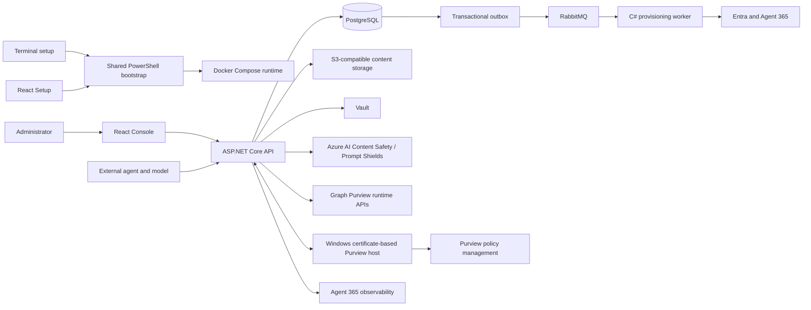
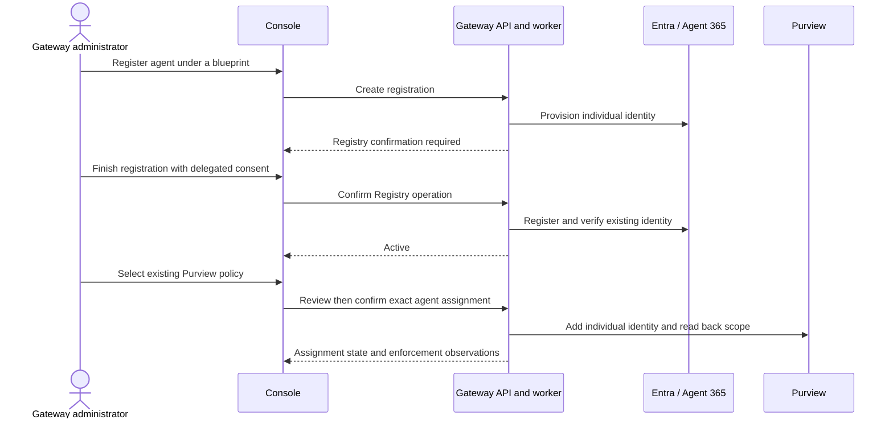
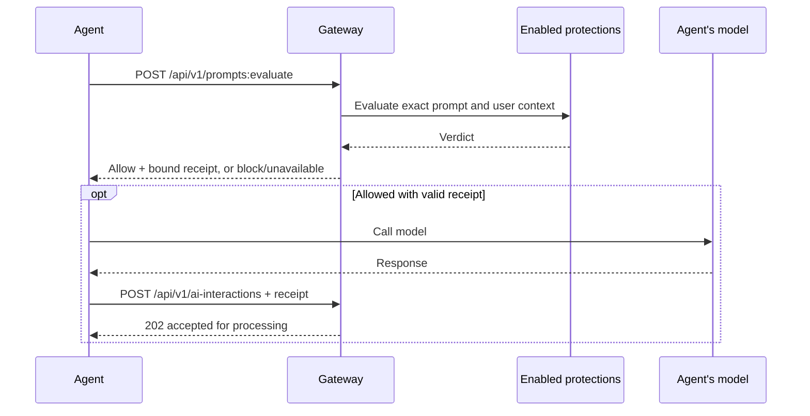

# A365 Custom Gateway

Connect independently hosted AI agents to Microsoft Entra agent identities, Agent 365 observability, Microsoft Purview DLP, and Prompt Shields. Agents keep their own hosting and model calls; the gateway provides registration, scoped credentials, pre-model evaluation, and interaction/activity ingestion.

## What the gateway does

- Registers each agent with an individual Entra agent identity under a reusable blueprint and guides an administrator through Agent 365 Registry confirmation.
- Issues revocable, per-agent API keys; clear keys are returned only once.
- Evaluates prompts before an external model runs, with independently configurable Prompt Shields and Purview enforcement.
- Discovers **existing Purview policies** and adds the selected **individual agent identity** to their application locations. It preserves other targets and policy definitions. Policy owners manage classifiers, sensitive information types, rules and exclusions in Purview.
- Records provisioning, assignment and protection state separately. Queued work, completed assignments and verified enforcement have different meanings.
- Provides a React administrator Console with persistent light/dark theme, and equivalent terminal and React bootstrap interfaces.

## Architecture


```mermaid
flowchart LR
    TUI[Terminal setup] --> Bootstrap[Shared PowerShell bootstrap]
    Setup[React Setup] --> Bootstrap
    Bootstrap --> Runtime[Docker Compose runtime]
    Admin[Administrator] --> Console[React Console]
    Console --> API[ASP.NET Core API]
    Agent[External agent and model] --> API
    API --> DB[(PostgreSQL)]
    DB --> Outbox[Transactional outbox]
    Outbox --> Bus[RabbitMQ]
    Bus --> Worker[C# provisioning worker]
    Worker --> Entra[Entra and Agent 365]
    API --> Objects[S3-compatible content storage]
    API --> Vault[Vault]
    API --> Shield[Azure AI Content Safety / Prompt Shields]
    API --> Graph[Graph Purview runtime APIs]
    API <--> Catalog[Windows certificate-based Purview host]
    Catalog --> SCC[Purview policy management]
    API --> OTel[Agent 365 observability]
```

The API and worker use .NET 10. PostgreSQL owns registration, protection, receipt, audit and outbox state. Docker Compose supplies the database, RabbitMQ, Vault and S3-compatible storage. Microsoft services provide identity, governance and observability. The Purview management host runs on Windows with a dedicated certificate identity; its signed catalog and authenticated assignment queue are separate from runtime Graph `processContent` calls.

The bundled Compose configuration is for local development: loopback ports, development service credentials and Vault development mode. Production hardening, TLS termination, durable secret management and host service supervision require deployment-specific work. Registry beta registration is explicitly gated to development; the source does not claim production registration readiness.

## Set up and run

Use Windows for the complete certificate-based Purview setup. Install PowerShell 7, .NET 10 SDK, Git, Azure CLI, and Docker with Linux containers. Node.js/npm are needed for local frontend development; application image builds install their frontend dependencies inside Docker. Bootstrap checks additional Microsoft management dependencies and sign-in requirements.

For Linux development prerequisites, use the [Ubuntu dependency installer](tools/scripts/setup/README.md). It supports Ubuntu 22.04/24.04/26.04 x86-64, installs the required tools, and verifies them. This does not remove the current Windows requirement for Purview management.

From the repository root:

```powershell
.\gateway.cmd init
.\gateway.cmd plan
.\gateway.cmd apply
.\gateway.cmd verify
.\gateway.cmd open
```

`init` collects tenant and identity settings, **Content Safety provisioning choices**, and **Purview connection/management permissions**. `plan` presents the exact changes and binds acceptance to source and configuration. `apply` provisions and starts that accepted configuration. `verify` checks the running endpoints. Alternatively, `.\gateway.cmd up` combines configuration, review, apply and verification. `.\gateway.cmd gui` opens the React installer using the same engine and configuration.

Start with [bootstrap instructions](bootstrap/README.md) and [configuration example](bootstrap/config.example.runtime.json). Local configuration lives in ignored `bootstrap/config.json`; generated credentials and checkpoints live in ignored `.bootstrap/`. Keep these files secure and preserve them across normal rebuilds. Never commit agent keys or generated environment files.

Default local endpoints:

| Endpoint | Purpose |
| --- | --- |
| [Console](http://127.0.0.1:5081) | Agent administration, existing policies and connection diagnostics |
| [Interactive API reference](http://127.0.0.1:5081/docs) | Scalar documentation with request execution against the running gateway |
| [API reference directly](http://127.0.0.1:5080/docs) | Same reference on the API listener |
| [OpenAPI JSON](http://127.0.0.1:5080/openapi/v1.json) | Generated machine-readable contract |
| [OpenAPI YAML](http://127.0.0.1:5080/openapi/v1.yaml) | Generated YAML contract |

Ports are configurable. The Console sidebar links to the API reference. The published schema is readable without a token; protected operations still require their documented credentials and authorization.

## Registration and protection flow


```mermaid
sequenceDiagram
    actor Admin as Gateway administrator
    participant Console
    participant API as Gateway API and worker
    participant Entra as Entra / Agent 365
    participant Purview
    Admin->>Console: Register agent under a blueprint
    Console->>API: Create registration
    API->>Entra: Provision individual identity
    API-->>Console: Registry confirmation required
    Admin->>Console: Finish registration with delegated consent
    Console->>API: Confirm Registry operation
    API->>Entra: Register and verify existing identity
    API-->>Console: Active
    Admin->>Console: Select existing Purview policy
    Console->>API: Review then confirm exact agent assignment
    API->>Purview: Add individual identity and read back scope
    API-->>Console: Assignment state and enforcement observations
```

An assigned policy is not automatically proof that blocking has propagated. Verify normal allow and synthetic-sensitive block through the gateway. Verify a same-blueprint sibling independently, including its policy scope; other policies may also apply. Settings contains ongoing Purview diagnostics. Initial connection setup belongs to bootstrap.

## Call the agent API

Administrative endpoints use an Entra **access token for the Gateway API** with the required gateway role. Agent endpoints use a **gateway-issued agent key**. Both use `Authorization: Bearer`; these credentials are not interchangeable. Use HTTPS outside the allowed local loopback development configuration.


```mermaid
sequenceDiagram
    participant Agent
    participant Gateway
    participant Protection as Enabled protections
    participant Model as Agent's model
    Agent->>Gateway: POST /api/v1/prompts:evaluate
    Gateway->>Protection: Evaluate exact prompt and user context
    Protection-->>Gateway: Verdict
    Gateway-->>Agent: Allow + bound receipt, or block/unavailable
    opt Allowed with valid receipt
        Agent->>Model: Call model
        Model-->>Agent: Response
        Agent->>Gateway: POST /api/v1/ai-interactions + receipt
        Gateway-->>Agent: 202 accepted for processing
    end
```

PowerShell example (set `GATEWAY_AGENT_KEY`, `GATEWAY_EXTERNAL_AGENT_ID` and `GATEWAY_TENANT_USER_ID` securely in your environment). This evaluates a normal prompt and submits a **simulated** response. Replace the marked line with your model call only after the allow gate:

```powershell
$base = 'http://127.0.0.1:5080'
$headers = @{ Authorization = "Bearer $env:GATEWAY_AGENT_KEY"; 'Idempotency-Key' = [guid]::NewGuid().ToString() }
$request = @{
    externalAgentId = $env:GATEWAY_EXTERNAL_AGENT_ID
    interactionId = [guid]::NewGuid().ToString()
    occurredAtUtc = [DateTime]::UtcNow.ToString('o')
    userContext = @{ tenantUserObjectId = $env:GATEWAY_TENANT_USER_ID }
    prompt = @{ contentType = 'text/plain'; content = 'Explain what a gateway does.' }
}
$evaluation = Invoke-RestMethod "$base/api/v1/prompts:evaluate" -Method Post -Headers $headers -ContentType 'application/json' -Body ($request | ConvertTo-Json -Depth 8)
if (-not $evaluation.allowed -or -not $evaluation.evaluationReceiptId) { throw 'Model call not authorized.' }

$modelResponse = 'A gateway connects services.' # Replace with your model call.
$request.sessionId = $null
$request.model = $null
$request.metadata = $null
$request.response = @{ contentType = 'text/plain'; content = $modelResponse }
$request.promptEvaluationReceiptId = $evaluation.evaluationReceiptId
$headers['Idempotency-Key'] = [guid]::NewGuid().ToString()
Invoke-RestMethod "$base/api/v1/ai-interactions" -Method Post -Headers $headers -ContentType 'application/json' -Body ($request | ConvertTo-Json -Depth 8)
```

Receipt consumption requires matching agent, interaction, prompt, user context and timestamp, current protection state, and an unexpired receipt. A block returns `403`; unavailable required protection fails closed with `503`. Do not call the model after either response. Preserve a request's UUID v4 `Idempotency-Key` for its retries; use a different key for a different operation. `202` means accepted for processing, not confirmed appearance in a Microsoft destination.

For activity batches, credential operations, pagination, assignment review/confirmation and concurrency headers, use the [API contract](docs/api/api-contract.md) and [generated schema](docs/api/openapi.yaml). The [C# sample agent](src/ExternalAgent.Sample/) exercises the integration with a model stub.

## Repository and operations

| Directory | Responsibility |
| --- | --- |
| `src/` | API, application/domain/contracts, infrastructure, Microsoft adapters, worker and Purview host |
| `web/console/` | Administrator UI |
| `web/setup/`, `tools/Gateway.Setup/` | React installer and its local host |
| `bootstrap/` | Shared setup engine, configuration schema and tests |
| `deploy/runtime/` | Compose runtime and container configuration |
| `infrastructure/bicep/` | Optional Content Safety provisioning only |
| `src/ExternalAgent.Sample/` | External-agent integration sample |
| `tests/`, `tools/scripts/` | Regression checks and explicit operator diagnostics |
| `docs/`, `operations/` | Architecture, API and operating instructions |

Use [runtime operations](docs/runtime/README.md) for rebuilds and diagnostics, [validation instructions](tests/README.md) for executable checks, and the [documentation index](docs/README.md) for detailed design. Process health, registration readiness, protection enforcement and downstream visibility must be verified separately.

**Settings → Manage Agents** supports selecting multiple agents to **Disable** or **Enable** gateway access, with confirmation and individual results. Disable rejects new prompts, activities (including batches), and AI interactions on this gateway; it does not change Agent 365 registration, Entra identity, or protection settings. Previously accepted work may finish. Disabled status appears in the agent list and detail page, and testing is unavailable until enabled. Registered agents can also be permanently deregistered here. Select multiple agents, review the selected names and Registry IDs, and type `DELETE` to confirm. The Console shows progress and results for each agent. The gateway blocks runtime access immediately and verifies removal from the Agent 365 Registry before removing the local registration. Unconfirmed deletions remain visible for retry. Entra identities, shared blueprints, Purview policies and audit history are retained. See [the API contract](docs/api/api-contract.md#permanently-deregister-registered-agents) for the confirmation and retry contract.

Use **Test Agent** on an active agent's list row or detail page to send a prompt through the real gateway APIs using its registered API key. The side panel reports protection decisions, telemetry acceptance and failures, and uses a clearly labeled simulated response without invoking a model. Keys are not saved. Portal delivery is distinguished from gateway acceptance; see [Console agent testing](docs/api/api-contract.md#test-a-registered-agent-from-the-console).
