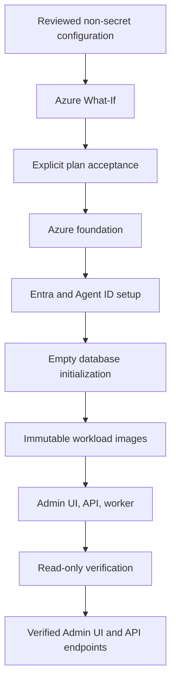

# A365 Gateway bootstrap

The bootstrap is the supported deployment system for a new A365 Custom Gateway. It
owns the path from non-secret configuration through Azure What-If, explicit plan
acceptance, Azure and tenant capability provisioning, database initialization,
immutable image deployment, and final verification.

Bootstrap is capability-only: mutable protection governance belongs in role-aware
Gateway Admin Settings. The source implements this split; it has not yet been
deployed or live-verified. See the
[protection settings plan](../docs/architecture/protection-settings-plan.md).

Run it through `./gateway` on macOS/Linux or `.\gateway.cmd` on Windows. The launcher
delegates to `bootstrap/bootstrap.ps1`; lower-level scripts are not alternate
installers.

## What it deploys

The bootstrap creates one named resource group containing the Gateway's Azure
foundation and workloads, then creates the required tenant-side identity objects.
The deployed system includes:

- Azure Container Apps for the Admin UI, API, and provisioning worker;
- Azure Container Registry and immutable workload images;
- Azure SQL, Service Bus, Blob storage, Key Vault, private networking, logs, alerts,
  and Application Insights;
- Entra applications, app roles, managed identities, federated credentials, and
  the seed Agent ID blueprint;
- the ordered Gateway database schema; and
- optional Azure AI Content Safety and its managed-identity RBAC; and
- optional Purview identity, RBAC, certificate, Key Vault, and runtime
  prerequisites.

This list ends at capability preparation. It does not include tenant authority
connection, SIT choice, KYD or DLP policy authoring, propagation, or runtime
readiness.

After exact deployment readback, bootstrap emits and re-reads one strict 19-key
`BootstrapCapabilities` environment contract. The inert API starts with the
contract disabled and all facts blank. The verified runtime API receives only the
ownership/source/time-bound Installed or NotInstalled snapshot. Startup validates
the complete shape and synchronizes capability rows under a SQL application lock;
that synchronization does not claim policy, propagation, token-role, or verdict
readiness.



## Prerequisites

- Git
- .NET 10 SDK
- PowerShell 7 (`pwsh`)
- Azure CLI 2.76 or later (`az`)
- an enabled Azure subscription in the target Microsoft Entra tenant
- an Azure account with Subscription Owner, or Contributor plus permission to make
  the role assignments shown by Plan
- an administrator able to approve the Entra and Agent ID changes
- Agent 365 tenant eligibility and licensing
- for optional Purview capability preparation, authority to create the reviewed
  identities, RBAC, certificate, Key Vault, and runtime prerequisites. Later tenant
  connection and policy work requires a signed-in `Gateway.Administrator` with the
  applicable Security & Compliance roles. Provider operations that require
  `Connect-IPPSSession` remain interactive and Windows-only

The installer uses official Microsoft sign-in surfaces. It never asks you to paste
an Azure password, access token, client secret, certificate, or Gateway key into its
configuration.

## Guided deployment

From the repository root:

```bash
az login
./gateway setup
```

On Windows PowerShell or Command Prompt, run:

```powershell
az login
.\gateway.cmd setup
```

Setup listens only on an ephemeral `127.0.0.1` port. It lets you select a
subscription visible to Azure CLI, loads that subscription's physical Azure
locations into a dropdown, discovers compatible Agent 365 manager applications,
and lets you choose one of three deployment-capability presets:

- **Full evaluation** is recommended and selected by default for Quick development.
  It includes Agent 365 Registry beta, Prompt Shields infrastructure, and Purview
  prerequisites.
- **Core Gateway** includes no Prompt Shields or Purview dependency. In Quick
  development it retains the deployment-wide Registry beta capability; staging and
  production keep that boundary closed.
- **Custom** independently includes or excludes Prompt Shields and Purview
  prerequisites. It cannot open Registry beta in staging or production.

Registry beta, Prompt Shields cost/quota, and Purview authority each require their
applicable explicit acknowledgement before Plan. A checked capability does not
enable every registration or prove runtime readiness. The installer remains supported on
Windows, macOS, and Linux. Region labels are paired with their canonical Azure
values—for example,
`Korea Central · koreacentral`—and the configuration stores `koreacentral`. Setup
does not accept a free-text region or silently choose one. Only after every required
selection has current proof does Setup atomically write `bootstrap/config.json`.
It then runs Plan, displays the exact deployment boundaries, and requires a second
explicit confirmation before Apply. If an accepted deployment later stops, Setup
offers a read-only resume review first. That review runs its own process, installs
nothing, changes no Azure, Entra, Agent 365, SQL, or policy resource, and returns
one accepted plan fingerprint plus a single-use authorization. Only then does Setup
offer a separate Resume confirmation. This path is implemented and covered by
tests; it has not yet been exercised in a hosted browser against preserved stopped
state, so use the terminal Resume path for recovery evidence.

Keep the terminal open. Deployment may hand control to official Microsoft browser
windows for refreshed Azure, Entra, or Agent ID authentication. Setup closes after
completion and does not become part of the hosted Gateway.

## Terminal deployment

The same deployment can be run without the setup UI:

```bash
./gateway doctor
./gateway init
./gateway plan
./gateway apply --open
```

Windows uses the same command names through the root launcher:

```powershell
.\gateway.cmd doctor
.\gateway.cmd init
.\gateway.cmd plan
.\gateway.cmd apply --open
```

`init` interactively creates `bootstrap/config.json`. You can instead copy
`bootstrap/config.example.json`, replace every placeholder, and pass a different
file with `--config PATH`.

### Command reference

| Command | Behavior |
|---|---|
| `setup` | Start the temporary loopback-only setup UI. |
| `up` | Create configuration if needed, Plan, confirm, Apply/Resume, and Verify. |
| `init` | Create a reviewed non-secret configuration interactively. |
| `doctor` | Check tools, configuration, Azure CLI account, and subscription readiness. |
| `plan` | Validate inputs, compile Bicep, and run authenticated Azure What-If. |
| `apply` | Apply an accepted current plan and run final verification. |
| `resume` | Reconcile and continue an interrupted accepted plan from the terminal. |
| `status` | Show local checkpoint/readiness state without Azure calls. |
| `verify` | Rerun read-only deployment verification. |
| `open` | Open the recorded verified Admin UI HTTPS endpoint. |
| `diagnose` | Write a sanitized diagnostic bundle. |

Narrow recovery and upgrade commands also appear in `./gateway --help`. Use them
only when the matching failure boundary or runbook explicitly calls for them; they
are not alternate installation paths.

Common options include `--config PATH`, `--json`, `--non-interactive`, `--yes`,
`--expected-plan-fingerprint SHA256`, `--open`, and `--no-install`. Run
`./gateway --help` for the exact current surface.

## Configuration

`bootstrap/config.json` is non-secret and ignored by Git. The JSON schema is
`bootstrap/config.schema.json`; the example is `bootstrap/config.example.json`.
Configuration selects:

- the exact subscription and tenant;
- environment, canonical Azure location, project name, resource group, and alert
  email;
- SQL service tier;
- seed blueprint name and reviewed manager-application allowlist;
- the deployment-wide Agent 365 Registry beta capability; and
- optional Prompt Shields and Purview capability prerequisites.

The deployment profile matters. **Quick development** defaults the beta Registry
path on but requires an explicit acknowledgement before Plan so a registration can
reach Gateway-reported `Active`. Staging and production keep Registry creation
closed.

Do not put credentials, tokens, Gateway keys, prompt/response content, or
certificate material in configuration. Purview capability configuration records
only non-secret identity and Key Vault references; certificate material is loaded
through its approved non-echoing runtime path.

### Changing configuration after a deployment has started

A deployment state is bound to three generations: its deployment identity, its
configuration, and the bootstrap source that produced its evidence.

Deployment identity is immutable for the life of a state file. It is exactly
`subscriptionId`, `tenantId`, `environment`, `location`, `projectName`, and
`resourceGroupName`. Changing any of them means the recorded evidence describes
different Azure objects, so bootstrap refuses to load that state and names the
fields that moved.

For every other setting, bootstrap can detect and record a fingerprint-only
configuration change while retaining prior evidence for diagnosis. That
reconciliation is not authorization to reconfigure: an accepted plan is bound to
the original fingerprint, a deployment with checkpoints cannot receive a fresh
Plan, and Resume cannot use a changed configuration. Preserve the existing state
and use a new isolated deployment identity for changed settings.

## Plan, Apply, Resume, Verify

Bootstrap is a resumable state machine:

1. `plan` validates configuration and source, compiles Bicep, runs authenticated
   subscription-scope What-If, and shows imperative tenant operations. Before
   What-If, it proves the configured SQL edition, service objective, 2 GiB size, and
   LRS storage path are available in the selected Azure region.
2. Explicit acceptance binds the exact plan fingerprint, configuration, source,
   target, and What-If prediction for a limited time.
3. `apply` revalidates that binding before mutation and writes safe checkpoint
   evidence after each verified action.
4. `resume` reconciles completed checkpoints and continues only work that remains
   safe for the same accepted plan.
5. `verify` reads back the deployed boundary without creating or updating it.

Terminal Resume is supported. The engine runs a read-only checkpoint review and then
requires both the accepted-Plan fingerprint and the resulting Resume authorization
fingerprint in a separately authorized process. The local Setup UI performs that
same two-process exchange after Setup restarts: it starts one read-only review
without `-Yes`, holds the returned authorization only in memory for a single
confirmation, and discards it on restart, a changed checkpoint, another command, a
failed review, or cancellation. That browser path has not yet been validated against
preserved stopped state, so do not use a restarted browser session as recovery
evidence until it has.

State and sanitized evidence live under ignored `.bootstrap/`. They may contain
tenant, subscription, resource, application, principal, image-digest, and
fingerprint identifiers. They never contain credentials, access tokens, clear
Gateway keys, prompts, responses, or provider bodies.

For automation, create and review a fresh JSON plan, then require the exact emitted
fingerprint at the mutation gate:

```bash
./gateway plan --config bootstrap/config.json --json --non-interactive
./gateway up --config bootstrap/config.json --json --non-interactive --yes \
  --expected-plan-fingerprint sha256:REVIEWED_FINGERPRINT
```

The second command stops before mutation if source, configuration, target, or
What-If output changed.

The region dropdown is the selected subscription's Azure Resource Manager inventory
of physical locations. Visibility in that inventory is not proof that every service
or SKU is available there. `doctor`, `plan`, and the pre-mutation Apply revalidation
use the Azure SQL regional capabilities endpoint for the exact configured SQL path;
an unavailable or unverified path stops safely and asks you to choose another
dropdown region.

## Optional runtime protections

Prompt Shields and Purview are optional and independent.

### Prompt Shields

Select the Prompt Shields capability to deploy Azure AI Content Safety and authorize
the Gateway API managed identity. The account has local authentication disabled;
bootstrap does not provision or store an account key. Registration defaults and
per-agent enablement belong in Gateway Settings.

### Microsoft Purview

Select the Purview capability only to prepare the reviewed identities, Graph and
compliance RBAC, certificate and Key Vault path, and runtime prerequisites. In the
implemented source, bootstrap neither connects tenant policy authority nor
inventories SITs nor authors policy.

After deployment, a signed-in `Gateway.Administrator` uses Gateway Settings to
connect the exact tenant, load its live SIT inventory, make an explicit no-default
selection, configure and read back the independent KYD Group and blueprint
Individual DLP profiles, and prove propagation and runtime readiness. Provider
steps that require Security & Compliance PowerShell remain interactive and
Windows-only; the core bootstrap and capability preparation remain cross-platform.
The downloadable companion is packaged in the immutable Admin UI image and runs
locally only after the Administrator explicitly downloads and invokes it.

Purview uses two distinct Application-plane locations:

| Purpose | Location | Source | Type |
|---|---|---|---|
| Know Your Data collection | Fixed tenant-wide enterprise-AI-apps location `ee1680d0-702f-4090-b26c-c49091e86531` | Entra | `Group` |
| DLP policy/rule | Selected reusable blueprint application/client ID | Entra | `Individual` |

The KYD collection is not blueprint-scoped, and the DLP policy is not Group-scoped.
Exact readback proves configuration, not policy propagation or a data-plane
allow/block verdict. Follow the [Purview setup runbook](../docs/operations/purview-setup-runbook.md)
for roles, certificate handling, and bounded validation.

## Recovery

If Plan stops, the setup UI identifies the safe boundary that stopped—configuration,
local prerequisites/Bicep, Azure account or region selection, Azure SQL regional
availability, Azure What-If, Agent ID blueprint validation, or changing inputs.
Correct that item, select **Review and run Plan again**, review the current inputs,
and confirm Plan again. Apply and Resume remain unavailable until Plan produces one
apply-ready fingerprint.

`doctor` checks the Windows Azure CLI/Bicep path through the same command boundary
used by Plan and Apply. `diagnose` can still write a safe bundle when configuration is
missing or invalid; in that case it reports configuration as unavailable and includes
no deployment identifiers.

If an accepted deployment stops:

```bash
./gateway status
./gateway diagnose
./gateway resume
```

On Windows PowerShell or Command Prompt, use:

```powershell
.\gateway.cmd status
.\gateway.cmd diagnose
.\gateway.cmd resume
```

Review the reported failure and correct its cause before Resume. Do not edit or
delete `.bootstrap/`, manually replay completed tenant operations, access retained
messages, or run a second bootstrap against the same deployment.

If Setup itself was closed or restarted, the terminal sequence above is the verified
path. Setup also implements the equivalent browser exchange—a read-only Resume
review, an in-memory single-use authorization handoff, and a separate
confirmation—but that path is not yet validated against preserved stopped state.

Database recovery, one-shot manual database repair, and Admin UI upgrade are
deliberately bounded commands. Use them only when the bootstrap identifies that
exact eligible state and follow the linked [operations guide](../operations/README.md).

If a completed resource group was deleted, preserved tenant objects and deleted
resource-group credentials no longer share one lifecycle. Bootstrap refuses to
replay that state. Use a separately reviewed disaster-recovery procedure or a new
isolated deployment.

Bootstrap has no destroy mode and does not authorize cleanup, historical replay,
retained-message access, or SQL finalization.

### Reading the exact provider cause

A stopped step names the provider error codes and the correlation ID it received,
for example `Provider error codes: InvalidTemplateDeployment >
CanNotCreateMultipleFreeAccounts.` Those bounded identifiers appear in the terminal,
in the Setup timeline, and in the persisted checkpoint.

The unfiltered provider text stays local. Bootstrap writes it to
`.bootstrap/diagnostics/`, which is ignored by Git and readable only by the account
that ran the command. Read it yourself when a code is not enough; never paste it into
an issue, a chat, or a shared log, because provider bodies can contain identities,
headers, and other tenant data.

### Prompt Shields free-tier capacity

Azure allows one free Cognitive Services account per account type per subscription.
If `promptShield.enabled` is `true` with a free `skuName` such as `F0` and another
free Content Safety account already exists anywhere in the subscription, ARM rejects
the whole workload template during preflight and records no deployment, so there is
nothing to read back.

Bootstrap detects that conflict read-only during Plan and again before the workload
deployment, and names the conflicting account.

A deleted account still counts. Deleting a Content Safety account, or the resource
group that holds it, leaves it *soft-deleted*: it keeps its free-tier slot for the
rest of its retention window and never appears in a resource listing. A subscription
that looks completely clean can therefore fail every retry with the identical
`CanNotCreateMultipleFreeAccounts` rejection. List whatever still holds a slot with
`az cognitiveservices account list-deleted -o table`.

If Plan detects the conflict before checkpoints exist, either choose a paid SKU or
disable Prompt Shields, then run Plan again. If Apply detects a new conflict after
checkpoints exist, changing either setting invalidates the accepted plan and cannot
authorize Resume; preserve the state and use a new isolated deployment identity.
Keeping the accepted plan and resuming requires the conflicting slot to be released:

- purge the named account to release its slot, with `az cognitiveservices account
  purge --location <region> --resource-group <group> --name <account>`.

Purging is destructive and requires separate current authorization for that exact
soft-deleted account; the bootstrap never performs it.

### Starting over from a clean initial state

Resume continues the deployment you already own. When you instead want the very
first state again, create a *new* deployment identity rather than repointing
preserved state at existing resources:

1. Preserve the current deployment, configuration, and `.bootstrap/` evidence.
   Bootstrap never deletes existing Azure or tenant resources.
2. Move the existing configuration aside rather than editing it in place:
   `mv bootstrap/config.json bootstrap/config.json.previous`.
3. Run `.\gateway.cmd setup` (Windows) or `./gateway setup` (macOS, Linux). Setup
   generates a new project name, a new deployment ownership ID, and a new resource
   group, then writes a fresh `bootstrap/config.json` and a fresh ignored `.bootstrap/`
   ledger beside it.
4. Run Plan, review it, and confirm Apply.

Retiring the prior deployment is not a prerequisite. If the owner later chooses to
remove it, each resource-group deletion and any Content Safety purge is a separate
destructive action requiring current authorization for that exact target. A
Container Apps environment may also own an infrastructure group named
`ME_<environment>_<resourceGroup>_<region>`.

Do not delete `.bootstrap/` to force a stopped deployment forward. That state is the
only record of what was already created in your tenant, and removing it makes the
next run unable to tell an owned resource from someone else's.

## After verification

A successful `up`, `resume`, or `verify` ends with a framed completion summary rather
than a single line. It states when the run finished in your local clock with the UTC
offset spelled out, how long it took, how many steps completed, the deployment,
resource group, region, subscription, readiness tiers, agent admission, the state
ledger path, the verified endpoints, and the numbered next steps. The guided Setup UI
renders the same facts on its Progress and Finish pages from the same event, so the
terminal and the browser cannot disagree about when or how the run ended.

Open the hosted Admin UI with `./gateway open` and sign in as a
`Gateway.Administrator`. Configure any installed optional capability in Settings,
then register an external agent and store the one-time Gateway key immediately.
See the root [quickstart](../README.md#sign-in-and-register-an-agent) and
[sample client](../README.md#send-a-sample-interaction).

Additional references:

- [Entra setup](../docs/operations/entra-setup-runbook.md)
- [Agent 365 observability](../docs/operations/agent365-observability-setup.md)
- [Backup and recovery](../docs/operations/backup-recovery.md)
- [Upgrade strategy](../docs/operations/upgrade-strategy.md)
- [Infrastructure assets](../infrastructure/README.md)
