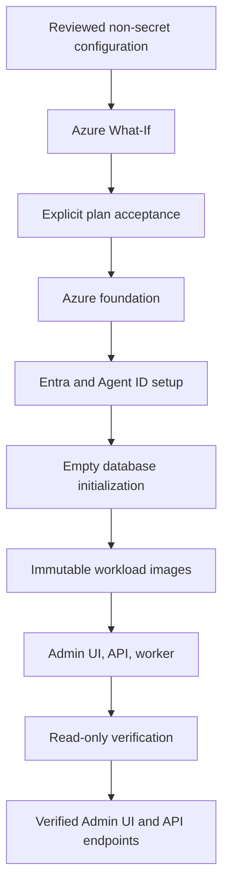

# A365 Gateway bootstrap

The bootstrap is the supported deployment system for a new A365 Custom Gateway. It
owns the path from non-secret configuration through Azure What-If, explicit plan
acceptance, Azure and tenant provisioning, database initialization, immutable image
deployment, and final verification.

Run it through `./gateway` on macOS/Linux or `.\gateway.cmd` on Windows. The launcher
delegates to `bootstrap/bootstrap.ps1`; lower-level scripts are not alternate
installers.

## What it deploys

The bootstrap creates one named resource group containing the Gateway's Azure
foundation and workloads, then creates the required tenant-side identity objects.
The deployed system includes:

- Azure Container Apps for the Admin UI, API, and provisioning worker;
- Azure Container Registry and immutable workload images;
- Azure SQL, Service Bus, Blob storage, Key Vault, private networking, logs, alerts,
  and Application Insights;
- Entra applications, app roles, managed identities, federated credentials, and
  the seed Agent ID blueprint;
- the ordered Gateway database schema; and
- optional Azure AI Content Safety and optional Purview policy-authoring
  prerequisites. Purview runtime enforcement is enabled only after the separate
  post-bootstrap verification in the Purview runbook.



## Prerequisites

- Git
- .NET 10 SDK
- PowerShell 7 (`pwsh`)
- Azure CLI (`az`)
- an enabled Azure subscription in the target Microsoft Entra tenant
- an Azure account with Subscription Owner, or Contributor plus permission to make
  the role assignments shown by Plan
- an administrator able to approve the Entra and Agent ID changes
- Agent 365 tenant eligibility and licensing
- for optional Purview provisioning, an approved Security & Compliance PowerShell
  application, certificate in Key Vault, and the required Purview roles

The installer uses official Microsoft sign-in surfaces. It never asks you to paste
an Azure password, access token, client secret, certificate, or Gateway key into its
configuration.

## Guided deployment

From the repository root:

```bash
az login
./gateway setup
```

On Windows PowerShell or Command Prompt, run:

```powershell
az login
.\gateway.cmd setup
```

Setup listens only on an ephemeral `127.0.0.1` port. It lets you select a
subscription visible to Azure CLI, discover compatible Agent 365 manager
applications, choose optional features, and write `bootstrap/config.json`. It then
runs Plan, displays the exact deployment boundaries, and requires a second explicit
confirmation before Apply or Resume.

Keep the terminal open. Deployment may hand control to official Microsoft browser
windows for refreshed Azure, Entra, Agent ID, or Purview authentication. Setup
closes after completion and does not become part of the hosted Gateway.

## Terminal deployment

The same deployment can be run without the setup UI:

```bash
./gateway doctor
./gateway init
./gateway plan
./gateway apply --open
```

Windows uses the same command names through the root launcher:

```powershell
.\gateway.cmd doctor
.\gateway.cmd init
.\gateway.cmd plan
.\gateway.cmd apply --open
```

`init` interactively creates `bootstrap/config.json`. You can instead copy
`bootstrap/config.example.json`, replace every placeholder, and pass a different
file with `--config PATH`.

### Command reference

| Command | Behavior |
|---|---|
| `setup` | Start the temporary loopback-only setup UI. |
| `up` | Create configuration if needed, Plan, confirm, Apply/Resume, and Verify. |
| `init` | Create a reviewed non-secret configuration interactively. |
| `doctor` | Check tools, configuration, Azure CLI account, and subscription readiness. |
| `plan` | Validate inputs, compile Bicep, and run authenticated Azure What-If. |
| `apply` | Apply an accepted current plan and run final verification. |
| `resume` | Reconcile and continue an interrupted accepted plan. |
| `status` | Show local checkpoint/readiness state without Azure calls. |
| `verify` | Rerun read-only deployment verification. |
| `open` | Open the recorded verified Admin UI HTTPS endpoint. |
| `diagnose` | Write a sanitized diagnostic bundle. |

Narrow recovery and upgrade commands also appear in `./gateway --help`. Use them
only when the matching failure boundary or runbook explicitly calls for them; they
are not alternate installation paths.

Common options include `--config PATH`, `--json`, `--non-interactive`, `--yes`,
`--expected-plan-fingerprint SHA256`, `--open`, and `--no-install`. Run
`./gateway --help` for the exact current surface.

## Configuration

`bootstrap/config.json` is non-secret and ignored by Git. The JSON schema is
`bootstrap/config.schema.json`; the example is `bootstrap/config.example.json`.
Configuration selects:

- the exact subscription and tenant;
- environment, Azure location, project name, resource group, and alert email;
- SQL service tier;
- seed blueprint name and reviewed manager-application allowlist;
- development-only Registry preview enablement; and
- optional Prompt Shields and Purview settings.

The deployment profile matters. A development configuration may explicitly enable
the preview Registry path so a registration can reach Gateway-reported `Active`.
Staging and production configurations keep Registry creation closed.

Do not put credentials, tokens, Gateway keys, prompt/response content, or
certificate material in configuration. Purview automation records only an
application ID, organization domain, and Key Vault secret URI; the certificate is
loaded through its approved non-echoing runtime path.

## Plan, Apply, Resume, Verify

Bootstrap is a resumable state machine:

1. `plan` validates configuration and source, compiles Bicep, runs authenticated
   subscription-scope What-If, and shows imperative tenant operations.
2. Explicit acceptance binds the exact plan fingerprint, configuration, source,
   target, and What-If prediction for a limited time.
3. `apply` revalidates that binding before mutation and writes safe checkpoint
   evidence after each verified action.
4. `resume` reconciles completed checkpoints and continues only work that remains
   safe for the same accepted plan.
5. `verify` reads back the deployed boundary without creating or updating it.

State and sanitized evidence live under ignored `.bootstrap/`. They may contain
tenant, subscription, resource, application, principal, image-digest, and
fingerprint identifiers. They never contain credentials, access tokens, clear
Gateway keys, prompts, responses, or provider bodies.

For automation, create and review a fresh JSON plan, then require the exact emitted
fingerprint at the mutation gate:

```bash
./gateway plan --config bootstrap/config.json --json --non-interactive
./gateway up --config bootstrap/config.json --json --non-interactive --yes \
  --expected-plan-fingerprint sha256:REVIEWED_FINGERPRINT
```

The second command stops before mutation if source, configuration, target, or
What-If output changed.

## Optional runtime protections

Prompt Shields and Purview are optional and independent.

### Prompt Shields

Set `promptShield.enabled` to `true` to deploy Azure AI Content Safety and authorize
the Gateway API managed identity. The account has local authentication disabled;
the bootstrap does not provision or store an account key. Registrations still opt
in individually in the Admin UI.

### Microsoft Purview

Set `purview.enabled` to `true` and provide a reviewed sensitive-information type
only when you want bootstrap to prepare the optional policy-authoring path. If
`policyProvisioningEnabled` is true, deployment pauses for the authorized Security
& Compliance PowerShell sign-in and provisions then reads back the policy contract.
Bootstrap always deploys the Gateway with `Purview__Enabled=false`; enabling runtime
enforcement requires the separate token-role and bounded data-plane checks in the
Purview runbook.

Purview uses two distinct Application-plane locations:

| Purpose | Location | Source | Type |
|---|---|---|---|
| Know Your Data collection | Fixed tenant-wide enterprise-AI-apps location `ee1680d0-702f-4090-b26c-c49091e86531` | Entra | `Group` |
| DLP policy/rule | Selected reusable blueprint application/client ID | Entra | `Individual` |

The KYD collection is not blueprint-scoped, and the DLP policy is not Group-scoped.
Exact readback proves configuration, not policy propagation or a data-plane
allow/block verdict. Follow the [Purview setup runbook](../docs/operations/purview-setup-runbook.md)
for roles, certificate handling, and bounded validation.

## Recovery

If deployment stops:

```bash
./gateway status
./gateway diagnose
./gateway resume
```

Review the reported failure and correct its cause before Resume. Do not edit or
delete `.bootstrap/`, manually replay completed tenant operations, access retained
messages, or run a second bootstrap against the same deployment.

Database recovery, one-shot manual database repair, and Admin UI upgrade are
deliberately bounded commands. Use them only when the bootstrap identifies that
exact eligible state and follow the linked [operations guide](../operations/README.md).

If a completed resource group was deleted, preserved tenant objects and deleted
resource-group credentials no longer share one lifecycle. Bootstrap refuses to
replay that state. Use a separately reviewed disaster-recovery procedure or a new
isolated deployment.

Bootstrap has no destroy mode and does not authorize cleanup, historical replay,
retained-message access, or SQL finalization.

## After verification

Open the hosted Admin UI with `./gateway open`, sign in as a
`Gateway.Administrator`, register an external agent, and store the one-time Gateway
key immediately. See the root [quickstart](../README.md#sign-in-and-register-an-agent)
and [sample client](../README.md#send-a-sample-interaction).

Additional references:

- [Entra setup](../docs/operations/entra-setup-runbook.md)
- [Agent 365 observability](../docs/operations/agent365-observability-setup.md)
- [Backup and recovery](../docs/operations/backup-recovery.md)
- [Upgrade strategy](../docs/operations/upgrade-strategy.md)
- [Infrastructure assets](../infrastructure/README.md)
