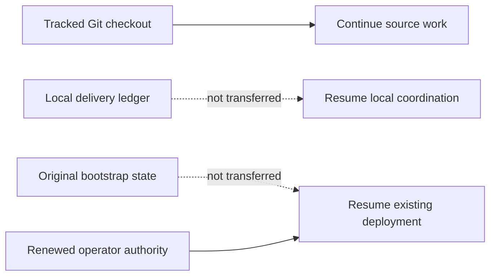

# Agent continuation checkpoint

Last updated: 2026-09-06 (Asia/Seoul).

This tracked file is the bounded continuation seed for Claude, Codex, GitHub
Copilot, other automation, and human contributors after a fetch, pull, fresh clone,
chat restart, or context loss. It describes source work only. It is not deployment
state, operator authorization, or live evidence.

## Receiving a checkout

This file deliberately does not embed a commit hash. A tracked file cannot reliably
self-embed the hash of the commit containing its final bytes, and branch pointers
can move. The reviewed branch and commit that contain this file are the handoff
source. On the receiving machine, record the actual checkout before acting:

```bash
git status --short
git rev-parse --verify HEAD
```

Do not silently discard local changes to make the checkout match another machine.
If a maintainer supplied a specific branch or commit, check out that exact source;
otherwise use the repository's reviewed default branch. Record HEAD and this file's
fingerprint in the new local delivery ledger.

For an existing clean checkout of the reviewed default branch, update without a
merge commit:

```bash
git fetch origin
git switch main
git pull --ff-only origin main
```

If `git status --short` reports local work, preserve and review it before pulling;
never reset or overwrite it merely to follow this checkpoint.

Git transfers tracked code, tests, documentation, and agent/skill instructions. It
does not transfer these ignored local inputs and evidence:

- `.agent-runtime/` delivery journals, assignments, and handoffs;
- legacy `.agents/runtime/` delivery state retained by older working copies;
- `.bootstrap/` deployment checkpoints and sanitized environment evidence;
- `bootstrap/config.json` non-secret deployment configuration;
- `.secret` or `.secrets` private runtime input; or
- build output and other generated artifacts.



A new clone can continue the source task below by initializing a new local ledger
from this checkpoint. It cannot Resume an existing deployment from Git alone. That
requires the original matching `.bootstrap/` state, matching configuration, and
renewed operator authorization through the documented secure operator boundary.
Never commit those paths to make deployment Resume portable.

## Authority and reading order

`AGENTS.md` is the binding cross-tool repository instruction file. Tool-specific
entry points supplement it:

- Claude reads `CLAUDE.md` and the project `.claude/` instructions;
- Codex uses the tracked `.agents/skills/` and `.codex/agents/` definitions; and
- GitHub Copilot reads `.github/copilot-instructions.md`.

Follow the exact required reading sequence in `AGENTS.md`: current
`docs/implementation-status.md`, this `docs/agent-continuation.md` checkpoint,
`CLAUDE.md`, and the relevant agent guide. For bootstrap work also read
`bootstrap/README.md` and the complete canonical
`.agents/skills/a365-bootstrap-delivery/SKILL.md` plus its recording contract. Before
any Azure, SQL, Entra, Graph, Service Bus, Purview, deployment, or incident action,
read `docs/operations/development-deployment-status.md` and the applicable runbook.

When sources disagree, authority descends from implemented code, tests, deployed
contract, and authorized live evidence; then current official Microsoft
documentation; current checkpoints; architecture and runbooks; product intent; and
finally agent playbooks. Record the discrepancy instead of silently choosing an old
comment or troubleshooting note. Do not reconstruct current work from chat history,
Git chronology, or `docs/history/`.

If `.agent-runtime/bootstrap-delivery/CURRENT.json` is absent, this tracked file is
the bootstrap-delivery seed. Initialize a new bounded local session with the
canonical skill recorder, bind it to the checked-out HEAD and this checkpoint, and
record an Intent before the first material action. Runtime journals remain local;
durable verified truth returns to the two tracked status files. The ignored legacy
`.agents/runtime/` location is not an active discovery path and is never transferred
by Git.

## Current delivery: stopped for model handoff

The operator stopped live work because model credits were exhausted and requested
this handoff. The fully running Gateway has **not** been delivered. Do not restart
deployment automatically from this checkpoint; continue when the operator resumes
the task. Exact target, original authorization, configuration and recovery evidence
remain in ignored local operator records and do not transfer through Git.

The active Azure bootstrap has thirteen of nineteen stages completed. Its original
Purview prerequisite failure was a malformed directory-role query. The corrected,
reviewed recovery completed and independently verified the exact Exchange and
Compliance Administrator grants on the existing owned automation identity.
Its certificate operation remains `Started`, with no completion receipt.

Read-only evidence shows that the exact Key Vault certificate-secret deployment
succeeded, while the pinned Entra application still has zero key credentials.
The exact application audit event reports a failed `Update application` with
`Microsoft.Online.Workflows.ValidationException`. This is a partial certificate,
not a missing certificate and not a completed recovery. No secret value was read
for diagnosis. Preserve the secret, both grants, original accepted snapshot,
thirteen completed stages and the recovery operation record. Do not rotate,
recreate, clear or replay the certificate operation, or rerun the whole identity
Ensure function. The existing recovery rejects this partial state by design.

Before that live attempt, the minimal recovery source passed independent review,
Release with zero warnings/errors, all 2,008 .NET tests, 928 Pester tests with seven
skips, 28 Bicep templates and three parameter files, formatting and clean-export
Windows/POSIX launcher checks. The PKCS12 proof correction also passed independent
review; its bounded zero-padding acceptance retains MAC, key and certificate proof.
These are evidence for the minimal recovery source, not the combined handoff source.

The reviewed Windows executor, worker transport, private publisher, package
inspector, Bicep and tests have now been promoted into canonical source. Required
implementation is no longer held only in an ignored export. Canonical recovery and
diagnostic privacy corrections were preserved during promotion. The host/client,
publisher and package-inspector boundaries previously passed independent review
with 66, 49 and 29 focused tests; two additional package-builder source-binding
tests passed, with 31 combined package tests and independent review. Deployment
integration, dedicated identity creation, package publication, upgrade receipt,
fresh-bootstrap wiring and actual Windows/provider proof remain unfinished.
The old package must be rebuilt against the final source before publication.

Promotion changes the source fingerprint. It does not widen or complete the
preserved minimal recovery authorization. The combined source must not be deployed
as a finished Full evaluation release. A local Windows host startup check was
blocked by automatic tool policy and remains unverified. The new source has not
been deployed; final combined validation and hosted CI are reported separately.

No new registration, delegated Registry completion, worker-verified Active,
independent Agent 365 landing, Prompt Shields allow/block or DLP allow/block has
passed for this target. All remain required after deployment and Windows integration.
Use the shared model handoff protocol and exact first unfinished action below or
in the continuation checkpoint. Canonical `main` is the sole checkout; the old
linked worktree, branch and verified-empty worktree parent were retired. Credentials
and runtime evidence remain outside Git.

## Handoff validation

The combined handoff source passed Release with zero warnings and errors, all 2123
.NET tests across eight projects, 31 package/source-binding Pester tests, source
structure checks, document/link/private-path checks and independent handoff review.
The earlier architecture failure was a stale expectation of the removed local
provider; its assertion now expects the reviewed remote provider and all affected
tests pass. The first build was blocked only by the owned idle Setup executable;
stopping that host resolved the lock. Final full bootstrap/export gates and hosted
CI remain pending for this combined source. No live gate was closed by this handoff.

## Exact first unfinished action and invalidated gates

When the operator resumes, inspect the local recovery receipt and the bounded
certificate readback/audit evidence. Diagnose why Entra rejected public-certificate
publication after Key Vault succeeded. The audit proves a failed update; it does
not explain the validation detail. Do not guess that cause or repeat the write.
Design and review a separate exact repair for the existing certificate if needed;
the current recovery command cannot complete a partial certificate. Preserve the
original and corrected accepted source snapshots and all operation records.

No live command is running. The visible Setup remains on a stopped read-only
Resume review, with no Resume authorization. Its owned local host was stopped
for handoff; restarting it does not authorize deployment. Only after exact
repair and independent readback may the recovery complete, the normal read-only
stage reconciler finish stage fourteen, and Setup Resume and `gateway verify` run.

Then finish [Windows executor integration](architecture/purview-windows-executor.md)
using the now-tracked implementation. Preserve original bootstrap evidence and
record the upgrade separately. Finish core registrations, delegated Registry,
Agent 365 observability, Prompt Shields and DLP live acceptance. This handoff
contains unfinished implementation; it is not release or live acceptance.

Combined-source full bootstrap/export gates, deployment, Windows startup/provider
proof, full Gateway E2E and final release acceptance remain open. The validation
summary below records only checks actually completed for the handoff source.

## Live boundary and remaining work after operator resume

The active deployment has thirteen completed stages and a failed Purview
prerequisite stage. Older deployments and database recovery evidence are retained
for diagnosis; they are different targets and are not Resume candidates for the
current source. Do not edit accepted state, replay database jobs, finalize SQL,
remove identities, or clean up earlier environments without exact authority.

After the operator resumes and deployment is verified, prove real Admin UI sign-in and primary routes, two
external registrations using compatible blueprints created or reused as authorized,
user-only delegated Registry completion, final worker-verified Active, independent
Agent 365 activity and audit landing, Prompt Shields allow/block, and blueprint DLP
allow/block. Existing seed blueprints must be reconciled before creating additional
ones. Follow the [deployment checkpoint](operations/development-deployment-status.md)
and [Purview runbook](operations/purview-setup-runbook.md).

The prior local desktop/narrow-width UI gate uses the user's explicit acceptance
of bUnit tests and independent UI source review after automatic browser policy
blocked inspection. That is a waiver, not evidence of a browser run or a waiver of
real deployed Admin UI and Gateway E2E. Automatic policy separately blocked the
local packaged Windows host startup check; that check remains unverified.

Before commit/push, follow the shared [model handoff protocol](agent-guides/model-handoff.md):
update all applicable model entry points, specs, skills, directives, guides,
READMEs, status and notes; run metadata, link, private-path and ledger checks;
commit and push canonical `main`; verify the remote commit and hosted CI. The
retired worktree's local evidence remains an archive, not active deployment state.
Git contains no credentials or ignored runtime evidence. Historical detail lives
in Git history and the bounded local ledger, not a competing next-action section.
