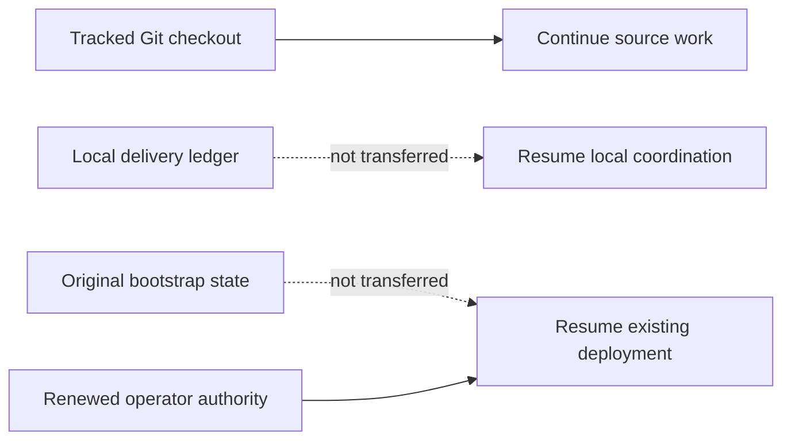

# Agent continuation checkpoint

Last updated: 2026-09-02 (Asia/Seoul).

This tracked file is the bounded continuation seed for Claude, Codex, GitHub
Copilot, other automation, and human contributors after a fetch, pull, fresh clone,
chat restart, or context loss. It describes source work only. It is not deployment
state, operator authorization, or live evidence.

## Receiving a checkout

This file deliberately does not embed a commit hash. A tracked file cannot reliably
self-embed the hash of the commit containing its final bytes, and branch pointers
can move. The reviewed branch and commit that contain this file are the handoff
source. On the receiving machine, record the actual checkout before acting:

```bash
git status --short
git rev-parse --verify HEAD
```

Do not silently discard local changes to make the checkout match another machine.
If a maintainer supplied a specific branch or commit, check out that exact source;
otherwise use the repository's reviewed default branch. Record HEAD and this file's
fingerprint in the new local delivery ledger.

For an existing clean checkout of the reviewed default branch, update without a
merge commit:

```bash
git fetch origin
git switch main
git pull --ff-only origin main
```

If `git status --short` reports local work, preserve and review it before pulling;
never reset or overwrite it merely to follow this checkpoint.

Git transfers tracked code, tests, documentation, and agent/skill instructions. It
does not transfer these ignored local inputs and evidence:

- `.agent-runtime/` delivery journals, assignments, and handoffs;
- legacy `.agents/runtime/` delivery state retained by older working copies;
- `.bootstrap/` deployment checkpoints and sanitized environment evidence;
- `bootstrap/config.json` non-secret deployment configuration;
- `.secret` or `.secrets` private runtime input; or
- build output and other generated artifacts.



A new clone can continue the source task below by initializing a new local ledger
from this checkpoint. It cannot Resume an existing deployment from Git alone. That
requires the original matching `.bootstrap/` state, matching configuration, and
renewed operator authorization through the documented secure operator boundary.
Never commit those paths to make deployment Resume portable.

## Authority and reading order

`AGENTS.md` is the binding cross-tool repository instruction file. Tool-specific
entry points supplement it:

- Claude reads `CLAUDE.md` and the project `.claude/` instructions;
- Codex uses the tracked `.agents/skills/` and `.codex/agents/` definitions; and
- GitHub Copilot reads `.github/copilot-instructions.md`.

Follow the exact required reading sequence in `AGENTS.md`: current
`docs/implementation-status.md`, this `docs/agent-continuation.md` checkpoint,
`CLAUDE.md`, and the relevant agent guide. For bootstrap work also read
`bootstrap/README.md` and the complete canonical
`.agents/skills/a365-bootstrap-delivery/SKILL.md` plus its recording contract. Before
any Azure, SQL, Entra, Graph, Service Bus, Purview, deployment, or incident action,
read `docs/operations/development-deployment-status.md` and the applicable runbook.

When sources disagree, authority descends from implemented code, tests, deployed
contract, and authorized live evidence; then current official Microsoft
documentation; current checkpoints; architecture and runbooks; product intent; and
finally agent playbooks. Record the discrepancy instead of silently choosing an old
comment or troubleshooting note. Do not reconstruct current work from chat history,
Git chronology, or `docs/history/`.

If `.agent-runtime/bootstrap-delivery/CURRENT.json` is absent, this tracked file is
the bootstrap-delivery seed. Initialize a new bounded local session with the
canonical skill recorder, bind it to the checked-out HEAD and this checkpoint, and
record an Intent before the first material action. Runtime journals remain local;
durable verified truth returns to the two tracked status files. The ignored legacy
`.agents/runtime/` location is not an active discovery path and is never transferred
by Git.

## Current objective and proven source state

The delivery objective is one public bootstrap that a fresh-clone audience can use
on Windows and macOS to configure, deploy, verify, open, and operate the complete
Gateway. Windows is the primary audience. Optional Purview selection and policy
authoring remain Windows-only; the core path remains cross-platform with Purview
disabled.

The current source has passed these local offline gates. Every row was measured on
Windows unless it states otherwise:

| Evidence | Result |
|---|---:|
| Complete .NET test set | 1,683 passed |
| Complete bootstrap Pester set on Windows | 759 passed, 7 skipped |
| Launcher regressions executed on Windows | 11 passed, 6 skipped |
| Standalone source-compiler regressions | 10 passed |
| Windows Azure CLI boundary regressions | 8 passed |
| Windows Bicep prerequisite regressions | 9 passed |
| Entra credential and orphan-cleanup regressions | 33 passed |
| Final backend Resume/private-vault security rereview | 356 passed |

The Release solution build completed with zero warnings and zero errors. Source
validation parsed 18 PowerShell files and two JSON contracts and locally compiled
27 Bicep templates and three parameter files through the explicit Windows Bicep
compilation lane. These results are source evidence, not a hosted-Windows launcher,
browser, deployment, or live-Gateway claim.

The cross-tool handoff itself was also revalidated at this checkpoint: all 17 Codex
role definitions parsed, all 20 Claude agent/skill frontmatters parsed, and local
links and anchors passed across 54 Markdown files. The schema-v2 delivery-ledger
regression suite passed, including source binding, coordinator/delegate isolation,
assignment provenance, redaction, rotation, exact pre-append rejection of oversized
current-checkpoint and handoff payloads, legacy and rotated-empty-tail migration,
writer-locked bounded normal validation, explicit full-history audit and historical
tamper detection, and checkpoint/handoff integrity. The focused Release architecture
suite passed all 115 tests. `.secret`, `.secrets`, `.bootstrap/`,
`bootstrap/config.json`, `.agent-runtime/`, and legacy `.agents/runtime/` remain
outside tracked source.

## First unfinished source task

The local Setup application's restarted-process, two-step Resume integration is
implemented, tested, and independently rereviewed. The remaining first task is
platform and browser validation of that journey, not new service code.

Implemented and covered at this checkpoint:

- `tools/Gateway.Setup/Services/BootstrapCommand.cs` expresses distinct read-only
  review and confirmed Resume argument contracts. The review adds
  `-InstallPrerequisites:$false` so a read-only review never inherits the engine's
  default local-prerequisite installation.
- `BootstrapProgressEvent.cs` and `BootstrapOutputSanitizer.cs` represent and
  strictly parse exactly one safe typed `resumeReview` claim bound to its own
  message. Missing, duplicate, conflicting, malformed, standard-error, and
  noncanonical claims authorize nothing.
- `BootstrapExecutionCoordinator.cs` holds the accepted-Plan and
  Resume-authorization fingerprints only in bounded in-memory state and consumes
  them once. Restart, a changed checkpoint, another command, a failed review,
  cancellation, or first use invalidates that state.
- `Components/Pages/Progress.razor` renders the read-only review action first and
  gates a separate explicit confirmation on the review-produced authorization. No
  path offers direct Resume mutation. The confirmation states the same Azure,
  Entra, Agent 365, SQL, and optional policy boundary Apply states, and the review
  claims only that it changes no such resource rather than claiming absolute safety.
- `bootstrap/bootstrap.ps1` was left unchanged; the backend contract remained
  authoritative and no regression proved a backend defect.

Corrected after this checkpoint, in response to a stopped `Inert identity deployment`
step that reported no diagnosable cause:

- `Invoke-BootstrapCommand` no longer discards failed provider output. It extracts a
  bounded signature — at most eight `code`/`errorCode` values and four correlation
  GUIDs — attaches it to the thrown exception, and writes the unfiltered text to an
  ignored `.bootstrap/diagnostics/` file restricted to the current account. The safe
  failure event, the Setup timeline, and the persisted checkpoint carry only the
  bounded identifiers and a local file path. Curated messages are unchanged when a
  failure carries no provider signature.
- `Get-BootstrapExceptionProviderErrorCodes` returns an empty result that unrolls to
  `$null`, so every caller wraps it in `@(...)`. The first attempt did not, and the
  complete Pester set caught four ordinary-failure regressions before commit;
  `tests/Bootstrap.Tests/Common.Tests.ps1` now pins the empty case directly.
- `Assert-GatewayPromptShieldFreeTierCapacity` discovers, read-only, whether the
  subscription already holds a free Content Safety account outside the target
  resource group. Azure permits one free account per Cognitive Services account type
  per subscription and ARM rejects a duplicate during template preflight without
  creating a deployment record, so the step previously stopped with nothing to read
  back. The preflight names the conflicting account and three remediations, runs no
  discovery when Prompt Shields is disabled or on a paid SKU, and attempts no
  workload mutation.
- That preflight first read only `az resource list`, which returns live accounts. A
  soft-deleted Cognitive Services account keeps its free-tier slot for the rest of its
  retention window and is absent from every resource listing, so deleting the resource
  group never released the quota and a subscription with no live free account still
  failed every retry with the identical `CanNotCreateMultipleFreeAccounts` rejection.
  The preflight now also reads `az cognitiveservices account list-deleted`, and parses
  the originating group and account name out of the deleted-account resource ID
  because that listing reports a null `resourceGroup`. It never exempts a soft-deleted
  account by resource group: the workload always creates a freshly suffixed account
  rather than recovering a deleted name, so a same-named group does not help. A
  soft-deleted conflict is remediated only by purging, and the message names the exact
  `az cognitiveservices account purge` command for that account.
- The capacity preflight also runs in `Invoke-GatewayPlanWorkflow` under the
  `plan_prompt_shield_capacity` failure code, so the conflict is named during Plan
  instead of only at the inert deployment, after Apply has already mutated Azure.
- `cognitiveservices` joins the reviewed Azure CLI resource command groups in
  `Get-BootstrapAzureCliArguments`, so the deleted-account listing is pinned to the
  exact bootstrap subscription like every other resource family.
- A trusted progress sink renders long provider calls. It receives only a command
  label built from leading lowercase verb tokens, a phase word, and an elapsed
  duration, all produced inside the bootstrap; child-process output never reaches it.
  Completed steps also report their duration in text mode. The sink is registered
  inside the run path rather than at module init so `Status` and `Open` JSON output
  remain single documents.
- `Components/Pages/Progress.razor` and `wwwroot/app.css` mark the newest stage as
  working while a run is live and as stopped once a run ends without succeeding, and
  keep a static ring under `prefers-reduced-motion`.
- `bootstrap/README.md` documents reading the bounded provider cause, the Prompt
  Shields free-tier constraint, and how to start over as a genuinely new isolated
  deployment without deleting `.bootstrap/`.
- A successful run now closes with an explicit completion summary instead of a single
  streamed line, because the previous ending did not tell an operator when or how the
  run finished. `Write-GatewayCompletionSummary` in `bootstrap/modules/Experience.psm1`
  is the one emitter for both surfaces and both completion sites (Apply/Up and Verify).
  In `Text` it renders a framed block — completion moment, duration, steps completed,
  deployment, resource group, region, subscription, readiness tiers, agent admission,
  state ledger path, endpoints, and numbered next steps — sanitizing every line
  individually, because `Write-GatewayExperienceEvent` collapses a message into one
  bounded line, which is right for streamed progress and wrong for a closing summary.
  In `Json` it emits exactly one `Result` event, preserving the single-verification-claim
  contract the Setup coordinator depends on. The completion moment is stamped into
  `data.completedAtUtc` inside that emitter from the same value the console prints, so
  the terminal and the wizard can never disagree about when the run ended. The frame
  uses ASCII rules rather than Unicode box characters, because the supported console
  is not guaranteed to be UTF-8.
- `BootstrapProgressEvent.cs` carries the same facts as a `BootstrapCompletionSummary`
  record hanging off `BootstrapVerifiedEndpoints`. Every member is a primitive, and
  deliberately so: `BootstrapExecutionCoordinator` detects a conflicting second
  verification claim by comparing two `BootstrapVerifiedEndpoints` values, and a nested
  collection would compare by reference and report a false conflict.
- Endpoint parsing stays strictly fail-closed, but the completion summary is fail-soft.
  `BootstrapOutputSanitizer` bounds every summary field by regex or GUID parse and drops
  the whole summary when any field is malformed, while still honoring the endpoint
  claim. A presentational field must never downgrade a genuinely successful, verified
  deployment to an error. `statePath` is a local filesystem path and is therefore
  console-only; it is never parsed into the wizard.
- `Components/Pages/Progress.razor` states the finish time, elapsed duration, and step
  count in its success notice, and `Components/Pages/Finish.razor` renders a
  "Deployment summary" card plus a machine-readable `<time datetime>` stamp. Both
  render the moment in the operator's local clock with the UTC offset spelled out,
  because a bare local time in a log is ambiguous and a bare UTC time makes the reader
  do arithmetic before they can trust it.

The remaining validation work, in order:

1. Fixture-backed local browser inspection of the Setup Resume journey at desktop
   and narrow widths, including a newly started Setup process over representative
   preserved stopped state. This is the gate that would let a restarted Setup
   process be claimed as end-to-end Resume recovery; until it passes, terminal
   Resume remains the only documented recovery path.
2. A hosted Windows run of the root `gateway.cmd` launcher with real prerequisite
   detection and repair. The launcher regression suite now executes on Windows, but
   an actual hosted launcher run has not happened.
3. The macOS root `gateway` launcher and core Setup path with Purview disabled.

One contributor-tool defect was found and corrected while closing the Windows Bicep
compilation lane. `tools/Test-BootstrapSource.ps1` resolved the Azure CLI with an
unbounded `Get-Command az -CommandType Application`. Because the Azure CLI MSI
installs `az.cmd` and an extensionless shim in the same directory, that call
returned two matches whose `Source` cast to one space-joined path, and the lane
failed closed on an unusable boundary. The resolver now binds exactly one command
source and deterministically promotes an extensionless shim to its sibling Windows
launcher before the existing bundled-Python mapping; anything else still fails
closed. `tests/Bootstrap.Tests/Source.Tests.ps1` covers both behaviors. The shipped
bootstrap engine resolves the Azure CLI through a different, single-match call in
`bootstrap/modules/Common.psm1` and was not affected.

The focused test surfaces for this area are:

- `tests/Gateway.Setup.Tests/Services/BootstrapCommandFactoryTests.cs`;
- `tests/Gateway.Setup.Tests/Services/BootstrapOutputSanitizerTests.cs`;
- `tests/Gateway.Setup.Tests/Services/BootstrapExecutionCoordinatorTests.cs`; and
- `tests/Gateway.Setup.Tests/RepositoryLayoutTests.cs` for structural UI guards.

## Acceptance criteria

The Setup integration is acceptable only when all of the following are proved.
Items 1 through 7 are proved by the tests above; the browser journey in the
remaining validation list is what extends them to a recovery claim.

1. A stopped accepted deployment offers read-only Resume review, not direct
   mutation and not a new Plan.
2. Review starts one non-interactive child process without `-Yes` and accepts
   exactly one canonical typed review claim from the trusted event stream.
3. Missing, duplicate, conflicting, malformed, standard-error, or noncanonical
   claims fail closed and authorize nothing.
4. Setup stores only the accepted-Plan and Resume-authorization fingerprints in
   bounded in-memory coordinator state. Restart, changed checkpoint, another
   command, failed review, cancellation, or first use invalidates that state.
5. A separate user confirmation starts a new non-interactive Resume process with
   `-Yes` and both exact fingerprints. It cannot be replayed or bypassed.
6. Successful Resume still requires exactly one nonconflicting Apply-mode endpoint
   verification result before Setup reports the Gateway ready.
7. Error text remains sanitized and tells the user to preserve `.bootstrap/` state.

For any further change in this area, add focused failing tests first, implement the
smallest coherent correction, rerun the complete Setup test project, and obtain an
independent hash-scoped security rereview before broader gates.

## Gates still required

Before any live action, complete and record:

- a hosted Windows run of the root `gateway.cmd` launcher and prerequisite
  detection and repair;
- the macOS root `gateway` launcher and core Setup path with Purview disabled; and
- fixture-backed local browser inspection of the Setup Resume journey at desktop
  and narrow widths, including a newly started Setup process over representative
  preserved stopped state.

The full .NET and bootstrap suites, Release build, format, whitespace, source,
Bicep, documentation-link, and secret/state-path checks have passed for this source
generation and are recorded above. Rerun them after any further source change.

A separate operator prerequisite applies to the next live Apply or Resume. The
current development subscription already holds a free Content Safety account outside
the target resource group, so a free-SKU Prompt Shields deployment fails ARM
preflight. The new read-only capacity check now names that account and stops before
mutation, but resolving it is the user's decision and requires the user's own
authorized action: choose a paid SKU, disable Prompt Shields for base verification,
or delete the unused account. No agent may delete it.

Note that `src/A365Gateway.slnx` contains no test projects, so `dotnet test` against
that solution reports success without running a single test. Always run the eight
projects under `tests/` to obtain a real .NET result.

Still missing after those source/platform checks are an authorized fresh-clone
browser and live deployment: signed-in Plan, explicit Apply, exact resource and
image readback, API/Admin UI health, Admin UI sign-in, one bounded registration
through `Active`, and a bounded Gateway data-plane use check. Optional Prompt
Shields and Purview evidence must remain separate from core bootstrap completion.

## Current pause and stopping condition

No Azure, Entra, SQL, Graph, Service Bus, Purview, deployment, cleanup, or other
live-provider action is authorized at this checkpoint. Do not mutate or delete a
stopped target, and do not begin a new deployment. The user must return and
explicitly request live continuation after reviewing the source commit.

Source-only work may continue through the Setup integration and offline gates. Stop
before the first live action and record the exact remaining evidence. After any
verified change, update this checkpoint and both status files, validate all links,
commit every intended tracked file, and push the reviewed branch so the next
receiver starts from Git rather than from chat history.

A stopped deployment is diagnosed, not cleared. Read the bounded provider codes in
the terminal, the Setup timeline, or the persisted checkpoint, and read the local
ignored `.bootstrap/diagnostics/` file when a code is not enough. That file holds
unfiltered provider text and must never be pasted into an issue, a chat, or a shared
log. Never delete `.bootstrap/` to force a stopped deployment forward; it is the only
record of what already exists in the tenant.
