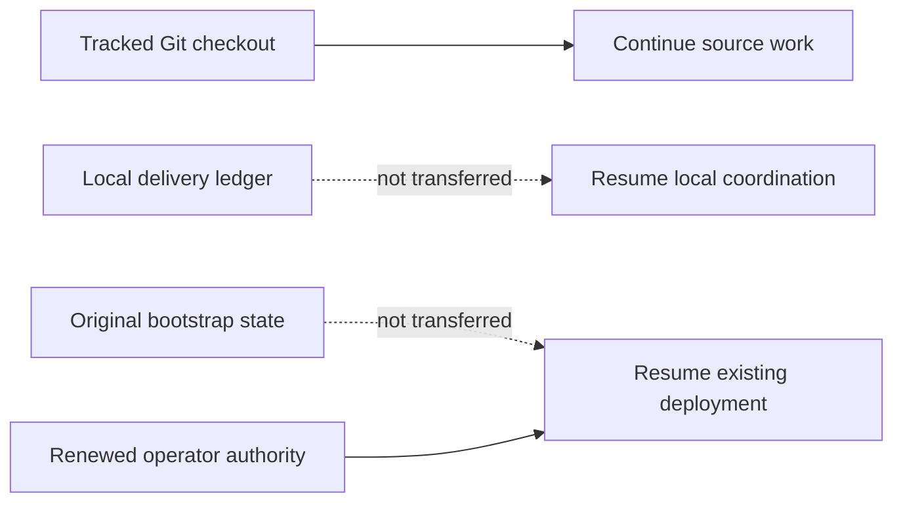

# Agent continuation checkpoint

Last updated: 2026-09-01 (Asia/Seoul).

This tracked file is the bounded continuation seed for Claude, Codex, GitHub
Copilot, other automation, and human contributors after a fetch, pull, fresh clone,
chat restart, or context loss. It describes source work only. It is not deployment
state, operator authorization, or live evidence.

## Receiving a checkout

This file deliberately does not embed a commit hash. A tracked file cannot reliably
self-embed the hash of the commit containing its final bytes, and branch pointers
can move. The reviewed branch and commit that contain this file are the handoff
source. On the receiving machine, record the actual checkout before acting:

```bash
git status --short
git rev-parse --verify HEAD
```

Do not silently discard local changes to make the checkout match another machine.
If a maintainer supplied a specific branch or commit, check out that exact source;
otherwise use the repository's reviewed default branch. Record HEAD and this file's
fingerprint in the new local delivery ledger.

For an existing clean checkout of the reviewed default branch, update without a
merge commit:

```bash
git fetch origin
git switch main
git pull --ff-only origin main
```

If `git status --short` reports local work, preserve and review it before pulling;
never reset or overwrite it merely to follow this checkpoint.

Git transfers tracked code, tests, documentation, and agent/skill instructions. It
does not transfer these ignored local inputs and evidence:

- `.agent-runtime/` delivery journals, assignments, and handoffs;
- legacy `.agents/runtime/` delivery state retained by older working copies;
- `.bootstrap/` deployment checkpoints and sanitized environment evidence;
- `bootstrap/config.json` non-secret deployment configuration;
- `.secret` or `.secrets` private runtime input; or
- build output and other generated artifacts.



A new clone can continue the source task below by initializing a new local ledger
from this checkpoint. It cannot Resume an existing deployment from Git alone. That
requires the original matching `.bootstrap/` state, matching configuration, and
renewed operator authorization through the documented secure operator boundary.
Never commit those paths to make deployment Resume portable.

## Authority and reading order

`AGENTS.md` is the binding cross-tool repository instruction file. Tool-specific
entry points supplement it:

- Claude reads `CLAUDE.md` and the project `.claude/` instructions;
- Codex uses the tracked `.agents/skills/` and `.codex/agents/` definitions; and
- GitHub Copilot reads `.github/copilot-instructions.md`.

Follow the exact required reading sequence in `AGENTS.md`: current
`docs/implementation-status.md`, this `docs/agent-continuation.md` checkpoint,
`CLAUDE.md`, and the relevant agent guide. For bootstrap work also read
`bootstrap/README.md` and the complete canonical
`.agents/skills/a365-bootstrap-delivery/SKILL.md` plus its recording contract. Before
any Azure, SQL, Entra, Graph, Service Bus, Purview, deployment, or incident action,
read `docs/operations/development-deployment-status.md` and the applicable runbook.

When sources disagree, authority descends from implemented code, tests, deployed
contract, and authorized live evidence; then current official Microsoft
documentation; current checkpoints; architecture and runbooks; product intent; and
finally agent playbooks. Record the discrepancy instead of silently choosing an old
comment or troubleshooting note. Do not reconstruct current work from chat history,
Git chronology, or `docs/history/`.

If `.agent-runtime/bootstrap-delivery/CURRENT.json` is absent, this tracked file is
the bootstrap-delivery seed. Initialize a new bounded local session with the
canonical skill recorder, bind it to the checked-out HEAD and this checkpoint, and
record an Intent before the first material action. Runtime journals remain local;
durable verified truth returns to the two tracked status files. The ignored legacy
`.agents/runtime/` location is not an active discovery path and is never transferred
by Git.

## Current objective and proven source state

The delivery objective is one public bootstrap that a fresh-clone audience can use
on Windows and macOS to configure, deploy, verify, open, and operate the complete
Gateway. Windows is the primary audience. Optional Purview selection and policy
authoring remain Windows-only; the core path remains cross-platform with Purview
disabled.

The current source has passed these local offline gates:

| Evidence | Result |
|---|---:|
| Complete .NET test set | 1,625 passed |
| Complete bootstrap Pester set | 682 passed, 9 Windows-only skipped on macOS |
| Resume and Azure security regressions | 323 passed |
| Entra credential and orphan-cleanup regressions | 33 passed |
| Windows Bicep prerequisite regressions | 9 passed |
| Standalone source-compiler regressions | 7 passed |
| Launcher regressions executed on macOS | 8 passed, 9 Windows-only skipped |
| Final backend Resume/private-vault security rereview | 356 passed |

The Release solution build completed with zero warnings and zero errors. Source
validation parsed 18 PowerShell files and two JSON contracts and locally compiled
27 Bicep templates and three parameter files. These results are source evidence,
not a hosted-Windows, browser, deployment, or live-Gateway claim.

The cross-tool handoff itself was also revalidated at this checkpoint: all 17 Codex
role definitions parsed, all 20 Claude agent/skill frontmatters parsed, and local
links and anchors passed across 54 Markdown files. The schema-v2 delivery-ledger
regression suite passed, including source binding, coordinator/delegate isolation,
assignment provenance, redaction, rotation, exact pre-append rejection of oversized
current-checkpoint and handoff payloads, legacy and rotated-empty-tail migration,
writer-locked bounded normal validation, explicit full-history audit and historical
tamper detection, and checkpoint/handoff integrity. The focused Release architecture
suite passed all 115 tests. `.secret`, `.secrets`, `.bootstrap/`,
`bootstrap/config.json`, `.agent-runtime/`, and legacy `.agents/runtime/` remain
outside tracked source.

## First unfinished source task

Complete the local Setup application's restarted-process, two-step Resume
integration. The PowerShell backend already supports the required boundary:

1. read-only `Resume -NonInteractive` revalidates the accepted Plan and completed
   checkpoint prefix, emits one typed `resumeReview` result, and performs no
   deployment mutation; and
2. a separately authorized non-interactive Resume requires the exact accepted-Plan
   and Resume-authorization fingerprints before any remaining step can execute.

Setup currently retains only the Plan fingerprint and offers a direct Resume
confirmation after a failed Apply/Resume. It does not strictly consume the typed
review claim, hold the resulting authorization ephemerally, or pass both
fingerprints through a separate confirmation. Therefore terminal Resume is
supported, while a restarted Setup browser process is not yet claimed as complete
recovery.

The implementation owner should work first in these source surfaces:

- `tools/Gateway.Setup/Services/BootstrapCommand.cs`: express distinct read-only
  review and confirmed Resume argument contracts;
- `tools/Gateway.Setup/Services/BootstrapProgressEvent.cs` and
  `BootstrapOutputSanitizer.cs`: represent and strictly parse exactly one safe typed
  Resume-review claim;
- `tools/Gateway.Setup/Services/BootstrapExecutionCoordinator.cs`: hold a
  checkpoint-bound authorization ephemerally and consume it once;
- `tools/Gateway.Setup/Components/Pages/Progress.razor`: render a read-only review
  action followed by a separate explicit confirmation, with no direct Resume; and
- `bootstrap/bootstrap.ps1`: treat the existing backend contract as authoritative;
  change it only if a regression proves a backend defect.

The focused test surfaces are:

- `tests/Gateway.Setup.Tests/Services/BootstrapCommandFactoryTests.cs`;
- `tests/Gateway.Setup.Tests/Services/BootstrapOutputSanitizerTests.cs`;
- `tests/Gateway.Setup.Tests/Services/BootstrapExecutionCoordinatorTests.cs`; and
- `tests/Gateway.Setup.Tests/RepositoryLayoutTests.cs` for structural UI guards.

## Acceptance criteria

The Setup integration is acceptable only when all of the following are proved:

1. A stopped accepted deployment offers read-only Resume review, not direct
   mutation and not a new Plan.
2. Review starts one non-interactive child process without `-Yes` and accepts
   exactly one canonical typed review claim from the trusted event stream.
3. Missing, duplicate, conflicting, malformed, standard-error, or noncanonical
   claims fail closed and authorize nothing.
4. Setup stores only the accepted-Plan and Resume-authorization fingerprints in
   bounded in-memory coordinator state. Restart, changed checkpoint, another
   command, failed review, cancellation, or first use invalidates that state.
5. A separate user confirmation starts a new non-interactive Resume process with
   `-Yes` and both exact fingerprints. It cannot be replayed or bypassed.
6. Successful Resume still requires exactly one nonconflicting Apply-mode endpoint
   verification result before Setup reports the Gateway ready.
7. Error text remains sanitized and tells the user to preserve `.bootstrap/` state.

Add focused failing tests first, implement the smallest coherent correction, rerun
the complete Setup test project, and obtain an independent hash-scoped security
rereview before broader gates.

## Gates still required

Before any live action, complete and record:

- the full .NET and bootstrap suites, Release build, format, whitespace, source,
  Bicep, documentation-link, and secret/state-path checks;
- a hosted Windows run of the root `gateway.cmd` launcher, prerequisite detection
  and repair, and the explicit Windows Bicep compilation lane;
- the macOS root `gateway` launcher and core Setup path with Purview disabled; and
- fixture-backed local browser inspection of the Setup Resume journey at desktop
  and narrow widths, including a newly started Setup process over representative
  preserved stopped state.

Still missing after those source/platform checks are an authorized fresh-clone
browser and live deployment: signed-in Plan, explicit Apply, exact resource and
image readback, API/Admin UI health, Admin UI sign-in, one bounded registration
through `Active`, and a bounded Gateway data-plane use check. Optional Prompt
Shields and Purview evidence must remain separate from core bootstrap completion.

## Current pause and stopping condition

No Azure, Entra, SQL, Graph, Service Bus, Purview, deployment, cleanup, or other
live-provider action is authorized at this checkpoint. Do not mutate or delete a
stopped target, and do not begin a new deployment. The user must return and
explicitly request live continuation after reviewing the source commit.

Source-only work may continue through the Setup integration and offline gates. Stop
before the first live action and record the exact remaining evidence. After any
verified change, update this checkpoint and both status files, validate all links,
commit every intended tracked file, and push the reviewed branch so the next
receiver starts from Git rather than from chat history.
