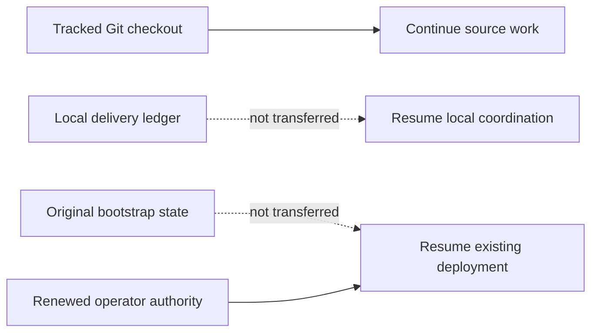

# Agent continuation checkpoint

Last updated: 2026-09-06 (Asia/Seoul).

This tracked file is the bounded continuation seed for Claude, Codex, GitHub
Copilot, other automation, and human contributors after a fetch, pull, fresh clone,
chat restart, or context loss. It describes source work only. It is not deployment
state, operator authorization, or live evidence.

## Receiving a checkout

This file deliberately does not embed a commit hash. A tracked file cannot reliably
self-embed the hash of the commit containing its final bytes, and branch pointers
can move. The reviewed branch and commit that contain this file are the handoff
source. On the receiving machine, record the actual checkout before acting:

```bash
git status --short
git rev-parse --verify HEAD
```

Do not silently discard local changes to make the checkout match another machine.
If a maintainer supplied a specific branch or commit, check out that exact source;
otherwise use the repository's reviewed default branch. Record HEAD and this file's
fingerprint in the new local delivery ledger.

For an existing clean checkout of the reviewed default branch, update without a
merge commit:

```bash
git fetch origin
git switch main
git pull --ff-only origin main
```

If `git status --short` reports local work, preserve and review it before pulling;
never reset or overwrite it merely to follow this checkpoint.

Git transfers tracked code, tests, documentation, and agent/skill instructions. It
does not transfer these ignored local inputs and evidence:

- `.agent-runtime/` delivery journals, assignments, and handoffs;
- legacy `.agents/runtime/` delivery state retained by older working copies;
- `.bootstrap/` deployment checkpoints and sanitized environment evidence;
- `bootstrap/config.json` non-secret deployment configuration;
- `.secret` or `.secrets` private runtime input; or
- build output and other generated artifacts.



A new clone can continue the source task below by initializing a new local ledger
from this checkpoint. It cannot Resume an existing deployment from Git alone. That
requires the original matching `.bootstrap/` state, matching configuration, and
renewed operator authorization through the documented secure operator boundary.
Never commit those paths to make deployment Resume portable.

## Authority and reading order

`AGENTS.md` is the binding cross-tool repository instruction file. Tool-specific
entry points supplement it:

- Claude reads `CLAUDE.md` and the project `.claude/` instructions;
- Codex uses the tracked `.agents/skills/` and `.codex/agents/` definitions; and
- GitHub Copilot reads `.github/copilot-instructions.md`.

Follow the exact required reading sequence in `AGENTS.md`: current
`docs/implementation-status.md`, this `docs/agent-continuation.md` checkpoint,
`CLAUDE.md`, and the relevant agent guide. For bootstrap work also read
`bootstrap/README.md` and the complete canonical
`.agents/skills/a365-bootstrap-delivery/SKILL.md` plus its recording contract. Before
any Azure, SQL, Entra, Graph, Service Bus, Purview, deployment, or incident action,
read `docs/operations/development-deployment-status.md` and the applicable runbook.

When sources disagree, authority descends from implemented code, tests, deployed
contract, and authorized live evidence; then current official Microsoft
documentation; current checkpoints; architecture and runbooks; product intent; and
finally agent playbooks. Record the discrepancy instead of silently choosing an old
comment or troubleshooting note. Do not reconstruct current work from chat history,
Git chronology, or `docs/history/`.

If `.agent-runtime/bootstrap-delivery/CURRENT.json` is absent, this tracked file is
the bootstrap-delivery seed. Initialize a new bounded local session with the
canonical skill recorder, bind it to the checked-out HEAD and this checkpoint, and
record an Intent before the first material action. Runtime journals remain local;
durable verified truth returns to the two tracked status files. The ignored legacy
`.agents/runtime/` location is not an active discovery path and is never transferred
by Git.

## Latest bootstrap correction and live boundary

A separately authorized clean beta.2 bootstrap reached the inert deployment, where
ARM emitted `BootstrapCapabilities__Enabled` as `False` but the verifier expected
`false`. The verifier now uses the existing ARM Boolean text helper for both
`True` and `False`. Ordinal comparison, opposite-value rejection, secret-reference
rejection, and all nineteen capability fields remain enforced. Templates, images,
application behavior, and accepted-state guards are unchanged.

The executable regression first failed for both Boolean values, then all fourteen
container-configuration tests passed. Fresh independent source and recovery review
accepted the correction. Release passed with zero warnings/errors, and all eight
.NET test projects passed again (2,004 tests). The complete bootstrap gate passed
848 tests with zero failures and 7 skips, plus all 28 Bicep templates and 3 parameter
files. All nine format targets and metadata/private-path checks passed. The clean
898-file export passed Release, all 2,004 .NET tests, source/Bicep, the 14-test
regression, and Windows/POSIX launcher smoke. Production-source fingerprints match
the canonical candidate. Verify correction-specific hosted CI for the actual
checkout before any fresh deployment.

The older full acceptance table below records the pre-deployment baseline. It is
not evidence that the corrected source has been deployed or that live E2E passed.

## Current objective and proven source state

The `0.1.0-beta.2` protection-governance source has passed final integrated offline
acceptance and clean-export validation. The source handoff includes all intended
new files. Detailed prior chronology stays in Git history; local journal evidence
does not transfer to another computer.

Bootstrap prepares shared capabilities only. Settings owns tenant connection, SIT
inventory/selection, fixed KYD Group, blueprint Individual DLP, readiness, defaults,
and per-registration controls. The canonical contracts are in AGENTS.md and the
[protection settings plan](architecture/protection-settings-plan.md).

| Gate | Final result |
|---|---:|
| Release build | 0 warnings, 0 errors |
| Gateway.UnitTests | 805 passed |
| Gateway.AdminUi.Tests | 217 passed |
| Gateway.Setup.Tests | 255 passed |
| Gateway.ObservabilityRuntime.Tests | 232 passed |
| Gateway.ArchitectureTests | 131 passed |
| Gateway.IntegrationTests | 107 passed |
| Gateway.EndToEndTests | 116 passed |
| Gateway.SecurityTests | 141 passed |
| **.NET total** | **2,004 passed, 0 failed** |
| Pester | 846 passed, 0 failed, 7 skipped |
| Format | All nine targets passed |
| Independent security and UI source review | Passed; no remaining actionable findings |
| Clean export | Release, all eight test projects, canonical bootstrap gate, layout and launcher smoke passed |

Canonical source gate: 20 PowerShell files and 2 JSON files, with 28 Bicep templates and 3 parameter files compiled, with Pester behavior tests.


Hosted validation exposed Windows-only fixture paths and platform differences
in passwordless PKCS12 verification. The tests now use a native temporary path and
accept both documented null and empty password encodings independently for the
MAC, safe contents, and private key. All eight synthetic encoding combinations
pass; nonempty-password and public-only packages are rejected. The actual export
must retain the exact certificate and prove its matching private key by an
in-memory signature. Both affected files passed again (11 tests, zero
failures/skips) in the canonical checkout and clean export; fresh independent
review of the encoding correction passed. Production source, test counts, and UI
contracts are unchanged, so the earlier full integrated results above remain
applicable alongside this incremental evidence. All five hosted jobs passed for
the certificate-proof correction before the separately authorized live attempt.
The subsequent Boolean-verifier correction below requires its own acceptance.

The fresh independent review passed the combined source after explicitly
rechecking all four original findings: shared API/worker runtime identity and
token subject, exact capability/runtime binding, cancellation-owned process
termination, and provider-ID-bound KYD/DLP updates with exact readback and
ambiguous-outcome recovery. It also rechecked the exact 19-key
`BootstrapCapabilities` startup materialization and subsequent integration
corrections to bootstrap identity attestation, API credential guards, current
tenant/SIT readiness, and Settings action compatibility. No earlier review was
reused as acceptance.

UI acceptance uses the full bUnit suite and fresh independent source review.
The user explicitly accepted that evidence after automatic browser policy blocked
local inspection. Desktop and narrow-width browser inspection was waived, not
reported as executed. AgentDetails distinguishes effective protection from
selected-profile readiness. Settings uses the supported UploadText Block rule
for both policy modes, and only Enforce can request runtime allow/block proof.


OpenAPI parsing/internal references, Markdown links/anchors/fences, ignored private
paths, Claude frontmatter, Codex TOML, skill YAML, behavioral parity, whitespace,
and the full local delivery-ledger audit passed. All intended tracked and new
source files were included in the clean export. No secret or ignored runtime state
belongs in the commit.

## Exact first unfinished action and invalidated gates

Verify all five hosted jobs for the Boolean-verifier corrective commit on `main`.
If green, obtain authorization for an exact unused replacement project/resource-
group identity and continue through visible Setup.
The original deployment cannot Resume under changed source; preserve its accepted
snapshot and failed checkpoint. No replacement-target deployment is authorized by
this tracked file.

The one-expression source correction invalidated Build and later gates. All
affected offline, review, and clean-export gates have passed again. Hosted
acceptance must be checked against the actual commit. Deploy and LiveValidate
remain incomplete. The earlier UI inspection waiver is unchanged because this
correction affects no UI surface.

## Live boundary and next separately authorized task

The authorized beta.2 bootstrap stopped after the inert ARM deployment succeeded
but before step 7 verification completed. Steps 1–6 are Completed; later steps,
Admin UI sign-in, registration, and protection E2E are unproved. Original resources,
accepted source snapshot, configuration, and state are preserved. A read-only run
of the corrected verifier passes against the existing inert resources; it does not
change the persisted Failed checkpoint or authorize changed-source Resume.

No supported continuation admits this source correction at a failed step 7 with
persisted evidence. Existing pre-inert and database recovery guards do not apply
and remain unchanged. After correction acceptance, a fresh supported bootstrap
requires a separately authorized unused project/resource-group identity. Do not
edit state, accepted snapshots, or old resources to force progress. No live or
cleanup authority transfers through Git or documentation.

After exact-commit hosted CI is green and fresh authority is granted, the future
live exercise begins with a clean bootstrap in the approved new target. Create two
new blueprints with one external registration each. Verify both through truthful
Active, independent Agent 365 observability, Prompt Shields allow/block, and
blueprint-specific Purview DLP allow/block. Follow the current
[deployment checkpoint](operations/development-deployment-status.md) and
[Purview runbook](operations/purview-setup-runbook.md).

Preserved `.bootstrap/` state must never be
deleted, edited, or pointed at another target to force progress. Restoring or
retiring an earlier environment requires its own matching state and authority.
