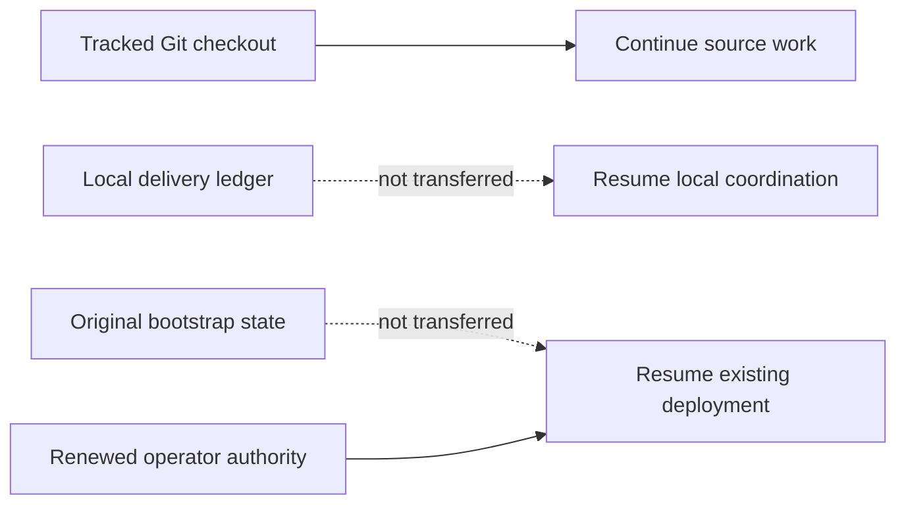

# Agent continuation checkpoint

Last updated: 2026-09-06 (Asia/Seoul).

This tracked file is the bounded continuation seed for Claude, Codex, GitHub
Copilot, other automation, and human contributors after a fetch, pull, fresh clone,
chat restart, or context loss. It describes source work only. It is not deployment
state, operator authorization, or live evidence.

## Receiving a checkout

This file deliberately does not embed a commit hash. A tracked file cannot reliably
self-embed the hash of the commit containing its final bytes, and branch pointers
can move. The reviewed branch and commit that contain this file are the handoff
source. On the receiving machine, record the actual checkout before acting:

```bash
git status --short
git rev-parse --verify HEAD
```

Do not silently discard local changes to make the checkout match another machine.
If a maintainer supplied a specific branch or commit, check out that exact source;
otherwise use the repository's reviewed default branch. Record HEAD and this file's
fingerprint in the new local delivery ledger.

For an existing clean checkout of the reviewed default branch, update without a
merge commit:

```bash
git fetch origin
git switch main
git pull --ff-only origin main
```

If `git status --short` reports local work, preserve and review it before pulling;
never reset or overwrite it merely to follow this checkpoint.

Git transfers tracked code, tests, documentation, and agent/skill instructions. It
does not transfer these ignored local inputs and evidence:

- `.agent-runtime/` delivery journals, assignments, and handoffs;
- legacy `.agents/runtime/` delivery state retained by older working copies;
- `.bootstrap/` deployment checkpoints and sanitized environment evidence;
- `bootstrap/config.json` non-secret deployment configuration;
- `.secret` or `.secrets` private runtime input; or
- build output and other generated artifacts.



A new clone can continue the source task below by initializing a new local ledger
from this checkpoint. It cannot Resume an existing deployment from Git alone. That
requires the original matching `.bootstrap/` state, matching configuration, and
renewed operator authorization through the documented secure operator boundary.
Never commit those paths to make deployment Resume portable.

## Authority and reading order

`AGENTS.md` is the binding cross-tool repository instruction file. Tool-specific
entry points supplement it:

- Claude reads `CLAUDE.md` and the project `.claude/` instructions;
- Codex uses the tracked `.agents/skills/` and `.codex/agents/` definitions; and
- GitHub Copilot reads `.github/copilot-instructions.md`.

Follow the exact required reading sequence in `AGENTS.md`: current
`docs/implementation-status.md`, this `docs/agent-continuation.md` checkpoint,
`CLAUDE.md`, and the relevant agent guide. For bootstrap work also read
`bootstrap/README.md` and the complete canonical
`.agents/skills/a365-bootstrap-delivery/SKILL.md` plus its recording contract. Before
any Azure, SQL, Entra, Graph, Service Bus, Purview, deployment, or incident action,
read `docs/operations/development-deployment-status.md` and the applicable runbook.

When sources disagree, authority descends from implemented code, tests, deployed
contract, and authorized live evidence; then current official Microsoft
documentation; current checkpoints; architecture and runbooks; product intent; and
finally agent playbooks. Record the discrepancy instead of silently choosing an old
comment or troubleshooting note. Do not reconstruct current work from chat history,
Git chronology, or `docs/history/`.

If `.agent-runtime/bootstrap-delivery/CURRENT.json` is absent, this tracked file is
the bootstrap-delivery seed. Initialize a new bounded local session with the
canonical skill recorder, bind it to the checked-out HEAD and this checkpoint, and
record an Intent before the first material action. Runtime journals remain local;
durable verified truth returns to the two tracked status files. The ignored legacy
`.agents/runtime/` location is not an active discovery path and is never transferred
by Git.

## Current delivery: stopped for model handoff

The operator stopped work and handed the task to another model. The fully running
Gateway has **not** been delivered. Do not restart deployment automatically from
this checkpoint; continue when the operator resumes. Exact target, original
authorization, configuration and recovery evidence remain in ignored local operator
records and do not transfer through Git.

Two bootstrap defects that blocked the Purview prerequisite stage were found,
corrected against current Microsoft documentation, and pushed to `main`.

The first defect built the Microsoft Entra key-credential window from the requested
generation values instead of the issued certificate. That produced two simultaneous
violations: a sub-second `endDateTime` outliving the certificate's whole-second
`NotAfter`, and a window of one year plus five minutes exceeding the documented
one-year maximum. Entra rejected the whole application update as a validation
failure, which is the previously undiagnosed publication error. The window is now
derived from the issued certificate, clamped inside its validity and under one
year, and formatted to whole UTC seconds.

The second defect asked Microsoft Graph to filter the `domains` collection.
Microsoft documents `$filter` as unsupported there, and the service answers HTTP
400 `Request_UnsupportedQuery`. The initial verified domain is now selected from
the returned collection. The uniqueness, verification and domain-shape guards are
unchanged.

Both corrections are proven by exact live provider readback, not by local state or
configuration. The automation application on the active target now carries exactly
one key credential with a whole-second window inside the certificate; this is the
first successful publication of that credential on any target. The corrected domain
lookup returned the tenant initial verified domain in a read-only call against the
same tenant.

A clean deployment of the current source was separately authorized on a new
development target. It reached thirteen of nineteen stages complete with the
Purview prerequisite stage failed. Its certificate is **not** partial: publication
succeeded and only the subsequent domain readback failed, which the second
correction addresses. The earlier retained target that holds the partial
certificate is untouched. Its certificate, both grants, accepted snapshot,
completed stages and operation record were not replayed, rotated, cleared or
rerun through the identity Ensure function. Preserve it exactly as recorded.

Both corrections landed after that deployment's plan was accepted, so the current
source fingerprint no longer matches its accepted-source snapshot. This is the
active blocker and it is unresolved. Resume stops at its accepted-authorization
preflight because current source differs from the accepted source without a
completed automatic database recovery. Plan refuses because the deployment has
already started. Resume also executes bootstrap modules from the accepted-source
snapshot rather than the working tree, so even a passing Resume would run the
uncorrected source. No supported operator path out of this state had been
established when work stopped.

Do not force progress. Do not edit or delete accepted state, remove `.bootstrap`,
weaken the source-binding guard, or replay a completed recovery in order to adopt
new source. If no supported command accepts a corrected source generation on a
started deployment, that is a reviewable source gap to report to the operator with
its trade-offs, not a guard to bypass.

No registration, delegated Registry completion, worker-verified `Active`,
independent Agent 365 landing, Prompt Shields allow/block or DLP allow/block has
passed for the active target. Windows executor deployment integration, dedicated
identity creation, package rebuild and publication, upgrade receipt,
fresh-bootstrap wiring and actual Windows/provider proof also remain unfinished;
the old package is stale and must be rebuilt against final source. Canonical `main`
is the sole checkout, with no branch or worktree created. Credentials and runtime
evidence remain outside Git.

## Validation for the two corrections

These are source gates. They are not deployment evidence or live-readiness proof.

| Gate | Result |
|---|---|
| Focused Purview certificate and identity tests | 45 passed, 0 failed |
| Focused credential-window and domain-lookup tests | 50 passed, 0 failed |
| Bootstrap, Operations and Purview Pester | 964 passed, 0 failed, 7 skipped |
| Hosted CI for the credential-window commit | Passed |
| Hosted CI for the domain-lookup commit | Still running when work stopped |

Each correction carries focused regression tests that fail against the previous
behaviour. Release build, the eight .NET test projects, Bicep compilation, the nine
format targets and the clean-export gates were **not** rerun for these two
corrections, because both change PowerShell bootstrap source only. Rerun the
affected gates before any release claim.

## Earlier validation for the promoted Windows executor source

The combined handoff source passed Release with zero warnings and errors, all 2123
.NET tests across eight projects, 31 package/source-binding Pester tests, source
structure checks, document/link/private-path checks and independent handoff review.
The earlier architecture failure was a stale expectation of the removed local
provider; its assertion now expects the reviewed remote provider and all affected
tests pass. Hosted CI later passed for the promoted-source commit. Full
bootstrap/export gates for that combined source remain pending. No live gate was
closed by that handoff.

## Exact first unfinished action and invalidated gates

Resolve the accepted-source deadlock on the active deployment. Both corrections
landed after its plan was accepted, so Resume refuses the changed source and Plan
refuses a started deployment. Read `Get-GatewayResumeExecutionSource` and
`Invoke-GatewayResumePreflight` in `bootstrap/bootstrap.ps1` together with
`bootstrap/recover-purview-prerequisites.ps1`, and establish whether any supported
command accepts a corrected source generation on a started deployment. The only
escapes from source drift recorded in that guard are a completed Purview
prerequisite recovery plan and a completed automatic database recovery plan.
Neither exists on the active target, and its certificate is deliberately not
partial, so the narrow prerequisite recovery command does not apply as written.

If no supported path exists, report the gap and its options to the operator before
changing anything. Do not bypass the guard, edit or delete accepted state, remove
`.bootstrap`, or start a third deployment to avoid the question. Diagnose with
`-OutputFormat Text`; the JSON output swallows the failing stage's exception detail.

Once the deployment can advance on corrected source, finish Apply through all
nineteen stages and run `gateway verify`. Then finish
[Windows executor integration](architecture/purview-windows-executor.md) using the
now-tracked implementation, preserving original bootstrap evidence and recording
the upgrade separately. Then finish core registrations, delegated Registry,
Agent 365 observability, Prompt Shields and DLP live acceptance.

The retained earlier target still holds an unresolved partial certificate. Its
publication failure is now explained by the corrected credential window, but the
existing recovery command still refuses partial state by design, and the operator
deferred that repair until the active deployment runs. When it is taken up, build
an exact repair that publishes the preserved Key Vault certificate without
rotating, recreating, clearing or replaying anything.

No live command is running and no deployment mutation is authorized by this
handoff. Deployment, Windows startup and provider proof, full Gateway E2E and
final release acceptance remain open.

## Live boundary and remaining work after operator resume

The active deployment has thirteen completed stages and a failed Purview
prerequisite stage whose two causes are now corrected in source but not yet
applied to that target. Older deployments and database recovery evidence are
retained for diagnosis; they are different targets and are not Resume candidates
for the current source. Do not edit accepted state, replay database jobs, finalize
SQL, remove identities, or clean up earlier environments without exact authority.

After the operator resumes and deployment is verified, prove real Admin UI sign-in and primary routes, two
external registrations using compatible blueprints created or reused as authorized,
user-only delegated Registry completion, final worker-verified Active, independent
Agent 365 activity and audit landing, Prompt Shields allow/block, and blueprint DLP
allow/block. Existing seed blueprints must be reconciled before creating additional
ones. Follow the [deployment checkpoint](operations/development-deployment-status.md)
and [Purview runbook](operations/purview-setup-runbook.md).

The prior local desktop/narrow-width UI gate uses the user's explicit acceptance
of bUnit tests and independent UI source review after automatic browser policy
blocked inspection. That is a waiver, not evidence of a browser run or a waiver of
real deployed Admin UI and Gateway E2E. Automatic policy separately blocked the
local packaged Windows host startup check; that check remains unverified.

Before commit/push, follow the shared [model handoff protocol](agent-guides/model-handoff.md):
update all applicable model entry points, specs, skills, directives, guides,
READMEs, status and notes; run metadata, link, private-path and ledger checks;
commit and push canonical `main`; verify the remote commit and hosted CI. The
retired worktree's local evidence remains an archive, not active deployment state.
Git contains no credentials or ignored runtime evidence. Historical detail lives
in Git history and the bounded local ledger, not a competing next-action section.
