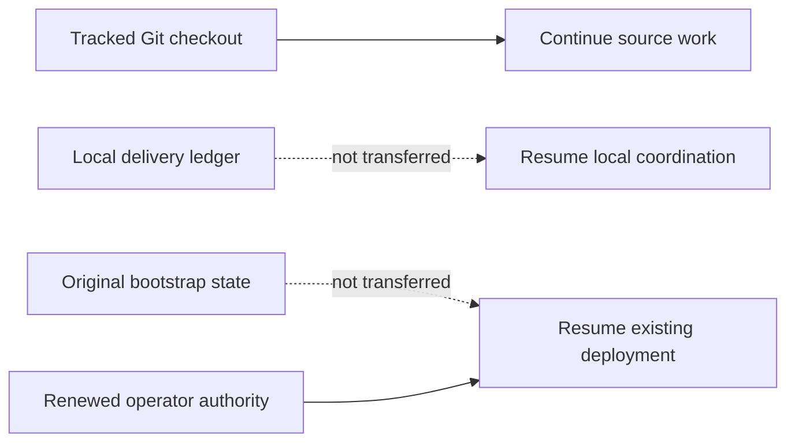

# Agent continuation checkpoint

Last updated: 2026-09-04 (Asia/Seoul).

This tracked file is the bounded continuation seed for Claude, Codex, GitHub
Copilot, other automation, and human contributors after a fetch, pull, fresh clone,
chat restart, or context loss. It describes source work only. It is not deployment
state, operator authorization, or live evidence.

## Receiving a checkout

This file deliberately does not embed a commit hash. A tracked file cannot reliably
self-embed the hash of the commit containing its final bytes, and branch pointers
can move. The reviewed branch and commit that contain this file are the handoff
source. On the receiving machine, record the actual checkout before acting:

```bash
git status --short
git rev-parse --verify HEAD
```

Do not silently discard local changes to make the checkout match another machine.
If a maintainer supplied a specific branch or commit, check out that exact source;
otherwise use the repository's reviewed default branch. Record HEAD and this file's
fingerprint in the new local delivery ledger.

For an existing clean checkout of the reviewed default branch, update without a
merge commit:

```bash
git fetch origin
git switch main
git pull --ff-only origin main
```

If `git status --short` reports local work, preserve and review it before pulling;
never reset or overwrite it merely to follow this checkpoint.

Git transfers tracked code, tests, documentation, and agent/skill instructions. It
does not transfer these ignored local inputs and evidence:

- `.agent-runtime/` delivery journals, assignments, and handoffs;
- legacy `.agents/runtime/` delivery state retained by older working copies;
- `.bootstrap/` deployment checkpoints and sanitized environment evidence;
- `bootstrap/config.json` non-secret deployment configuration;
- `.secret` or `.secrets` private runtime input; or
- build output and other generated artifacts.



A new clone can continue the source task below by initializing a new local ledger
from this checkpoint. It cannot Resume an existing deployment from Git alone. That
requires the original matching `.bootstrap/` state, matching configuration, and
renewed operator authorization through the documented secure operator boundary.
Never commit those paths to make deployment Resume portable.

## Authority and reading order

`AGENTS.md` is the binding cross-tool repository instruction file. Tool-specific
entry points supplement it:

- Claude reads `CLAUDE.md` and the project `.claude/` instructions;
- Codex uses the tracked `.agents/skills/` and `.codex/agents/` definitions; and
- GitHub Copilot reads `.github/copilot-instructions.md`.

Follow the exact required reading sequence in `AGENTS.md`: current
`docs/implementation-status.md`, this `docs/agent-continuation.md` checkpoint,
`CLAUDE.md`, and the relevant agent guide. For bootstrap work also read
`bootstrap/README.md` and the complete canonical
`.agents/skills/a365-bootstrap-delivery/SKILL.md` plus its recording contract. Before
any Azure, SQL, Entra, Graph, Service Bus, Purview, deployment, or incident action,
read `docs/operations/development-deployment-status.md` and the applicable runbook.

When sources disagree, authority descends from implemented code, tests, deployed
contract, and authorized live evidence; then current official Microsoft
documentation; current checkpoints; architecture and runbooks; product intent; and
finally agent playbooks. Record the discrepancy instead of silently choosing an old
comment or troubleshooting note. Do not reconstruct current work from chat history,
Git chronology, or `docs/history/`.

If `.agent-runtime/bootstrap-delivery/CURRENT.json` is absent, this tracked file is
the bootstrap-delivery seed. Initialize a new bounded local session with the
canonical skill recorder, bind it to the checked-out HEAD and this checkpoint, and
record an Intent before the first material action. Runtime journals remain local;
durable verified truth returns to the two tracked status files. The ignored legacy
`.agents/runtime/` location is not an active discovery path and is never transferred
by Git.

## Current objective and proven source state

The delivery objective is one public bootstrap that a fresh-clone audience can use
on Windows and macOS to configure, deploy, verify, open, and operate the complete
Gateway. Windows is the primary audience. Optional Purview selection and policy
authoring remain Windows-only; the core path remains cross-platform with Purview
disabled.

The current source has passed these local offline gates. Both rows were measured on
Windows at this checkpoint:

| Evidence | Result |
|---|---:|
| The eight .NET test projects under `tests/` | 1,748 passed, 0 failed |
| The three Pester suites, run as one gate | 794 passed, 0 failed, 7 skipped |

Pester tests live in three separate directories, not one. `tests/Bootstrap.Tests`
holds 740 of them, `tests/Gateway.Purview.Tests` holds 22, and
`tests/Operations.Tests` holds 32. Run all three through the canonical gate rather
than naming a directory directly, because that script is what defines the set:

```powershell
pwsh -NoProfile -File tools/Test-BootstrapSource.ps1 -RunPester -CompileBicep
```

Its `$pesterPaths` array is the authoritative list. If a fourth suite is added
later, it belongs there, and a checkpoint that names directories individually will
silently stop covering it.

Every narrower lane named in earlier revisions of this file — launcher,
source-compiler, Azure CLI boundary, Bicep prerequisite, and Entra credential
regressions — is a file inside `tests/Bootstrap.Tests` and is already counted in
its 740. Do not restate a subset as though it were an independent gate.

Run the .NET projects individually. `src/A365Gateway.slnx` deliberately contains
only shipping projects, so a solution-scoped `dotnet test` matches no test project,
runs nothing, and still exits successfully; treat an empty run as a failure to
execute, never as a pass. The bootstrap Pester set takes roughly seventeen minutes
on Windows, and PowerShell buffers redirected output, so a log file that stops
growing for several minutes is normal. Confirm progress from the file's size and
modification time before concluding that a run has hung. Pester 5 also discovers
every test file before running any of them, so editing a module mid-suite
contaminates the result; stop the run and start it again instead.

The Release solution build completes with zero warnings and zero errors under
`-warnaserror`. The same gate command above also parsed 18 PowerShell files and two
JSON contracts and locally compiled 27 Bicep templates and three parameter files;
`-CompileBicep` is what opens that Windows compilation lane, and the script skips it
silently when the switch is absent.

`dotnet format --verify-no-changes` is not part of that script and is not part of
any local script, so run it by hand over `src/A365Gateway.slnx` and each of the
eight test projects. Continuous integration used to format only the solution, which
by design contains no test project, so nothing under `tests/` was ever checked; that
job now formats all nine targets. Two whitespace violations reached `main` through
the gap.

These results are source evidence. They are not a hosted-Windows launcher, browser,
deployment, or live-Gateway claim.

The cross-tool handoff itself was revalidated at this checkpoint: all 17 Codex role
definitions in `.codex/agents/` parsed, all 20 Claude agent and skill frontmatters
under `.claude/` parsed, and every local link and anchor resolved across 56 Markdown
files. The schema-v2 delivery-ledger regressions and the focused Release
architecture suite are .NET tests counted inside the 1,748 above rather than
separate gates; between them they cover source binding, coordinator/delegate
isolation, assignment provenance, redaction, rotation, exact pre-append rejection of
oversized current-checkpoint and handoff payloads, legacy and rotated-empty-tail
migration, writer-locked bounded normal validation, explicit full-history audit with
historical tamper detection, and checkpoint/handoff integrity.

`.secret`, `.secrets`, `.bootstrap/`, `bootstrap/config.json`, `.agent-runtime/`,
and legacy `.agents/runtime/` remain outside tracked source.

One cross-tool gap is open and is deliberately left alone here rather than fixed in
a documentation pass: `.codex/agents/` defines `bootstrap-delivery-reviewer` with no
matching definition under `.claude/agents/`, so that role exists for Codex and not
for Claude. Raise it before relying on that reviewer role from either tool.

## First unfinished source task

No source defect currently blocks a deployment. The offline gates above pass on
this source generation, and the Setup Resume integration that earlier revisions of
this file named as the first task is implemented, tested, and independently
rereviewed. Its record is kept below as history, not as work.

Two kinds of work remain, and they are not interchangeable. One is live and belongs
to the operator. The other is source, and is what a receiving agent should pick up.

### The blocking work is live and operator-gated

Every stated Gateway delivery goal is met except one: a blueprint-scoped Microsoft
Purview DLP verdict has never been observed on a deployed build. The source needed
for it is committed. None of it is deployed.

That goal cannot be reached by changing the existing deployment. Bootstrap refuses
to mix source generations inside one deployment state, so once a deployment has
recorded durable state evidence, a working tree carrying newer commits is rejected
rather than applied. Because corrections are pending, this is the ordinary
condition rather than an error to work around. The supported path is a fresh
provision under a new, unused deployment identity with Purview enabled from the
start, which also lands every pending correction in one cycle.
`docs/operations/purview-setup-runbook.md` states that procedure as its case B, and
`.\gateway.cmd plan` — `./gateway plan` on macOS — is the discriminator that proves
which case a given machine is actually in.

Three properties of that run belong to the operator and to no agent:

- it authors tenant policy over an interactive `Connect-IPPSSession` sign-in, so it
  cannot run unattended, and `--non-interactive` must fail closed rather than
  author policy without a signed-in operator;
- Security & Compliance PowerShell is unavailable in PowerShell 7 on macOS and
  Linux, so this particular run is Windows-only, while the core bootstrap stays
  cross-platform with Purview disabled; and
- creating a new deployment, and retiring the superseded one afterwards, each
  require a fresh explicit authorization naming that specific resource group.
  Authorization for one deployment's teardown never carries to the next.

Do not attempt to reach this goal by hand-editing `bootstrap/config.json`, by
deleting `.bootstrap/` state, or by pointing fresh state at an existing resource
group. A sensitive-information-type GUID that was not chosen through the
tenant-backed picker fails closed mid-run, after the deployment steps have already
restarted.

### The first unfinished source task is diagnosable step-failure causes

A step whose validator throws is recorded as `Failed` under one generic sentence —
"could not be independently revalidated" — which names the step but never the field
that disagreed. One hundred and twenty-five validator branches under
`bootstrap/modules/` throw the bare literal `'mismatch'`, so the specific comparison
that failed is discarded at the throw site and cannot be recovered downstream.

This costs more than readability. A `Failed` step is not merely noisy: on the next
run the engine consults the anti-replay guard instead of replaying, and a step it
cannot reconcile exactly strands the deployment. An operator who cannot see which
field mismatched has no basis for choosing between correcting the input and
abandoning the deployment.

One instance of this class is already fixed, and is the worked example to follow.
`Test-GatewayPurviewEvidence` threw before assigning `$connectionId` while its
`finally` block read that variable, so strict mode replaced every fast-path
mismatch reason with a variable-not-set error. Initializing the variable before
`try` — the idiom `Ensure-BootstrapPurviewPolicies` already uses — restored the
real reason.

The remaining work is to carry the failing comparison out of the validator in a
bounded, non-secret form: the property name and the fact that it disagreed, never
the expected or actual value, because these validators compare resource IDs,
endpoints, principal IDs, and image digests. Add focused failing tests first, keep
the change mechanical, and rerun the complete bootstrap Pester set.

Two smaller source items are parked behind an explicit decision rather than
forgotten, and should not be started without one:

- Purview is currently split between a bootstrap-time concern and a Gateway
  feature. The reviewed intent is that bootstrap provisions the Gateway and the
  Gateway owns per-blueprint DLP thereafter. `Purview.psm1` also swallows an
  exception where it should surface a bounded cause.
- The Purview policy-automation application and certificate exist only for
  worker-authored protection profiles, the path taken when the Gateway creates a
  *new* protected blueprint. That identity is not a prerequisite for the live goal
  above, because registering an agent against an *existing* blueprint never enters
  the profile-provisioning path.

### Completed record

The entries below are finished work, kept because each encodes a constraint that is
cheaper to read than to rediscover. Nothing in this subsection is an open task.

The local Setup application's restarted-process, two-step Resume integration:

- `tools/Gateway.Setup/Services/BootstrapCommand.cs` expresses distinct read-only
  review and confirmed Resume argument contracts. The review adds
  `-InstallPrerequisites:$false` so a read-only review never inherits the engine's
  default local-prerequisite installation.
- `BootstrapProgressEvent.cs` and `BootstrapOutputSanitizer.cs` represent and
  strictly parse exactly one safe typed `resumeReview` claim bound to its own
  message. Missing, duplicate, conflicting, malformed, standard-error, and
  noncanonical claims authorize nothing.
- `BootstrapExecutionCoordinator.cs` holds the accepted-Plan and
  Resume-authorization fingerprints only in bounded in-memory state and consumes
  them once. Restart, a changed checkpoint, another command, a failed review,
  cancellation, or first use invalidates that state.
- `Components/Pages/Progress.razor` renders the read-only review action first and
  gates a separate explicit confirmation on the review-produced authorization. No
  path offers direct Resume mutation. The confirmation states the same Azure,
  Entra, Agent 365, SQL, and optional policy boundary Apply states, and the review
  claims only that it changes no such resource rather than claiming absolute safety.
- `bootstrap/bootstrap.ps1` was left unchanged; the backend contract remained
  authoritative and no regression proved a backend defect.

Corrected later, in response to a stopped `Inert identity deployment` step that
reported no diagnosable cause:

- `Invoke-BootstrapCommand` no longer discards failed provider output. It extracts a
  bounded signature — at most eight `code`/`errorCode` values and four correlation
  GUIDs — attaches it to the thrown exception, and writes the unfiltered text to an
  ignored `.bootstrap/diagnostics/` file restricted to the current account. The safe
  failure event, the Setup timeline, and the persisted checkpoint carry only the
  bounded identifiers and a local file path. Curated messages are unchanged when a
  failure carries no provider signature.
- `Get-BootstrapExceptionProviderErrorCodes` returns an empty result that unrolls to
  `$null`, so every caller wraps it in `@(...)`. The first attempt did not, and the
  complete Pester set caught four ordinary-failure regressions before commit;
  `tests/Bootstrap.Tests/Common.Tests.ps1` now pins the empty case directly.
- `Assert-GatewayPromptShieldFreeTierCapacity` discovers, read-only, whether the
  subscription already holds a free Content Safety account outside the target
  resource group. Azure permits one free account per Cognitive Services account type
  per subscription and ARM rejects a duplicate during template preflight without
  creating a deployment record, so the step previously stopped with nothing to read
  back. The preflight names the conflicting account and three remediations, runs no
  discovery when Prompt Shields is disabled or on a paid SKU, and attempts no
  workload mutation.
- That preflight first read only `az resource list`, which returns live accounts. A
  soft-deleted Cognitive Services account keeps its free-tier slot for the rest of its
  retention window and is absent from every resource listing, so deleting the resource
  group never released the quota and a subscription with no live free account still
  failed every retry with the identical `CanNotCreateMultipleFreeAccounts` rejection.
  The preflight now also reads `az cognitiveservices account list-deleted`, and parses
  the originating group and account name out of the deleted-account resource ID
  because that listing reports a null `resourceGroup`. It never exempts a soft-deleted
  account by resource group: the workload always creates a freshly suffixed account
  rather than recovering a deleted name, so a same-named group does not help. A
  soft-deleted conflict is remediated only by purging, and the message names the exact
  `az cognitiveservices account purge` command for that account.
- The capacity preflight also runs in `Invoke-GatewayPlanWorkflow` under the
  `plan_prompt_shield_capacity` failure code, so the conflict is named during Plan
  instead of only at the inert deployment, after Apply has already mutated Azure.
- `cognitiveservices` joins the reviewed Azure CLI resource command groups in
  `Get-BootstrapAzureCliArguments`, so the deleted-account listing is pinned to the
  exact bootstrap subscription like every other resource family.
- A trusted progress sink renders long provider calls. It receives only a command
  label built from leading lowercase verb tokens, a phase word, and an elapsed
  duration, all produced inside the bootstrap; child-process output never reaches it.
  Completed steps also report their duration in text mode. The sink is registered
  inside the run path rather than at module init so `Status` and `Open` JSON output
  remain single documents.
- `Components/Pages/Progress.razor` and `wwwroot/app.css` mark the newest stage as
  working while a run is live and as stopped once a run ends without succeeding, and
  keep a static ring under `prefers-reduced-motion`.
- `bootstrap/README.md` documents reading the bounded provider cause, the Prompt
  Shields free-tier constraint, and how to start over as a genuinely new isolated
  deployment without deleting `.bootstrap/`.
- A successful run now closes with an explicit completion summary instead of a single
  streamed line, because the previous ending did not tell an operator when or how the
  run finished. `Write-GatewayCompletionSummary` in `bootstrap/modules/Experience.psm1`
  is the one emitter for both surfaces and both completion sites (Apply/Up and Verify).
  In `Text` it renders a framed block — completion moment, duration, steps completed,
  deployment, resource group, region, subscription, readiness tiers, agent admission,
  state ledger path, endpoints, and numbered next steps — sanitizing every line
  individually, because `Write-GatewayExperienceEvent` collapses a message into one
  bounded line, which is right for streamed progress and wrong for a closing summary.
  In `Json` it emits exactly one `Result` event, preserving the single-verification-claim
  contract the Setup coordinator depends on. The completion moment is stamped into
  `data.completedAtUtc` inside that emitter from the same value the console prints, so
  the terminal and the wizard can never disagree about when the run ended. The frame
  uses ASCII rules rather than Unicode box characters, because the supported console
  is not guaranteed to be UTF-8.
- `BootstrapProgressEvent.cs` carries the same facts as a `BootstrapCompletionSummary`
  record hanging off `BootstrapVerifiedEndpoints`. Every member is a primitive, and
  deliberately so: `BootstrapExecutionCoordinator` detects a conflicting second
  verification claim by comparing two `BootstrapVerifiedEndpoints` values, and a nested
  collection would compare by reference and report a false conflict.
- Endpoint parsing stays strictly fail-closed, but the completion summary is fail-soft.
  `BootstrapOutputSanitizer` bounds every summary field by regex or GUID parse and drops
  the whole summary when any field is malformed, while still honoring the endpoint
  claim. A presentational field must never downgrade a genuinely successful, verified
  deployment to an error. `statePath` is a local filesystem path and is therefore
  console-only; it is never parsed into the wizard.
- `Components/Pages/Progress.razor` states the finish time, elapsed duration, and step
  count in its success notice, and `Components/Pages/Finish.razor` renders a
  "Deployment summary" card plus a machine-readable `<time datetime>` stamp. Both
  render the moment in the operator's local clock with the UTC offset spelled out,
  because a bare local time in a log is ambiguous and a bare UTC time makes the reader
  do arithmetic before they can trust it.

Two platform validations from that record are still open, and one is now closed:

1. **Open.** Fixture-backed local browser inspection of the Setup Resume journey at
   desktop and narrow widths, including a newly started Setup process over
   representative preserved stopped state. This is the gate that would let a
   restarted Setup process be claimed as end-to-end Resume recovery; until it
   passes, terminal Resume remains the only documented recovery path.
2. **Open.** The macOS root `gateway` launcher and core Setup path with Purview
   disabled. Keep Purview disabled there: Security & Compliance PowerShell is
   unavailable in PowerShell 7 on macOS, so a Purview-enabled macOS run is expected
   to stop before any provider call rather than to succeed.
3. **Closed.** A hosted Windows run of the root `gateway.cmd` launcher with real
   prerequisite detection and repair. Operator-run Windows bootstraps have since
   provisioned complete gateways through the launcher and reached all nineteen
   steps `Completed`. Treat the launcher itself as exercised on Windows.

One contributor-tool defect was found and corrected while closing the Windows Bicep
compilation lane. `tools/Test-BootstrapSource.ps1` resolved the Azure CLI with an
unbounded `Get-Command az -CommandType Application`. Because the Azure CLI MSI
installs `az.cmd` and an extensionless shim in the same directory, that call
returned two matches whose `Source` cast to one space-joined path, and the lane
failed closed on an unusable boundary. The resolver now binds exactly one command
source and deterministically promotes an extensionless shim to its sibling Windows
launcher before the existing bundled-Python mapping; anything else still fails
closed. `tests/Bootstrap.Tests/Source.Tests.ps1` covers both behaviors. The shipped
bootstrap engine resolves the Azure CLI through a different, single-match call in
`bootstrap/modules/Common.psm1` and was not affected.

The focused test surfaces for this area are:

- `tests/Gateway.Setup.Tests/Services/BootstrapCommandFactoryTests.cs`;
- `tests/Gateway.Setup.Tests/Services/BootstrapOutputSanitizerTests.cs`;
- `tests/Gateway.Setup.Tests/Services/BootstrapExecutionCoordinatorTests.cs`; and
- `tests/Gateway.Setup.Tests/RepositoryLayoutTests.cs` for structural UI guards.

## Acceptance criteria for the Setup Resume integration

These are now regression invariants rather than open criteria. Items 1 through 7
are proved by the tests listed above; the browser journey is what would extend them
to an end-to-end recovery claim. Preserve all seven in any later change to this
area.

1. A stopped accepted deployment offers read-only Resume review, not direct
   mutation and not a new Plan.
2. Review starts one non-interactive child process without `-Yes` and accepts
   exactly one canonical typed review claim from the trusted event stream.
3. Missing, duplicate, conflicting, malformed, standard-error, or noncanonical
   claims fail closed and authorize nothing.
4. Setup stores only the accepted-Plan and Resume-authorization fingerprints in
   bounded in-memory coordinator state. Restart, changed checkpoint, another
   command, failed review, cancellation, or first use invalidates that state.
5. A separate user confirmation starts a new non-interactive Resume process with
   `-Yes` and both exact fingerprints. It cannot be replayed or bypassed.
6. Successful Resume still requires exactly one nonconflicting Apply-mode endpoint
   verification result before Setup reports the Gateway ready.
7. Error text remains sanitized and tells the user to preserve `.bootstrap/` state.

For any further change in this area, add focused failing tests first, implement the
smallest coherent correction, rerun the complete Setup test project, and obtain an
independent hash-scoped security rereview before broader gates.

## Gates still required

The offline gate is green for this source generation. The eight .NET test projects,
all three Pester suites, the Release build under `-warnaserror`, and the format,
whitespace, source, Bicep, documentation-link, and secret/state-path checks all
pass, and the two measured totals are recorded above. Rerun them after any further
source change.

Rerun the format check deliberately, because no local script performs it. Two
whitespace violations were sitting on `main` at this checkpoint — a collapsed brace
in `tests/Gateway.Setup.Tests` and an under-indented object initializer in
`tests/Gateway.UnitTests` — and both are now corrected. Neither could fail a test or
a build, and continuous integration formatted only `src/A365Gateway.slnx`, which
contains no test project, so nothing under `tests/` was checked at all. That CI job
now formats all nine targets; locally, still run it by hand.

Two platform gates remain open, both described in the completed record above: the
macOS root `gateway` launcher on the core path with Purview disabled, and
fixture-backed local browser inspection of the Setup Resume journey. Neither blocks
the live goal.

The live gates that earlier revisions of this file listed as missing are now closed
on a deployed build, and `docs/operations/development-deployment-status.md` holds
the authoritative record: signed-in Plan, explicit Apply, exact resource and image
readback, API and Admin UI health, Admin UI sign-in, bounded registrations reaching
`Active` across multiple blueprints, and a bounded data-plane use check. Prompt
Shields is proven enforcing per agent request. Agent 365 activity attribution and
interaction logging are proven per agent.

One live gate remains open, and it is the whole of the remaining goal: a
blueprint-scoped Purview DLP allow and block pair observed on a deployed build.
Optional Prompt Shields and Purview evidence stays separate from core bootstrap
completion; neither may be folded into a claim that bootstrap itself succeeded.

An operator prerequisite that earlier revisions recorded as blocking is no longer
blocking, and should not be re-raised as one. Azure permits a single free Content
Safety account per Cognitive Services account type per subscription, and a
soft-deleted account holds that slot for the rest of its retention window while
being absent from every resource listing, so a free-SKU Prompt Shields deployment
failed ARM preflight with no deployment record to read back. Later runs provisioned
successfully, so the conflict is resolved for the current subscription. The
read-only capacity check still runs during Plan and Apply and still names the
conflicting account, live or soft-deleted, together with the exact
`az cognitiveservices account purge` command. No agent may delete or purge such an
account; that stays the user's decision and the user's own authorized action.

## Current pause and stopping condition

Live authorization does not travel with Git. On a fresh checkout, treat every
Azure, Entra, SQL, Graph, Service Bus, Purview, deployment, and cleanup action as
unauthorized until the user grants it for this machine and for that specific
target. A grant recorded in chat history, in a previous session, or for a previous
deployment is not a grant for the next one. Do not mutate or delete a stopped
target, and do not begin a new deployment, on the strength of this file.

That boundary is exactly where the remaining goal sits. The source is ready; the
run is not an agent's to start.

Source-only work may continue through the open tasks above and the offline gates.
Stop before the first live action and record the exact remaining evidence. After any
verified change, update this checkpoint and both status files, validate all links,
commit every intended tracked file, and push the reviewed branch so the next
receiver starts from Git rather than from chat history.

A stopped deployment is diagnosed, not cleared. Read the bounded provider codes in
the terminal, the Setup timeline, or the persisted checkpoint, and read the local
ignored `.bootstrap/diagnostics/` file when a code is not enough. That file holds
unfiltered provider text and must never be pasted into an issue, a chat, or a shared
log. Never delete `.bootstrap/` to force a stopped deployment forward; it is the only
record of what already exists in the tenant.
