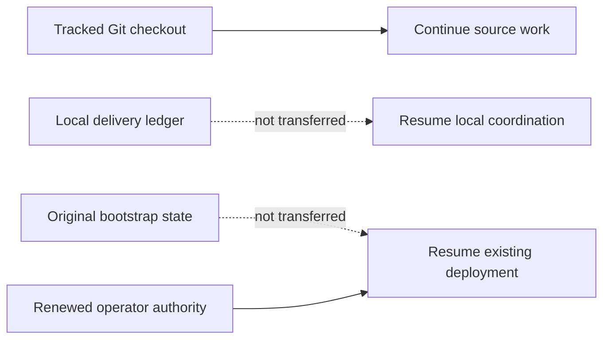

# Agent continuation checkpoint

Last updated: 2026-09-09 (Asia/Seoul).

This tracked file is the bounded continuation seed for Claude, Codex, GitHub
Copilot, other automation, and human contributors after a fetch, pull, fresh clone,
chat restart, or context loss. It describes source work only. It is not deployment
state, operator authorization, or live evidence.

## Receiving a checkout

This file deliberately does not embed a commit hash. A tracked file cannot reliably
self-embed the hash of the commit containing its final bytes, and branch pointers
can move. The reviewed branch and commit that contain this file are the handoff
source. On the receiving machine, record the actual checkout before acting:

```bash
git status --short
git rev-parse --verify HEAD
```

Do not silently discard local changes to make the checkout match another machine.
If a maintainer supplied a specific branch or commit, check out that exact source;
otherwise use the repository's reviewed default branch. Record HEAD and this file's
fingerprint in the new local delivery ledger.

For an existing clean checkout of the reviewed default branch, update without a
merge commit:

```bash
git fetch origin
git switch main
git pull --ff-only origin main
```

If `git status --short` reports local work, preserve and review it before pulling;
never reset or overwrite it merely to follow this checkpoint.

Git transfers tracked code, tests, documentation, and agent/skill instructions. It
does not transfer these ignored local inputs and evidence:

- `.agent-runtime/` delivery journals, assignments, and handoffs;
- legacy `.agents/runtime/` delivery state retained by older working copies;
- `.bootstrap/` deployment checkpoints and sanitized environment evidence;
- `bootstrap/config.json` non-secret deployment configuration;
- `.secret` or `.secrets` private runtime input; or
- build output and other generated artifacts.



A new clone can continue the source task below by initializing a new local ledger
from this checkpoint. It cannot Resume an existing deployment from Git alone. That
requires the original matching `.bootstrap/` state, matching configuration, and
renewed operator authorization through the documented secure operator boundary.
Never commit those paths to make deployment Resume portable.

## Authority and reading order

`AGENTS.md` is the binding cross-tool repository instruction file. Tool-specific
entry points supplement it:

- Claude reads `CLAUDE.md` and the project `.claude/` instructions;
- Codex uses the tracked `.agents/skills/` and `.codex/agents/` definitions; and
- GitHub Copilot reads `.github/copilot-instructions.md`.

Follow the exact required reading sequence in `AGENTS.md`: current
`docs/implementation-status.md`, this `docs/agent-continuation.md` checkpoint,
`CLAUDE.md`, and the relevant agent guide. For bootstrap work also read
`bootstrap/README.md` and the complete canonical
`.agents/skills/a365-bootstrap-delivery/SKILL.md` plus its recording contract. Before
any Azure, SQL, Entra, Graph, Service Bus, Purview, deployment, or incident action,
read `docs/operations/development-deployment-status.md` and the applicable runbook.

When sources disagree, authority descends from implemented code, tests, deployed
contract, and authorized live evidence; then current official Microsoft
documentation; current checkpoints; architecture and runbooks; product intent; and
finally agent playbooks. Record the discrepancy instead of silently choosing an old
comment or troubleshooting note. Do not reconstruct current work from chat history,
Git chronology, or `docs/history/`.

If `.agent-runtime/bootstrap-delivery/CURRENT.json` is absent, this tracked file is
the bootstrap-delivery seed. Initialize a new bounded local session with the
canonical skill recorder, bind it to the checked-out HEAD and this checkpoint, and
record an Intent before the first material action. Runtime journals remain local;
durable verified truth returns to the two tracked status files. The ignored legacy
`.agents/runtime/` location is not an active discovery path and is never transferred
by Git.

## Current execution contract and operator direction

### Current publication checkpoint

The operator subsequently approved all further independently reviewed work needed
for full deployment and live Gateway function testing on the existing R3 target.
This resolves the host-settings amendment approval hold below. Continue bounded
repairs, exact Plan/receipt execution, normal Resume, verification and live tests
without repeated approval prompts within that scope. Independent review, source
binding, safe input handling and no-replay guards remain mandatory. Unrelated
cleanup, purge, bulk tenant-identity deletion or another target are not implied.

Current continuation: exact Graph operator access was restored through supported
resource-specific claims sign-in and account renewal without exposing credentials,
tokens or challenges. Host-settings Amendment Plan and receipt-only Execute then
passed. Removing only the child receipt from the in-memory state reproduced the
entire prior semantic state; parent receipt, publication, host enablement and all
original assets remain preserved.

Local Setup's missing SDK asset package was resolved by a fresh restore from the
unchanged configured feeds. Full Release build and all eight .NET test projects
now pass. Continuation is using the documented canonical terminal Resume path.
The operator-requested retry passed all fourteen read-only Resume checkpoints.
The first fingerprint-bound Resume stopped on a SQL endpoint read; the unchanged
endpoint verifier then passed. A second normal Resume passed all fourteen preflight
checks and revalidated retained stages through immutable images, but subsequently
stopped on a publisher manifest metadata read before stage seven's callback.
Fourteen stages remain completed; runtime deployment remains failed. No new
publisher execution, host enablement or SQL initialization occurred.

The terminal native exit has no classified error code. Historical independent
probes proved intermittent pre-authentication TCP resets and timeouts; a subsequent
exact publisher metadata read succeeded and matched the retained digest. These
facts do not prove the latest failure's cause or persistent image drift.
The exact manifest-read retry repair and distinct preserving tooling amendment
passed independent review, 1,447 Pester tests (eight platform exclusions), source/
Bicep, a 960-file clean export with fresh Windows package verification, Release
build, all 2,123 .NET tests, and nine formatting checks. Only exact manifest digest
reads retry native nonzero exits, at most three times; unknown exits are not
relabeled transient. Successful readback still requires exact semantic proof.
Mutations, malformed successful output and digest mismatches never retry.

Actual read-only amendment Plan and receipt-only Execute passed. Removing only the
new receipt reproduced the entire prior semantic state; configuration remained
byte-identical. Both historical receipts, snapshots, original deployment assets
and completed operations remain intact.

First unfinished action: finish the fresh canonical Resume review already started
against the new tooling, inspect its semantic result, and use its new exact
authorization for normal Resume. Never use an older authorization fingerprint.
Then require all nineteen stages, `gateway verify`, independent Admin UI HTTPS/
sign-in verification and the full live acceptance matrix. Deployment and live gates
remain unfinished; no verified Admin UI URL or completed deployment is claimed.

### Earlier R3 checkpoints (historical)

The current continuation above supersedes the earlier approval holds and failure
states below.

The operator approved the exact reviewed in-place
reconciliation and continuation. Receipt-only Execute completed, and comparison
after removing only that receipt matched the original semantic state. Public
Setup's read-only Resume review passed all fourteen checkpoints. Normal Resume
then reconciled the existing publisher execution without another start and
completed the Windows executor host-enable deployment.

Runtime verification stopped afterward on the host-settings readback adapter.
The generic ARM action returned an empty object, while the dedicated Web App
settings read returned all thirty settings matching the exact expected values.
No host configuration drift was found. A narrowly scoped read-only adapter fix and
amendment to the completed tooling receipt are implemented, with 109 changed-file
tests passing (one platform exclusion) and the aligned native fixture passing 45.
Independent review and final validation passed: 1,419 Pester tests (zero failures,
eight explicit platform exclusions), source/Bicep and a 959-file clean export
with fresh-source package verification. Original R3 assets were not rebuilt or
replaced. Amendment Plan is blocked by Graph authentication as described above.
Preserve the
original receipt and assets, completed publication and host enablement, SQL,
certificates and identities; none may be replayed or reset.

The new host-settings amendment approval prompt returned NoResponse. Continue
source implementation, tests and independent review, but do not amend execution
binding or Resume again without explicit approval. R3 remains at fourteen of
nineteen completed stages, with no verified Admin UI URL.

Earlier R3 publisher boundary: the operator explicitly approved the exact replacement.
The failed R2 group was deleted once and verified absent, with its local evidence
and existing tenant applications preserved. Fresh R3 Setup Plan passed, and Apply
completed fourteen stages including SQL, Admin UI credentials and Purview
prerequisites. Runtime deployment stopped at publisher execution-template
validation after exactly one publisher execution succeeded.

Read-only comparison proved the sole mismatch: Azure adds execution metadata
`imageType: ContainerImage`, including through the stable ARM API. All remaining
normalized image, environment and resource fields match the current job readback.
Reconciliation must additionally prove the original persisted publication-intent
fingerprint before any execution-binding change.
The ordinary guard rejected the unreviewed field; publication remains `Started`
locally and no host enablement or later completion is claimed. No second publisher
execution is allowed.

A narrow parser correction and explicit tooling-source reconciliation plan/receipt
are implemented for this exact fourteen-stage case, with 569 affected tests passed
(one existing platform exclusion) and a final 52-test reconciliation rerun passed.
Independent review and final validation passed: 1,362 Pester tests (zero failures,
seven existing platform exclusions), source/Bicep and a 958-file clean export.
Tests used an isolated Azure CLI configuration to prevent use of operator
credentials. Fresh-source package verification passed separately; it is not a
replacement for the original R3 package. They preserve the
original accepted plan, runtime images, package, SQL, certificates and identities,
restore corrected tooling before callbacks, and let only normal Resume advance.
The actual read-only reconciliation Plan passed against R3, including original
raw-intent, package, source and provider checks; original state/configuration
hashes were unchanged. Its exact Execute/continuation approval prompt returned
NoResponse. Obtain explicit approval of that recorded Plan before receipt-only
Execute and normal Resume; do not rebind R3 execution or perform remaining
mutations without it. No replacement target, purge or policy change
is authorized by that prompt. Follow the
[publisher metadata runbook](operations/publisher-metadata-recovery.md) only within
its reviewed authority and source boundary. There is no verified Admin UI URL yet.

Latest continuation on 2026-09-08: the operator explicitly approved the exact
cleanup and replacement, resolving the earlier approval hold. The failed original
resource group was deleted once and independently verified absent, with original
configuration/state hashes unchanged and tenant identities preserved. Actual fresh
Setup Plan succeeded on the reviewed, published fixes. Replacement Apply completed
four stages, then the API-identity guard refused an Entra application created
before this attempt whose ownership marker does not match the replacement.
No application adoption, ownership rewrite or tenant-identity deletion occurred.

The remaining replacement namespace was checked read-only before proposing a new
scope: the named Entra applications and API audience were absent, the Key Vault
and Service Bus names were available, and the proposed group was absent. The
scope-amendment prompt returned NoResponse; that does not authorize deletion of
the current replacement or creation of another target. Preserve its four completed
stages, configuration, resources and prior tenant identities. Early Plan namespace
validation is implemented with 38 focused and 258 affected tests passing so this
conflict is caught before foundation creation. Final validation passed 1,290
Pester tests (zero failures, seven existing platform exclusions), source/Bicep,
independent review and a 954-file clean export with rebuilt Windows package and
independent ZIP verification. The new read-only helper also rejected the actual
known namespace conflict without mutation. Obtain the exact scope amendment
before another live deployment. No Admin UI URL or completed deployment is verified.

Latest operator action: after source publication, the operator reported deleting
Azure resources and bootstrap configuration, then requested repair of a fresh
Setup Plan failure, completion of deployment, and the verified Admin UI URL.
The new configured target is independently absent in Azure and has zero local
completed stages with no accepted Plan. Preserve older state; never Resume a
deleted target. Existing selected-subscription authority remains bounded to the
reviewed configuration and documented provider operations.

The Plan failure was reproduced through Windows PowerShell launching PowerShell 7:
both editions' module paths expose ExchangeOnlineManagement 3.10.1, and the
packager incorrectly required exactly one installed copy globally. The reviewed
source fix pins an exact signed manifest using ordered module discovery, rejects
an invalid first candidate without fallback, and retains version and reparse
guards. Actual launcher-ancestry validation now passes; 54 package tests and 200
Experience tests passed. Setup reports an actionable, curated packaging boundary.
The combined candidate passed 1,256 Pester tests (seven existing exclusions),
source/Bicep, independent review and a 953-file clean export with an actual rebuilt
Windows package. Actual Setup Plan then succeeded, and explicitly confirmed Apply
completed six stages before Azure returned `VaultAlreadyExists` during inert
deployment. Subsequent exact active/deleted vault inventory was empty and name
availability was true; a persistent soft-delete collision is not established.
Supported read-only Resume validated all six stages, but confirmed Resume stopped
before another ARM deployment.

Read-only diagnosis proved a second source defect: strict-mode canonicalization
crashes on an empty `PSCustomObject`, including the disabled executor binding
returned by ARM. A one-line enumeration fix passes 25 focused canonical/parameter
tests (one existing exclusion), including previously failing real JSON fixtures.
Its final source generation passed 1,265 Pester tests (zero failures, seven existing
platform exclusions), all source/Bicep checks, independent review, and a 953-file
clean export with rebuilt Windows package and independent ZIP verification. It
cannot silently replace the accepted snapshot. The exact replacement-target approval request received
NoResponse, not consent or revocation. Preserve the failed target, its six
completed stages and all local evidence; no purge, reset, replacement or another
Resume is authorized by that failed prompt. The first unfinished action is to
obtain exact replacement authority or a separately reviewed in-place source
recovery plan. Deployment, `gateway verify` and the Admin UI URL remain unverified.

The operator explicitly authorized committing and pushing the accumulated source
and protocol work on canonical `main` on 2026-09-07. This is a source handoff, not
a completed deployment or release. The current live attempt remains at fourteen
of nineteen stages, with Gateway runtime deployment (stage 15) failed after
supported same-source Resume. Preserve its accepted state and the prior successful
publisher execution; do not replay completed mutations.

The publisher metadata correction passed 61 focused regressions, independent
review, and the full Bootstrap suite (1,161 passed, zero failed, seven existing
platform exclusions), with source/Bicep and package/export evidence recorded in
the local ledger. Earlier counts below belong to their named source generations.
The exact first unfinished product action is to isolate the stage-15 validation
failure from safe evidence and source, then validate any proven correction before
another authorized live action. Deploy, LiveValidate and final release acceptance
remain open. Git publication does not authorize a new deployment or bypass source
binding; ignored state, configuration and private inputs are not published.

### Execution history and retained authority

Follow the [end-to-end execution contract](agent-guides/end-to-end-execution.md).
The latest operator instruction supersedes the earlier recovery-first plan and
cloud hold: automatically tear down the authorized test scope, configure/deploy
through the Windows Setup UI, verify multiple external agents and blueprints,
independent Agent 365 observability, SIT-based DLP and Prompt Shields allow/block,
capture safe screenshots, and repeat a clean scratch run with edge cases.
No test milestone or blocked turn closes this product objective.

Canonical `main` remains the sole checkout. The operator authorized login,
deletion and recreation and supplied temporary credentials. Do not request the
same credentials again or copy their values. Existing authenticated Azure CLI
subscription/group inventory succeeded. The operator then explicitly selected one
subscription under the full teardown directive, resolving the earlier scope prompt.
Only that subscription is in scope; the other subscription and bulk tenant identity
deletion are excluded. Cleanup is verified: zero resource groups and zero active
ARM resources, with independent delegate readback and coordinator corroboration.
All original groups are absent; provider-managed groups disappeared through their
parents. No soft-delete purge, tenant identity cleanup or local evidence deletion
was performed. Deleted-target state must never be resumed to recreate resources.
Fresh Windows integration and its exact executor-grant Verify/Resume correction
are implemented and independently re-reviewed. The current frozen source passed
Release with zero warnings/errors, all 2,123 .NET tests, 1,055 Bootstrap tests,
32 Operations tests and 22 Purview tests. Seven Bootstrap exclusions are six POSIX
launcher cases on Windows and a symlink case unavailable on this host; they are
not execution proof. Source/Bicep, replacement Windows package and clean-export
checks passed. These are offline results, not live readiness.
Do not treat the earlier NoResponse or cloud hold as a current blocker.

The bounded local ledger references `execution-context.json` in its active session
for the current authority, credential-availability facts, scope question and next
action. That context contains no credential values. Git does not transfer it or
grant a receiving session cloud authority. Preserve prior accepted deployment state
and config evidence; the fresh UI run uses a new deployment identity. Do not restart the obsolete
recovery-only sequence or claim the old cloud prohibition is still current.

The public Windows Setup UI Plan succeeded and attempt1 Apply ran once under its
exact confirmation. It completed fourteen stages, including one successful private
database execution and Purview prerequisites, then stopped at runtime deployment.
Read-only reproduction identified an ARM resource GET incorrectly routed through
the shared Graph-only dispatcher; the Graph hostname guard correctly rejected it
before any executor mutation intent. A regression-first adapter correction and
authorized selected-subscription teardown are separately assigned. Do not weaken
the guard, Resume deleted state, or replay completed SQL/certificate work.

Attempt1 teardown is now independently verified: zero groups/active ARM resources,
with the original state/config/diagnostic hashes unchanged. The ARM routing repair
passed independent review and 45 real-dispatch regressions, 1,100 Bootstrap tests
(seven unchanged exclusions), Release with zero warnings/errors, all 2,123 .NET
tests and 54 Operations/Purview tests. Replacement package and clean-export proof
are bound to the new source. Attempt2 uses a fresh identity and exact UI-reviewed
resource-group name; its public UI Plan succeeded and Apply was started once.
Apply completed fourteen stages and then crossed its built-in sixty-minute validity
window before runtime deployment began. Source/configuration/snapshot checks still
matched. The actual UI's supported read-only Resume review then validated all
fourteen checkpoints, including the single database execution, schema and original
administrator restoration. A fresh remaining-step confirmation started Resume once
under existing authority; no clock,
guard, source, config or completed SQL/certificate action was changed/replayed.
That Resume passed the former ARM routing boundary and completed the executor
identity/grant, publisher image and disabled host/publisher deployments. It then
stopped before any publisher execution: Azure returned no secrets as null and
case-normalized ARM identity IDs, which the exact publisher validator rejected.
Read-only diagnostics confirmed all substantive principal/environment/manual-job
limits and Main/None lifecycle bindings match. A regression-first semantic
normalization fix and authorized clean teardown are now separately assigned.
The attempt2 UI was closed and its config archived byte-identically; state and
operation evidence remain preserved. Next UI identity is fresh, never a Resume of
deleted state. Current references are in the local execution context.
This also records successful supported UI continuation, not an expiry bypass.

The failed attempt's accepted state, byte-identical config archive and safe
diagnostic/screenshot evidence remain local. Its owned UI/browser were closed.
The new public UI run checks field settlement and the exact reviewed
resource-group name before Plan. S0 retains the previously reviewed cost choice.
API activation recovered without intervention; an unrelated policy deployment's
ResourceNotFound remains separately recorded, not asserted as the Gateway cause.

Protocol repair evidence: 70 cross-tool contract Pester tests passed with zero
failures/skips; the isolated ledger self-test passed after first reproducing an
omitted-gate reset. Recorder guards now preserve omitted gate/blockers/next action,
require an evidenced coordinator Decision to change the objective, and reject
premature Complete without the required gate references or with open holds/tasks.
Independent review found no high-confidence issues. Machine-readable test output
and the review receipt are referenced by the local ledger. This is protocol-only
acceptance, not cloud delivery; the earlier recovery clean-export check still has
not run and the earlier completion report overstated that milestone.

## Prior stopped deployment evidence (not current authorization)

The operator stopped work and handed the task to another model. The fully running
Gateway has **not** been delivered. Do not restart deployment automatically from
this checkpoint; continue when the operator resumes. Exact target, original
authorization, configuration and recovery evidence remain in ignored local operator
records and do not transfer through Git.

Two bootstrap defects that blocked the Purview prerequisite stage were found,
corrected against current Microsoft documentation, and pushed to `main`.

The first defect built the Microsoft Entra key-credential window from the requested
generation values instead of the issued certificate. That produced two simultaneous
violations: a sub-second `endDateTime` outliving the certificate's whole-second
`NotAfter`, and a window of one year plus five minutes exceeding the documented
one-year maximum. Entra rejected the whole application update as a validation
failure, which is the previously undiagnosed publication error. The window is now
derived from the issued certificate, clamped inside its validity and under one
year, and formatted to whole UTC seconds.

The second defect asked Microsoft Graph to filter the `domains` collection.
Microsoft documents `$filter` as unsupported there, and the service answers HTTP
400 `Request_UnsupportedQuery`. The initial verified domain is now selected from
the returned collection. The uniqueness, verification and domain-shape guards are
unchanged.

Both corrections are proven by exact live provider readback, not by local state or
configuration. The automation application on the active target now carries exactly
one key credential with a whole-second window inside the certificate; this is the
first successful publication of that credential on any target. The corrected domain
lookup returned the tenant initial verified domain in a read-only call against the
same tenant.

A clean deployment of the current source was separately authorized on a new
development target. It reached thirteen of nineteen stages complete with the
Purview prerequisite stage failed. Its certificate is **not** partial: publication
succeeded and only the subsequent domain readback failed, which the second
correction addresses. The earlier retained target that holds the partial
certificate is untouched. Its certificate, both grants, accepted snapshot,
completed stages and operation record were not replayed, rotated, cleared or
rerun through the identity Ensure function. Preserve it exactly as recorded.

Both corrections landed after that deployment's plan was accepted, so the current
source fingerprint no longer matches its accepted-source snapshot. This is the
active blocker and it is unresolved. Resume stops at its accepted-authorization
preflight because current source differs from the accepted source without a
completed automatic database recovery. Plan refuses because the deployment has
already started. Resume also executes bootstrap modules from the accepted-source
snapshot rather than the working tree, so even a passing Resume would run the
uncorrected source. No supported operator path out of this state had been
established when work stopped.

Do not force progress. Do not edit or delete accepted state, remove `.bootstrap`,
weaken the source-binding guard, or replay a completed recovery in order to adopt
new source. If no supported command accepts a corrected source generation on a
started deployment, that is a reviewable source gap to report to the operator with
its trade-offs, not a guard to bypass.

No registration, delegated Registry completion, worker-verified `Active`,
independent Agent 365 landing, Prompt Shields allow/block or DLP allow/block has
passed for the active target. Windows executor deployment integration, dedicated
identity creation, package rebuild and publication, upgrade receipt,
fresh-bootstrap wiring and actual Windows/provider proof also remain unfinished;
the old package is stale and must be rebuilt against final source. Canonical `main`
is the sole checkout, with no branch or worktree created. Credentials and runtime
evidence remain outside Git.

## Validation for the two corrections

These are source gates. They are not deployment evidence or live-readiness proof.

| Gate | Result |
|---|---|
| Focused Purview certificate and identity tests | 45 passed, 0 failed |
| Focused credential-window and domain-lookup tests | 50 passed, 0 failed |
| Bootstrap, Operations and Purview Pester | 964 passed, 0 failed, 7 skipped |
| Hosted CI for the credential-window commit | Passed |
| Hosted CI for the domain-lookup commit | Passed |

Each correction carries focused regression tests that fail against the previous
behaviour. The final recovery selectors passed 50/50, the bootstrap source gate
passed, and the source plus Windows/POSIX launcher tests passed 21 with six
existing skips. Release build, the eight .NET test projects, Bicep compilation,
the nine format targets and a clean export were not rerun. These results remain
offline source evidence only; rerun the broader release gates before any release
claim.

## Earlier validation for the promoted Windows executor source

The combined handoff source passed Release with zero warnings and errors, all 2123
.NET tests across eight projects, 31 package/source-binding Pester tests, source
structure checks, document/link/private-path checks and independent handoff review.
The earlier architecture failure was a stale expectation of the removed local
provider; its assertion now expects the reviewed remote provider and all affected
tests pass. Hosted CI later passed for the promoted-source commit. Full
bootstrap/export gates for that combined source remain pending. No live gate was
closed by that handoff.

## Exact first unfinished action and invalidated gates

The accepted-source deadlock is now addressed in source by the separately
reviewable `CompletePrerequisiteReconciliation` plan and receipt. It accepts only
the active case with thirteen completed stages, exact complete grant and
certificate readback, and corrected tooling pinned in an immutable snapshot.
Resume restores that snapshot before callbacks while preserving the original
deployment source, images, SQL binding, and completed prefix. It performs only
the normal `ReconcileOnly` stage verification; it does not create, rotate, grant,
replay, reset, or mutate provider state.

The source candidate passed 48 focused recovery tests and the full bootstrap
suite (917 passed, 7 skipped). The seven skips remain test-environment exclusions
from the existing suite; no skipped test was used as recovery evidence. An
independent diff review found no significant issues. No live Plan, provider
readback, Execute, Resume, deployment, policy, or cleanup action has been run.

The earlier next action was exact-target read-only recovery Plan approval. The
latest clean-test directive above supersedes that ordering; the recovery candidate
is retained as source evidence, not the current execution plan.

Once the deployment can advance on corrected source, finish Apply through all
nineteen stages and run `gateway verify`. Then finish
[Windows executor integration](architecture/purview-windows-executor.md) using the
now-tracked implementation, preserving original bootstrap evidence and recording
the upgrade separately. Then finish core registrations, delegated Registry,
Agent 365 observability, Prompt Shields and DLP live acceptance.

The retained earlier target still holds an unresolved partial certificate. Its
publication failure is now explained by the corrected credential window, but both
the ordinary recovery and the complete-prerequisite reconciliation deliberately
refuse partial state. Leave that target untouched.

Deployment, Windows startup and provider proof, full Gateway E2E and final release
acceptance remain open. Current authority and destructive-scope resolution are
described above, not supplied by this historical handoff.

## Live boundary and remaining work after operator resume

The active deployment has fourteen completed stages and a failed Gateway runtime
deployment stage. The corrected publisher source was used for one supported
same-source Resume: stages 1-14 revalidated and executor resources were
provisioned, but stage 15 failed. A sanitized diagnosis confirmed the executor
ARM deployments and one prior succeeded publisher execution without exposing a
dependency error body. Older deployments and database recovery evidence are
retained for diagnosis; they are different targets and are not Resume candidates
for the current source. Do not edit accepted state, replay database jobs, finalize
SQL, remove identities, or clean up earlier environments without exact authority.

After the operator resumes and deployment is verified, prove real Admin UI sign-in and primary routes, two
external registrations using compatible blueprints created or reused as authorized,
user-only delegated Registry completion, final worker-verified Active, independent
Agent 365 activity and audit landing, Prompt Shields allow/block, and blueprint DLP
allow/block. Existing seed blueprints must be reconciled before creating additional
ones. Follow the [deployment checkpoint](operations/development-deployment-status.md)
and [Purview runbook](operations/purview-setup-runbook.md).

The prior local desktop/narrow-width UI gate uses the user's explicit acceptance
of bUnit tests and independent UI source review after automatic browser policy
blocked inspection. That is a waiver, not evidence of a browser run or a waiver of
real deployed Admin UI and Gateway E2E. Automatic policy separately blocked the
local packaged Windows host startup check; that check remains unverified.

Before commit/push, follow the shared [model handoff protocol](agent-guides/model-handoff.md):
update all applicable model entry points, specs, skills, directives, guides,
READMEs, status and notes; run metadata, link, private-path and ledger checks;
commit and push canonical `main`; verify the remote commit and hosted CI. The
retired worktree's local evidence remains an archive, not active deployment state.
Git contains no credentials or ignored runtime evidence. Historical detail lives
in Git history and the bounded local ledger, not a competing next-action section.
