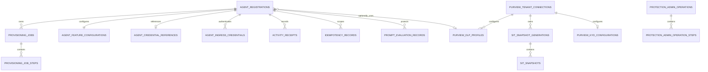
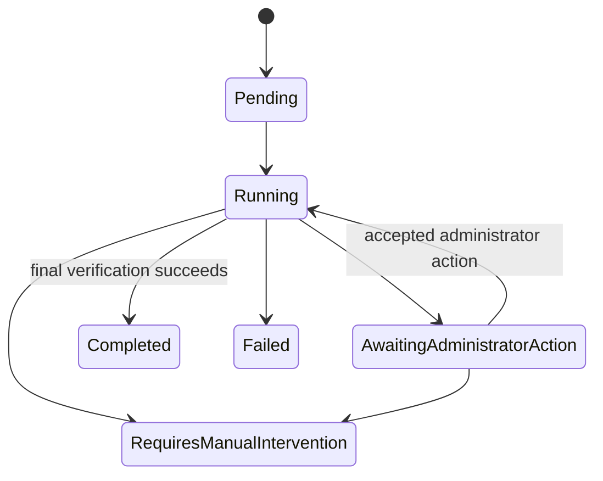

# Data model

Azure SQL is the authoritative store for Gateway registrations, provisioning,
credentials, idempotency, audit, and outbox state. The schema is applied by reviewed
migrations and bootstrap initializes only a database with zero user tables.

## Core relationships

`OutboxMessages` is a transactionally written dispatch table whose payload carries
safe workflow identifiers; the current schema does not model a foreign key from it
to a job or registration.

## Registration aggregate

`AgentRegistrations` binds the generated external agent ID, selected reusable
blueprint, distinct child Agent ID, accepted Registry ID, feature settings, status,
and timestamps. One external ID maps to exactly one registration. A blueprint may
be reused by many registrations; a child identity may not.

`AgentIngressCredentials` stores key ID, format and hash metadata, salted verifier,
creation time, required expiry, revocation time, and the creating administrator's
object ID. It never stores the clear Gateway key. `AgentCredentialReferences` is a
separate one-to-one registration reference used by the provisioning aggregate.

## Provisioning state

`ProvisioningJobs` owns ordered `ProvisioningJobSteps`. The current workflow uses
seven steps selected from the persisted `ProvisioningStepType` enum. Existing enum
numeric values are compatibility contracts and must not be reordered or reused.

The API-owned `Agent365RegistryAttemptState` is serialized into the `RegisterAgent`
step's `ResultData`; there is no separate Registry-attempt table. It records the
authentication mode, creator, start time, planned Registry ID, and optional returned
Registry ID. It is distinct from the historical serialized compatibility property
on worker state. Only this API-owned step state authorizes Registry recovery.

Registry acceptance and final verification are step-level facts while the job is
`Running`; they are not additional `JobStatus` values.

An unknown POST outcome does not return to a POST-capable state. Recovery performs
exact GET against the persisted planned ID or remains manual.

## Idempotency and locking

Data-plane idempotency is scoped by registration, normalized endpoint, and canonical
UUIDv4 idempotency key. Under a transaction-owned SQL application lock, the API:

1. resolves the authenticated registration;
2. computes a canonical request hash;
3. acquires the scoped lock;
4. reads or creates the idempotency lease;
5. performs side effects and outbox writes;
6. commits safe response metadata.

The same key and hash replay the safe recorded result. The same key with a different
hash returns conflict before side effects. One-time secret responses are never
cached for replay.

## Outbox

`OutboxMessages` is written in the same SQL transaction as the state transition.
Publishers deliver to Service Bus and mark dispatch state afterward. Consumers must
tolerate duplicate delivery. Final Registry acceptance enqueues only the final
verification message.

## Content and observability metadata

Raw approved interaction content is kept only in the encrypted Blob content store
with documented retention. SQL activity receipts contain sanitized identifiers,
processing decisions, timestamps, and correlation data. Prompt-evaluation receipts
store a salted content binding and consumption state, never the prompt.

## Protection governance

The protection-governance v1 migration implements the
[protection settings plan](protection-settings-plan.md):

- `ProtectionCapabilities` stores bootstrap-owned capability kind, status,
  non-secret resource identifiers, and exact-readback time.
- `PurviewTenantConnections` stores one exact tenant authority connection and its
  active expiring inventory generation.
- `PurviewSensitiveInformationTypeSnapshotGenerations` and
  `PurviewSensitiveInformationTypeSnapshots` store bounded tenant inventory by
  canonical GUID, exact Unicode name, publisher, order, and expiry.
- `PurviewKnowYourDataConfigurations` enforces one fixed
  `ee1680d0-702f-4090-b26c-c49091e86531` Group on the Application plane.
- `PurviewDlpProfiles` enforces one Individual/Application profile per blueprint
  application ID and stores policy/rule readback plus independent capability,
  propagation, token-role, allow, and block evidence.
- `ProtectionAdminOperations` and their ordered steps persist reviewed intent,
  accepted-request hash, confirmation verifier, idempotency key, actor, target,
  retry/manual-intervention state, safe failure code, and readback references.

Legacy combined `PurviewPolicyProfiles` are preserved. The migration projects them
into review-required `LegacyProtectionPolicyCandidates`, splitting blueprint
bindings without declaring them Ready or mutating provider state.

At verified runtime startup, the API validates bootstrap's complete exact 19-key
capability attestation and synchronizes all three capability rows under a SQL
application lock and transaction. The upsert is deterministic,
restart-idempotent, rowversion-preserving for unchanged rows, clears stale
NotInstalled identifiers, and rejects partial or drifted state. Inert startup does
not materialize rows.

Profile assignment remains optional. A registration without a profile follows the
core path. Purview use fails closed unless the exact profile and inventory remain
Ready for that registration's resolved blueprint.

## Retention and deletion

The idempotency service applies the configured idempotency-record lifetime when it
creates a record. The repository does not currently implement background cleanup
for activity receipts, audit events, or outbox rows, so their persisted legacy
retention columns are not presented as active controls. Identity, Registry, and
credential cleanup are separate privileged operations and must be based on exact
ownership evidence. Bootstrap intentionally has no destroy mode.
