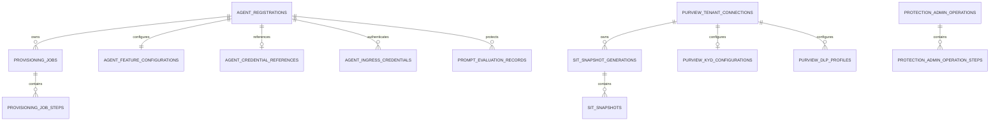

# Data model

Azure SQL is the authoritative store for Gateway registrations, provisioning,
credentials, protection configuration, audit, idempotency and dispatch state.
This guide describes the retained EF model, not a deployed database.
[MILESTONES.md](../../MILESTONES.md) is the sole completion record; see
[project state](../project-state.md) for the deleted tooling and current context.

## Core relationships

This diagram shows principal aggregates. Current DLP profiles bind to registrations
through the resolved blueprint application ID; the registration's legacy
`PurviewPolicyProfileId` foreign key points to the older combined profile table.
Do not treat those two profile models as interchangeable.

## Registration and credentials

`AgentRegistrations` records the generated external ID, requested and resolved
blueprint, child identity, Registry identifiers, lifecycle status, feature choices,
row version and a nonempty protection revision. Filtered unique indexes prevent
active registrations from sharing external or child identity bindings.

The aggregate also records the requested Purview policy mode and configuration
operation ID. A reviewed new-blueprint request persists deferred configuration on
the protection operation until the resolved identity is available. Turning off one
agent's usage does not remove the blueprint's shared DLP profile.

`AgentIngressCredentials` stores key ID, format/hash metadata, salted verifier,
expiry, revocation and creating administrator. It never stores the clear key.
`AgentCredentialReferences` serves the separate provisioning reference.

## Provisioning and Registry recovery

`ProvisioningJobs` owns ordered `ProvisioningJobSteps`. The current workflow has
seven stages. Persisted enum values are compatibility contracts.

The API's `Agent365RegistryAttemptState` is serialized into the RegisterAgent
step's result data. It records the actor, authentication mode, start time, planned
Registry ID and accepted ID when known. This API-owned state authorizes exact
Registry recovery; historical worker compatibility fields do not.

Jobs can wait for administrator action, complete, fail or require manual
intervention. Registry acceptance and final verification are step facts, not extra
job statuses. An unknown POST outcome remains readback-only and never restores
permission to POST again.

## Idempotency, locks and dispatch

Data-plane idempotency binds registration, normalized endpoint and canonical
UUIDv4 key to the request hash. SQL application locks serialize the scope.
Matching requests can replay a safe stored result; a changed hash conflicts.
One-time secret responses are not cached for replay.

`OutboxMessages` is written with its state transition and dispatched afterward.
Its safe payload identifies workflow work; it has no job/registration foreign key.
Persistence derives the destination from the message type. Registration and
protection queues remain separate, and consumers tolerate duplicate delivery.

Protection operations also bind actor, tenant, target, reviewed payload, accepted
request, confirmation verifier, idempotency key and row version. Provider work
does not hold the runtime-test acceptance transaction open.

## Protection state

| Record | Persisted purpose |
|---|---|
| ProtectionCapabilities | Installed/unavailable state, non-secret resource identifiers and exact readback |
| PurviewTenantConnections | Exact tenant authority, status, expiry and active inventory generation |
| SIT generations and snapshots | Tenant-backed GUID, exact Unicode name, publisher, bounded generation and expiry |
| PurviewKnowYourDataConfigurations | Fixed enterprise-AI-apps Group on the Application plane |
| PurviewDlpProfiles | One Individual/Application profile per blueprint, selected SITs and thresholds, policy mode, provider IDs and readiness |
| ProtectionAdminOperations and steps | Reviewed intent, deferred binding, durable progress, safe failures, runtime consent/result and recovery disposition |

Capability startup synchronization uses deployment/source/time-bound attestation,
a SQL application lock and a serializable transaction. The normal bootstrap path
requires either zero or all three capability rows, preserves unchanged row
versions and rejects installed-fact drift. A separate preparation-history path
requires its matching authorization; old bootstrap configuration cannot bypass
an upgraded projection's receipt requirements.

A DLP profile preserves compatibility fields for one SIT and the legacy
Enforce/AuditOnly mode. Its normalized selection uses the current list when
present. Each selected SIT carries independent minimum/maximum count and
confidence values. The four current modes are Enforce, SimulationWithTips,
SimulationWithoutTips and Disabled.

Exact policy readback, propagation, token-role checks and runtime observations are
separate facts. SimulationReady and Disabled are not enforced-ready. Enforce
readiness requires current capability/connection/inventory binding and a valid
runtime certification for the exact profile and test registration.

Legacy combined profiles and review-required candidates remain in the model.
Their existence or provider IDs do not establish current readiness. The source
retains database bootstrap/upgrade attestation contracts, but the referenced
DatabaseMigrator project is absent; schema application must be re-established
and verified under the milestone plan.

## Runtime tests and prompt receipts

Runtime tests reuse `ProtectionAdminOperations`; there is no dedicated runtime
test table. Immutable consent and suite/configuration hashes accompany bounded
sanitized result JSON. Raw sample content is held by disposable ephemeral objects
and is not queued or persisted as operation content.

An execution commits acceptance before calling the provider, then reloads current
state for finalization. SQL finalization uses a fresh serializable transaction and
consistent registration-before-profile locking. Unknown or expired executions
remain explicit outcomes rather than replaying sample submissions.

Prompt-evaluation records store the salted content binding, decisions, expiry,
consumption state, protection revision and context hash. The context binds the
current shared profile, classifier thresholds, policy mode, capability, inventory,
registration and certification. Persistence guards coordinate relevant protection
changes so stale receipts cannot authorize protected ingestion.

## Content, retention and deletion

Approved raw interaction content belongs in the Blob content store. SQL and
outbox data contain bounded operational metadata, hashes and decisions rather
than clear prompts, responses, credentials or provider bodies.

Idempotency records receive their configured lifetime. The retained repository
does not implement background cleanup for activity receipts, audit events or
outbox rows; legacy retention columns are not active cleanup controls.

Registration deletion is Gateway state management and does not imply removal of
Microsoft identities, Registry objects or shared policies. Those require exact
ownership and separate operational handling.

The source contracts are in
[GatewayDbContext](../../src/Gateway.Infrastructure/Persistence/GatewayDbContext.cs),
[entity configurations](../../src/Gateway.Infrastructure/Persistence/Configurations),
[protection context](../../src/Gateway.Domain/Models/PromptProtectionContext.cs) and
[runtime repository](../../src/Gateway.Infrastructure/Persistence/Repositories/PurviewRuntimeTestRepository.cs).
