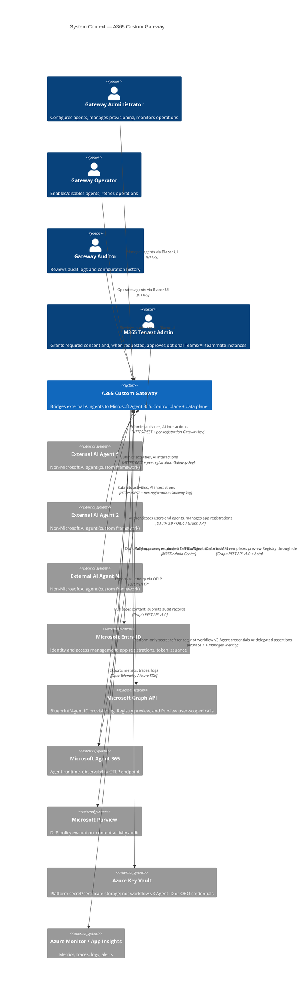
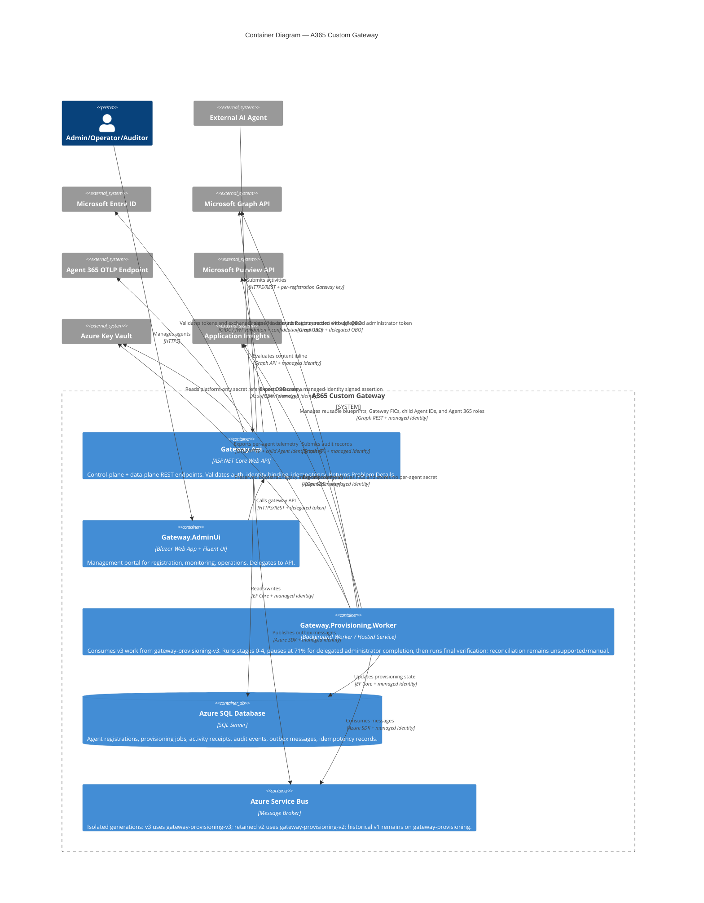
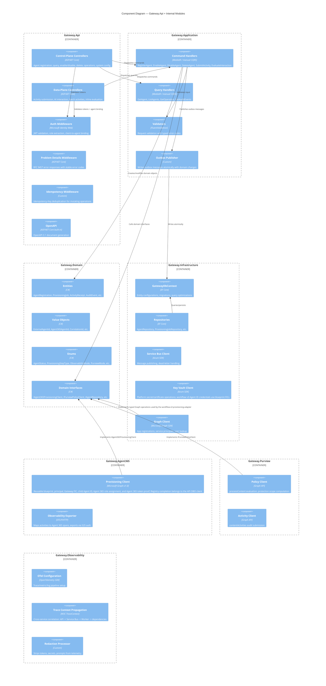
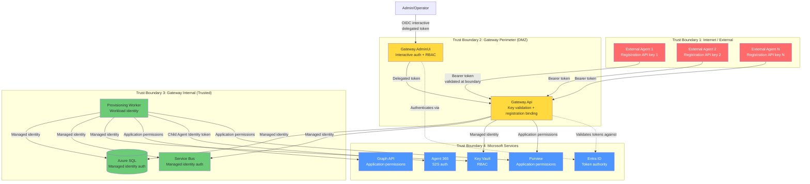

# Phase 2: Architecture

## 1. Executive Summary

The A365 Custom Gateway is a .NET 10 modular monolith that bridges externally developed AI agents to Microsoft Agent 365 without requiring those agents to embed the Agent 365 SDK or CLI. The gateway acts as both a **control plane** (registration, provisioning, administration) and a **data plane** (activity ingestion, AI interaction evaluation, observability export).

### Implementation Boundary

This document describes the architecture; the volatile revision/digest checkpoint
is maintained separately in the deployment status. Local source implements workflow
v3, in which the worker prepares the Agent ID through 71%, a signed-in Gateway
administrator completes the Registry boundary through the API's delegated OBO action
to 85%, and the worker performs final connection verification. Exact current test
counts live in the implementation status.

Workflow v3 development continuous mode is live with its isolated queue, delegated
Graph consent, API-app federated identity credential, and Active registrations for
both create-new and reuse-existing blueprint paths. Both are Available in Microsoft
365 Admin Center, and blueprint-scoped Purview Enforce is proven. The v3 queue is
`0/0/9`, retained v2 is `0/0/3`, and historical v1 is `0/0/2`; no worker may receive
from another generation's queue. Safe identifiers, exact revisions/digests, and the
current resume boundary are maintained in
[`docs/implementation-status.md`](../implementation-status.md) and the live
deployment checkpoint rather than duplicated here.

Three bounded workflow-v2 failures are retained separately with zero active, zero
scheduled, and three v2 DLQ messages. The first failed GET-only at
`ResolveBlueprint` for an incompatible blueprint. The second received HTTP 201 from
one FIC POST on a compatible blueprint, then failed closed when the immediate list
read was stale; later read-only reconciliation proved exactly one matching FIC with
exactly one audience. Neither operation created a child Agent ID, Agent 365 role,
Registry record, or telemetry mapping. The third GET-reused that FIC, created child
`8e4859bd-477c-4133-adb1-9030ec13bf5c`, assigned OtelWrite, then received HTTP 500
without a durable Registry ID. Its outcome is unknown, but the separate workflow-v3
canary succeeded. The three redacted artifacts are under `docs/operations/evidence/`.

The four SQL prepare scripts and the session-owned provisioning job lock, scoped
idempotency lock, and three-scope ingress limiter are deployed in development; real
multi-replica/failover stress remains open and SQL finalization is unapplied. The
deployed API/worker enforce one-POST-maximum accepted-create durability
and API-enforced admission expiry. Workflow-v3 local source removes Registry HTTP
from the worker. The API first acquires an OBO token for the signed-in administrator,
persists create intent under a per-job SQL lock, sends at most one create POST, stores
the safe Registry ID immediately on HTTP 201, using the persisted planned ID only
when a successful response omits one. Immediate exact GET is not required from the
preview collection; an unknown POST is reconciled only by exact planned-ID GET and
never by a second POST. The provisioning-state planned-ID/app-only path remains
historical compatibility code; the API-owned attempt planned ID is current. Microsoft-resource
deletion and standalone reconciliation remain unsupported. See
[`docs/implementation-status.md`](../implementation-status.md) and the live
deployment checkpoint. A completed or failed Gateway row is never independent proof
that a Microsoft resource exists.

### Architectural Style

**Modular-monolith solution boundaries with three deployment hosts** — domain,
application, and integration modules share one solution and strict dependency
boundaries, while `Gateway.Api`, `Gateway.AdminUi`, and
`Gateway.Provisioning.Worker` are independently versioned/scaled Container App
processes. Modules can still be extracted further if scaling or ownership requires
it. The gateway is decomposed into 10 source modules:

| Module | Responsibility |
|---|---|
| `Gateway.Api` | ASP.NET Core Web API — control-plane and data-plane endpoints |
| `Gateway.AdminUi` | Blazor Web App management portal with Fluent UI |
| `Gateway.Application` | CQRS handlers, validators, orchestration services |
| `Gateway.Domain` | Entities, value objects, enums, domain events |
| `Gateway.Infrastructure` | EF Core, Service Bus, Key Vault, Graph implementations |
| `Gateway.Agent365` | Agent 365 integration adapter; observability and the gated development create adapter are implemented and deployed in development, while deletion/reconciliation remain fail-closed unsupported |
| `Gateway.Purview` | Microsoft Purview policy evaluation adapter |
| `Gateway.Observability` | OpenTelemetry, Application Insights, Agent 365 telemetry export |
| `Gateway.Provisioning.Worker` | Background worker for async provisioning via Service Bus |
| `Gateway.Contracts` | Shared DTOs, API contracts, error codes |

### Key Design Decisions

1. **Async-first provisioning** via the outbox pattern: API writes to SQL + outbox in a single transaction, a relay publishes to Service Bus, the worker processes steps idempotently.
2. **Fail-closed by default** for authentication, authorization, identity binding, and Purview Enforce mode.
3. **Agent-to-client identity binding** enforced server-side — externalAgentId in request bodies is never trusted without comparison against authenticated claims.
4. **No clear secrets in code/config/logs/DB** — workflow v3 uses a Gateway-worker FIC for outbound Agent 365 tokens, an API managed-identity signed assertion for delegated OBO, and salted API-key hashes for ingress. Clear keys are returned only at issuance/rotation; tokens/assertions remain in memory and are never logged.
5. **Delegated Registry completion** — the preview Registry create is a user-only API
   action. The caller must be authenticated, carry `Gateway.Administrator`, provide a
   valid `oid`, and have `access_as_user`; the API exchanges that assertion through
   OBO for the admin-consented `AgentRegistration.ReadWrite.All` and
   `AgentRegistration.Read.All` scopes. App-only and CLI fallback are rejected.
6. **Programmatic standard Agent ID flow** — reusable blueprint, blueprint principal, FIC, Agent Identity, and Gateway app-role operations use documented Microsoft Graph v1.0 methods. Per-instance administrator approval belongs only to the optional post-publish Teams/AI-teammate workflow.
7. **Separated ingress and egress identity** — final workflow verification uses the Gateway-worker FIC and `fmi_path` to validate the mapped child Agent ID's Agent 365 token. Gateway ingress uses a unique per-registration API key and independently cross-checks `externalAgentId`.
8. **N:N deterministic routing** — one Gateway brokers N external registrations; each API key resolves one registration and its one child Agent ID/blueprint mapping. Blueprints may be reused, but a singleton Agent ID or global agent API key is forbidden.
9. **One mutation maximum per logical external resource** — after one successful
   Microsoft POST, preserve its safe identifier and use bounded, cancellation-aware
   GET-only reconciliation. Never blind-retry a mutation whose outcome is unknown.
10. **Crash-safe bounded creation admission** — registration/retry admission requires
    both the boolean execution gate and a parseable future UTC
    `Provisioning__AdmissionExpiresAtUtc`, plus exact binding to the one authorized
    external ID (or separately authorized retry agent ID); expiry closes the API server-side even if
    the canary controller or operator PC disappears. The controller gives revision
    rollout 60--300 seconds (default 300), starts the 30--300 second operator window
    (default 120) only after readiness, and caps the API-enforced total exposure at
    600 seconds from the update request. Authenticated system config exposes only the
    authorized registration external ID to the UI; it is not a credential.
11. **Independent delegated-action admission** — close registration before opening
    the Registry completion gate. Completion requires its own future action expiry
    and exact `AuthorizedOperationId`; the two windows must never overlap or be
    treated as one broad execution switch.

Two prototypes inform this boundary without defining it:

- [`a365-agentid-manager`](https://github.com/patrick-shim/a365-agentid-manager)
  demonstrates typed reusable blueprint inventory and child Agent ID relationships.
  Its delegated administrator authentication is a reference, not this worker's
  service-authentication design.
- [`a365-custom-a365-gateway`](https://github.com/patrick-shim/a365-custom-a365-gateway)
  is an N:1 prototype. Its singleton `AGENT_ID`, singleton token provider, and
  optional global API key must not be copied into this N:N Gateway.

### Hosting Decision

**Azure Container Apps** (primary), with Azure App Service as a documented alternative.

| Factor | Container Apps | App Service |
|---|---|---|
| Independent background worker | First-class Container App with separate scaling/revision | Requires WebJobs or separate plan |
| Autoscaling | KEDA-based, scale-to-zero capable | Rule-based, minimum 1 instance |
| Managed identity | Supported | Supported |
| Ingress | Built-in Envoy with mTLS | Built-in with ARR affinity |
| Cost at low traffic | Lower (scale-to-zero) | Higher (always-on plan) |
| Deployment | Container image via ACR | Code or container |
| Networking | VNet integration, private endpoints | VNet integration, private endpoints |

Container Apps is selected because KEDA enables Service Bus-driven autoscaling, independent worker revisions isolate background processing, and scale-to-zero reduces costs during idle periods. The rejected CLI token-cache design isn't part of the hosting decision.

### Phase 1 Constraints Carried Forward

- Direct Agent Registration API is beta and production-unsupported — workflow v3
  uses the explicit delegated administrator completion gate; never use app-only or
  implicit CLI fallback
- `managerApplications` is restricted to first-party apps. The current development
  provider input was correlated from A365 CLI `1.1.214+90c444832f` and tenant
  inventory to verified Microsoft 365 App Catalog Services; keep it tenant/provider
  configuration and revalidate after provider changes
- Blueprints are reusable typed Agent ID resources; ordinary Entra apps and the Gateway API app cannot be converted or selected as blueprints
- Blueprint, blueprint-principal, FIC, Agent Identity, and Gateway app-role operations use documented Microsoft Graph v1.0 methods and are programmatic
- The Gateway worker uses the documented autonomous Agent Identity token exchange for outbound Agent 365 calls; metadata/FIC reads alone do not prove that egress path
- Purview requires real user context — external agents must provide `tenantUserObjectId`
- Per-instance admin approval applies only to the optional post-publish Teams/AI-teammate flow — use a separate `AwaitingInstanceApproval` state after a real request exists
- DLP policy creation is PowerShell-only — documented as operational prerequisite

---

## 2. C4 Context Diagram



---

## 3. C4 Container Diagram



---

## 4. Component Diagram



---

## 5. Trust Boundaries



### Trust Boundary Rules

| Boundary | Identity Model | Validation | Fail Behavior |
|---|---|---|---|
| **1 → 2** (External → Gateway) | Unique Gateway-issued API key per registration. | Parse key ID, reject expired/revoked/deleted state, salted hash + fixed-time comparison, resolve `AgentRegistrationId`, and cross-check request `externalAgentId`. | Fail closed. 401/403. |
| **Admin → 2** (Admin → Gateway) | Entra interactive sign-in. OIDC auth code flow. | JWT with the route's Gateway role. Registry completion additionally requires `Gateway.Administrator`, valid `oid`, and delegated `access_as_user`; the API uses a managed-identity signed assertion for OBO to the two admin-consented Registry scopes. | Fail closed. 401/403. App-only Registry completion is rejected. |
| **2 → 3** (Gateway Perimeter → Internal) | Implicit — same process for API+Application, Service Bus for Worker. | Outbox atomicity ensures only validated messages enter the queue. | N/A (in-process or message-based). |
| **3 → 4** (Internal → Microsoft) | Worker managed identity authorizes provisioning Graph calls and is the one deterministic blueprint FIC subject. The API uses the signed-in administrator assertion through OBO only for Registry completion. `fmi_path` yields the mapped child Agent ID token with `Agent365.Observability.OtelWrite`. | Verify worker Graph caller `oid`, API user `oid`/role/scope, OBO token audience/scopes, resource audience, child `appid`/`azp`, and expected role before use. | Fail closed for authentication, Registry completion, and both Purview modes. Agent 365 observability delivery uses its bounded retry/dead-letter path. |

### Identity Binding Enforcement

The critical security boundary is the **agent-key-to-registration binding** at Trust Boundary 1→2:

1. Registration or rotation returns one high-entropy Gateway API key once; SQL stores only its salted hash and lifecycle metadata.
2. Gateway API validates the key and resolves its credential ID to one stored `AgentRegistrationId`.
3. The `externalAgentId` in the request body/URL is compared against that authenticated registration.
4. Mismatch → 403 `AGENT_IDENTITY_MISMATCH`. No fallback, no override.

The registration body never supplies an ingress identity or external managed-
identity object ID. The child Agent ID comes from provisioning and is used only for
the registration's outbound Agent 365 mapping. The Gateway worker identity is trusted
deployment configuration, not user input.

---

## 6. Control-Plane Flow

```mermaid
sequenceDiagram
    actor Admin as Gateway Administrator
    participant UI as AdminUi (Blazor)
    participant Entra as Microsoft Entra ID
    participant API as Gateway.Api
    participant Relay as API Outbox Relay
    participant App as Application Layer
    participant DB as Azure SQL
    participant SB as Service Bus
    participant Worker as Provisioning Worker
    participant Graph as Microsoft Graph
    participant A365 as Agent 365

    Note over Admin, A365: Agent Registration Flow

    Admin->>UI: Select typed reusable blueprint<br/>or create a new reusable blueprint
    UI->>Entra: OIDC auth code flow
    Entra-->>UI: ID token + access token (delegated)
    UI->>API: POST /api/v1/agents (delegated token)

    API->>API: Validate JWT (issuer, audience, roles)
    API->>API: Assert role = Gateway.Administrator
    API->>API: Require execution gate + unexpired deadline<br/>+ exact authorized external ID binding
    API->>App: RegisterAgentCommand

    App->>App: Validate uniqueness (externalAgentId)
    App->>App: Create AgentRegistration (status=Draft)
    App->>App: Create ProvisioningJob (WorkflowVersion=3, seven persisted stages)
    App->>App: Generate unique per-registration Gateway API key<br/>and persist only its salted hash
    App->>App: Create OutboxMessage

    App->>DB: BEGIN TRANSACTION
    App->>DB: INSERT AgentRegistration
    App->>DB: INSERT ProvisioningJob
    App->>DB: INSERT AgentIngressCredential (key ID + salt + hash only)
    App->>DB: INSERT OutboxMessage
    App->>DB: INSERT AuditEvent
    App->>DB: COMMIT

    API-->>UI: 202 Accepted + agentId + operationId<br/>+ one-time Gateway API key (no-store)
    UI-->>Admin: Shows one-time credential handoff<br/>and "Provisioning..." status

    Note over Relay, Worker: API relay is the sole v3 publisher to gateway-provisioning-v3

    loop Worker-owned stages 0 through 4
        Relay->>DB: Atomically claim one due OutboxMessage
        Relay->>SB: Publish ProvisionAgentMessage(ExpectedStepIndex=n)
        Relay->>DB: Mark claimed OutboxMessage Published
        SB-->>Worker: Deliver exactly one expected stage
        Worker->>DB: Validate workflow v3, job/message/index, and persisted prior state
        Worker->>Worker: Validate execution gate
        Worker->>DB: Persist stage Running

        alt n = 0: ResolveBlueprint
            alt UseExisting
                Worker->>Graph: GET typed agentIdentityBlueprint by selected object ID
            else CreateNew
                Worker->>Graph: Resolve deterministic key or create typed reusable blueprint
            end
            Graph-->>Worker: blueprintObjectId + blueprintAppId<br/>(separate fields; values may match)
        else n = 1: EnsureBlueprintPrincipal
            Worker->>Graph: Resolve/create typed principal for blueprintAppId
            Graph-->>Worker: blueprintPrincipalObjectId
        else n = 2: ConfigureGatewayFederation
            Worker->>Graph: Verify caller oid equals trusted Gateway principal ID
            Worker->>Graph: GET deterministic Gateway FIC
            alt No FIC exists and create is safe
                Worker->>Graph: POST exactly once; preserve returned ID
                Worker->>Graph: Bounded GET-only reconciliation<br/>of ID/name/issuer/subject/exactly one audience
            else One exact FIC already exists
                Worker->>Worker: Reuse it; issue no POST
            end
        else n = 3: CreateAgentIdentity
            Worker->>Graph: POST typed agentIdentity<br/>(agentIdentityBlueprintId = blueprintAppId + sponsor)
            Graph-->>Worker: agentIdentityObjectId + separately named agentIdentityClientId/appId<br/>(current contract requires the same GUID)
        else n = 4: AssignAgent365Access
            Worker->>Graph: Resolve/assign/verify Agent365.Observability.OtelWrite role<br/>on resource 9b975845-388f-4429-889e-eab1ef63949c
        end

        Worker->>DB: Persist verified stage result and safe identifiers
        alt n is less than 4
            Worker->>DB: INSERT next OutboxMessage(ExpectedStepIndex=n+1)
        else n = 4
            Worker->>DB: Mark job AwaitingAdministratorAction<br/>agent AwaitingAdminApproval; progress 71%<br/>no continuation outbox
        end
    end

    UI->>API: GET operation status
    API-->>UI: RequiredAction=CompleteAgent365Registration (71%)
    Note over API, UI: Exact-bound mode closes registration and binds completion to this operation;<br/>continuous development invokes the same user action automatically
    Admin->>UI: Complete Agent 365 registration (explicit or automatic UI action)
    UI->>API: POST /operations/{id}:complete-agent365-registration<br/>delegated Administrator token
    API->>API: Require user + Gateway.Administrator + oid + access_as_user
    API->>DB: Acquire per-job SQL application lock and validate exact v3 prefix
    API->>Entra: OBO exchange using managed-identity signed assertion<br/>Registry ReadWrite + Read delegated scopes
    Entra-->>API: Delegated Graph token
    API->>DB: Persist creator-bound intent with planned Registry ID
    API->>Graph: POST /beta/copilot/agentRegistrations exactly once<br/>planned id + reviewed managedByAppId
    Graph-->>API: HTTP 201 + optional safe Registry ID
    API->>DB: Persist returned ID immediately, or planned ID fallback<br/>no mandatory immediate GET
    API->>DB: Complete RegisterAgent at 85%<br/>audit + final-stage outbox atomically

    Relay->>SB: Publish VerifyAgent365Connection (index 6)
    SB-->>Worker: Deliver final v3 stage
    Worker->>Graph: Re-read blueprint, principal, Gateway FIC, Agent ID, and Agent 365 role
    Worker->>Worker: Verify persisted delegated Registry evidence<br/>No Registry HTTP from worker
    Worker->>Entra: Acquire blueprint T1 with worker FIC<br/>and fmi_path=Agent Identity client ID
    Worker->>Entra: Exchange T1 for child token scoped to Agent 365 observability
    Entra-->>Worker: Agent 365 token
    Worker->>Worker: Validate audience, child appid/azp,<br/>and Agent365.Observability.OtelWrite in memory
    Worker->>DB: Mark Agent Active + job Completed<br/>and insert verification audit event

    Note over Worker, Entra: One deterministic Gateway-worker FIC is reused per blueprint;<br/>fmi_path selects the registration's child Agent ID

    Note over Admin, A365: Optional Teams/AI-teammate instance lifecycle is separate<br/>Publish + configure messaging endpoint + request instance + tenant-admin approval
```

---

## 7. Data-Plane Flow

```mermaid
sequenceDiagram
    actor ExtAgent as External AI Agent
    participant API as Gateway.Api
    participant App as Application Layer
    participant DB as Azure SQL
    participant SB as Service Bus
    participant Worker as Provisioning Worker
    participant Purview as Microsoft Purview
    participant A365 as Agent 365 OTLP
    participant Monitor as Azure Monitor

    Note over ExtAgent, Monitor: Activity Submission Flow

    ExtAgent->>API: POST /api/v1/agent-activities<br/>Authorization: Bearer a365gw_v1_{key-id}.{secret}<br/>Idempotency-Key: {uuid}<br/>X-Correlation-ID: {uuid}

    API->>API: Resolve key ID and verify salted hash<br/>with fixed-time comparison
    API->>API: Reject expired, revoked, or deleted registration credentials
    API->>API: Resolve credential → AgentRegistration
    API->>API: Compare body.externalAgentId with bound registration

    alt Identity mismatch
        API-->>ExtAgent: 403 AGENT_IDENTITY_MISMATCH
    end

    API->>API: Check agent status = Active
    alt Agent disabled
        API-->>ExtAgent: 403 AGENT_DISABLED
    end

    API->>API: Check Idempotency-Key scoped to<br/>registration + endpoint + key
    alt Duplicate key, same body
        API-->>ExtAgent: 202 (cached response)
    else Duplicate key, different body
        API-->>ExtAgent: 409 IDEMPOTENCY_CONFLICT
    end

    API->>App: SubmitActivityCommand
    App->>App: Validate schema, size, redact prohibited fields

    App->>DB: BEGIN TRANSACTION
    App->>DB: INSERT ActivityReceipt
    App->>DB: INSERT IdempotencyRecord
    App->>DB: INSERT OutboxMessage (type=ProcessActivity)
    App->>DB: COMMIT

    API-->>ExtAgent: 202 Accepted + receiptId

    Note over SB, A365: Async Processing

    Worker->>SB: Consume ProcessActivity message

    alt agent365ObservabilityEnabled = true
        Worker->>Worker: Map activity to Agent 365 span (invoke_agent, execute_tool, etc.)
        Worker->>Worker: Emit child ID as gen_ai.agent.id and blueprint client ID<br/>as microsoft.a365.agent.blueprint.id; omit type/platform ID
        Worker->>Worker: Resolve registration's stored child Agent ID + blueprint
        Worker->>Entra: Use the blueprint's one Gateway-worker FIC + fmi_path<br/>to acquire the child Agent ID's Agent 365 token
        Worker->>A365: POST /traces (OTLP/HTTP,<br/>Agent Identity token with Agent365.Observability.OtelWrite)
        A365-->>Worker: 200 OK
        Note over Worker,A365: HTTP 200 proves endpoint acceptance only;<br/>verify delayed CloudAppEvents landing independently
    else Agent 365 export disabled
        Worker->>Worker: Skip Agent 365 destination
    end

    opt azureMonitorExportEnabled = true
        Worker->>Monitor: Mirror sanitized agent metrics and traces
    end

    Note over API, Monitor: Gateway/platform diagnostics continue independently of per-agent destinations

    Worker->>DB: Update ActivityReceipt (status=Processed)

    Note over ExtAgent, Purview: Completed AI Interaction with Purview Enforce

    ExtAgent->>API: POST /api/v1/ai-interactions<br/>Idempotency-Key: {uuid}
    API->>API: Validate Gateway key binding + agent status + Entra user object ID
    API->>App: SubmitInteractionCommand
    App->>Purview: Compute scope for user + reusable blueprint application location
    Purview-->>App: policyUserScope collection + ETag
    App->>Purview: processContent each activity with child/blueprint aiAgentInfo<br/>wait for inline prompt; submit offline response
    Purview-->>App: protectionScopeState + policyActions + processingErrors

    alt exact restrictAccess:block
        App->>DB: INSERT interaction + PurviewDecision (Blocked), no export outbox
        App-->>API: 202 receipt (status=Failed, Purview=Blocked)
    else trusted prompt allow + response audit/offline
        App->>DB: INSERT interaction + PurviewDecision (Allowed) + OutboxMessage
        App-->>API: 202 receipt (status=Accepted, Purview=Allowed)
    else no trusted decision
        App-->>API: 503 PURVIEW_DEPENDENCY_UNAVAILABLE, persist nothing
    end
```

---

## 8. Purview Integration Flow

```mermaid
sequenceDiagram
    participant API as Gateway.Api
    participant App as Application Layer
    participant Cache as Protection Scope Cache
    participant Purview as Microsoft Purview (Graph v1.0)
    participant DB as Azure SQL

    API->>App: Completed prompt + response + Entra user object ID
    alt Purview disabled
        App->>DB: Log decision: PurviewDisabled
        App-->>API: Accept without Purview
    else Enabled but adapter/user/Agent Identity metadata invalid
        App-->>API: Reject before Blob or database mutation
    end

    alt AuditOnly
        App->>Purview: POST contentActivities (uploadText metadata, no content)
        App->>Purview: POST contentActivities (downloadText metadata, no content)
        Purview-->>App: 201 Created for both
        App->>DB: Persist AuditLogged decision and encrypted content reference
    else Enforce
        App->>Cache: Get scope by user ID + reusable blueprint cache partition
        opt Cache miss/expired
        App->>Purview: POST protectionScopes/compute for reusable blueprint application location
        Purview-->>App: policyUserScope collection + ETag
        App->>Cache: Cache inline-only scopes for 30 minutes
        end
        App->>Purview: processContent uploadText with raw prompt + aiAgentInfo
        App->>Purview: processContent downloadText with raw response + aiAgentInfo
        alt protectionScopeState is modified
            App->>Purview: Refresh scope and retry once
        end
        alt Exact restrictAccess:block
            App->>DB: Persist Blocked decision and failed receipt
        else Inline allow and/or accepted offline submission
            App->>DB: Persist Allowed or AuditLogged decision and accepted receipt
        end
    end

    alt Graph failure, processing error, missing/unknown mode, or missing inline decision
        App-->>API: 503 PURVIEW_DEPENDENCY_UNAVAILABLE; persist nothing
    end
```

### Purview Decision Matrix

| Agent Config | User Context | Purview API Available | Gateway Action |
|---|---|---|---|
| `purviewEnabled=false` | N/A | N/A | Skip. Log `PurviewDisabled`. |
| `purviewEnabled=true`, `Enforce` | Missing/invalid | N/A | Reject before content persistence. |
| `purviewEnabled=true`, `Enforce` | Present | Inline and/or offline scopes available | Process each activity by its returned mode. Inline requires an allow/block decision; offline accepts Graph submission and produces `AuditLogged`. Block only exact `restrictAccess:block`; persist a failed receipt and do not enqueue observability. |
| `purviewEnabled=true`, `Enforce` | Present | **Unavailable** | **Fail closed.** Return 503. Do not process the interaction. |
| `purviewEnabled=true`, `AuditOnly` | Missing/invalid | N/A | Reject before content persistence. |
| `purviewEnabled=true`, `AuditOnly` | Present | Available | Synchronously submit metadata-only prompt and response content activities, then persist `AuditLogged`. |
| `purviewEnabled=true`, `AuditOnly` | Present | **Unavailable** | Return 503 and persist nothing; no audit retry queue is implemented. |

The current interaction endpoint receives a completed prompt/response pair. It can
prevent Gateway persistence/export after a block, but cannot undo external model
execution. Pre-model DLP requires a separately implemented phase-specific endpoint.

---

## 9. Provisioning State Machine

```mermaid
stateDiagram-v2
    [*] --> Draft: Administrator creates registration

    Draft --> Provisioning: Provisioning job starts

    state Provisioning {
        [*] --> ResolveBlueprint
        ResolveBlueprint --> EnsureBlueprintPrincipal: typed reusable blueprint verified
        EnsureBlueprintPrincipal --> ConfigureGatewayFederation: principal verified
        ConfigureGatewayFederation --> CreateAgentIdentity: one deterministic Gateway FIC verified
        CreateAgentIdentity --> AssignAgent365Access: Agent ID relationship verified
        AssignAgent365Access --> WorkerPause: Agent 365 observability role verified
        VerifyAgent365Connection --> ProvisioningComplete: delegated Registry evidence and child token verified
    }

    Provisioning --> AwaitingAdminApproval: worker pauses at 71%; no continuation
    AwaitingAdminApproval --> Provisioning: delegated administrator Registry action verified at 85%<br/>final-stage outbox emitted
    Provisioning --> Active: final worker verification complete
    Provisioning --> Failed: Unrecoverable error

    AwaitingAdminApproval --> RequiresManualIntervention: Registry POST remains indeterminate<br/>after exact planned-ID GET

    Active --> Disabled: Operator/admin disables
    Disabled --> Active: Operator/admin enables

    Active --> Deleting: Admin requests deletion
    Disabled --> Deleting: Admin requests deletion
    Failed --> Deleting: Admin requests deletion
    AwaitingAdminApproval --> Deleting: Admin requests deletion
    Draft --> Deleting: Admin requests deletion

    Failed --> Provisioning: Admin retry and server eligibility supported=true

    Deleting --> Deleted: Cleanup complete
    Deleting --> RequiresManualIntervention: Cannot safely delete<br/>Microsoft resources

    RequiresManualIntervention --> Deleted: Admin manually resolves

    Deleted --> [*]

    state OptionalTeamsInstanceLifecycle {
        [*] --> InstanceNotRequested
        InstanceNotRequested --> AwaitingInstanceApproval: Published agent configured and instance requested
        AwaitingInstanceApproval --> InstanceActive: Tenant admin approves
        AwaitingInstanceApproval --> InstanceRejected: Tenant admin rejects or request expires
    }
```



The optional Teams/AI-teammate lifecycle is a separate concern and doesn't make an otherwise verified standard Agent ID registration inactive. The current Gateway doesn't yet collect the publish package, messaging endpoint, or instance-request identifier needed to enter that subflow.

### State Transition Rules

| From | To | Trigger | Side Effects |
|---|---|---|---|
| `Draft` | `Provisioning` | First expected-step outbox message consumed by worker | Mark the already-persisted ProvisioningJob `Running` and begin its first stage; never create a duplicate job at consumption |
| `Provisioning` | `AwaitingAdminApproval` | Workflow-v3 worker completes stages 0-4 | Persist `AwaitingAdministratorAction`, report `RequiredAction=CompleteAgent365Registration` at 71%, and emit no continuation outbox. |
| `AwaitingAdminApproval` | `Provisioning` | A signed-in Gateway administrator completes the API OBO Registry action and HTTP 201 returns a safe ID (or the planned ID remains the verified fallback) | Persist the returned/fallback Registry ID and delegated evidence, complete `RegisterAgent` at 85%, and atomically emit only `VerifyAgent365Connection`. |
| `Provisioning` | `Active` | Final workflow-v3 worker stage verifies the typed reusable blueprint, principal, one deterministic Gateway-worker FIC, child Agent ID, Agent 365 observability role/token, and API-persisted delegated Registry evidence | Complete job and record the Agent 365 connection verification audit event. The worker performs no Registry HTTP. Gateway ingress remains independently bound to the registration's issued API key. |
| `Provisioning` | `Failed` | Unrecoverable step failure | Record error code + summary. Mark ProvisioningJob failed. |
| `AwaitingAdminApproval` | `RequiresManualIntervention` | The one Registry POST outcome remains indeterminate after exact planned-ID GET, or creator/state evidence conflicts | Preserve planned intent and safe evidence. Never issue a second POST or move the job through administrative retry. |
| `Active` | `Disabled` | Admin/operator calls `:disable` | Audit event: AgentDisabled. Data-plane rejects with AGENT_DISABLED. |
| `Disabled` | `Active` | Admin/operator calls `:enable` | Audit event: AgentEnabled. Verify Microsoft resources still exist. |
| `Failed` | `Provisioning` | Admin retries only after the authoritative server-computed decision reports `retryProvisioning.supported=true` | Create a new version-3 job with the safe monotonic completed prefix. A verified post-Registry failure queues only final verification; a safe pre-Registry failure resumes at the first incomplete worker stage; if `RegisterAgent` is next, it waits at the administrator boundary without an outbox. Legacy shapes, active/running jobs, manual/ambiguous outcomes, and unsafe prefixes are rejected. |
| `*` | `Deleting` | Admin calls DELETE | Async deletion job. Default: preserve Microsoft resources. |
| `Deleting` | `Deleted` | Cleanup job completes | Soft-delete AgentRegistration. Audit event: AgentDeleted. |
| `Deleting` | `RequiresManualIntervention` | Cannot safely delete Microsoft resources | Audit event. Admin must resolve manually. |
| `RequiresManualIntervention` | `Deleted` | Admin confirms manual resolution | Audit event: ManualResolutionCompleted. |

An optional Teams/AI-teammate instance request uses its own `AwaitingInstanceApproval` status after the agent is published and a real request ID exists. It isn't a standard `AgentRegistration` activation prerequisite.

### Provisioning Step Idempotency

Each persisted stage must be safely resumable through independently idempotent or
verifiable provider sub-operations and must record its safe result. A multi-call
stage can resume after a partial result; it is not an atomic side-effect boundary.
Each logical create or assignment emits at most one POST. A successful response's
safe ID is retained while bounded GET-only reconciliation checks the external
resource. Missing, duplicate, mismatched, or null collection results fail closed;
they never trigger a second POST.
The deployed v2 beta Registry create remains an unresolved historical exception: its
app-only POST returned HTTP 500 without a durable ID, and no documented
`sourceAgentId` lookup can prove its outcome. Workflow v3 does not repair, retry, or
attach that canary. It instead moves the Registry boundary into a creator-bound,
delegated administrator API action whose successful response ID is persisted before
any reconciliation read.

| Step | Idempotency Check | Compensation |
|---|---|---|
| `ResolveBlueprint` | For `UseExisting`, read the selected object through the typed blueprint route and verify its first-party manager set. For `CreateNew`, resolve by deterministic key before create. Persist object ID and app/client ID separately. | Preserve and mark for manual review if ownership or downstream use is uncertain; never substitute an ordinary app |
| `EnsureBlueprintPrincipal` | Reuse persisted principal object ID or resolve the exact typed principal for the blueprint app ID before create | No automatic deletion |
| `ConfigureGatewayFederation` | List and compare the exact issuer, worker-managed-identity subject, deterministic name, and collection containing exactly one `api://AzureADTokenExchange` audience for the blueprint's one Gateway-worker FIC. Create at most once, preserve the returned ID, and reconcile through bounded GET-only reads; reuse an existing exact FIC without POST. | Never replace an ambiguous credential mutation, issue a second POST, or fall back to a client secret; require manual intervention when outcome is unknown |
| `CreateAgentIdentity` | Reuse the persisted Agent Identity ID, verify its object/client fields are the same documented child GUID, and verify `agentIdentityBlueprintId` equals the persisted blueprint `appId` field. Do not infer the route field from equality with blueprint `id`; equal values are valid. | No automatic deletion |
| `AssignAgent365Access` | Resolve the Agent 365 resource service principal and role ID dynamically, then verify only `Agent365.Observability.OtelWrite` is assigned to the child Agent ID object ID | Remove only through an explicitly authorized recovery operation; never grant the child a Gateway application role or use the worker identity as the per-agent telemetry principal |
| `RegisterAgent` | User-only API action requires `Gateway.Administrator`, valid `oid`, and delegated `access_as_user`, then acquires the two-scope OBO token before persisting creator-bound intent with a planned ID. Under a per-job SQL lock it sends at most one POST with that `id` and the reviewed `managedByAppId`, then immediately persists the safe returned/fallback ID on HTTP 201. | An unknown POST uses exact planned-ID GET only; nonrecoverable ambiguity is manual. Administrative retry never repeats Registry; after accepted completion it queues only final verification. Preserve the historical v2 canary for read-only reconciliation. |
| `VerifyAgent365Connection` | Worker re-reads blueprint, principal, child Agent ID, Gateway FIC, and Agent 365 observability assignment; verifies the API-persisted delegated Registry evidence without Registry HTTP; acquires the blueprint token through the worker FIC with `fmi_path=<child-agent-id>` and validates the resulting Agent 365 observability token. | Do not mark complete on a metadata-only check, token failure, claim mismatch, missing relationship, or unknown outcome; no Gateway readiness self-call or Registry create/read is part of the worker stage. |

Every prior sequence is legacy/non-resumable. Historical workflow-v1/v2 jobs must
never be mapped onto these workflow-v3 stage meanings or moved between queues.

### Compensation Strategy

Compensation does **not** automatically delete successfully created Microsoft resources when deletion could cause data loss or require separate authorization. Instead:

1. **Default recovery:** Where a documented typed lookup exists, discover and reuse a partial resource, persist its identifiers, and resume from the first unverified step. Workflow-v3 Registry completion accepts HTTP 201 plus a safe returned/fallback ID and uses exact planned-ID GET after ambiguity; the existing v2 canary predates that recovery state and remains manual.
2. **Explicitly authorized compensation:** Perform a destructive reversal only when ownership, impact, required permission, and recovery policy were established before the operation.
3. **Requires manual intervention:** Ambiguous Microsoft success, ownership uncertainty, active Agent Identities/instances, registry records with downstream use, or any resource independently modified by a tenant administrator.
4. **Never auto-compensate:** A resource merely because the Gateway failed to persist the response or because a status screen needs to be reset.

---

## 10. Failure-Mode Table

| # | Component | Failure Mode | Detection | Impact | Fail Behavior | Mitigation | Recovery |
|---|---|---|---|---|---|---|---|
| 1 | **Entra ID** | Token validation fails (Entra outage) | JWT validation exception, OIDC metadata fetch timeout | All requests rejected | **Fail closed** | Cache OIDC metadata with bounded TTL | Auto-recovers when Entra is available |
| 2 | **Graph API** | Provisioning call fails (5xx, timeout) | HTTP status, timeout exception | Provisioning step may have an unknown external result | Retry only classified reads/token requests. Emit at most one POST per logical mutation; after success use bounded GET-only reconciliation, and after an unknown result use only a documented deterministic/known-ID lookup | Persist safe identifiers and never issue a second mutation to resolve uncertainty | Reuse an independently verified resource and resume; otherwise an operator resolves the ambiguous outcome |
| 3 | **Graph API** | Blueprint permission denied (403) | HTTP 403 from Graph | Cannot create blueprints | **Fail closed** — mark provisioning failed | Alert admin. Verify permissions. | Fix permissions, re-read the agent, and invoke retry only when the current server-computed `retryProvisioning.supported=true`; otherwise preserve the failed/manual state |
| 4 | **Graph Registry API / OBO** | Delegated token acquisition or create fails | OBO error, unexpected schema, 4xx/5xx, or timeout | Cannot complete the administrator Registry boundary | **Fail closed.** Acquire OBO token before intent; persist a planned ID; emit at most one POST. Accept and persist the safe returned/fallback ID on HTTP 201; use exact planned-ID GET only after an unknown outcome. | Verify user `oid`/role/`access_as_user`, two admin-consented delegated scopes, API-app FIC, creator binding, and exact state under the per-job SQL lock. Never fall back to app-only or CLI. | Correct a pre-POST identity/configuration failure and retry only when the server still reports the required action. An unknown mutation is never repeated; nonrecoverable exact-GET ambiguity is manual. |
| 5 | **Azure SQL** | Database unavailable | Connection timeout, SQL exception | All operations fail | **Fail closed** — 503 | Health probe reports unhealthy. Autoscaler replaces instance. | Azure SQL auto-failover |
| 6 | **Azure SQL** | Concurrency conflict | `DbUpdateConcurrencyException` | Single operation fails | Return 409/412 | Client retries with fresh ETag | Client retry |
| 7 | **Service Bus** | Queue unavailable | Send exception | Outbox messages not published | Outbox relay retries with bounded backoff and eventually marks the row `Failed` after its configured limit | Alert on terminal failed outbox rows and preserve the durable intent | Dependency recovery may allow an explicitly authorized retry; terminal rows require operator review and are not proof of delivery |
| 8 | **Service Bus** | Poison message | Repeated processing failure | Consumer blocked | Move to dead-letter queue after max delivery count | Alert on dead-letter depth | An authorized operator inspects non-destructively and chooses recovery; replay/discard is never automatic and needs explicit authority |
| 9 | **Entra Agent ID token exchange** | Gateway-worker FIC T1 or child Agent 365 token acquisition fails | Token endpoint error, audience/identity/role claim mismatch | Agent 365 connection cannot be verified | **Fail closed** — do not complete `VerifyAgent365Connection` | Verify the one Gateway FIC's issuer/subject/audience, `fmi_path`, Agent 365 scope, and the child observability assignment without logging assertions/tokens | Correct configuration or consent, re-read the agent, and retry only when the prior outcome is known and the current server decision reports `retryProvisioning.supported=true`; otherwise preserve failed/manual state |
| 10 | **Gateway ingress credential** | Key is unknown, expired, revoked, or bound to another registration | Credential lookup/hash validation or request-body binding fails | Data-plane request is unauthorized | **Fail closed** — reject without falling back to an Entra or global key | Keep one salted hash per issued credential, compare in fixed time, and cross-check `externalAgentId` against the resolved registration | Issue and deploy a replacement before revoking the last usable key; never reveal or recover an old clear key |
| 11 | **Purview** | Scope/content dependency unavailable (Enforce) | HTTP 4xx/5xx, timeout, processing error, missing/unknown mode, 202/204 for an inline activity, or unstable scope state | AI interaction cannot obtain the required policy outcome | **Fail closed** — return 503 `PURVIEW_DEPENDENCY_UNAVAILABLE` before Blob/database mutation | Correlation-only diagnostics; verify API managed identity, roles, reusable-blueprint application policy location, child attribution, user context, and per-activity execution mode | Dependency/policy may recover; caller retries only under the endpoint's idempotency rules. |
| 12 | **Purview** | contentActivity unavailable (AuditOnly) | HTTP error or timeout | Required audit metadata was not accepted | **Fail closed** — return 503 and persist nothing; no audit retry queue exists | Correlation-only diagnostics and Purview activity verification | Correct identity/role/policy or dependency; retry under the endpoint's idempotency rules. |
| 13 | **Purview** | User or Agent Identity metadata invalid | Missing/malformed Entra user, child Agent Identity, or blueprint client ID | Purview request cannot be scoped truthfully | Reject before external content submission and persistence | Validate caller user context and completed provisioning metadata | Caller supplies a valid user object ID or operator repairs provisioning; never fabricate identity. |
| 14 | **Agent 365 OTLP** | Telemetry export fails or is accepted without verified downstream landing | HTTP 5xx, 429, or HTTP 200 without later `CloudAppEvents` evidence | Agent 365 observability data is not exported or its landing remains unproved | **Continue** — queue transport failures for retry. Do not fail the primary operation or the independent Azure Monitor mirror. Never treat HTTP 200 alone as landing proof. | Dead-letter after transport retries; independently query delayed `CloudAppEvents` for the controlled canary | Admin reviews Agent 365 export and attribution; optional Azure Monitor mirroring continues when enabled. |
| 15 | **Agent 365 OTLP** | Rate limited (429) | HTTP 429 with `Retry-After: 1` | Export delayed | Honor Retry-After. Max 1MB request body. | Batch within limits | Auto-recovers |
| 16 | **External Agent** | Identity mismatch | `externalAgentId` ≠ bound registration | Unauthorized data submission | **Fail closed** — 403 `AGENT_IDENTITY_MISMATCH` | Log security event | No recovery — client must use correct identity |
| 17 | **External Agent** | Disabled agent submits data | Agent status = Disabled | Activity rejected | **Fail closed** — 403 `AGENT_DISABLED` | Clear error response | Admin re-enables agent |
| 18 | **External Agent** | Replay attack | Duplicate scoped Idempotency-Key with the same canonical request hash | No impact (idempotent) | Return cached response | Scope records by registration + endpoint + key; TTL prevents unbounded storage | N/A |
| 19 | **External Agent** | Idempotency abuse | Same registration + endpoint + key with a different canonical request hash | Data integrity risk | **Fail closed** — 409 `IDEMPOTENCY_CONFLICT` | Log a safe security event; never store one-time registration or credential secrets in idempotency data | Client uses a new key; the same value remains independent for another registration or endpoint |
| 20 | **Provisioning Worker** | Worker crash mid-step | Service Bus message not completed | One or more provider sub-operations within the stage may be partially done | The stage message is redelivered (at-least-once); every sub-operation must use its own deterministic lookup and verification before reuse or retry | One persisted stage/adapter invocation per message; multi-call stages resume from independently verified sub-operations, while ambiguous outcomes enter manual intervention | Automatically resumes only after independent verification; never blindly replays an outcome-unknown mutation |
| 21 | **Optional Teams instance** | Request remains in `AwaitingInstanceApproval` | Separate optional-lifecycle reconciliation detects stale request | Teams/AI-teammate instance isn't active; standard Agent ID registration remains active | Alert without changing the standard registration to failed | Track the actual instance request ID and tenant response | Tenant admin approves/rejects, or operator closes the optional request |
| 22 | **Reconciliation** | Drift detected | Resource state ≠ gateway state | Inconsistency between gateway and Microsoft | **Current implementation: fail closed to manual intervention** | Standalone Microsoft-resource reconciliation remains unsupported; do not claim or auto-fix drift | Admin reviews and resolves; future automated repair requires a separately documented and tested adapter |
| 23 | **Gateway API** | Payload too large | Request body exceeds limit | Single request rejected | 413 `PAYLOAD_TOO_LARGE` | Documented limits in API contract | Client reduces payload size |
| 24 | **Gateway API** | Distributed limiter storage/configuration fails | Bucket table missing, SQL contention/dependency error, or nonpositive limits | Registration-bound ingress cannot be safely admitted | **Fail closed** — 503 `SERVICE_UNAVAILABLE`; an exceeded credential/registration/global bucket is 429 `RATE_LIMIT_EXCEEDED` with reset headers | The bucket migration and limiter are deployed in development; SQL uses database-UTC serializable `UPDLOCK`/`HOLDLOCK`; never key by body `externalAgentId` | Multi-replica load/security tests prove configured limits and safe failure behavior |
| 25 | **Gateway API** | Concurrent first use of one idempotency scope | Same-scope requests arrive before a cache row exists | Without serialization, external/domain work could execute more than once | **Implemented and deployed in development:** acquire an exclusive transaction-owned `sp_getapplock` on an opaque scope hash before lookup; same hash replays, different hash returns 409 before effects, and a 30-second lock failure fails closed 409 | Hold the lease through Blob/Purview/domain writes and transaction commit; dispose rolls back/releases on every noncommit path | Focused races pass; real SQL Server multi-replica/staging stress, timeout, cancellation, and crash evidence remain required |
| 26 | **Gateway API** | Canary controller/operator PC crashes while a registration or delegated-action window is open | Controller heartbeat/finally no longer runs | Unbounded creation/completion if the API trusted only booleans | **Fail closed at the API:** registration also needs a future expiry and exact external-ID/retry binding; delegated completion has an independent future expiry and exact operation-ID binding. The windows do not overlap. | Controller bounds rollout/window exposure, closes in `finally`, and configures one reviewed identifier per phase. Authenticated system config exposes only the authorized external ID to the UI. | Expiry/binding stops unrelated requests without controller participation; an operator verifies both windows closed and the inert revision before continuing. |

---

## 11. Architecture Decision Records

### ADR-005: Azure Container Apps as Primary Hosting Platform

**Status:** Accepted

**Context:** The gateway requires a hosting platform that supports the main API, a Blazor admin UI, and a Service Bus-driven background provisioning worker. The rejected CLI token-cache design isn't a hosting requirement. Two options were evaluated: Azure Container Apps and Azure App Service.

**Decision:** Use Azure Container Apps as the primary hosting platform.

**Rationale:**
- **Worker isolation** — Container Apps can deploy and scale the API, Admin UI, and provisioning worker as independently versioned container applications.
- **KEDA-based autoscaling** — Service Bus-driven scaling for the provisioning worker. Scale to zero when no provisioning work is pending.
- **Cost efficiency** — Consumption plan with scale-to-zero. The provisioning worker (bursty, low-frequency) benefits significantly.
- **Container-native deployment** — Aligns with the CI/CD strategy of building container images via GitHub Actions and deploying via ACR.
- **VNet integration and private endpoints** — Available for network isolation, same as App Service.

**Consequences:**
- Team must maintain Dockerfiles and container build pipeline.
- Local development uses `dotnet run` directly (not containers). Container testing via Docker Compose.
- App Service remains a documented alternative for teams that prefer PaaS-managed deployments.

### ADR-006: Outbox Pattern for Reliable Async Messaging

**Status:** Accepted

**Context:** Provisioning, observability export, and audit submission are asynchronous
operations triggered by API requests. The gateway needs atomic persistence of domain
state plus message intent and a bounded, observable recovery path when Service Bus is
temporarily unavailable. It cannot guarantee eventual processing across terminal
relay failure, broker acceptance followed by a process crash, or an unsafe external
mutation outcome.

**Decision:** Use the transactional outbox pattern: API writes domain state + outbox message in a single database transaction. A relay (hosted service or scheduled poll) publishes outbox messages to Service Bus.

**Rationale:**
- **Atomicity** — Domain state and message intent are committed together; a domain
  write cannot commit without its durable outbox intent. This does not itself prove
  later publication or processing.
- **Reliability** — The relay uses bounded backoff and crash-recoverable SQL claims.
  After the retry limit it marks a row `Failed` for alerting and explicit recovery;
  durable intent is not the same as guaranteed publication or processing.
- **Idempotency** — Outbox messages carry stable IDs, but the current Basic-tier
  broker has no duplicate detection. A broker-accepted/process-crash window can
  publish twice; consumer idempotency, independently verified provider
  sub-operations, and the implemented session-owned per-job SQL claim remain
  mandatory. Duplicate delivery is not categorically harmless. The claim is covered
  by local tests but still needs real SQL multi-replica/failover stress.
- **Simplicity** — No distributed transaction coordinator or saga framework needed for the initial release.

**Consequences:**
- Outbox relay adds a small latency (polling interval, default 5 seconds).
- Outbox table requires periodic cleanup of published messages (retention policy).
- Terminal `Failed` rows require alerting and an authorized recovery decision; the
  current two DLQ messages are not implied recovery input.
- At-least-once delivery and duplicate publication windows remain even with atomic
  intent persistence.
- The pattern is well-documented in the .NET ecosystem (MassTransit, NServiceBus, or custom).

### ADR-007: Modular Monolith Module Boundaries

**Status:** Accepted

**Context:** The spec mandates "clear module boundaries so modules can later be extracted into services." The 10 source projects define the module structure.

**Decision:** Enforce module boundaries through project references and architecture tests:

```
Gateway.Api → Gateway.Application, Gateway.Contracts
Gateway.Application → Gateway.Domain, Gateway.Contracts
Gateway.Domain → (no project references — only BCL)
Gateway.Infrastructure → Gateway.Domain, Gateway.Application
Gateway.Agent365 → Gateway.Domain, Gateway.Contracts
Gateway.Purview → Gateway.Domain, Gateway.Contracts
Gateway.Observability → Gateway.Contracts
Gateway.Provisioning.Worker → Gateway.Application, Gateway.Infrastructure, Gateway.Agent365, Gateway.Purview
Gateway.AdminUi → Gateway.Contracts
Gateway.Contracts → (no project references — only BCL)
```

**Rules:**
1. `Gateway.Domain` has zero project references. It defines interfaces; infrastructure implements them.
2. `Gateway.Api` never references `Gateway.Infrastructure` directly — it receives services via DI.
3. `Gateway.AdminUi` calls the API over HTTP, never shares DbContext or repositories.
4. Cross-module communication uses domain events or the outbox, not direct method calls between adapters.
5. Architecture tests (NetArchTest) enforce these rules in CI.

**Consequences:**
- Slightly more boilerplate for DI registration.
- Extraction to microservices requires defining API contracts between modules, but the boundaries are already clean.

### ADR-008: CQRS Without Event Sourcing

**Status:** Accepted

**Context:** The gateway has distinct read and write patterns: commands (register, enable, disable, submit activity) mutate state with side effects; queries (list agents, get operation status) are read-only and may need different optimization.

**Decision:** Use CQRS (Command/Query Responsibility Segregation) without event sourcing. Commands and queries are separate handler classes. Both use the same EF Core DbContext and relational model.

**Rationale:**
- **Separation of concerns** — Command handlers encapsulate validation, state transitions, outbox publishing, and audit logging. Query handlers are simple reads.
- **No event sourcing** — The domain model is not complex enough to warrant event replay. State is the source of truth, not an event log.
- **Pragmatic** — Can use MediatR or simple manual dispatch. No need for a CQRS framework.

**Consequences:**
- Event sourcing can be added later for specific aggregates if audit requirements demand full replay.
- Read models can be optimized with denormalized views or materialized projections if query performance becomes an issue.

### ADR-009: Agent-to-Client Identity Binding Strategy

**Status:** Accepted

**Context:** The critical security requirement: external agents must not impersonate other agents. The `externalAgentId` in request bodies cannot be trusted without server-side validation.

**Decision:** Enforce a server-side binding from a unique Gateway-issued API key to
exactly one `AgentRegistration`, then compare the request's `externalAgentId` with
that stored registration. Only a salted hash is persisted. The clear key is returned
once at registration or rotation and is not recoverable. The registration's child
Agent ID remains its outbound Agent 365 identity; it is not an ingress credential.

**Flow:**
1. Registration creates the durable Gateway row, provisions its distinct child Agent ID under the selected reusable blueprint, and issues a unique Gateway API key once.
2. The Gateway stores the credential ID, salt, and hash against that registration; it never persists or logs the clear key.
3. At runtime, the key ID selects a credential and a fixed-time hash comparison proves the presented secret.
4. The Gateway resolves that credential's `AgentRegistrationId` and compares the stored `externalAgentId` with the request body.
5. Unknown/expired/revoked credentials are unauthorized; a body mismatch is `403 AGENT_IDENTITY_MISMATCH`. There is no global-key or Entra-token fallback.
6. `GET /agent-runtime/readiness` stops after this credential/non-deleted-binding
   proof and intentionally does not require `Active`; ingestion endpoints apply their
   separate operational-state gate.

**Rationale:**
- **Defense in depth** — Even if a key is valid, the `externalAgentId` must match its server-side registration binding.
- **No trust in request bodies** — The spec explicitly requires this: "Do not authorize solely from externalAgentId in the body or URL."
- **Auditable** — Every identity resolution is logged.

**Consequences:**
- Each registered agent has a distinct child Agent ID and a distinct ingress key even when multiple agents reuse one blueprint.
- `externalClientId` is the child Agent ID client ID used for outbound Agent 365 routing. It is never used as a Gateway data-plane credential or substituted for a blueprint object/client ID, blueprint-principal ID, Gateway service-principal ID, or Agent 365 registry ID.
- One deterministic Gateway-worker FIC stays on each reusable blueprint. The child Agent ID has no secret or FIC of its own, and the external client needs no Entra credential for normal Gateway ingress.
- Idempotency records are unique by registration + endpoint + key and compare an
  endpoint-specific canonical hash, including ordered batch content. One-time secret
  responses are never cached, so a lost issuance response requires a replacement.

### ADR-010: Reconciliation Job Design

**Status:** Target design only; the current adapter is fail-closed unsupported.

**Context:** The spec requires a reconciliation job that detects drift between gateway state and Microsoft resources: missing resources, unexpected deletions, config drift, permission drift, and stuck transitional states.

**Decision:** Implement reconciliation as a scheduled background job in the provisioning worker. It runs periodically (configurable, default every 6 hours) and checks each active agent:

1. **Resource existence** — Verify the typed reusable blueprint, blueprint principal,
   its one Gateway-worker FIC, child Agent ID, and Agent 365 observability role
   assignment. Registry verification may use only the durably persisted
   returned/fallback ID through an authorized delegated-user boundary; a scheduled
   worker must not reuse app-only Registry access. The beta API has a documented
   known-ID GET but no documented search by `sourceAgentId`.
2. **Relationship integrity** — Verify the blueprint app/object-ID mapping,
   principal app ID, Gateway FIC issuer/subject/exactly-one-audience, that the Agent ID
   `agentIdentityBlueprintId` equals the blueprint client ID, and the Agent 365 role
   principal/resource/role IDs. Verify Registry fields only through the delegated
   boundary above. The historical v2 no-ID canary remains manual.
3. **Configuration drift** — Compare Gateway-stored configuration with documented Microsoft resource state.
4. **Permission drift** — Verify the expected Agent 365 observability role and provider requirements. Separately verify that each active Gateway ingress credential remains bound to exactly one registration; never treat Graph metadata as proof of ingress authorization.
5. **Stuck transitions** — Detect agents in `Provisioning` or `AwaitingAdminApproval` beyond a configurable timeout. Reconcile optional `AwaitingInstanceApproval` records separately by their real instance request IDs.

**Actions:**
- **Auto-fix safe drifts:** Re-apply role assignments, update gateway state to match Microsoft state for non-destructive changes.
- **Alert on unsafe drifts:** Missing resources, permission revocations, unexpected deletions → emit alert, do not auto-fix.
- **Escalate stuck transitions:** Mark as `RequiresManualIntervention` after timeout.

**Consequences:**
- These actions are not current runtime behavior. Until a real adapter is
  implemented, reconciliation requests transition to manual intervention rather
  than reporting "in sync."
- Reconciliation adds Graph API call volume. Rate limiting must be respected.
- Reconciliation results are stored as `AuditEvent` records.
- Reconciliation can be triggered on-demand via the admin API.

### ADR-011: Delegated Administrator OBO for Registry Completion

**Status:** Accepted for workflow v3; supersedes the workflow-v2 app-only Registry path

**Context:** The public Agent Registration API is beta. Workflow v2 attempted create
from the worker through application permissions; its canary received HTTP 500 without
a durable ID, leaving the outcome unknown. The official CLI is a delegated public
client acting for a signed-in user and cannot be converted into a background
managed-identity provider by preloading its token cache.

**Decision:** Keep the seven persisted stages but move `RegisterAgent` out of the
worker. The worker pauses after stage 4 at 71%. A signed-in Gateway administrator
calls the API completion endpoint; the API requires user authentication,
`Gateway.Administrator`, valid `oid`, and `access_as_user`, then exchanges the user
assertion via OBO using an API managed-identity signed assertion. The API requests
only delegated `AgentRegistration.ReadWrite.All` and
`AgentRegistration.Read.All`, both admin-consented. The worker retains eight Graph
application roles and receives no Registry role.

The API acquires the OBO token before persisting creator-bound create intent,
serializes the action with a per-job SQL lock, and emits at most one create POST with
the planned `id` and reviewed `managedByAppId`. It immediately persists the safe
returned/fallback ID on HTTP 201. Immediate exact GET is not required from the
preview collection; an unknown POST uses exact planned-ID GET only, and
nonrecoverable ambiguity is manual. The accepted boundary advances to 85%
and emits only final worker verification. There is no CLI or app-only fallback.

**Consequences:**
- Every Registry create requires the signed-in administrator boundary; admin consent
  is deployment-wide, while the completion action remains per registration.
- App-only tokens, missing `oid`, missing delegated scope, creator conflicts, unsafe
  prefixes, and ambiguous outcomes fail closed.
- The historical v2 no-ID request remains unresolved and is never replayed or
  switched to this path.
- Continuous development has completed the delegated boundary and independently
  verified Admin Center and data-plane landing. The beta API remains unsupported for
  production, so this is not production-readiness proof.

### ADR-012: Observability Architecture

**Status:** Accepted

**Context:** Agent 365 observability is the primary per-agent telemetry destination and is enabled by default. Azure Monitor / Application Insights mirroring is optional and independently configurable per agent. The gateway must also preserve compatibility with clients and rows that use the original string mode while propagating W3C trace context across: External Agent → Gateway API → Service Bus → Worker → Microsoft dependencies.

**Decision:**

1. **OpenTelemetry SDK** as the telemetry foundation for all destinations.
2. **Independent per-agent destinations:**
   - `agent365ObservabilityEnabled` defaults to `true` and exports sanitized telemetry to the Agent 365 OTLP endpoint (`agent365.svc.cloud.microsoft`) with the child Agent Identity's two-stage S2S token and `Agent365.Observability.OtelWrite` assignment on resource app `9b975845-388f-4429-889e-eab1ef63949c`. The worker/exporter identity is not the per-agent telemetry identity.
   - `azureMonitorExportEnabled` defaults to `false` and optionally mirrors sanitized agent metrics and traces to Azure Monitor / Application Insights.
3. **Backward-compatible encoding:** Persist the existing mode string and derive the canonical booleans with this mapping: `Disabled` = neither destination, `GatewayOnly` = Azure Monitor only, `Agent365` = Agent 365 only, and `Agent365AzureMonitor` = both. The deprecated `observabilityMode` and `defaultObservabilityMode` API fields remain available for older clients; conflicting mixed legacy/canonical requests are rejected.
4. **Separation of concerns:** Gateway/platform diagnostics continue through their operational telemetry pipeline regardless of per-agent destination settings. Purview audit or enforcement is configured separately and is not an observability destination.
5. **Span mapping and Entra child attribution:** Gateway maps external agent
   activities to documented Agent 365 span operations: `invoke_agent`,
   `execute_tool`, `chat`, `output_messages`. It emits the mapped child Agent
   Identity client ID as `gen_ai.agent.id` and the selected blueprint client ID as
   `microsoft.a365.agent.blueprint.id`. It intentionally omits
   `gen_ai.agent.type` and `microsoft.a365.agent.platform.id` for this Entra child
   model.
6. **Redaction processor:** A custom OpenTelemetry processor strips tokens, secrets, prompts, responses, and auth headers from all telemetry before export.
7. **Correlation propagation:** W3C `traceparent` and `tracestate` headers are propagated on Service Bus messages using the `Diagnostic-Id` message property.

**Consequences:**
- Per-agent telemetry routing fans out only to enabled destinations and settles each destination independently.
- S2S token acquisition for Agent 365 OTLP adds latency to the export path (token caching mitigates this).
- Redaction must occur before either per-agent exporter receives telemetry so no sensitive data reaches a destination.
- Agent 365 OTLP HTTP 200 is endpoint acceptance, not downstream landing proof;
  controlled completion requires the delayed `CloudAppEvents` observation when the
  tenant/license path makes that evidence available.

---

## Phase 2 Completion Checklist

- [x] Executive summary
- [x] C4 context diagram (Mermaid)
- [x] C4 container diagram (Mermaid)
- [x] Component diagram (Mermaid)
- [x] Trust boundaries
- [x] Control-plane flow (sequence diagram)
- [x] Data-plane flow (sequence diagram)
- [x] Purview integration flow (sequence diagram + decision matrix)
- [x] Provisioning state machine (state diagram + transition rules + idempotency + compensation)
- [x] Failure-mode table (26 failure scenarios)
- [x] Architecture decision records (ADR-005 through ADR-012, building on Phase 1 ADR-001 through ADR-004)

## Phase 3 implementation outcomes and remaining limitations

- **Resolved:** API versioning uses URL-path versioning under `/api/v1`.
- **Resolved:** the API uses built-in ASP.NET Core OpenAPI generation with Scalar for
  the interactive reference.
- **Resolved for the current repository:** cursor pagination is implemented by the
  relevant query/repository paths; treat cursors as opaque contract values rather
  than reopening the transport strategy.
- **Resolved in source and the development deployment:** registration-bound ingress
  rate limiting uses SQL-backed credential, registration, and global fixed-minute
  buckets after authorization, and its prepare script is applied. Real
  multi-replica/load/security proof remains open; the InMemory fallback is test-only.
- **Still open:** centrally enforced batch-count/request-size limits remain
  production-hardening work. Do not infer them from the presence of the v1 endpoints.

## Clean-subscription bootstrap boundary

The `bootstrap/` layer is an orchestration boundary over the reviewed runtime
architecture, not a second runtime implementation. Subscription-scope Bicep creates
the resource group and network/Container Apps foundation; resource-group templates
then create the existing modular infrastructure. PowerShell owns interactive
prerequisite installation, Entra/Agent 365/Purview control-plane operations,
resumable state, and read-back verification. The current EF model may initialize
only a database with zero user tables; a nonempty unknown schema is verified and
never overwritten.

Bootstrap state contains safe identifiers and immutable image digests only. Secret
values are transient: the SQL deployment password is carried in a restricted
temporary ARM parameter file deleted in `finally`, while the Admin UI app secret is
transferred directly from Graph to Key Vault and never rendered or stored in state.
There is no bootstrap destroy operation. Registry preview remains development-only,
and Purview policy creation/read-back remains distinct from propagation and a
synthetic inline verdict.

Authentication and verification are process-scoped, not durable bootstrap facts:
Apply/Resume always revalidate prerequisites and select the configured tenant and
subscription, while final verification always reruns. If the exact recorded
resource group no longer exists, dependent local state is discarded and recreated;
tenant-level applications and typed blueprints are then adopted only by unique,
validated identifiers. Non-interactive execution fails at any missing resource
whose supported provider flow requires an interactive session.

The state flow is:

```text
Plan -> prerequisites/auth -> subscription foundation + ACR -> immutable image build
     -> inert identities -> typed seed blueprint + Entra permissions
     -> private SQL + empty schema -> Admin UI secret/identity
     -> optional Purview policies -> runtime/UI deploy -> network close -> Verify
```

## Microsoft Documentation Citations

All architectural decisions reference capabilities validated in the Phase 1 documentation validation matrix (`docs/architecture/doc-validation-matrix.md`). Key citations:

- Create Agent Identity Blueprint (Microsoft Graph v1.0): https://learn.microsoft.com/graph/api/agentidentityblueprint-post?view=graph-rest-1.0
- Configure Agent Identity Blueprint and FIC: https://learn.microsoft.com/entra/agent-id/create-blueprint
- Create Federated Identity Credential: https://learn.microsoft.com/graph/api/federatedidentitycredential-post?view=graph-rest-1.0
- Get Federated Identity Credential by ID or Name: https://learn.microsoft.com/graph/api/federatedidentitycredential-get?view=graph-rest-1.0
- Federated Identity Credential Propagation Considerations: https://learn.microsoft.com/entra/workload-id/workload-identity-federation-considerations
- Reusable Agent Identity Blueprint Model: https://learn.microsoft.com/entra/agent-id/agent-blueprint
- Migrate Ordinary App Registrations to Agent ID: https://learn.microsoft.com/entra/agent-id/migrate-custom-app-registrations-to-agent-id
- Create Agent Identity Blueprint Principal (Microsoft Graph v1.0): https://learn.microsoft.com/graph/api/agentidentityblueprintprincipal-post?view=graph-rest-1.0
- Create Agent Identity (Microsoft Graph v1.0): https://learn.microsoft.com/graph/api/agentidentity-post?view=graph-rest-1.0
- Autonomous Agent Identity Two-Stage Token Flow: https://learn.microsoft.com/entra/agent-id/autonomous-agent-authentication-authorization-flow
- Gateway App-Role Assignment to Agent Identity: https://learn.microsoft.com/graph/api/serviceprincipal-post-approleassignments?view=graph-rest-1.0
- Agent Identity Creation Channels and automatic `CreateAsManager`: https://learn.microsoft.com/entra/agent-id/agent-id-creation-channels
- Agent 365 Identity Object Model: https://learn.microsoft.com/microsoft-agent-365/developer/identity
- Agent 365 Registration Setup and Blueprint Acceptance: https://learn.microsoft.com/microsoft-agent-365/developer/registration
- Create Agent Registration (beta): https://learn.microsoft.com/microsoft-365/copilot/extensibility/api/admin-settings/agent-registration/agentregistration-create
- Agent Registration API Overview: https://learn.microsoft.com/microsoft-365/copilot/extensibility/api/admin-settings/agent-registration/overview
- Agent 365 CLI Setup and Provider Order: https://learn.microsoft.com/microsoft-agent-365/developer/reference/cli/setup
- Agent 365 CLI Delegated Client Authentication: https://learn.microsoft.com/microsoft-agent-365/developer/custom-client-app-registration
- Optional Teams/AI-Teammate Instance Approval: https://learn.microsoft.com/microsoft-agent-365/developer/create-instance
- Purview processContent API (GA v1.0): https://learn.microsoft.com/graph/api/userdatasecurityandgovernance-processcontent
- Purview protectionScopes/compute (GA v1.0): https://learn.microsoft.com/graph/api/userprotectionscopecontainer-compute
- Agent 365 Direct OTel Integration (GA): https://learn.microsoft.com/microsoft-agent-365/developer/direct-open-telemetry-integration
- Agent 365 Observability Attributes: https://learn.microsoft.com/microsoft-agent-365/developer/observability-attribute-reference
- Microsoft Identity Web: https://learn.microsoft.com/entra/msidweb/getting-started/quickstart-webapi
- Workload Identity Federation: https://learn.microsoft.com/entra/workload-id/workload-identity-federation
- Azure Container Apps: https://learn.microsoft.com/azure/container-apps/
- Azure Service Bus Managed Identity: https://learn.microsoft.com/azure/service-bus-messaging/service-bus-managed-service-identity
- Azure Key Vault RBAC: https://learn.microsoft.com/azure/key-vault/general/secure-key-vault

## Unsupported Assumptions

| # | Assumption | Status | Risk |
|---|---|---|---|
| 1 | CLI can run as the worker by using a pre-seeded managed-identity token cache | **Rejected** — current CLI docs require delegated signed-in-user authentication | High — implementing it would invent an unsupported service-auth contract |
| 2 | A production-supported programmatic registry provider is available to this no-agent-SDK Gateway | Unresolved | High — the public direct API is beta and its production use is unsupported |
| 3 | One `managerApplications` value can be hard-coded for every tenant/provider | **Rejected** — the current development value was independently correlated to verified Microsoft 365 App Catalog Services for A365 CLI `1.1.214+90c444832f`; treat it as versioned tenant/provider input | High — a stale or invented app ID can make the blueprint invalid or overprivileged |
| 4 | OTLP export correctly attributes telemetry per-agent and later lands in `CloudAppEvents` when using S2S auth | Transport mapping is implemented/tested; no successful live child-token/landing canary yet | Medium — HTTP 200 proves acceptance only, so the development canary must verify delayed downstream evidence |
| 5 | Reconciliation Graph API calls stay within rate limits at scale (1000+ agents) | Unvalidated | Low — can batch and throttle |

## Resolved Phase 3 decisions

1. **Hosting:** Azure Container Apps, as recorded in ADR-005 and implemented in
   Bicep.
2. **CQRS dispatch:** MediatR with validation/logging pipeline behaviors.
3. **Outbox relay:** polling the SQL outbox with atomic lease claims, bounded
   backoff, and terminal failed-row handling.
4. **API versioning:** URL-path versioning under `/api/v1`.
