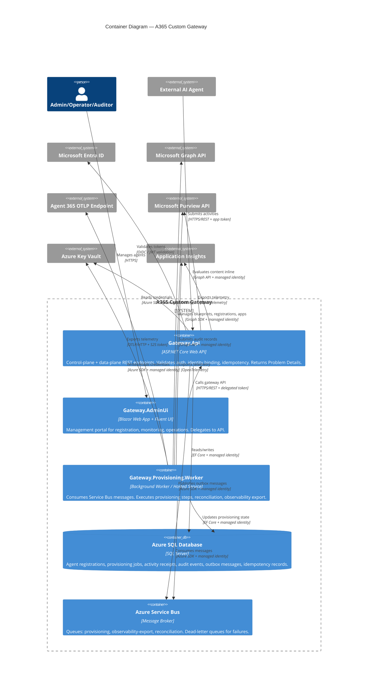
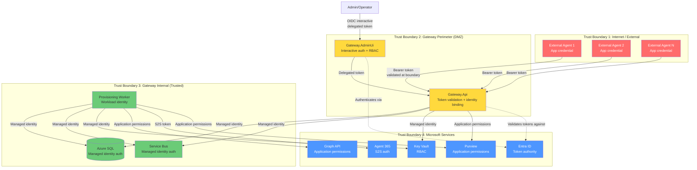
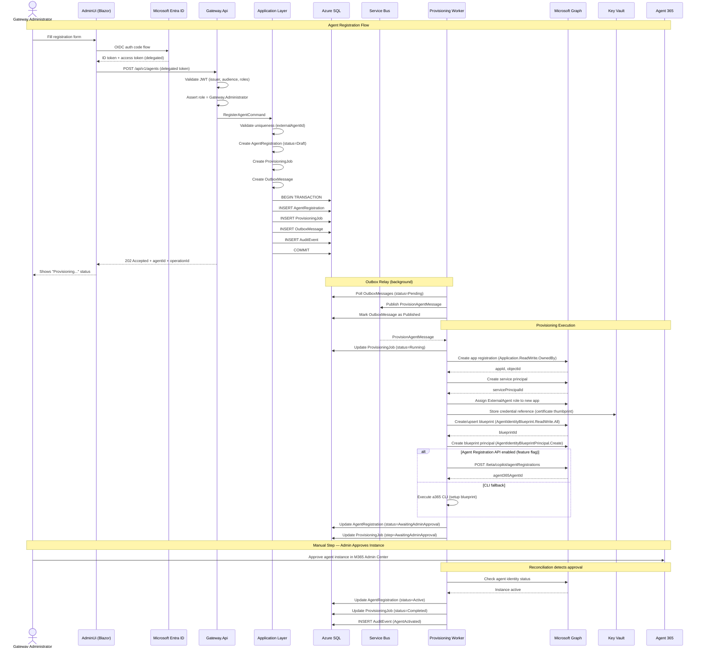
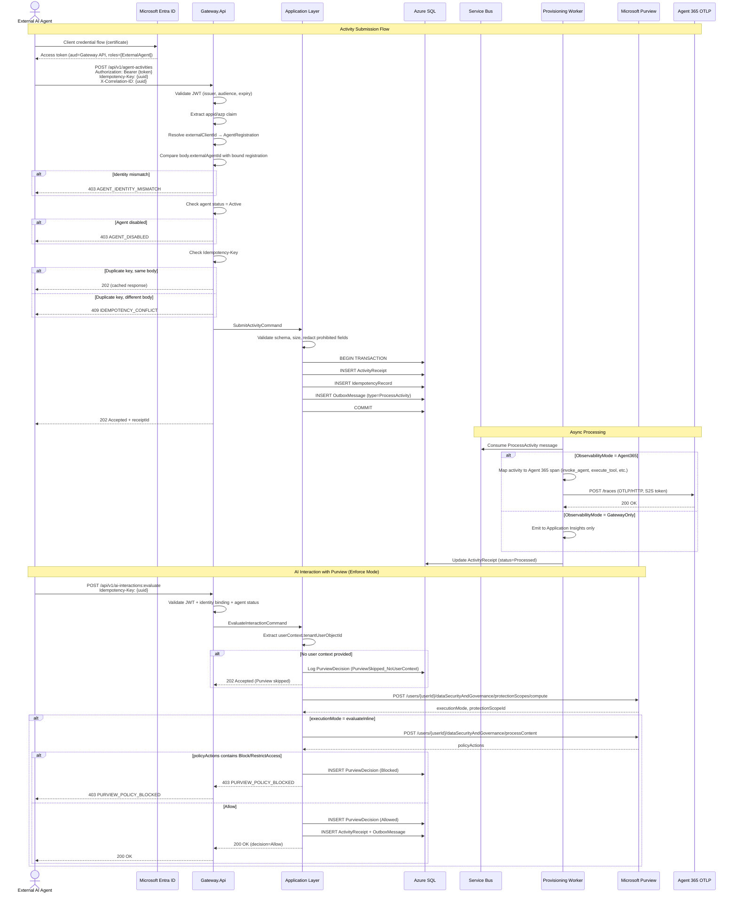
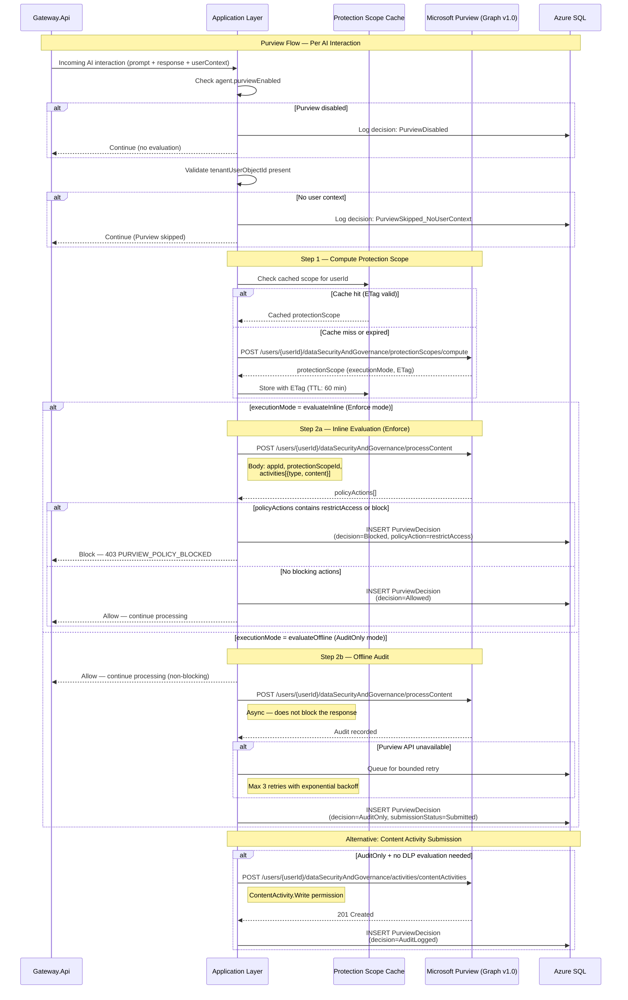
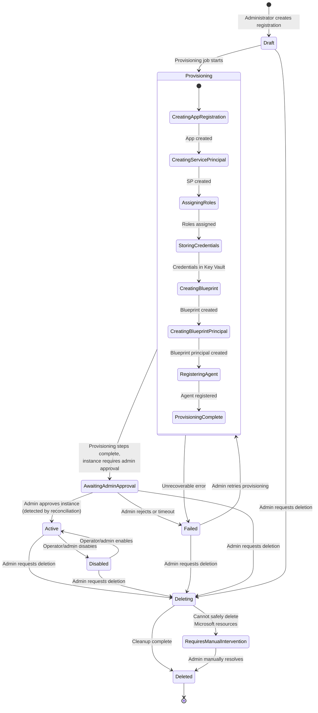

# Phase 2: Architecture

## 1. Executive Summary

The A365 Custom Gateway is a .NET 10 modular monolith that bridges externally developed AI agents to Microsoft Agent 365 without requiring those agents to embed the Agent 365 SDK or CLI. The gateway acts as both a **control plane** (registration, provisioning, administration) and a **data plane** (activity ingestion, AI interaction evaluation, observability export).

### Architectural Style

**Modular monolith** — a single deployable unit with strict module boundaries, designed for extraction to microservices if scaling requirements demand it. The gateway is decomposed into 10 source modules:

| Module | Responsibility |
|---|---|
| `Gateway.Api` | ASP.NET Core Web API — control-plane and data-plane endpoints |
| `Gateway.AdminUi` | Blazor Web App management portal with Fluent UI |
| `Gateway.Application` | CQRS handlers, validators, orchestration services |
| `Gateway.Domain` | Entities, value objects, enums, domain events |
| `Gateway.Infrastructure` | EF Core, Service Bus, Key Vault, Graph implementations |
| `Gateway.Agent365` | Agent 365 integration adapter (Graph API, CLI orchestration) |
| `Gateway.Purview` | Microsoft Purview policy evaluation adapter |
| `Gateway.Observability` | OpenTelemetry, Application Insights, Agent 365 telemetry export |
| `Gateway.Provisioning.Worker` | Background worker for async provisioning via Service Bus |
| `Gateway.Contracts` | Shared DTOs, API contracts, error codes |

### Key Design Decisions

1. **Async-first provisioning** via the outbox pattern: API writes to SQL + outbox in a single transaction, a relay publishes to Service Bus, the worker processes steps idempotently.
2. **Fail-closed by default** for authentication, authorization, identity binding, and Purview Enforce mode.
3. **Agent-to-client identity binding** enforced server-side — externalAgentId in request bodies is never trusted without comparison against authenticated claims.
4. **Zero secrets in code/config/logs/DB** — all credential material in Azure Key Vault, referenced by URI.
5. **Preview-aware design** — Agent Registration API (beta) behind a feature flag with CLI fallback (ADR-001). Instance provisioning requires manual admin approval (ADR-004).

### Hosting Decision

**Azure Container Apps** (primary), with Azure App Service as a documented alternative.

| Factor | Container Apps | App Service |
|---|---|---|
| Sidecar for CLI worker | Native sidecar support | Requires WebJobs or separate plan |
| Autoscaling | KEDA-based, scale-to-zero capable | Rule-based, minimum 1 instance |
| Managed identity | Supported | Supported |
| Ingress | Built-in Envoy with mTLS | Built-in with ARR affinity |
| Cost at low traffic | Lower (scale-to-zero) | Higher (always-on plan) |
| Deployment | Container image via ACR | Code or container |
| Networking | VNet integration, private endpoints | VNet integration, private endpoints |

Container Apps is selected because the CLI worker benefits from sidecar containers, KEDA enables Service Bus-driven autoscaling, and scale-to-zero reduces costs for the provisioning worker during idle periods.

### Phase 1 Constraints Carried Forward

- Agent Registration API is beta — feature-flagged with CLI fallback
- `managerApplications` restricted to first-party apps — higher-privilege permissions required
- Purview requires real user context — external agents must provide `tenantUserObjectId`
- Instance provisioning requires manual admin approval — `AwaitingAdminApproval` status
- DLP policy creation is PowerShell-only — documented as operational prerequisite

---

## 2. C4 Context Diagram

```mermaid
C4Context
    title System Context — A365 Custom Gateway

    Person(admin, "Gateway Administrator", "Configures agents, manages provisioning, monitors operations")
    Person(operator, "Gateway Operator", "Enables/disables agents, retries operations")
    Person(auditor, "Gateway Auditor", "Reviews audit logs and configuration history")
    Person(tenantAdmin, "M365 Tenant Admin", "Approves agent instances in M365 admin center")

    System(gateway, "A365 Custom Gateway", "Bridges external AI agents to Microsoft Agent 365. Control plane + data plane.")

    System_Ext(extAgent1, "External AI Agent 1", "Non-Microsoft AI agent (custom framework)")
    System_Ext(extAgent2, "External AI Agent 2", "Non-Microsoft AI agent (custom framework)")
    System_Ext(extAgentN, "External AI Agent N", "Non-Microsoft AI agent (custom framework)")

    System_Ext(entraId, "Microsoft Entra ID", "Identity and access management, app registrations, token issuance")
    System_Ext(graph, "Microsoft Graph API", "Blueprint management, agent registration, app management, user lookup")
    System_Ext(a365, "Microsoft Agent 365", "Agent runtime, observability OTLP endpoint")
    System_Ext(purview, "Microsoft Purview", "DLP policy evaluation, content activity audit")
    System_Ext(keyVault, "Azure Key Vault", "Credential storage, certificate management")
    System_Ext(monitor, "Azure Monitor / App Insights", "Metrics, traces, logs, alerts")

    Rel(admin, gateway, "Manages agents via Blazor UI", "HTTPS")
    Rel(operator, gateway, "Operates agents via Blazor UI", "HTTPS")
    Rel(auditor, gateway, "Reviews audit logs via Blazor UI", "HTTPS")
    Rel(tenantAdmin, a365, "Approves agent instances", "M365 Admin Center")

    Rel(extAgent1, gateway, "Submits activities, AI interactions", "HTTPS/REST + Bearer token")
    Rel(extAgent2, gateway, "Submits activities, AI interactions", "HTTPS/REST + Bearer token")
    Rel(extAgentN, gateway, "Submits activities, AI interactions", "HTTPS/REST + Bearer token")

    Rel(gateway, entraId, "Authenticates users and agents, manages app registrations", "OAuth 2.0 / OIDC / Graph API")
    Rel(gateway, graph, "Manages blueprints, agent registrations, service principals", "Graph REST API v1.0 + beta")
    Rel(gateway, a365, "Exports telemetry via OTLP", "OTLP/HTTP")
    Rel(gateway, purview, "Evaluates content, submits audit records", "Graph REST API v1.0")
    Rel(gateway, keyVault, "Reads/writes credentials and certificates", "Azure SDK + managed identity")
    Rel(gateway, monitor, "Exports metrics, traces, logs", "OpenTelemetry / Azure SDK")
```



---

## 3. C4 Container Diagram



---

## 4. Component Diagram

```mermaid
C4Component
    title Component Diagram — Gateway.Api + Internal Modules

    Container_Boundary(api, "Gateway.Api") {
        Component(controlPlane, "Control-Plane Controllers", "ASP.NET Core", "Agent registration, query, enable/disable, delete, operations, system config")
        Component(dataPlane, "Data-Plane Controllers", "ASP.NET Core", "Activity submission, AI interaction, batch activities, inline evaluation")
        Component(authMiddleware, "Auth Middleware", "Microsoft Identity Web", "JWT validation, role extraction, client-to-agent binding")
        Component(problemDetails, "Problem Details Middleware", "ASP.NET Core", "RFC 9457 error responses with stable error codes")
        Component(idempotency, "Idempotency Middleware", "Custom", "Idempotency-Key deduplication for mutating operations")
        Component(openApi, "OpenAPI", "ASP.NET Core built-in", "OpenAPI 3.1 document generation")
    }

    Container_Boundary(app, "Gateway.Application") {
        Component(commands, "Command Handlers", "MediatR / manual CQRS", "RegisterAgent, EnableAgent, DisableAgent, DeleteAgent, SubmitActivity, EvaluateInteraction")
        Component(queries, "Query Handlers", "MediatR / manual CQRS", "GetAgent, ListAgents, GetOperation, GetAuditEvents")
        Component(validators, "Validators", "FluentValidation", "Request validation with typed error codes")
        Component(outbox, "Outbox Publisher", "Custom", "Writes outbox messages atomically with domain changes")
    }

    Container_Boundary(domain, "Gateway.Domain") {
        Component(entities, "Entities", "C#", "AgentRegistration, ProvisioningJob, ActivityReceipt, AuditEvent, etc.")
        Component(valueObjects, "Value Objects", "C#", "ExternalAgentId, Agent365AgentId, CorrelationId, etc.")
        Component(enums, "Enums", "C#", "AgentStatus, ProvisioningStepType, ObservabilityMode, PurviewMode, etc.")
        Component(interfaces, "Domain Interfaces", "C#", "IAgent365ProvisioningClient, IPurviewPolicyClient, IAgentRepository, etc.")
    }

    Container_Boundary(infra, "Gateway.Infrastructure") {
        Component(dbContext, "GatewayDbContext", "EF Core", "Entity configurations, migrations, query optimizations")
        Component(repos, "Repositories", "EF Core", "AgentRepository, ProvisioningJobRepository, etc.")
        Component(sbClient, "Service Bus Client", "Azure SDK", "Message publishing, dead-letter handling")
        Component(kvClient, "Key Vault Client", "Azure SDK", "Secret/certificate read, write, rotation")
        Component(graphClient, "Graph Client", "Microsoft.Graph SDK", "App registrations, service principals, user lookup")
    }

    Container_Boundary(a365, "Gateway.Agent365") {
        Component(provClient, "Provisioning Client", "Graph API + CLI", "Blueprint CRUD, agent registration, CLI fallback")
        Component(obsExporter, "Observability Exporter", "OTLP/HTTP", "Maps activities to Agent 365 spans, exports via S2S auth")
    }

    Container_Boundary(purview, "Gateway.Purview") {
        Component(policyClient, "Policy Client", "Graph API", "processContent evaluation, protection scope computation")
        Component(activityClient, "Activity Client", "Graph API", "contentActivities audit submission")
    }

    Container_Boundary(obs, "Gateway.Observability") {
        Component(otelConfig, "OTel Configuration", "OpenTelemetry SDK", "Trace/metric/log pipeline setup")
        Component(traceContext, "Trace Context Propagation", "W3C TraceContext", "Cross-service correlation: API -> Service Bus -> Worker -> dependencies")
        Component(redaction, "Redaction Processor", "Custom", "Strips tokens, secrets, prompts from telemetry")
    }

    Rel(controlPlane, authMiddleware, "Validates tokens")
    Rel(dataPlane, authMiddleware, "Validates tokens + agent binding")
    Rel(controlPlane, commands, "Dispatches commands")
    Rel(controlPlane, queries, "Dispatches queries")
    Rel(dataPlane, commands, "Dispatches commands")
    Rel(commands, validators, "Validates input")
    Rel(commands, entities, "Creates/modifies domain objects")
    Rel(commands, outbox, "Publishes outbox messages")
    Rel(commands, interfaces, "Calls domain interfaces")
    Rel(outbox, dbContext, "Writes atomically")
    Rel(repos, dbContext, "Queries/persists")
    Rel(graphClient, interfaces, "Implements IAgent365ProvisioningClient (partial)")
    Rel(provClient, interfaces, "Implements IAgent365ProvisioningClient")
    Rel(policyClient, interfaces, "Implements IPurviewPolicyClient")
```



---

## 5. Trust Boundaries



### Trust Boundary Rules

| Boundary | Identity Model | Validation | Fail Behavior |
|---|---|---|---|
| **1 → 2** (External → Gateway) | Per-agent Entra app registration or workload identity federation. Bearer token with `ExternalAgent` app role. | JWT signature, issuer, audience, expiry, `roles` claim. Server-side `externalAgentId` ↔ `appid`/`sub` binding. | Fail closed. 401/403. |
| **Admin → 2** (Admin → Gateway) | Entra interactive sign-in. OIDC auth code flow. | JWT with `roles` claim containing `Gateway.Administrator`, `.Operator`, `.Auditor`, or `.SupportReader`. | Fail closed. 401/403. |
| **2 → 3** (Gateway Perimeter → Internal) | Implicit — same process for API+Application, Service Bus for Worker. | Outbox atomicity ensures only validated messages enter the queue. | N/A (in-process or message-based). |
| **3 → 4** (Internal → Microsoft) | Managed identity (`DefaultAzureCredential`). Application permissions pre-consented by tenant admin. | Azure SDK handles token acquisition and refresh. | Fail closed for auth/Purview Enforce. Queue retry for Purview AuditOnly and observability. |

### Identity Binding Enforcement

The critical security boundary is the **agent-to-client binding** at Trust Boundary 1→2:

1. External agent authenticates with its Entra app registration → receives a token with `appid` (v1) or `azp` (v2) claim.
2. Gateway API resolves the `appid`/`azp` to a stored `externalClientId` on `AgentRegistration`.
3. The `externalAgentId` in the request body/URL is compared against the server-side binding.
4. Mismatch → 403 `AGENT_IDENTITY_MISMATCH`. No fallback, no override.

---

## 6. Control-Plane Flow



---

## 7. Data-Plane Flow



---

## 8. Purview Integration Flow



### Purview Decision Matrix

| Agent Config | User Context | Purview API Available | Gateway Action |
|---|---|---|---|
| `purviewEnabled=false` | N/A | N/A | Skip. Log `PurviewDisabled`. |
| `purviewEnabled=true`, `Enforce` | Missing | N/A | Skip Purview. Log `PurviewSkipped_NoUserContext`. Process activity. |
| `purviewEnabled=true`, `Enforce` | Present | Available | Evaluate inline. Block or allow per `policyActions`. |
| `purviewEnabled=true`, `Enforce` | Present | **Unavailable** | **Fail closed.** Return 503. Do not process the interaction. |
| `purviewEnabled=true`, `AuditOnly` | Missing | N/A | Skip Purview. Log `PurviewSkipped_NoUserContext`. Process activity. |
| `purviewEnabled=true`, `AuditOnly` | Present | Available | Process activity. Submit audit record asynchronously. |
| `purviewEnabled=true`, `AuditOnly` | Present | **Unavailable** | Process activity. Queue audit for bounded retry (max 3). |

---

## 9. Provisioning State Machine



### State Transition Rules

| From | To | Trigger | Side Effects |
|---|---|---|---|
| `Draft` | `Provisioning` | Outbox message consumed by worker | Create ProvisioningJob, begin step execution |
| `Provisioning` | `AwaitingAdminApproval` | All automated steps complete | Agent registered but instance needs M365 admin approval |
| `Provisioning` | `Failed` | Unrecoverable step failure | Record error code + summary. Mark ProvisioningJob failed. |
| `AwaitingAdminApproval` | `Active` | Reconciliation detects instance is active | Audit event: AgentActivated |
| `Active` | `Disabled` | Admin/operator calls `:disable` | Audit event: AgentDisabled. Data-plane rejects with AGENT_DISABLED. |
| `Disabled` | `Active` | Admin/operator calls `:enable` | Audit event: AgentEnabled. Verify Microsoft resources still exist. |
| `Failed` | `Provisioning` | Admin retries provisioning | New ProvisioningJob. Resume from last successful step (idempotent). |
| `*` | `Deleting` | Admin calls DELETE | Async deletion job. Default: preserve Microsoft resources. |
| `Deleting` | `Deleted` | Cleanup job completes | Soft-delete AgentRegistration. Audit event: AgentDeleted. |
| `Deleting` | `RequiresManualIntervention` | Cannot safely delete Microsoft resources | Audit event. Admin must resolve manually. |
| `RequiresManualIntervention` | `Deleted` | Admin confirms manual resolution | Audit event: ManualResolutionCompleted. |

### Provisioning Step Idempotency

Each provisioning step is individually idempotent and records its result:

| Step | Idempotency Check | Compensation |
|---|---|---|
| `CreateAppRegistration` | Check if app with `displayName` pattern exists | Delete app registration (only if no SP created yet) |
| `CreateServicePrincipal` | Check if SP for appId exists | Delete SP |
| `AssignRoles` | Check existing role assignments | Remove role assignment |
| `StoreCredentials` | Check Key Vault secret/cert by name | Delete secret/cert from Key Vault |
| `CreateBlueprint` | Upsert with `Prefer: create-if-missing` by `uniqueName` | N/A (upsert is naturally idempotent) |
| `CreateBlueprintPrincipal` | Check if blueprint principal exists for SP | N/A |
| `RegisterAgent` | Check if registration exists by external agent ID | Delete registration (beta API) |

### Compensation Strategy

Compensation does **not** automatically delete successfully created Microsoft resources when deletion could cause data loss or require separate authorization. Instead:

1. **Safe to compensate:** App registrations with no active usage, role assignments, Key Vault entries created by the gateway.
2. **Requires manual intervention:** Blueprints with active instances, agent registrations with existing user interactions, any resource where deletion requires Global Administrator.
3. **Never auto-compensate:** Resources that may have been independently modified by tenant admins.

---

## 10. Failure-Mode Table

| # | Component | Failure Mode | Detection | Impact | Fail Behavior | Mitigation | Recovery |
|---|---|---|---|---|---|---|---|
| 1 | **Entra ID** | Token validation fails (Entra outage) | JWT validation exception, OIDC metadata fetch timeout | All requests rejected | **Fail closed** | Cache OIDC metadata with bounded TTL | Auto-recovers when Entra is available |
| 2 | **Graph API** | Provisioning call fails (5xx, timeout) | HTTP status, timeout exception | Provisioning step fails | Retry with exponential backoff + jitter | Dead-letter after max retries | Admin retries provisioning |
| 3 | **Graph API** | Blueprint permission denied (403) | HTTP 403 from Graph | Cannot create blueprints | **Fail closed** — mark provisioning failed | Alert admin. Verify permissions. | Fix permissions, retry provisioning |
| 4 | **Graph API** | Agent Registration API breaking change (beta) | Unexpected response schema, 4xx | Cannot register agents | Fall back to CLI worker (ADR-001) | Feature flag disables Graph path | CLI-based registration |
| 5 | **Azure SQL** | Database unavailable | Connection timeout, SQL exception | All operations fail | **Fail closed** — 503 | Health probe reports unhealthy. Autoscaler replaces instance. | Azure SQL auto-failover |
| 6 | **Azure SQL** | Concurrency conflict | `DbUpdateConcurrencyException` | Single operation fails | Return 409/412 | Client retries with fresh ETag | Client retry |
| 7 | **Service Bus** | Queue unavailable | Send exception | Outbox messages not published | Outbox relay retries on next poll | Dead-letter monitoring | Auto-recovers. Outbox ensures no message loss. |
| 8 | **Service Bus** | Poison message | Repeated processing failure | Consumer blocked | Move to dead-letter queue after max delivery count | Alert on dead-letter depth | Admin inspects and replays/discards |
| 9 | **Key Vault** | Credential read fails | HTTP 5xx, timeout | Cannot read agent credentials | **Fail closed** for provisioning. Data-plane continues for already-validated tokens. | Retry with backoff | Auto-recovers |
| 10 | **Key Vault** | Throttled (429) | HTTP 429 with Retry-After | Credential operations delayed | Honor Retry-After header | Batch credential operations | Auto-recovers |
| 11 | **Purview** | processContent unavailable (Enforce) | HTTP 5xx, timeout | AI interaction cannot be evaluated | **Fail closed** — return 503 `PURVIEW_DEPENDENCY_UNAVAILABLE` | Health check for Purview availability | Auto-recovers. No data loss. |
| 12 | **Purview** | processContent unavailable (AuditOnly) | HTTP 5xx, timeout | Audit record not submitted | **Continue** — queue for bounded retry (max 3) | Dead-letter after retries | Admin reviews unsubmitted audits |
| 13 | **Purview** | User not found | 404 from /users/{userId} | Cannot evaluate for this user | Skip Purview, log `PurviewSkipped_InvalidUser` | Return warning in response | Caller provides valid user ID |
| 14 | **Agent 365 OTLP** | Telemetry export fails | HTTP 5xx, 429 | Observability data not exported | **Continue** — queue for retry. Do not fail the primary operation. | Dead-letter after retries | Admin reviews. Fall back to GatewayOnly. |
| 15 | **Agent 365 OTLP** | Rate limited (429) | HTTP 429 with `Retry-After: 1` | Export delayed | Honor Retry-After. Max 1MB request body. | Batch within limits | Auto-recovers |
| 16 | **External Agent** | Identity mismatch | `externalAgentId` ≠ bound registration | Unauthorized data submission | **Fail closed** — 403 `AGENT_IDENTITY_MISMATCH` | Log security event | No recovery — client must use correct identity |
| 17 | **External Agent** | Disabled agent submits data | Agent status = Disabled | Activity rejected | **Fail closed** — 403 `AGENT_DISABLED` | Clear error response | Admin re-enables agent |
| 18 | **External Agent** | Replay attack | Duplicate Idempotency-Key with same body | No impact (idempotent) | Return cached 202 response | Idempotency record TTL prevents unbounded storage | N/A |
| 19 | **External Agent** | Idempotency abuse | Same key, different body | Data integrity risk | **Fail closed** — 409 `IDEMPOTENCY_CONFLICT` | Log security event | Client uses new key |
| 20 | **Provisioning Worker** | Worker crash mid-step | Service Bus message not completed | Step may be partially done | Message redelivered (at-least-once) | Each step is idempotent — safe to replay | Auto-recovers via Service Bus redelivery |
| 21 | **Provisioning Worker** | Stuck in AwaitingAdminApproval | Reconciliation detects stale status | Agent not active | Alert after configurable timeout | Reconciliation job checks periodically | Admin approves in M365 admin center |
| 22 | **Reconciliation** | Drift detected | Resource state ≠ gateway state | Inconsistency between gateway and Microsoft | Log drift event, alert admin | Reconciliation can auto-fix safe drifts | Admin reviews and resolves |
| 23 | **Gateway API** | Payload too large | Request body exceeds limit | Single request rejected | 413 `PAYLOAD_TOO_LARGE` | Documented limits in API contract | Client reduces payload size |
| 24 | **Gateway API** | Rate limit exceeded | Per-client/per-agent rate counter | Client throttled | 429 `RATE_LIMIT_EXCEEDED` with Retry-After | Configurable per-agent limits | Client backs off |

---

## 11. Architecture Decision Records

### ADR-005: Azure Container Apps as Primary Hosting Platform

**Status:** Accepted

**Context:** The gateway requires a hosting platform that supports the main API, a Blazor admin UI, and a background provisioning worker. The worker may need to execute the Agent 365 CLI as a sidecar process. Two options were evaluated: Azure Container Apps and Azure App Service.

**Decision:** Use Azure Container Apps as the primary hosting platform.

**Rationale:**
- **Sidecar support** — Container Apps natively supports sidecar containers. The CLI worker can run alongside the main API without a separate App Service plan.
- **KEDA-based autoscaling** — Service Bus-driven scaling for the provisioning worker. Scale to zero when no provisioning work is pending.
- **Cost efficiency** — Consumption plan with scale-to-zero. The provisioning worker (bursty, low-frequency) benefits significantly.
- **Container-native deployment** — Aligns with the CI/CD strategy of building container images via GitHub Actions and deploying via ACR.
- **VNet integration and private endpoints** — Available for network isolation, same as App Service.

**Consequences:**
- Team must maintain Dockerfiles and container build pipeline.
- Local development uses `dotnet run` directly (not containers). Container testing via Docker Compose.
- App Service remains a documented alternative for teams that prefer PaaS-managed deployments.

### ADR-006: Outbox Pattern for Reliable Async Messaging

**Status:** Accepted

**Context:** Provisioning, observability export, and audit submission are all asynchronous operations triggered by API requests. The gateway must guarantee that if a database write succeeds, the corresponding async work is eventually processed — even if the Service Bus is temporarily unavailable.

**Decision:** Use the transactional outbox pattern: API writes domain state + outbox message in a single database transaction. A relay (hosted service or scheduled poll) publishes outbox messages to Service Bus.

**Rationale:**
- **Atomicity** — Domain state and message intent are committed together. No "write succeeded but message was lost" scenarios.
- **Reliability** — Outbox relay retries until the message is published. Service Bus unavailability delays but does not lose work.
- **Idempotency** — Outbox messages carry deterministic IDs. Duplicate publishing is harmless because consumers are idempotent.
- **Simplicity** — No distributed transaction coordinator or saga framework needed for the initial release.

**Consequences:**
- Outbox relay adds a small latency (polling interval, default 5 seconds).
- Outbox table requires periodic cleanup of published messages (retention policy).
- The pattern is well-documented in the .NET ecosystem (MassTransit, NServiceBus, or custom).

### ADR-007: Modular Monolith Module Boundaries

**Status:** Accepted

**Context:** The spec mandates "clear module boundaries so modules can later be extracted into services." The 10 source projects define the module structure.

**Decision:** Enforce module boundaries through project references and architecture tests:

```
Gateway.Api → Gateway.Application, Gateway.Contracts
Gateway.Application → Gateway.Domain, Gateway.Contracts
Gateway.Domain → (no project references — only BCL)
Gateway.Infrastructure → Gateway.Domain, Gateway.Application
Gateway.Agent365 → Gateway.Domain, Gateway.Contracts
Gateway.Purview → Gateway.Domain, Gateway.Contracts
Gateway.Observability → Gateway.Contracts
Gateway.Provisioning.Worker → Gateway.Application, Gateway.Infrastructure, Gateway.Agent365, Gateway.Purview
Gateway.AdminUi → Gateway.Contracts
Gateway.Contracts → (no project references — only BCL)
```

**Rules:**
1. `Gateway.Domain` has zero project references. It defines interfaces; infrastructure implements them.
2. `Gateway.Api` never references `Gateway.Infrastructure` directly — it receives services via DI.
3. `Gateway.AdminUi` calls the API over HTTP, never shares DbContext or repositories.
4. Cross-module communication uses domain events or the outbox, not direct method calls between adapters.
5. Architecture tests (NetArchTest) enforce these rules in CI.

**Consequences:**
- Slightly more boilerplate for DI registration.
- Extraction to microservices requires defining API contracts between modules, but the boundaries are already clean.

### ADR-008: CQRS Without Event Sourcing

**Status:** Accepted

**Context:** The gateway has distinct read and write patterns: commands (register, enable, disable, submit activity) mutate state with side effects; queries (list agents, get operation status) are read-only and may need different optimization.

**Decision:** Use CQRS (Command/Query Responsibility Segregation) without event sourcing. Commands and queries are separate handler classes. Both use the same EF Core DbContext and relational model.

**Rationale:**
- **Separation of concerns** — Command handlers encapsulate validation, state transitions, outbox publishing, and audit logging. Query handlers are simple reads.
- **No event sourcing** — The domain model is not complex enough to warrant event replay. State is the source of truth, not an event log.
- **Pragmatic** — Can use MediatR or simple manual dispatch. No need for a CQRS framework.

**Consequences:**
- Event sourcing can be added later for specific aggregates if audit requirements demand full replay.
- Read models can be optimized with denormalized views or materialized projections if query performance becomes an issue.

### ADR-009: Agent-to-Client Identity Binding Strategy

**Status:** Accepted

**Context:** The critical security requirement: external agents must not impersonate other agents. The `externalAgentId` in request bodies cannot be trusted without server-side validation.

**Decision:** Enforce a server-side binding between the Entra app registration's `appid`/`azp` claim and the `AgentRegistration.externalClientId` stored in the database.

**Flow:**
1. During provisioning, the gateway creates an Entra app registration for each external agent and stores the `appId` as `externalClientId`.
2. At runtime, the gateway extracts `appid` (v1 token) or `azp` (v2 token) from the bearer token.
3. The gateway resolves `externalClientId` → `AgentRegistration` and compares `externalAgentId` from the request body.
4. Mismatch = 403 `AGENT_IDENTITY_MISMATCH`. No fallback.

**Rationale:**
- **Defense in depth** — Even if a token is somehow valid, the externalAgentId must match the server-side binding.
- **No trust in request bodies** — The spec explicitly requires this: "Do not authorize solely from externalAgentId in the body or URL."
- **Auditable** — Every identity resolution is logged.

**Consequences:**
- Each external agent must have its own Entra app registration.
- Workload identity federation (max 20 credentials) may require separate app registrations per agent (see Phase 1 validation).

### ADR-010: Reconciliation Job Design

**Status:** Accepted

**Context:** The spec requires a reconciliation job that detects drift between gateway state and Microsoft resources: missing resources, unexpected deletions, config drift, permission drift, and stuck transitional states.

**Decision:** Implement reconciliation as a scheduled background job in the provisioning worker. It runs periodically (configurable, default every 6 hours) and checks each active agent:

1. **Resource existence** — Verify app registration, service principal, blueprint, and agent registration still exist in Microsoft Graph.
2. **Configuration drift** — Compare gateway-stored config with Microsoft resource state.
3. **Permission drift** — Verify expected role assignments are still in place.
4. **Stuck transitions** — Detect agents in `Provisioning` or `AwaitingAdminApproval` beyond a configurable timeout (default 7 days).
5. **Instance activation** — Detect when an admin-approved instance becomes active.

**Actions:**
- **Auto-fix safe drifts:** Re-apply role assignments, update gateway state to match Microsoft state for non-destructive changes.
- **Alert on unsafe drifts:** Missing resources, permission revocations, unexpected deletions → emit alert, do not auto-fix.
- **Escalate stuck transitions:** Mark as `RequiresManualIntervention` after timeout.

**Consequences:**
- Reconciliation adds Graph API call volume. Rate limiting must be respected.
- Reconciliation results are stored as `AuditEvent` records.
- Reconciliation can be triggered on-demand via the admin API.

### ADR-011: CLI Worker Design for Agent 365 CLI Fallback

**Status:** Accepted

**Context:** Phase 1 (ADR-001) established that the Agent Registration API is beta. The CLI (`a365 setup all`, `a365 setup blueprint`) is the GA alternative. The CLI is interactive by default (browser-based auth).

**Decision:** Implement the CLI worker as a sidecar container in the Container Apps environment that can execute CLI commands non-interactively:

1. **Pre-authenticated token cache** — The CLI uses Azure AD tokens. The worker uses the managed identity to acquire tokens and populates the CLI's token cache before invocation.
2. **Non-interactive parameters** — Use `--agent-name`, `--tenant-id`, and other CLI parameters that bypass interactive prompts where supported.
3. **Process isolation** — The CLI runs as a child process with captured stdout/stderr. The worker parses structured output for results.
4. **Timeout and cancellation** — Each CLI invocation has a configurable timeout (default 5 minutes). If the process hangs, it is killed and the step is marked failed.

**Rationale:**
- The CLI is the documented GA mechanism for operations that have no REST equivalent.
- Process isolation prevents CLI failures from crashing the worker.
- Sidecar deployment keeps the CLI runtime separate from the main API.

**Consequences:**
- CLI must be installed in the sidecar container image (`dotnet tool install --global Microsoft.Agents.A365.DevTools.Cli`).
- CLI updates may require container image rebuilds.
- Interactive auth prompts that cannot be bypassed require pre-seeded token caches or delegated user intervention.

### ADR-012: Observability Architecture

**Status:** Accepted

**Context:** The gateway must support three observability modes per agent (Disabled, GatewayOnly, Agent365) and propagate W3C trace context across: External Agent → Gateway API → Service Bus → Worker → Microsoft dependencies.

**Decision:**

1. **OpenTelemetry SDK** as the telemetry foundation for all modes.
2. **Dual export pipeline:**
   - All modes: Azure Monitor / Application Insights via `Azure.Monitor.OpenTelemetry.Exporter`.
   - Agent365 mode: Additionally export to Agent 365 OTLP endpoint (`agent365.svc.cloud.microsoft`) via `OpenTelemetry.Exporter.OpenTelemetryProtocol` with S2S auth using `Agent365.Observability.OtelWrite` permission.
3. **Span mapping:** Gateway maps external agent activities to documented Agent 365 span operations: `invoke_agent`, `execute_tool`, `chat`, `output_messages`. Custom attributes follow the documented attribute reference.
4. **Redaction processor:** A custom OpenTelemetry processor strips tokens, secrets, prompts, responses, and auth headers from all telemetry before export.
5. **Correlation propagation:** W3C `traceparent` and `tracestate` headers propagated on Service Bus messages using `Diagnostic-Id` message property.

**Consequences:**
- Per-agent telemetry routing requires a custom exporter that filters spans by agent configuration at export time.
- S2S token acquisition for Agent 365 OTLP adds latency to the export path (token caching mitigates this).
- Redaction processor must be the last processor in the pipeline to ensure no sensitive data reaches any exporter.

---

## Phase 2 Completion Checklist

- [x] Executive summary
- [x] C4 context diagram (Mermaid)
- [x] C4 container diagram (Mermaid)
- [x] Component diagram (Mermaid)
- [x] Trust boundaries
- [x] Control-plane flow (sequence diagram)
- [x] Data-plane flow (sequence diagram)
- [x] Purview integration flow (sequence diagram + decision matrix)
- [x] Provisioning state machine (state diagram + transition rules + idempotency + compensation)
- [x] Failure-mode table (24 failure scenarios)
- [x] Architecture decision records (ADR-005 through ADR-012, building on Phase 1 ADR-001 through ADR-004)

## Open Issues for Phase 3

1. **API versioning strategy:** How to handle breaking changes in the gateway API (URL path vs header vs query parameter).
2. **Batch activity limits:** Exact maximum event count and request size for `/api/v1/agent-activities:batch`.
3. **Rate limiting configuration:** Per-client vs per-agent vs global rate limits. Token bucket vs sliding window.
4. **Cursor-based pagination:** Cursor encoding strategy for agent list and activity receipt queries.
5. **OpenAPI generation:** Built-in ASP.NET Core OpenAPI vs Swashbuckle vs NSwag — validate which supports OpenAPI 3.1.

## Microsoft Documentation Citations

All architectural decisions reference capabilities validated in the Phase 1 documentation validation matrix (`docs/architecture/doc-validation-matrix.md`). Key citations:

- Agent 365 Blueprint API (GA v1.0): https://learn.microsoft.com/graph/api/resources/agentidentityblueprint
- Agent Registration API (beta): https://learn.microsoft.com/microsoft-365/copilot/extensibility/api/admin-settings/agent-registration/overview
- Purview processContent API (GA v1.0): https://learn.microsoft.com/graph/api/userdatasecurityandgovernance-processcontent
- Purview protectionScopes/compute (GA v1.0): https://learn.microsoft.com/graph/api/userprotectionscopecontainer-compute
- Agent 365 Direct OTel Integration (GA): https://learn.microsoft.com/microsoft-agent-365/developer/direct-open-telemetry-integration
- Agent 365 Observability Attributes: https://learn.microsoft.com/microsoft-agent-365/developer/observability-attribute-reference
- Microsoft Identity Web: https://learn.microsoft.com/entra/msidweb/getting-started/quickstart-webapi
- Workload Identity Federation: https://learn.microsoft.com/entra/workload-id/workload-identity-federation
- Azure Container Apps: https://learn.microsoft.com/azure/container-apps/
- Azure Service Bus Managed Identity: https://learn.microsoft.com/azure/service-bus-messaging/service-bus-managed-service-identity
- Azure Key Vault RBAC: https://learn.microsoft.com/azure/key-vault/general/secure-key-vault

## Unsupported Assumptions

| # | Assumption | Status | Risk |
|---|---|---|---|
| 1 | Container Apps sidecar supports .NET tool installation for CLI | Unvalidated | Medium — may need custom container image |
| 2 | CLI can run non-interactively with pre-seeded token cache | Unvalidated | Medium — some commands may require interactive auth |
| 3 | OTLP export correctly attributes telemetry per-agent when using S2S auth | Unvalidated (carried from Phase 1) | Medium — requires dev environment testing |
| 4 | Reconciliation Graph API calls stay within rate limits at scale (1000+ agents) | Unvalidated | Low — can batch and throttle |

## Decisions Needed Before Phase 3

1. **Confirm hosting platform:** Container Apps selected in ADR-005. Any objections?
2. **CQRS implementation:** MediatR vs manual dispatch? MediatR adds a NuGet dependency but provides pipeline behaviors (validation, logging).
3. **Outbox relay strategy:** Polling (simple, slight latency) vs change tracking (lower latency, more complex)?
4. **API versioning:** URL path (`/api/v2/`) vs `api-version` query parameter vs `Accept` header?
