# Phase 4: Data Design

## Fresh-database initialization

The clean-subscription bootstrap uses the current reviewed EF model only when Azure
SQL reports zero user tables. `Gateway.DatabaseMigrator --phase initialize` calls
`EnsureCreatedAsync` for that one empty-database case and immediately runs the same
schema verification used by upgrade tooling. A nonempty database is never reshaped
by this phase: initialization is skipped and verification must prove it already has
the current workflow schema. Existing deployments continue to use the reviewed SQL
prepare/finalize upgrade phases; bootstrap initialization is not a replacement for
upgrade or recovery evidence.

## Implementation boundary

This document describes the implemented model plus longer-lived target tables. It is
not, by itself, the volatile deployment checkpoint. As of **2026-08-25**, the four
additive N:N prepare scripts have been rehearsed, applied twice, and verified in
development:
`deploy/sql/20260824_agent_identity_workflow_v2.sql`,
`deploy/sql/20260825_agent_ingress_credentials.sql`,
`deploy/sql/20260825_scoped_idempotency.sql`, and
`deploy/sql/20260825_ingress_rate_limit_buckets.sql`. The legacy global
idempotency index intentionally remains; the post-canary
`deploy/sql/20260825_scoped_idempotency_finalize.sql` is unapplied because no
replacement canary has completed successfully. Existing jobs
default to workflow version `1` and remain legacy/non-resumable. Current local source
creates workflow version `3`; version `2` remains the deployed/retained generation.
Workflow v3 keeps
one deterministic Gateway-worker FIC on each reusable blueprint and stores only
salted hashes for Gateway ingress keys; it does not create or store a per-agent
Entra client secret. See
[`docs/implementation-status.md`](../implementation-status.md) before changing the
model or database.

## 1. Entity Model

### 1.1 Entity Overview

| Entity | Purpose | Soft-Delete | Retention | Blob Storage |
|---|---|---|---|---|
| `AgentRegistration` | Core aggregate — external agent registration and Agent 365 mapping | Yes | Permanent (soft-deleted) | — |
| `AgentFeatureConfiguration` | Per-agent feature settings (observability, Purview) | No (cascade with agent) | Follows agent | — |
| `AgentIngressCredential` | Per-registration Gateway API-key verifier metadata; never the clear key | No (cascade with agent) | Follows agent or explicit revocation/expiry policy | — |
| `ProvisioningJob` | Async provisioning job tracking | No | 365 days | — |
| `ProvisioningJobStep` | Individual step within a provisioning job | No | Follows job | — |
| `AgentCredentialReference` | Legacy/future Key Vault URI reference; workflow v3 uses blueprint/API FICs and does not populate a per-agent secret | No | Follows agent | — |
| `ActivityReceipt` | Receipt for accepted activities (metadata only) | No | 90 days (configurable) | — |
| `AiInteractionRecord` | AI interaction metadata + blob reference (no content in DB) | No | 90 days (configurable) | Yes — prompt/response content |
| `PurviewDecision` | Purview evaluation decision metadata | No | 90 days (configurable) | — |
| `AuditEvent` | Immutable audit trail (append-only) | No | 365 days (configurable) | — |
| `OutboxMessage` | Transactional outbox for reliable messaging | No | Target: 3 days; cleanup job not implemented | — |
| `IdempotencyRecord` | Idempotency-Key deduplication | No | Target: 7 days; cleanup job not implemented | — |
| `IngressRateLimitBucket` | SQL-backed fixed-minute ingress counter per global/registration/credential scope | No | Current row is reused per scope; stale-scope cleanup not implemented | — |
| `SystemConfiguration` | Singleton — gateway-wide settings | No | Permanent | — |

### 1.2 Entity Relationships

```
AgentRegistration (1) ──── (1) AgentFeatureConfiguration
AgentRegistration (1) ──── (0..*) ProvisioningJob
AgentRegistration (1) ──── (0..*) AgentIngressCredential
AgentRegistration (1) ──── (0..1) Registration rate-limit bucket
AgentRegistration (1) ──── (0..1) AgentCredentialReference
AgentRegistration (1) ──── (0..*) ActivityReceipt
AgentRegistration (1) ──── (0..*) AiInteractionRecord
AgentRegistration (1) ──── (0..*) PurviewDecision
AgentRegistration (1) ──── (0..*) AuditEvent
ProvisioningJob   (1) ──── (1..*) ProvisioningJobStep
AiInteractionRecord (1) ── (0..1) PurviewDecision
```

---

## 2. ER Diagram

```mermaid
erDiagram
    AgentRegistration {
        uuid Id PK
        string ExternalAgentId UK "unique, immutable"
        string Name
        string Description
        string OwnerObjectId
        string Environment "Development|Test|Production"
        string Status "Draft|Provisioning|AwaitingAdminApproval|Active|Disabled|Failed|Deleting|Deleted|RequiresManualIntervention"
        string Agent365AgentId "nullable, Agent Identity client ID compatibility field"
        string BlueprintId "nullable, blueprint client ID compatibility field"
        string Agent365InstanceId "nullable, opaque Registry registration ID"
        string ExternalClientId "nullable, child Agent ID client ID for outbound Agent 365 routing"
        string AgentIdentityObjectId "nullable, Agent Identity service-principal object ID"
        string BlueprintObjectId "nullable, typed blueprint application object ID"
        string BlueprintSelectionMode "Legacy|UseExisting|CreateNew"
        string RequestedBlueprintObjectId "nullable, required for UseExisting"
        string RequestedBlueprintDisplayName "nullable, required for CreateNew"
        string LastProvisioningErrorCode "nullable"
        string LastProvisioningErrorSummary "nullable"
        bool IsDeleted "soft-delete flag"
        datetime DeletedAtUtc "nullable"
        datetime CreatedAtUtc
        string CreatedByObjectId
        datetime UpdatedAtUtc
        string UpdatedByObjectId
        binary RowVersion "concurrency token"
    }

    AgentFeatureConfiguration {
        uuid Id PK
        uuid AgentRegistrationId FK
        string ObservabilityMode "Disabled|GatewayOnly|Agent365|Agent365AzureMonitor"
        bool PurviewEnabled
        string PurviewMode "nullable, AuditOnly|Enforce"
        datetime UpdatedAtUtc
    }

    AgentIngressCredential {
        uuid Id PK "public key ID, not the secret"
        uuid AgentRegistrationId FK
        int FormatVersion
        string HashAlgorithm
        binary SecretSalt "random salt"
        binary SecretHash "salted hash only"
        datetime CreatedAtUtc
        string CreatedByObjectId
        datetime ExpiresAtUtc
        datetime RevokedAtUtc "nullable"
    }

    ProvisioningJob {
        uuid Id PK
        uuid AgentRegistrationId FK
        string Type "ProvisionAgent|DeleteAgent|RetryProvisioning|ReconcileAgent"
        string Status "Pending|Running|AwaitingAdministratorAction|Completed|Failed|RequiresManualIntervention"
        int PercentComplete
        int WorkflowVersion "1/2 retained; 3 current"
        string ErrorCode "nullable"
        string ErrorSummary "nullable"
        datetime StartedAtUtc
        datetime CompletedAtUtc "nullable"
        datetime CreatedAtUtc
    }

    ProvisioningJobStep {
        uuid Id PK
        uuid ProvisioningJobId FK
        string StepType "persisted enum; interpret only with WorkflowVersion and exact sequence"
        string Status "Pending|Running|Completed|Failed|Skipped"
        int OrderIndex
        string ResultData "nullable, safe identifiers only"
        string ErrorCode "nullable"
        string ErrorMessage "nullable"
        datetime StartedAtUtc "nullable"
        datetime CompletedAtUtc "nullable"
    }

    AgentCredentialReference {
        uuid Id PK
        uuid AgentRegistrationId FK "unique"
        string CredentialType "Certificate|ClientSecret"
        string KeyVaultSecretUri "Key Vault reference, never raw secret"
        string CertificateThumbprint "nullable"
        datetime ExpiresAtUtc "nullable"
        datetime CreatedAtUtc
        datetime RotatedAtUtc "nullable"
    }

    ActivityReceipt {
        uuid Id PK
        uuid AgentRegistrationId FK
        string ExternalActivityId "activityId from request"
        string SessionId "nullable"
        string ActivityType "ToolInvocation|Chat|InvokeAgent|OutputMessages|Custom"
        string ActorType "Agent|User|System"
        string ProcessingStatus "Accepted|Processing|Processed|Failed"
        string CorrelationId
        datetime OccurredAtUtc
        datetime ReceivedAtUtc
        datetime ProcessedAtUtc "nullable"
    }

    AiInteractionRecord {
        uuid Id PK
        uuid AgentRegistrationId FK
        string ExternalInteractionId "interactionId from request"
        string SessionId "nullable"
        string TenantUserObjectId "nullable, for Purview"
        string ContentBlobUri "Azure Blob reference for prompt+response"
        string ModelProvider "nullable"
        string ModelName "nullable"
        string ProcessingStatus "Accepted|Processing|Processed|Failed"
        string PurviewStatus "Pending|Allowed|Blocked|Skipped|NotApplicable"
        string ObservabilityStatus "Pending|Exported|Skipped|Failed|NotApplicable"
        string CorrelationId
        datetime OccurredAtUtc
        datetime ReceivedAtUtc
        datetime ProcessedAtUtc "nullable"
    }

    PurviewDecision {
        uuid Id PK
        uuid AgentRegistrationId FK
        uuid AiInteractionRecordId FK "nullable"
        string Decision "Allowed|Blocked|AuditOnly|AuditLogged|PurviewSkipped_NoUserContext|PurviewSkipped_InvalidUser|PurviewDisabled"
        string PolicyAction "nullable, safe action summary such as RestrictAccess:block"
        string ExecutionMode "nullable, evaluateInline|evaluateOffline"
        string ProtectionScopeId "legacy physical name; stores protectionScopeState, nullable"
        string TenantUserObjectId "nullable"
        datetime EvaluatedAtUtc
    }

    AuditEvent {
        uuid Id PK
        uuid AgentRegistrationId FK "nullable, null for system events"
        string EventType
        string PerformedByObjectId "nullable"
        string PerformedByRole "nullable"
        string Details "JSON, no secrets"
        string CorrelationId "nullable"
        datetime OccurredAtUtc
    }

    OutboxMessage {
        uuid Id PK
        string MessageType
        string Payload "JSON"
        string Status "Pending|Processing|Published|Failed"
        int RetryCount
        datetime CreatedAtUtc
        datetime PublishedAtUtc "nullable"
        datetime NextRetryAtUtc "nullable"
    }

    IdempotencyRecord {
        uuid Id PK
        uuid AgentRegistrationId FK "new rows required; legacy retained NULL"
        string IdempotencyKey "unique only with registration + endpoint"
        string RequestBodyHash "canonical request SHA-256"
        string Endpoint
        int ResponseStatusCode
        string ResponseBody "cached response JSON"
        datetime CreatedAtUtc
        datetime ExpiresAtUtc
    }

    IngressRateLimitBucket {
        byte ScopeType PK "0 global | 1 registration | 2 credential"
        uuid ScopeId PK "Guid.Empty | registration ID | credential ID"
        datetime WindowStartUtc
        int RequestCount
        datetime UpdatedAtUtc
    }

    SystemConfiguration {
        uuid Id PK "singleton"
        string ProvisioningMode
        string DefaultObservabilityMode "same compatibility encoding; default Agent365"
        bool DefaultPurviewEnabled
        string DefaultPurviewMode
        int RetentionDaysActivityReceipts
        int RetentionDaysAuditEvents
        int RetentionDaysIdempotencyRecords
        int RetentionDaysOutboxMessages
        int RateLimitPerClient "per credential per fixed minute"
        int RateLimitPerAgent "per authenticated registration per fixed minute"
        int RateLimitGlobal "Gateway-wide ingress per fixed minute"
        bool ReconciliationEnabled
        int ReconciliationIntervalHours
        int StuckTransitionTimeoutDays
        bool UseGraphAgentRegistration
        bool UseCliProvisioningFallback
        binary RowVersion
        datetime UpdatedAtUtc
    }

    AgentRegistration ||--|| AgentFeatureConfiguration : has
    AgentRegistration ||--o{ AgentIngressCredential : authenticatesWith
    AgentRegistration ||--o{ ProvisioningJob : has
    AgentRegistration ||--o| AgentCredentialReference : has
    AgentRegistration ||--o{ ActivityReceipt : receives
    AgentRegistration ||--o{ AiInteractionRecord : receives
    AgentRegistration ||--o{ PurviewDecision : evaluated
    AgentRegistration ||--o{ AuditEvent : audited
    AgentRegistration ||--o{ IdempotencyRecord : scopes
    ProvisioningJob ||--|{ ProvisioningJobStep : contains
    AiInteractionRecord ||--o| PurviewDecision : evaluatedBy
```



### 2.1 Workflow-v2 persisted identity and sequence

The compatibility-named columns retain explicit Microsoft identifier semantics.
Blueprint Graph `id` and `appId` remain separate named fields, but their values may
coincide; an earlier 2026-08-25 development inventory returned equal values for all
11 typed blueprints observed at that time. The later live compatibility catalog has
12 rows, and that historical equality observation is not extended to the added row.
Persist both returned properties and use the one required by each route without
enforcing equality or inequality. Microsoft currently documents the child
Agent Identity object ID and application/client ID as the same GUID, so the Gateway
verifies that child equality while retaining both field names. Never reuse the
Gateway registration GUID, blueprint ID, or principal ID as a child identifier.

| Column | Workflow-v3 meaning |
|---|---|
| `AgentRegistration.Id` | Gateway-owned registration GUID |
| `ExternalAgentId` | Immutable Gateway external identifier generated as `agent-<guid>` |
| `BlueprintObjectId` | Typed Agent Identity Blueprint application object ID |
| `BlueprintId` | Blueprint application/client ID (`appId`) |
| `AgentIdentityObjectId` | Child Agent Identity object ID; equal to its current documented app/client ID |
| `ExternalClientId` and `Agent365AgentId` | Same child Agent ID GUID used for outbound Agent 365 token/routing; duplicate names are retained for contract compatibility and are not ingress credentials |
| `Agent365InstanceId` | Opaque Agent 365 preview Registry registration ID, when returned |
| `AgentIngressCredential.AgentRegistrationId` | The only registration binding for a Gateway-issued ingress key; its clear secret is never persisted |

`ProvisioningJob.WorkflowVersion` plus the ordered step rows defines the workflow.
For version `3`, the only valid persisted order is:

1. `ResolveBlueprint`
2. `EnsureBlueprintPrincipal`
3. `ConfigureGatewayFederation`
4. `CreateAgentIdentity`
5. `AssignAgent365Access`
6. `RegisterAgent`
7. `VerifyAgent365Connection`

The persisted enum retains old numeric values for compatibility; numeric value alone
must never be used to reinterpret a version-1 job. The additive upgrade gives
existing rows `WorkflowVersion=1` and does not rewrite their steps.

For newly created version-3 jobs, the provisioning state's
`PlannedAgent365RegistrationId` is not generated or used; that property remains only
for historical serialized/source compatibility. After worker stage 4, the job
persists `AwaitingAdministratorAction` at 71% with no continuation. The delegated
API action persists `Agent365RegistryAttemptState`, including a creator-bound planned
Registry ID, in the `RegisterAgent` step result before its one POST. It immediately
stores the safe returned Registry ID in `Agent365InstanceId` and step result (using
the planned ID only when a successful response omits one), completes that stage at
85%, and atomically inserts only the final-stage outbox. HTTP 201 plus the durable ID
is the accepted boundary; an unknown POST permits exact planned-ID GET only and
never a second POST.

### 2.1a Per-job execution claim

The workflow-v3 worker opens a dedicated SQL connection and acquires an
exclusive, session-owned `sys.sp_getapplock` keyed by provisioning job ID before a
stage attempt. It holds that session and lease through the provider work and releases
it when the attempt exits; the API delegated Registry handler acquires the same lock
before validating/mutating the administrator boundary. A lost connection releases
the claim. This serializes the same job across replicas/hosts but does not make
Service Bus or Microsoft mutations exactly once or replace each provider
sub-operation's independent idempotency/reconciliation. Local serialization and
release tests pass; real multi-replica/failover stress remains a production gate.

### 2.2 Observability destination compatibility

The database retains the existing string columns to avoid a migration for this
backward-compatible contract change. The API exposes independent canonical booleans
derived from those strings:

| Stored value | `agent365ObservabilityEnabled` | `azureMonitorExportEnabled` |
|---|---:|---:|
| `Disabled` | `false` | `false` |
| `GatewayOnly` | `false` | `true` |
| `Agent365` | `true` | `false` |
| `Agent365AzureMonitor` | `true` | `true` |

`SystemConfiguration.DefaultObservabilityMode` uses the same encoding for
`defaultAgent365ObservabilityEnabled` and
`defaultAzureMonitorExportEnabled`. The initial default is `Agent365`, which enables
Agent 365 observability and leaves the optional Azure Monitor mirror off. The API's
`observabilityMode` and `defaultObservabilityMode` fields remain as deprecated
compatibility fields.

These per-agent values do not control gateway/platform diagnostics. Purview is stored
and evaluated separately through `PurviewEnabled` and `PurviewMode`.

### 2.3 Scoped data-plane idempotency

New data-plane rows require `AgentRegistrationId` and are unique by
`(AgentRegistrationId, Endpoint, IdempotencyKey)`. The canonical request hash is the
uppercase hexadecimal SHA-256 of the endpoint-specific typed payload serialized to
UTF-8: timestamps are normalized to UTC, attribute/metadata dictionaries are sorted
ordinally, and batch item order is retained. The Authorization header and Gateway
key are never included. An unexpired same-scope record with different content is
`409 IDEMPOTENCY_CONFLICT`; the same key value may be used independently by another
registration or endpoint.

The upgrade retains pre-N:N idempotency rows with NULL registration ownership until
approved retention removes them. It does not fabricate ownership or use those rows
as N:N cache hits. Registration and credential-issue responses are never inserted
because they contain one-time clear keys.

The filtered compound index remains a storage-integrity guard; atomic admission comes
from a separate scope lease. The SQL Server path starts a ReadCommitted transaction,
takes an exclusive transaction-owned `sys.sp_getapplock` on an opaque SHA-256 of the
registration/endpoint/key scope, and holds it from replay lookup through all side
effects, idempotency persistence, and commit. Its 30-second bounded wait fails closed
with 409. Any noncommit path rolls back/releases. The InMemory keyed semaphore is
test-only. This path and its schema are deployed in development and focused races
pass; real SQL Server multi-replica/staging stress remains a production-readiness
gate. See Microsoft Learn for
[`sp_getapplock`](https://learn.microsoft.com/en-us/sql/relational-databases/system-stored-procedures/sp-getapplock-transact-sql).

### 2.4 SQL-backed ingress rate buckets

After Gateway-key authorization supplies both registration and credential IDs, the
SQL limiter opens a Serializable transaction and reads the global, registration, and
credential rows using `UPDLOCK`/`HOLDLOCK`. Database UTC selects the current fixed
minute. If any scope is already full, no bucket is incremented and the caller receives
429 with that scope, its limit, reset, and `Retry-After`. Otherwise all three counters
advance in one transaction and response headers describe the most constrained scope.
Invalid configuration or any limiter dependency failure returns 503 and does not
admit the request. The process-singleton InMemory store exists only for test-host
behavior and must never be described as distributed enforcement. The SQL bucket
schema and limiter are deployed in development; multi-replica load/security proof
remains open.

---

## 3. Index Strategy

| Table | Index | Columns | Type | Rationale |
|---|---|---|---|---|
| `AgentRegistrations` | `IX_ExternalAgentId` | `ExternalAgentId` | Unique, filtered (`IsDeleted=false`) | Uniqueness constraint, lookup by external ID |
| `AgentRegistrations` | `IX_Status` | `Status, CreatedAtUtc DESC` | Non-unique | Filter by status for list endpoint |
| `AgentRegistrations` | `IX_Environment_Status` | `Environment, Status` | Non-unique | Combined filter |
| `AgentRegistrations` | `IX_ExternalClientId` | `ExternalClientId` | Unique, filtered (`ExternalClientId IS NOT NULL AND IsDeleted=false`) | Preserve one child Agent ID per registration for outbound Agent 365 routing |
| `AgentRegistrations` | `IX_OwnerObjectId` | `OwnerObjectId` | Non-unique | Filter by owner |
| `ProvisioningJobs` | `IX_AgentId_CreatedAt` | `AgentRegistrationId, CreatedAtUtc DESC` | Non-unique | Provisioning history query |
| `ProvisioningJobSteps` | `IX_JobId_Order` | `ProvisioningJobId, OrderIndex` | Non-unique | Step ordering |
| `ActivityReceipts` | `IX_AgentId_ReceivedAt` | `AgentRegistrationId, ReceivedAtUtc DESC` | Non-unique | Cursor-based pagination |
| `ActivityReceipts` | `IX_ExternalActivityId` | `AgentRegistrationId, ExternalActivityId` | Unique | Deduplication |
| `AiInteractionRecords` | `IX_AgentId_ReceivedAt` | `AgentRegistrationId, ReceivedAtUtc DESC` | Non-unique | Cursor-based pagination |
| `AiInteractionRecords` | `IX_ExternalInteractionId` | `AgentRegistrationId, ExternalInteractionId` | Unique | Deduplication |
| `PurviewDecisions` | `IX_AgentId_EvaluatedAt` | `AgentRegistrationId, EvaluatedAtUtc DESC` | Non-unique | Decision history |
| `PurviewDecisions` | `IX_InteractionId` | `AiInteractionRecordId` | Non-unique, filtered (`NOT NULL`) | Join to interaction |
| `AuditEvents` | `IX_AgentId_OccurredAt` | `AgentRegistrationId, OccurredAtUtc DESC` | Non-unique | Audit history query |
| `AuditEvents` | `IX_EventType_OccurredAt` | `EventType, OccurredAtUtc DESC` | Non-unique | Filter by event type |
| `OutboxMessages` | `IX_Status_NextRetry` | `Status, NextRetryAtUtc` | Non-unique, filtered (`Status='Pending'`) | Outbox relay polling |
| `AgentIngressCredentials` | `IX_AgentRegistrationId` | `AgentRegistrationId` | Non-unique | Resolve and manage all keys issued for one registration |
| `AgentIngressCredentials` | `IX_ExpiresAtUtc` | `ExpiresAtUtc` | Non-unique | Expiry lookup/cleanup |
| `IdempotencyRecords` | scoped unique index | `AgentRegistrationId, Endpoint, IdempotencyKey` | Unique | Prevent cross-agent and cross-endpoint collisions while detecting same-scope replay |
| `IdempotencyRecords` | `IX_ExpiresAt` | `ExpiresAtUtc` | Non-unique | TTL cleanup |
| `IngressRateLimitBuckets` | `PK_IngressRateLimitBuckets` | `ScopeType, ScopeId` | Unique/clustered | One atomically updated fixed-minute bucket per global, registration, or credential scope |

---

## 4. Data Classification Matrix

| Column | Classification | Storage Rule | Logging Rule |
|---|---|---|---|
| `AgentRegistration.ExternalClientId` | Confidential | Stored — required for outbound Agent 365 mapping | Never log |
| `AgentIngressCredential.Id` | Internal | Stored and returned as the non-secret key identifier | Safe only in credential metadata/audit; never pair with a clear secret in logs |
| `AgentIngressCredential.SecretSalt` / `SecretHash` | Confidential | Stored — salted verifier only | Never log, return, audit, or place in URLs/messages |
| `AgentCredentialReference.KeyVaultSecretUri` | Confidential | URI only — never raw secret value | Never log |
| `AgentCredentialReference.CertificateThumbprint` | Internal | Stored — for rotation tracking | Log thumbprint only, never cert content |
| `AiInteractionRecord.ContentBlobUri` | Confidential | Blob reference — content in Azure Blob | Never log URI or content |
| `AiInteractionRecord.TenantUserObjectId` | PII | Stored — required for Purview | Redact in non-admin contexts |
| `AuditEvent.PerformedByObjectId` | PII | Stored — audit accountability | Redact for SupportReader |
| `AgentRegistration.OwnerObjectId` | PII | Stored — ownership tracking | Redact for SupportReader |
| `PurviewDecision.TenantUserObjectId` | PII | Stored — audit trail | Redact in non-admin contexts |
| `ActivityReceipt.*` | Internal | Metadata only — no prompt/response content | Safe to log receipt IDs |
| `OutboxMessage.Payload` | Internal | JSON message payload — no secrets | Never log payload content |
| `IdempotencyRecord.ResponseBody` | Internal | Cached response — one-time registration/credential responses are never stored here | Never log |
| `IngressRateLimitBucket.*` | Internal | Scope type/ID, fixed-minute window, and count only; no API key or body content | Log only aggregate safe limiter metrics, never join to expose credentials |

### Fields That Must NEVER Appear in Database

- Raw client secrets
- Clear Gateway API keys (including one-time registration and rotation responses)
- Access tokens or refresh tokens
- Authentication headers
- Full prompt content (→ Azure Blob)
- Full response content (→ Azure Blob)
- Certificate private keys
- Key Vault secret values

---

## 5. Azure Blob Storage Design

### 5.1 Container Structure

```
a365-gateway-interactions/
  {yyyy}/{MM}/{dd}/
    {agentRegistrationId}/
      {interactionRecordId}.json
```

### 5.2 Blob Content Schema

```json
{
  "interactionId": "interaction-88731",
  "agentRegistrationId": "3d62b161-e342-4cc5-bd3e-e98fa91431df",
  "externalAgentId": "crm-assistant-prod",
  "prompt": {
    "contentType": "text/plain",
    "content": "Summarize the customer account."
  },
  "response": {
    "contentType": "text/plain",
    "content": "The account is currently active."
  },
  "storedAtUtc": "2026-08-23T04:47:01Z"
}
```

### 5.3 Blob Access

| Aspect | Design |
|---|---|
| **Auth** | Managed identity with `Storage Blob Data Contributor` role |
| **Encryption** | Azure Storage Service Encryption (SSE) at rest, TLS in transit |
| **Access tier** | Hot for first 30 days, auto-tiered to Cool after 30 days via lifecycle policy |
| **Retention** | Immutable blob with configurable retention (matches `retentionDays.activityReceipts`) |
| **Private endpoint** | Recommended for production |
| **Redundancy** | LRS for dev/test, ZRS or GRS for production |
| **Naming** | Deterministic path from IDs — no enumeration risk |
| **Never** | SAS tokens in database, blob content in logs, public access |

### 5.4 Write Flow

1. API receives AI interaction request.
2. Application layer creates `AiInteractionRecord` (metadata only) in SQL.
3. Application layer writes prompt/response content to Azure Blob.
4. Application layer stores blob URI in `AiInteractionRecord.ContentBlobUri`.
5. Both writes in the same command handler — blob write first, then SQL commit. If SQL fails, orphan blob is cleaned by lifecycle policy.

---

## 6. Retention and Cleanup Strategy

### 6.1 Target retention policies

Except for the Azure Blob lifecycle policy, the scheduled cleanup methods below are
target behavior. The current working tree has no `RetentionCleanupJob`; retention
configuration alone does not delete SQL rows.

| Entity | Default Retention | Configurable | Cleanup Method |
|---|---|---|---|
| `AgentRegistration` | Permanent (soft-delete) | No | Soft-delete only. Hard-delete requires manual DB operation. |
| `AgentFeatureConfiguration` | Follows agent | No | Cascade with agent |
| `AgentIngressCredential` | Follows registration; individual keys expire or are explicitly revoked | No | Cascade with agent; rotation prevents revoking the last usable key until a replacement exists |
| `ProvisioningJob` + Steps | 365 days | Yes | Future cleanup job would delete eligible terminal jobs |
| `AgentCredentialReference` | Legacy/future: follows agent | No | No automatic current cleanup. V2 creates no per-agent secret; any legacy reference/Key Vault lifecycle action is separately authorized and must not imply Microsoft-resource deletion. |
| `ActivityReceipt` | 90 days | Yes (`retentionDays.activityReceipts`) | Future cleanup job |
| `AiInteractionRecord` | 90 days | Yes (same as activity receipts) | Future SQL cleanup/blob coordination; Blob lifecycle remains the current orphan/content expiry mechanism |
| `PurviewDecision` | 90 days | Yes (same as activity receipts) | Future cleanup job |
| `AuditEvent` | 365 days | Yes (`retentionDays.auditEvents`) | Future cleanup job. **Append-only — never updated or deleted before retention expires.** |
| `OutboxMessage` | 3 days | Yes (`retentionDays.outboxMessages`) | Future cleanup of published messages |
| `IdempotencyRecord` | 7 days | Yes (`retentionDays.idempotencyRecords`) | Future cleanup by `ExpiresAtUtc` |
| `IngressRateLimitBucket` | No approved duration yet | No | Current row is reused per scope; future cleanup must preserve the global bucket and avoid racing current-window updates |
| Blob content | 90 days | Yes (matches interaction retention) | Azure Blob lifecycle management policy |

### 6.2 Target cleanup job design (not implemented)

A future background hosted service (`RetentionCleanupJob`) would run daily. No such
hosted service exists in the current working tree or deployed checkpoint:

1. Delete `IdempotencyRecords` where `ExpiresAtUtc < GETUTCDATE()`.
2. Delete `OutboxMessages` where `Status = 'Published' AND CreatedAtUtc < retention`.
3. Delete `ActivityReceipts` where `ReceivedAtUtc < retention`.
4. Delete `AiInteractionRecords` where `ReceivedAtUtc < retention` (also delete blobs).
5. Delete `PurviewDecisions` where `EvaluatedAtUtc < retention`.
6. Delete `ProvisioningJobs` + steps where `CreatedAtUtc < retention AND Status IN (Completed, Failed)`.
7. Delete `AuditEvents` where `OccurredAtUtc < retention`.
8. Delete stale non-global `IngressRateLimitBuckets` only after a retention policy and
   concurrency-safe predicate are approved; no cleanup exists today.

All deletions use batched SQL (`DELETE TOP(1000)`) to avoid long-running transactions.

---

## 7. Migration Strategy

### 7.1 Current N:N schema upgrades

The repository currently has no EF Core migrations set and does not call
`Database.MigrateAsync()`. Four pre-cutover additive/idempotent scripts are applied
in development; one post-cutover finalize script remains pending:

1. `deploy/sql/20260824_agent_identity_workflow_v2.sql` adds five Agent Registration
   fields plus `ProvisioningJobs.WorkflowVersion`. Existing jobs receive the
   legacy-safe default `1`; no step rows are rewritten.
2. `deploy/sql/20260825_agent_ingress_credentials.sql` creates
   `AgentIngressCredentials` with one-way salted verifier material, ownership,
   expiry, revocation, and lookup indexes. It contains no clear Gateway API key.

3. **Prepare:** `deploy/sql/20260825_scoped_idempotency.sql` retains legacy rows with
   nullable scope and retains the old globally unique key-only index while adding the
   checked registration foreign key plus a filtered unique compound index on
   `(AgentRegistrationId, Endpoint, IdempotencyKey)`. New application writes always
   provide registration ID; a matching unexpired legacy key fails closed and its
   cached response is never reused as a scoped result.
4. `deploy/sql/20260825_ingress_rate_limit_buckets.sql` creates the SQL-backed
   global/registration/credential bucket table with a compound primary key and scope/
   count checks. It is applied in development and remains a prerequisite before an
   N:N API revision receives traffic in any other environment.
5. **Finalize after cutover only:**
   `deploy/sql/20260825_scoped_idempotency_finalize.sql` drops only the legacy global
   unique key index. Run it only after the N:N API is verified and every legacy API
   revision is at zero traffic. It preserves NULL-scope legacy rows until approved
   retention.

The prepare phase is compatible with traffic rollback to the old API. The finalize
phase is the rollback boundary: after it, do not reactivate an old API revision
without an explicit database-compatibility recovery plan. Fail closed and roll
forward instead of silently allowing old NULL-scope writers.

The prepare scripts were rehearsed with recovery to a new database before live
application. Do not rerun them merely to manufacture a new checkpoint. Finalize only
after a successful bounded canary, verified inert gates, and zero traffic on every
old API revision. Neither retained 2026-08-25 failure satisfies that gate, and the
later admission window that expired without a registration submission is not a
canary result.

### 7.2 Target EF Core migration process (not implemented)

| Aspect | Decision |
|---|---|
| **Tool** | `dotnet ef migrations` via Infrastructure project, startup project is Gateway.Api |
| **Initial migration** | Not present; `InitialCreate` remains a future migration-baseline decision |
| **Naming** | `YYYYMMDD_Description` (e.g., `20260823_InitialCreate`) |
| **Idempotency** | EF Core tracks applied migrations in `__EFMigrationsHistory` |
| **Deployment** | Target only: reviewed CI/CD SQL scripts. Never infer that startup or pipeline migration is wired today. |
| **Rollback** | Generate rollback scripts via `dotnet ef migrations script --from Current --to Previous`. No automatic rollback. |
| **Data seeding** | `SystemConfiguration` singleton seeded in initial migration |

### 7.3 Target production migration process

1. Generate SQL script: `dotnet ef migrations script --idempotent --output migration.sql`
2. Review script in PR.
3. Apply via CI/CD pipeline with health check gating.
4. Never run `Database.MigrateAsync()` in production — always use pre-generated scripts.

### 7.4 Schema versioning rules

- Additive changes (new columns, tables) are non-breaking.
- Column type changes require data migration scripts.
- Index changes are non-blocking (use `CREATE INDEX ... WITH (ONLINE = ON)` on Azure SQL).
- Never drop columns without a deprecation period.

---

## Phase 4 Completion Checklist

- [x] Entity/operational-table model including ingress credentials, scoped idempotency, and rate buckets
- [x] ER diagram (Mermaid) with relationships
- [x] Index strategy with credential/idempotency scopes and compound limiter-bucket primary key
- [x] Data classification matrix (what's confidential, PII, internal)
- [x] Azure Blob Storage design (container structure, content schema, access patterns, lifecycle)
- [x] Retention and cleanup strategy (per-entity retention, cleanup job design)
- [x] Current four-script prepare plus post-cutover-finalize SQL strategy and future migration-process boundary documented
- [x] Fields that must never contain secrets (explicit list)

## Resolved choices and remaining limitation

1. **Blob orphan handling -- current limitation:** when blob write succeeds and SQL
   commit fails, the orphan relies on the documented storage lifecycle policy.
   Explicit compensation/reconciliation is not implemented and remains future work;
   do not claim immediate cleanup.
2. **SystemConfiguration singleton -- resolved:** EF Core model configuration uses
   `HasData` seeding. The repository still has no migration set, so this code choice
   does not imply an applied seed migration in development.
3. **Protection-scope cache -- resolved for current scale:** the Purview client uses
   process-local `IMemoryCache`. A distributed cache is a future scale/HA decision,
   not the current implementation.

## Microsoft Documentation Citations

- EF Core with Azure SQL: https://learn.microsoft.com/ef/core/
- Azure SQL row-version concurrency: https://learn.microsoft.com/ef/core/saving/concurrency
- Azure Blob Storage lifecycle management: https://learn.microsoft.com/azure/storage/blobs/lifecycle-management-overview
- Azure Blob Storage managed identity: https://learn.microsoft.com/azure/storage/blobs/authorize-managed-identity
- Azure Storage encryption: https://learn.microsoft.com/azure/storage/common/storage-service-encryption

## Phase 5 follow-up

The only unresolved data-lifecycle choice here is whether a future authorized change
adds explicit orphan-blob compensation/reconciliation beyond the current lifecycle-
policy cleanup. `HasData` seeding and in-memory protection-scope caching are already
implemented choices and must not be reopened without a concrete migration or scale
requirement.
