# Phase 4: Data Design

## 1. Entity Model

### 1.1 Entity Overview

| Entity | Purpose | Soft-Delete | Retention | Blob Storage |
|---|---|---|---|---|
| `AgentRegistration` | Core aggregate — external agent registration and Agent 365 mapping | Yes | Permanent (soft-deleted) | — |
| `AgentFeatureConfiguration` | Per-agent feature settings (observability, Purview) | No (cascade with agent) | Follows agent | — |
| `ProvisioningJob` | Async provisioning job tracking | No | 365 days | — |
| `ProvisioningJobStep` | Individual step within a provisioning job | No | Follows job | — |
| `AgentCredentialReference` | Key Vault URI reference for agent credentials | No | Follows agent | — |
| `ActivityReceipt` | Receipt for accepted activities (metadata only) | No | 90 days (configurable) | — |
| `AiInteractionRecord` | AI interaction metadata + blob reference (no content in DB) | No | 90 days (configurable) | Yes — prompt/response content |
| `PurviewDecision` | Purview evaluation decision metadata | No | 90 days (configurable) | — |
| `AuditEvent` | Immutable audit trail (append-only) | No | 365 days (configurable) | — |
| `OutboxMessage` | Transactional outbox for reliable messaging | No | 3 days (auto-cleanup) | — |
| `IdempotencyRecord` | Idempotency-Key deduplication | No | 7 days (auto-cleanup) | — |
| `SystemConfiguration` | Singleton — gateway-wide settings | No | Permanent | — |

### 1.2 Entity Relationships

```
AgentRegistration (1) ──── (1) AgentFeatureConfiguration
AgentRegistration (1) ──── (0..*) ProvisioningJob
AgentRegistration (1) ──── (0..1) AgentCredentialReference
AgentRegistration (1) ──── (0..*) ActivityReceipt
AgentRegistration (1) ──── (0..*) AiInteractionRecord
AgentRegistration (1) ──── (0..*) PurviewDecision
AgentRegistration (1) ──── (0..*) AuditEvent
ProvisioningJob   (1) ──── (1..*) ProvisioningJobStep
AiInteractionRecord (1) ── (0..1) PurviewDecision
```

---

## 2. ER Diagram

```mermaid
erDiagram
    AgentRegistration {
        uuid Id PK
        string ExternalAgentId UK "unique, immutable"
        string Name
        string Description
        string OwnerObjectId
        string Environment "Development|Test|Production"
        string Status "Draft|Provisioning|AwaitingAdminApproval|Active|Disabled|Failed|Deleting|Deleted|RequiresManualIntervention"
        string Agent365AgentId "nullable"
        string BlueprintId "nullable"
        string Agent365InstanceId "nullable"
        string ExternalClientId "nullable, Entra appId"
        string LastProvisioningErrorCode "nullable"
        string LastProvisioningErrorSummary "nullable"
        bool IsDeleted "soft-delete flag"
        datetime DeletedAtUtc "nullable"
        datetime CreatedAtUtc
        string CreatedByObjectId
        datetime UpdatedAtUtc
        string UpdatedByObjectId
        binary RowVersion "concurrency token"
    }

    AgentFeatureConfiguration {
        uuid Id PK
        uuid AgentRegistrationId FK
        string ObservabilityMode "Disabled|GatewayOnly|Agent365"
        bool PurviewEnabled
        string PurviewMode "nullable, AuditOnly|Enforce"
        datetime UpdatedAtUtc
    }

    ProvisioningJob {
        uuid Id PK
        uuid AgentRegistrationId FK
        string Type "ProvisionAgent|DeleteAgent|RetryProvisioning|ReconcileAgent"
        string Status "Pending|Running|Completed|Failed|RequiresManualIntervention"
        int PercentComplete
        string ErrorCode "nullable"
        string ErrorSummary "nullable"
        datetime StartedAtUtc
        datetime CompletedAtUtc "nullable"
        datetime CreatedAtUtc
    }

    ProvisioningJobStep {
        uuid Id PK
        uuid ProvisioningJobId FK
        string StepType "CreateAppRegistration|CreateServicePrincipal|AssignRoles|StoreCredentials|CreateBlueprint|CreateBlueprintPrincipal|RegisterAgent"
        string Status "Pending|Running|Completed|Failed|Skipped"
        int OrderIndex
        string ResultData "nullable, safe identifiers only"
        string ErrorCode "nullable"
        string ErrorMessage "nullable"
        datetime StartedAtUtc "nullable"
        datetime CompletedAtUtc "nullable"
    }

    AgentCredentialReference {
        uuid Id PK
        uuid AgentRegistrationId FK "unique"
        string CredentialType "Certificate|ClientSecret"
        string KeyVaultSecretUri "Key Vault reference, never raw secret"
        string CertificateThumbprint "nullable"
        datetime ExpiresAtUtc "nullable"
        datetime CreatedAtUtc
        datetime RotatedAtUtc "nullable"
    }

    ActivityReceipt {
        uuid Id PK
        uuid AgentRegistrationId FK
        string ExternalActivityId "activityId from request"
        string SessionId "nullable"
        string ActivityType "ToolInvocation|Chat|InvokeAgent|OutputMessages|Custom"
        string ActorType "Agent|User|System"
        string ProcessingStatus "Accepted|Processing|Processed|Failed"
        string CorrelationId
        datetime OccurredAtUtc
        datetime ReceivedAtUtc
        datetime ProcessedAtUtc "nullable"
    }

    AiInteractionRecord {
        uuid Id PK
        uuid AgentRegistrationId FK
        string ExternalInteractionId "interactionId from request"
        string SessionId "nullable"
        string TenantUserObjectId "nullable, for Purview"
        string ContentBlobUri "Azure Blob reference for prompt+response"
        string ModelProvider "nullable"
        string ModelName "nullable"
        string ProcessingStatus "Accepted|Processing|Processed|Failed"
        string PurviewStatus "Pending|Allowed|Blocked|Skipped|NotApplicable"
        string ObservabilityStatus "Pending|Exported|Skipped|Failed|NotApplicable"
        string CorrelationId
        datetime OccurredAtUtc
        datetime ReceivedAtUtc
        datetime ProcessedAtUtc "nullable"
    }

    PurviewDecision {
        uuid Id PK
        uuid AgentRegistrationId FK
        uuid AiInteractionRecordId FK "nullable"
        string Decision "Allowed|Blocked|AuditOnly|AuditLogged|PurviewSkipped_NoUserContext|PurviewSkipped_InvalidUser|PurviewDisabled"
        string PolicyAction "nullable, Block|RestrictAccess"
        string ExecutionMode "nullable, evaluateInline|evaluateOffline"
        string ProtectionScopeId "nullable"
        string TenantUserObjectId "nullable"
        datetime EvaluatedAtUtc
    }

    AuditEvent {
        uuid Id PK
        uuid AgentRegistrationId FK "nullable, null for system events"
        string EventType
        string PerformedByObjectId "nullable"
        string PerformedByRole "nullable"
        string Details "JSON, no secrets"
        string CorrelationId "nullable"
        datetime OccurredAtUtc
    }

    OutboxMessage {
        uuid Id PK
        string MessageType
        string Payload "JSON"
        string Status "Pending|Published|Failed"
        int RetryCount
        datetime CreatedAtUtc
        datetime PublishedAtUtc "nullable"
        datetime NextRetryAtUtc "nullable"
    }

    IdempotencyRecord {
        uuid Id PK
        string IdempotencyKey UK
        string RequestBodyHash "SHA-256"
        string Endpoint
        int ResponseStatusCode
        string ResponseBody "cached response JSON"
        datetime CreatedAtUtc
        datetime ExpiresAtUtc
    }

    SystemConfiguration {
        uuid Id PK "singleton"
        string ProvisioningMode
        string DefaultObservabilityMode
        bool DefaultPurviewEnabled
        string DefaultPurviewMode
        int RetentionDaysActivityReceipts
        int RetentionDaysAuditEvents
        int RetentionDaysIdempotencyRecords
        int RetentionDaysOutboxMessages
        int RateLimitPerClient
        int RateLimitPerAgent
        int RateLimitGlobal
        bool ReconciliationEnabled
        int ReconciliationIntervalHours
        int StuckTransitionTimeoutDays
        bool UseGraphAgentRegistration
        bool UseCliProvisioningFallback
        binary RowVersion
        datetime UpdatedAtUtc
    }

    AgentRegistration ||--|| AgentFeatureConfiguration : has
    AgentRegistration ||--o{ ProvisioningJob : has
    AgentRegistration ||--o| AgentCredentialReference : has
    AgentRegistration ||--o{ ActivityReceipt : receives
    AgentRegistration ||--o{ AiInteractionRecord : receives
    AgentRegistration ||--o{ PurviewDecision : evaluated
    AgentRegistration ||--o{ AuditEvent : audited
    ProvisioningJob ||--|{ ProvisioningJobStep : contains
    AiInteractionRecord ||--o| PurviewDecision : evaluatedBy
```



---

## 3. Index Strategy

| Table | Index | Columns | Type | Rationale |
|---|---|---|---|---|
| `AgentRegistrations` | `IX_ExternalAgentId` | `ExternalAgentId` | Unique, filtered (`IsDeleted=false`) | Uniqueness constraint, lookup by external ID |
| `AgentRegistrations` | `IX_Status` | `Status, CreatedAtUtc DESC` | Non-unique | Filter by status for list endpoint |
| `AgentRegistrations` | `IX_Environment_Status` | `Environment, Status` | Non-unique | Combined filter |
| `AgentRegistrations` | `IX_ExternalClientId` | `ExternalClientId` | Unique, filtered (`ExternalClientId IS NOT NULL AND IsDeleted=false`) | Data-plane identity binding lookup |
| `AgentRegistrations` | `IX_OwnerObjectId` | `OwnerObjectId` | Non-unique | Filter by owner |
| `ProvisioningJobs` | `IX_AgentId_CreatedAt` | `AgentRegistrationId, CreatedAtUtc DESC` | Non-unique | Provisioning history query |
| `ProvisioningJobSteps` | `IX_JobId_Order` | `ProvisioningJobId, OrderIndex` | Non-unique | Step ordering |
| `ActivityReceipts` | `IX_AgentId_ReceivedAt` | `AgentRegistrationId, ReceivedAtUtc DESC` | Non-unique | Cursor-based pagination |
| `ActivityReceipts` | `IX_ExternalActivityId` | `AgentRegistrationId, ExternalActivityId` | Unique | Deduplication |
| `AiInteractionRecords` | `IX_AgentId_ReceivedAt` | `AgentRegistrationId, ReceivedAtUtc DESC` | Non-unique | Cursor-based pagination |
| `AiInteractionRecords` | `IX_ExternalInteractionId` | `AgentRegistrationId, ExternalInteractionId` | Unique | Deduplication |
| `PurviewDecisions` | `IX_AgentId_EvaluatedAt` | `AgentRegistrationId, EvaluatedAtUtc DESC` | Non-unique | Decision history |
| `PurviewDecisions` | `IX_InteractionId` | `AiInteractionRecordId` | Non-unique, filtered (`NOT NULL`) | Join to interaction |
| `AuditEvents` | `IX_AgentId_OccurredAt` | `AgentRegistrationId, OccurredAtUtc DESC` | Non-unique | Audit history query |
| `AuditEvents` | `IX_EventType_OccurredAt` | `EventType, OccurredAtUtc DESC` | Non-unique | Filter by event type |
| `OutboxMessages` | `IX_Status_NextRetry` | `Status, NextRetryAtUtc` | Non-unique, filtered (`Status='Pending'`) | Outbox relay polling |
| `IdempotencyRecords` | `IX_Key` | `IdempotencyKey` | Unique | Key lookup |
| `IdempotencyRecords` | `IX_ExpiresAt` | `ExpiresAtUtc` | Non-unique | TTL cleanup |

---

## 4. Data Classification Matrix

| Column | Classification | Storage Rule | Logging Rule |
|---|---|---|---|
| `AgentRegistration.ExternalClientId` | Confidential | Stored — required for identity binding | Never log |
| `AgentCredentialReference.KeyVaultSecretUri` | Confidential | URI only — never raw secret value | Never log |
| `AgentCredentialReference.CertificateThumbprint` | Internal | Stored — for rotation tracking | Log thumbprint only, never cert content |
| `AiInteractionRecord.ContentBlobUri` | Confidential | Blob reference — content in Azure Blob | Never log URI or content |
| `AiInteractionRecord.TenantUserObjectId` | PII | Stored — required for Purview | Redact in non-admin contexts |
| `AuditEvent.PerformedByObjectId` | PII | Stored — audit accountability | Redact for SupportReader |
| `AgentRegistration.OwnerObjectId` | PII | Stored — ownership tracking | Redact for SupportReader |
| `PurviewDecision.TenantUserObjectId` | PII | Stored — audit trail | Redact in non-admin contexts |
| `ActivityReceipt.*` | Internal | Metadata only — no prompt/response content | Safe to log receipt IDs |
| `OutboxMessage.Payload` | Internal | JSON message payload — no secrets | Never log payload content |
| `IdempotencyRecord.ResponseBody` | Internal | Cached response — no secrets in responses | Never log |

### Fields That Must NEVER Appear in Database

- Raw client secrets
- Access tokens or refresh tokens
- Authentication headers
- Full prompt content (→ Azure Blob)
- Full response content (→ Azure Blob)
- Certificate private keys
- Key Vault secret values

---

## 5. Azure Blob Storage Design

### 5.1 Container Structure

```
a365-gateway-interactions/
  {yyyy}/{MM}/{dd}/
    {agentRegistrationId}/
      {interactionRecordId}.json
```

### 5.2 Blob Content Schema

```json
{
  "interactionId": "interaction-88731",
  "agentRegistrationId": "3d62b161-e342-4cc5-bd3e-e98fa91431df",
  "externalAgentId": "crm-assistant-prod",
  "prompt": {
    "contentType": "text/plain",
    "content": "Summarize the customer account."
  },
  "response": {
    "contentType": "text/plain",
    "content": "The account is currently active."
  },
  "storedAtUtc": "2026-08-23T04:47:01Z"
}
```

### 5.3 Blob Access

| Aspect | Design |
|---|---|
| **Auth** | Managed identity with `Storage Blob Data Contributor` role |
| **Encryption** | Azure Storage Service Encryption (SSE) at rest, TLS in transit |
| **Access tier** | Hot for first 30 days, auto-tiered to Cool after 30 days via lifecycle policy |
| **Retention** | Immutable blob with configurable retention (matches `retentionDays.activityReceipts`) |
| **Private endpoint** | Recommended for production |
| **Redundancy** | LRS for dev/test, ZRS or GRS for production |
| **Naming** | Deterministic path from IDs — no enumeration risk |
| **Never** | SAS tokens in database, blob content in logs, public access |

### 5.4 Write Flow

1. API receives AI interaction request.
2. Application layer creates `AiInteractionRecord` (metadata only) in SQL.
3. Application layer writes prompt/response content to Azure Blob.
4. Application layer stores blob URI in `AiInteractionRecord.ContentBlobUri`.
5. Both writes in the same command handler — blob write first, then SQL commit. If SQL fails, orphan blob is cleaned by lifecycle policy.

---

## 6. Retention and Cleanup Strategy

### 6.1 Retention Policies

| Entity | Default Retention | Configurable | Cleanup Method |
|---|---|---|---|
| `AgentRegistration` | Permanent (soft-delete) | No | Soft-delete only. Hard-delete requires manual DB operation. |
| `AgentFeatureConfiguration` | Follows agent | No | Cascade with agent |
| `ProvisioningJob` + Steps | 365 days | Yes | Scheduled cleanup job deletes completed jobs older than retention |
| `AgentCredentialReference` | Follows agent | No | Deleted when agent is soft-deleted + Key Vault secret disabled |
| `ActivityReceipt` | 90 days | Yes (`retentionDays.activityReceipts`) | Scheduled cleanup job |
| `AiInteractionRecord` | 90 days | Yes (same as activity receipts) | Scheduled cleanup job + delete blob |
| `PurviewDecision` | 90 days | Yes (same as activity receipts) | Scheduled cleanup job |
| `AuditEvent` | 365 days | Yes (`retentionDays.auditEvents`) | Scheduled cleanup job. **Append-only — never updated or deleted before retention expires.** |
| `OutboxMessage` | 3 days | Yes (`retentionDays.outboxMessages`) | Scheduled cleanup of published messages |
| `IdempotencyRecord` | 7 days | Yes (`retentionDays.idempotencyRecords`) | Scheduled cleanup by `ExpiresAtUtc` |
| Blob content | 90 days | Yes (matches interaction retention) | Azure Blob lifecycle management policy |

### 6.2 Cleanup Job Design

A background hosted service (`RetentionCleanupJob`) runs daily:

1. Delete `IdempotencyRecords` where `ExpiresAtUtc < GETUTCDATE()`.
2. Delete `OutboxMessages` where `Status = 'Published' AND CreatedAtUtc < retention`.
3. Delete `ActivityReceipts` where `ReceivedAtUtc < retention`.
4. Delete `AiInteractionRecords` where `ReceivedAtUtc < retention` (also delete blobs).
5. Delete `PurviewDecisions` where `EvaluatedAtUtc < retention`.
6. Delete `ProvisioningJobs` + steps where `CreatedAtUtc < retention AND Status IN (Completed, Failed)`.
7. Delete `AuditEvents` where `OccurredAtUtc < retention`.

All deletions use batched SQL (`DELETE TOP(1000)`) to avoid long-running transactions.

---

## 7. Migration Strategy

### 7.1 EF Core Migrations

| Aspect | Decision |
|---|---|
| **Tool** | `dotnet ef migrations` via Infrastructure project, startup project is Gateway.Api |
| **Initial migration** | `InitialCreate` — all tables, indexes, constraints |
| **Naming** | `YYYYMMDD_Description` (e.g., `20260823_InitialCreate`) |
| **Idempotency** | EF Core tracks applied migrations in `__EFMigrationsHistory` |
| **Deployment** | Run migrations at startup via `Database.MigrateAsync()` in development. CI/CD pipeline generates SQL scripts for staging/production. |
| **Rollback** | Generate rollback scripts via `dotnet ef migrations script --from Current --to Previous`. No automatic rollback. |
| **Data seeding** | `SystemConfiguration` singleton seeded in initial migration |

### 7.2 Production Migration Process

1. Generate SQL script: `dotnet ef migrations script --idempotent --output migration.sql`
2. Review script in PR.
3. Apply via CI/CD pipeline with health check gating.
4. Never run `Database.MigrateAsync()` in production — always use pre-generated scripts.

### 7.3 Schema Versioning Rules

- Additive changes (new columns, tables) are non-breaking.
- Column type changes require data migration scripts.
- Index changes are non-blocking (use `CREATE INDEX ... WITH (ONLINE = ON)` on Azure SQL).
- Never drop columns without a deprecation period.

---

## Phase 4 Completion Checklist

- [x] Entity model (12 entities with all fields, types, constraints)
- [x] ER diagram (Mermaid) with relationships
- [x] Index strategy (17 indexes with rationale)
- [x] Data classification matrix (what's confidential, PII, internal)
- [x] Azure Blob Storage design (container structure, content schema, access patterns, lifecycle)
- [x] Retention and cleanup strategy (per-entity retention, cleanup job design)
- [x] Migration strategy (EF Core migrations, production process, schema versioning)
- [x] Fields that must never contain secrets (explicit list)

## Open Issues for Phase 5

1. **Blob write failure handling:** If blob write succeeds but SQL commit fails, orphan blob relies on lifecycle policy. Acceptable?
2. **SystemConfiguration singleton pattern:** Use EF Core `HasData` seeding or application-level initialization?
3. **Protection scope cache:** In-memory cache or distributed cache (Redis)? For single-instance deployment, in-memory is simpler.

## Microsoft Documentation Citations

- EF Core with Azure SQL: https://learn.microsoft.com/ef/core/
- Azure SQL row-version concurrency: https://learn.microsoft.com/ef/core/saving/concurrency
- Azure Blob Storage lifecycle management: https://learn.microsoft.com/azure/storage/blobs/lifecycle-management-overview
- Azure Blob Storage managed identity: https://learn.microsoft.com/azure/storage/blobs/authorize-managed-identity
- Azure Storage encryption: https://learn.microsoft.com/azure/storage/common/storage-service-encryption

## Decisions Needed Before Phase 5

1. **Orphan blob strategy:** Accept lifecycle cleanup for orphan blobs, or implement compensation?
2. **SystemConfiguration seeding:** `HasData` or application startup?
3. **Protection scope cache:** In-memory or Redis?
