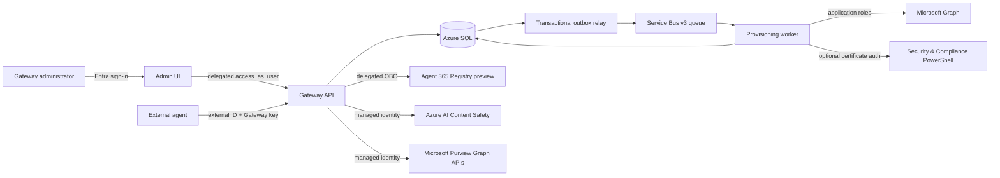
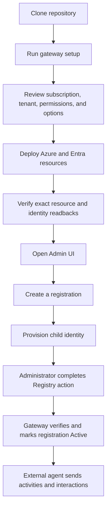
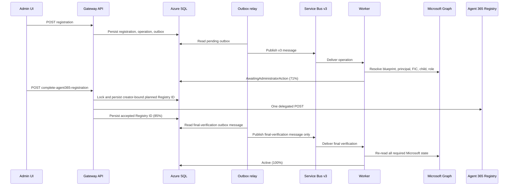
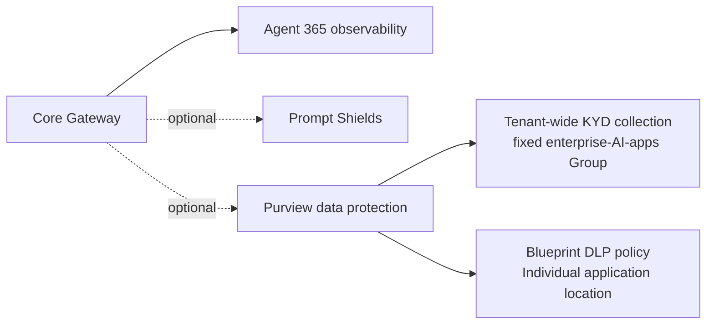

# A365 Custom Gateway architecture

The A365 Custom Gateway connects independently operated external agents to one
tenant-owned Azure control plane. Each registration binds one external agent ID,
one reusable Agent Identity blueprint, one child Entra Agent ID, and one Gateway
credential lifecycle.

Agent 365 Registry is currently a preview dependency. The repository therefore
defaults non-development deployments to closed registration admission and never
presents Gateway state as independent Microsoft-side proof.

## System context

## Identity and ownership

The product is N:N. A Gateway deployment can manage many registrations, and each
registration receives a distinct child identity and Gateway-issued ingress key.
External callers never submit a managed-identity identifier or Entra access token.

| Actor | Authentication | Authority |
|---|---|---|
| Admin UI user | Entra OpenID Connect | Portal experience; API authorization remains authoritative |
| Admin UI to API | Delegated `access_as_user` | Role-constrained control-plane calls |
| API to Registry | OBO with managed-identity signed assertion | Reviewed delegated Registry scopes |
| Worker to Graph | Managed identity | Eight reviewed Agent Identity/application roles |
| External agent | Gateway key plus generated external ID | One registration only |
| API to optional providers | API managed identity | Content Safety and Purview data-plane roles |
| Worker to policy authoring | Certificate stored in Key Vault | Reviewed Security & Compliance application/RBAC |

Gateway keys are ingress credentials, not Microsoft secrets. The clear value is
returned once; only a salted verifier and lifecycle metadata are stored.

## Deployment and first use

Bootstrap owns deployment through verified readback. Creating an Active
registration is a post-deployment use task, not a bootstrap prerequisite.

## Provisioning workflow

Seven persisted stages provide durable progress and recovery:

1. Resolve the selected or newly created reusable blueprint.
2. Ensure the blueprint service principal.
3. Configure the Gateway federated identity credential.
4. Create one child Agent ID.
5. Assign Agent 365 observability access.
6. Complete the Agent 365 Registry action through the signed-in Administrator.
7. Reverify blueprint, principal, federation, child, observability role, and token
   mapping before setting the registration to `Active`.

The worker never calls Registry. An unknown Registry POST outcome is reconciled only
by exact GET of the persisted planned ID; the POST is never repeated.

## Data plane

External agents submit activities and AI interactions using their registration
binding. The API resolves the key before trusting the external ID, applies
registration-scoped idempotency under a SQL application lock, stores approved
content only in the encrypted content store, and emits sanitized observability
records through the outbox.

Prompt evaluation is a separate pre-model call. When Prompt Shields or prompt-side
Purview is enabled, an allowed prompt returns a short-lived, single-use receipt
bound to registration, interaction, tenant user, content type, and a salted prompt
hash. The subsequent protected interaction must consume that receipt.

## Optional runtime protections

The minimal deployment does not require Prompt Shields or Purview.

- Prompt Shields calls Azure AI Content Safety before the external model call.
- Purview runtime evaluation uses Microsoft Graph v1.0 and fails closed.
- Know Your Data collection uses Microsoft's fixed tenant-wide enterprise-AI-apps
  Group location `ee1680d0-702f-4090-b26c-c49091e86531`.
- DLP protects the selected reusable blueprint application as an Individual
  location. Child and blueprint identifiers are supplied separately for attribution.
- Both policy types use the `Application` enforcement plane.

## Persistence and messaging

Azure SQL is the source of Gateway state. Writes that must publish work use a
transactional outbox. Current workflow messages use `gateway-provisioning-v3` only;
older queues must never receive a v3 worker. SQL job locks prevent concurrent work
on one operation, while idempotent provider discovery protects redelivery across
process failures.

## Security invariants

- Entra-only Azure SQL authentication; no SQL password fallback.
- Managed identity and workload identity wherever a supported contract exists.
- User-only Registry completion with role, `oid`, scope, operation, and lock checks.
- One Registry POST per operation lineage.
- No clear credentials, tokens, prompts, responses, or provider bodies in logs,
  queues, documentation, or bootstrap state.
- RFC 9457 errors and safe correlation IDs at API boundaries.
- Unknown, unauthorized, unsupported, or unverified provider outcomes fail closed.

See [the data model](data-model.md), [API contract](../api/api-contract.md), and
[Microsoft capability validation](microsoft-capabilities.md) for implementation detail.
