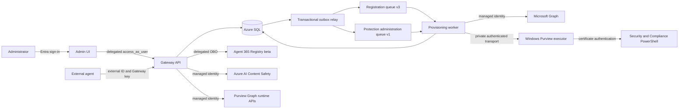

# A365 Custom Gateway architecture

The Gateway connects external agents to a tenant-owned Azure control plane. Each
registration binds a generated external agent ID, a reusable Agent Identity
blueprint, a distinct child Entra Agent ID, and a Gateway credential lifecycle.

This guide describes the retained source. Completion belongs only in
[MILESTONES.md](../../MILESTONES.md); deployment and continuation context belongs in
[project state](../project-state.md). Supporting files and Azure resources were
deliberately deleted. This guide establishes no current deployment or test result.

## System context

## Identity and authority

One Gateway manages many registrations, and a blueprint can be shared. Each
registration has its own child identity and ingress key. External callers present
the Gateway key and external ID; they do not choose a Microsoft managed identity.

| Actor | Authentication and boundary |
|---|---|
| Administrator in Admin UI | Entra OpenID Connect; the API enforces delegated scope, tenant, user and role |
| API to Registry | User-only on-behalf-of token with reviewed delegated Registry scopes |
| Worker to Graph | Managed identity with the reviewed Agent Identity application-role allowlist |
| External agent | Gateway credential bound to one registration |
| API to Prompt Shields | API managed identity with resource-scoped Content Safety access |
| Purview runtime | Prepared workload managed identity and exact runtime binding |
| Worker to Windows executor | Dedicated application role and exact caller binding |
| Windows executor to compliance provider | Prepared certificate resolved from the exact Key Vault secret |

Gateway keys are ingress credentials. Their clear value is returned once; storage
contains a salted verifier and lifecycle metadata. UI role visibility supplements
API authorization and does not replace it.

## Deployment and lifecycle

The retained bootstrap engine implements Plan, Apply, Resume and Verify. Guided
fresh setup includes shared Azure AI Content Safety in every preset; each agent's
Prompt Shields use remains optional. Purview prerequisites remain independently
selected. Setup prepares capabilities; tenant policy configuration belongs to the
authenticated application.

The guided Setup, DatabaseMigrator and LiveVerification projects referenced by the
solution are absent, as is the former test directory. Re-establishing reproducible
tooling is an M1 task. Existing binaries are not replacement source or validation.

Registration and protection are separate lifecycles:

1. Persist the registration, provisioning job and outbox work.
2. Resolve or create the reusable blueprint and its principal, configure
   federation, create the child identity and assign observability access.
3. Pause for the signed-in Administrator's delegated Registry completion.
4. Reverify the identity, federation, observability and token mapping before
   marking the registration Active.
5. Configure optional protection through reviewed application operations, either
   during registration or afterward.

The seven persisted registration stages remain independent of protection
administration. The worker never creates a Registry registration. Before its one
delegated POST, the API persists a creator-bound planned Registry ID. An unknown
outcome permits exact readback of that ID, never another POST. Registry acceptance
queues final verification rather than repeating creation.

The source treats Registry beta as a gated development capability; staging and
production admission remain closed. Current provider availability must be
verified for the selected tenant when deployment work resumes.

## Registration and shared protection

Registration can carry an explicitly reviewed and confirmed Purview configuration.
For an existing blueprint, the shared profile operation binds to that blueprint.
For a new blueprint, the operation waits in **AwaitingBlueprint**. After core
provisioning reaches Active, an internal continuation verifies the original
consent, actor, registration, new blueprint, connection and inventory before
queuing policy work. Conflict or expired authority requires renewed review.

Know Your Data uses the fixed tenant-wide enterprise-AI-apps Group
`ee1680d0-702f-4090-b26c-c49091e86531`. DLP uses the reusable blueprint application
as an Individual location. Both use the Application plane. Individual is a policy
scope, not per-agent isolation: changing a blueprint policy can affect other
agents, while switching one agent off does not delete or disable the shared policy.

The source supports multiple tenant-backed sensitive information types, count and
confidence thresholds, and four policy modes. Configuration, simulation, disabled
state and verified enforcement are distinct. See the
[protection guide](protection-settings-plan.md) for those contracts.

## Data plane and prompt receipts

The API authenticates the Gateway credential before trusting the external ID.
Registration-scoped idempotency and SQL locks protect repeated submissions.
Approved interaction content goes to the configured Blob content store;
observability and queue records contain sanitized metadata.

The external agent calls prompt evaluation before its model. Prompt Shields or
Purview Enforce requires a trusted allow receipt before protected ingestion. The
receipt is short-lived, single-use and bound to the registration, interaction,
tenant user, content type, salted prompt hash and current protection context.

That context includes protection revision, shared profile, mode, classifiers,
thresholds, capability, inventory and runtime certification. A changed context,
expired evidence, denied decision or consumed receipt cannot authorize a new model
call or ingestion. Simulation does not claim enforcement; offline processing
cannot establish response-side blocking.

## Durability and operational boundaries

Azure SQL owns Gateway state. State transitions and dispatch records use a
transactional outbox. Registration work uses `gateway-provisioning-v3`; ordinary
protection administration uses `gateway-protection-admin-v1` and its separate
eight-step workflow. Consumers handle duplicate delivery and reconcile uncertain
provider outcomes by exact readback.

Approved runtime sample tests use a separate synchronous API execution path so raw
samples remain ephemeral. Durable operations retain consent hashes and sanitized
outcomes for status and recovery.

Retained [upgrade operations](../../operations/gateway-upgrade.md) support bounded
existing-installation workflows. They preserve original bootstrap state and bind a
separate plan to exact source, resources, identities and schema. Their existence
does not establish a current upgrade target or bypass missing tooling.

## Security invariants

- Entra-only SQL authentication and scoped workload identities.
- Delegated Administrator-only Registry completion with one POST per lineage.
- Reviewed confirmation, concurrency and exact scope checks for shared policy changes.
- No clear credentials, tokens or raw content in logs, queues or operational receipts.
- Safe RFC 9457 errors and correlation IDs.
- Fail-closed enforcement when required provider proof is missing or stale.

See the [data model](data-model.md), [API contract](../api/api-contract.md),
[provider contracts](microsoft-capabilities.md) and
[Windows execution boundary](purview-windows-executor.md).
