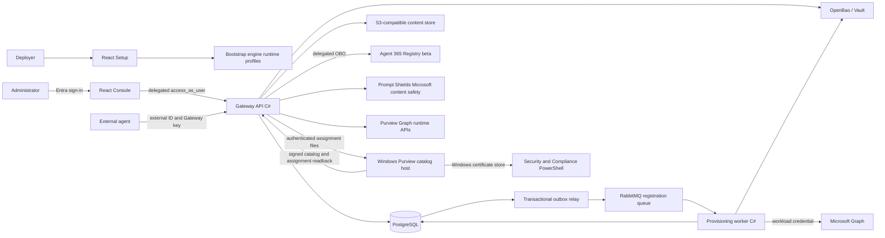

# A365 Custom Gateway architecture

## Purview responsibilities

The [policy-consumption decision](purview-policy-consumption.md) describes catalog and assignment behavior.
Purview policy owners manage SITs/classifiers, rules, thresholds, actions, and
modes. Gateway administrators select existing compatible policies from Purview
and apply them to the exact individual agent identity, preserving all unrelated
targets and exclusions. Never silently broaden an agent choice to its blueprint.

Console structure: Data protection → Policies; each agent has a Data protection
tab; Settings contains Gateway settings and Purview connection diagnostics.
Tenant setup and first access verification belong in bootstrap. Management
PowerShell access and runtime Graph processContent permissions are separate.
The gateway exposes prompts:evaluate and calls Purview; Purview does not call a
gateway processContent endpoint. Classifier/policy-rule editing stays in Purview.

Policies come from the existing Purview catalog and assignments target individual
agent identities. Assignment, synchronization, verified enforcement, and failures remain
separate states. Completion requires normal allow and synthetic sensitive block
through the gateway API plus a same-blueprint sibling isolation check. Follow the
decision document for current implementation and evidence; plans are not proof.

How the system is built. For **why** it exists, scope, UI platform, and
**runtime** requirements, see the [product brief](../spec/product-brief.md).

## Objective (architecture view)

The Gateway is a control plane whose **sole purpose** is connecting independently
hosted agents to **Entra, Graph, Agent 365, Purview, and Prompt Shields**. Each
registration binds:

- a generated external agent ID;
- a reusable Agent Identity blueprint;
- a distinct child Entra Agent ID;
- a Gateway credential lifecycle.

External agents keep hosting and model calls. The Gateway owns registration,
ingress credentials, evaluate/ingest receipts, durable provisioning, and
Purview / Prompt Shields administration.

**Product logic stays intact.** The **running environment** has **zero Microsoft
infrastructure dependence** — application containers use standard runtime interfaces
without Azure SQL, Service Bus, Key Vault, Container Apps, ACR, or Blob.

This guide describes the Docker Compose runtime.

## Infrastructure (zero Microsoft dependence)

| Concern | Target technology | Role |
|---|---|---|
| Relational state | **PostgreSQL** | Authoritative Gateway state (EF Core) |
| Messaging | **RabbitMQ** | Provisioning and activity work after transactional outbox |
| Secrets | **OpenBao** / **HashiCorp Vault** | Certificates, connection material, non-Entra secrets |
| Content store | **S3-compatible** (MinIO or cloud S3/GCS/Blob-via-S3) | Protected interaction content |
| Compute | **Docker Compose** | API, worker and Console; local Windows Purview catalog host |
| Images | Any **OCI** registry | Immutable digests |
| Telemetry mirror | **OpenTelemetry** | Optional sanitized monitoring export |
| Ingress | Standard TLS reverse proxy / cloud LB | HTTPS termination; trusted proxy CIDRs |

### Essential Microsoft product services (not infrastructure)

| Integration | Why it is essential |
|---|---|
| Entra ID / MSAL | Operator sign-in and API authorization |
| Microsoft Graph + Agent 365 Registry | Identity blueprints, child Agent IDs, Registry |
| Agent 365 observability | Default sanitized activity export |
| Purview + runtime catalog host | Microsoft 365 DLP/KYD and runtime evidence |
| Prompt Shields | Pre-model prompt-attack evaluation |

These are SaaS/API dependencies for the product's purpose. They do **not** put
the Gateway's database, bus, secrets, or compute on Microsoft infrastructure.

## System context

```mermaid
flowchart LR
    Operator[Administrator] -->|Entra sign-in| Ui[React Console]
    Deployer[Deployer] --> Setup[React Setup]
    Setup --> Bootstrap[Bootstrap engine runtime profiles]
    Ui -->|delegated access_as_user| Api[Gateway API C#]
    External[External agent] -->|external ID and Gateway key| Api
    Api --> Db[(PostgreSQL)]
    Db --> Relay[Transactional outbox relay]
    Relay --> RegistrationQueue[RabbitMQ registration queue]
    RegistrationQueue --> Worker[Provisioning worker C#]
    Worker --> Db
    Api --> Vault[OpenBao / Vault]
    Worker --> Vault
    Api --> Objects[S3-compatible content store]
    Worker -->|workload credential| Graph[Microsoft Graph]
    Api -->|delegated OBO| Registry[Agent 365 Registry beta]
    Api --> Shield[Prompt Shields Microsoft content safety]
    Api --> Purview[Purview Graph runtime APIs]
    Api -->|authenticated assignment files| Catalog[Windows Purview catalog host]
    Catalog -->|signed catalog and assignment readback| Api
    Catalog -->|Windows certificate store| Compliance[Security and Compliance PowerShell]
```

## Identity and authority

One Gateway manages many registrations; a blueprint can be shared. Each
registration has its own child identity and ingress key. External callers present
the Gateway key and external ID; they do not choose a cloud managed identity.

| Actor | Authentication and boundary |
|---|---|
| Administrator in hosted UI | Entra OpenID Connect; API enforces delegated scope, tenant, user, role |
| API to Registry | User-only on-behalf-of token with reviewed Registry scopes |
| Worker to Graph | Bootstrap-provisioned application credential with reviewed role allowlist |
| External agent | Gateway credential bound to one registration |
| API to Prompt Shields | Workload credential to the configured provider |
| Purview runtime | Individual agent token obtained through its own blueprint credential |
| API to catalog host | Authenticated files bound to tenant, agent, policy and review |
| Catalog host to compliance | Dedicated certificate in the bootstrap account Windows certificate store |

Gateway keys are ingress credentials. Clear value returned once; storage keeps a
salted verifier. UI role visibility never replaces API authorization.

The API admits forwarded scheme information only from reviewed trusted proxy
networks (`GatewayIngress:TrustedProxyNetworks`), before authentication. Empty
lists trust no forwarded scheme; direct HTTPS remains supported. See the
[HTTPS ingress contract](../api/api-contract.md#https-ingress).

### UI clients

React Console is the deployed administrator UI. React Setup and the terminal
installer use the same runtime bootstrap engine. Both setup interfaces share the same engine.

## Deployment and lifecycle

Bootstrap implements Plan, Apply/Up, and Verify for runtime Docker Compose.
The React installer and terminal share one configuration and execution engine.
Known interrupted checkpoints are reconciled through exact ownership readback;
Prompt Shields and Purview remain
independently selectable. Initial connection settings and product provisioning
belong in bootstrap; existing-policy selection belongs in the Console.

Registration and protection remain separate lifecycles:

1. Persist the registration, provisioning job and outbox work.
2. Resolve or create the reusable blueprint and principal, configure federation,
   create the child identity, assign observability access.
3. Pause for the signed-in Administrator's delegated Registry completion.
4. Reverify identity, federation, observability and token mapping before Active.
5. Configure optional protection through reviewed application operations.

The seven persisted registration stages stay independent of protection
administration. The worker never creates a Registry registration. Before its one
delegated POST, the API persists a creator-bound planned Registry ID. Unknown
outcomes permit exact-ID readback only. Registry acceptance queues final
verification rather than repeating creation.

Registry beta remains a gated development capability; staging and production
admission stay closed.

Bootstrap and maintenance authorize different lifecycles. Neither may adopt a
deliberately deleted environment by editing checkpoint fields.

## Registration and individual-agent protection

Registration creates the agent identity and Registry entry. Administrators select
existing Purview policies separately on the agent's Data protection tab. Assignment
targets the individual agent identity, never its blueprint. Policy definitions and
classifiers are authored in Purview. Initial connection setup belongs in bootstrap;
ongoing diagnostics belong in Settings.

Only individual policy assignments are stored. Assignment, synchronization and verified
enforcement remain distinct. See the [protection guide](protection-configuration.md).

## Data plane and prompt receipts

The API authenticates the Gateway credential before trusting the external ID.
Registration-scoped idempotency and database locks protect repeated submissions.
Approved interaction content goes to the configured **S3-compatible** content
store; observability and queue records contain sanitized metadata only.

Prompt evaluation before the model, allow-receipt binding, single-use consumption,
and fail-closed enforcement semantics are unchanged. Simulation does not claim
enforcement; offline processing cannot establish response-side blocking.

## Durability and operational boundaries

**PostgreSQL** owns Gateway state. State transitions and dispatch records
use a transactional outbox. Logical queues remain:

- registration: `gateway-provisioning-v3`

Transport is **RabbitMQ**; consumers stay duplicate-safe and recover
uncertain provider outcomes by exact readback.

Approved runtime sample tests keep ephemeral raw samples; durable operations keep
consent hashes and sanitized outcomes.

Telemetry has a narrower delivery guarantee than the outbox. An OpenTelemetry
mirror (target) or optional Azure Monitor mirror may record a durable attempt marker
before emission; a local span is not remote delivery proof. Agent 365 acceptance
does not establish every Microsoft 365 / DSPM / XDR destination.

Runtime maintenance uses the [runtime rebuild instructions](../runtime/README.md#rebuild-after-code-changes).

## Current management and ingestion boundaries

Agent listing cursor/filter semantics, role boundaries, and activity intake
limitations are unchanged. Custom activity may be supported by the OTel/Monitor
mirror path but not necessarily by the Agent 365 exporter. Duplicate new IDs in
one batch can still hit uniqueness constraints.

## Security invariants

- Workload credentials and delegated Entra access are least-privilege.
- Delegated Administrator-only Registry completion with one POST per lineage.
- Reviewed confirmation, concurrency, and exact scope checks for shared policy.
- No clear credentials, tokens, or raw content in logs, queues, or operational receipts.
- Secrets live in Vault/OpenBao (target), not in config files or images.
- Safe RFC 9457 errors and correlation IDs.
- Fail-closed enforcement when required provider proof is missing or stale.
- No required dependency on Azure PaaS for database, bus, secrets, or compute.

See the [data model](data-model.md), [API contract](../api/api-contract.md),
[provider contracts](microsoft-capabilities.md) and
[Runtime catalog host](purview-catalog-host.md).
