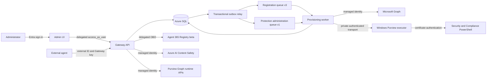

# A365 Custom Gateway architecture

The Gateway connects external agents to a tenant-owned Azure control plane. Each
registration binds a generated external agent ID, a reusable Agent Identity
blueprint, a distinct child Entra Agent ID, and a Gateway credential lifecycle.

This guide describes the source architecture. Current deployment and provider
readiness must be verified against the selected installation's exact bindings.

## System context

```mermaid
flowchart LR
    Operator[Administrator] -->|Entra sign-in| Admin[Admin UI]
    Admin -->|delegated access_as_user| Api[Gateway API]
    External[External agent] -->|external ID and Gateway key| Api
    Api --> Sql[(Azure SQL)]
    Sql --> Relay[Transactional outbox relay]
    Relay --> RegistrationQueue[Registration queue v3]
    Relay --> ProtectionQueue[Protection administration queue v1]
    RegistrationQueue --> Worker[Provisioning worker]
    ProtectionQueue --> Worker
    Worker --> Sql
    Worker -->|managed identity| Graph[Microsoft Graph]
    Api -->|delegated OBO| Registry[Agent 365 Registry beta]
    Api -->|managed identity| Shield[Azure AI Content Safety]
    Api -->|managed identity| Purview[Purview Graph runtime APIs]
    Worker -->|private authenticated transport| Executor[Windows Purview executor]
    Executor -->|certificate authentication| Compliance[Security and Compliance PowerShell]
```

## Identity and authority

One Gateway manages many registrations, and a blueprint can be shared. Each
registration has its own child identity and ingress key. External callers present
the Gateway key and external ID; they do not choose a Microsoft managed identity.

| Actor | Authentication and boundary |
|---|---|
| Administrator in Admin UI | Entra OpenID Connect; the API enforces delegated scope, tenant, user and role |
| API to Registry | User-only on-behalf-of token with reviewed delegated Registry scopes |
| Worker to Graph | Managed identity with the reviewed Agent Identity application-role allowlist |
| External agent | Gateway credential bound to one registration |
| API to Prompt Shields | API managed identity with resource-scoped Content Safety access |
| Purview runtime | Prepared workload managed identity and exact runtime binding |
| Worker to Windows executor | Dedicated application role and exact caller binding |
| Windows executor to compliance provider | Prepared certificate resolved from the exact Key Vault secret |

Gateway keys are ingress credentials. Their clear value is returned once; storage
contains a salted verifier and lifecycle metadata. UI role visibility supplements
API authorization and does not replace it.

The API explicitly admits forwarded scheme information only from its reviewed
ingress proxy networks, before authentication. It does not trust forwarded host
or client-IP values, and an empty proxy configuration does not promote HTTP to
HTTPS. The Container Apps contract supplies the platform ingress range; canonical
verification checks the effective public origin. See the
[HTTPS ingress contract](../api/api-contract.md#https-ingress).

The Blazor Admin UI described below is the UI that bootstrap still deploys, opens
and upgrades. A React + TypeScript **Console** is the replacement direction
(see the [Console design system](../console/design.md)); it consumes the same
`/api/v1` control plane with the same Entra sign‑in and role enforcement, but is
not yet part of the canonical install path and is not at full feature parity.

The Admin UI uses global InteractiveServer routing and head rendering, retaining
prerendering and page authorization. Registration controls and lifecycle mutations
wait for `RendererInfo.IsInteractive`; the page header's `aria-busy` exposes that
renderer readiness, not Gateway or provider health. Prerendered registration
inputs cannot accept edits that hydration would discard. Internal navigation stays
within the interactive route tree so the unsaved-key `NavigationLock` guard is
not bypassed by navigation between static page islands.

The current Admin UI offers Getting started and reviews registration identity,
blueprint and feature choices before dispatch. Endpoint/ID/key handoff precedes
Registry completion. Its saved-key acknowledgement is a circuit-only, one-use
operation/agent permit for eligible automatic completion, not durable authority
or a saved key. API role, admission and exact identity checks still apply.
The browser must acknowledge retention of the non-secret `pendingExternalId`
recovery URL before registration is dispatched; failure to obtain that
acknowledgement sends no create. The retained URL directs refreshed or interrupted
registration back to lookup without another create. Lost keys require replacement.
Operation polling pauses after five minutes without declaring the durable work
failed; unknown results remain recorded-status recovery, not mutation replay.

## Deployment and lifecycle

The retained bootstrap engine implements Plan, Apply, Resume and Verify. Guided
fresh setup includes shared Azure AI Content Safety in every preset; each agent's
Prompt Shields use remains optional. Purview prerequisites remain independently
selected. Setup prepares capabilities; tenant policy configuration belongs to the
authenticated application.

The guided Setup and DatabaseMigrator projects in the solution are the installer
entry points that bootstrap invokes. Existing binaries are not replacement source
or evidence for a later hosted acceptance.

Registration and protection are separate lifecycles:

1. Persist the registration, provisioning job and outbox work.
2. Resolve or create the reusable blueprint and its principal, configure
   federation, create the child identity and assign observability access.
3. Pause for the signed-in Administrator's delegated Registry completion.
4. Reverify the identity, federation, observability and token mapping before
   marking the registration Active.
5. Configure optional protection through reviewed application operations, either
   during registration or afterward.

The seven persisted registration stages remain independent of protection
administration. The worker never creates a Registry registration. Before its one
delegated POST, the API persists a creator-bound planned Registry ID. An unknown
outcome permits exact readback of that ID, never another POST. Registry acceptance
queues final verification rather than repeating creation.

The source treats Registry beta as a gated development capability; staging and
production admission remain closed. Current provider availability must be
verified for the selected tenant when deployment work resumes.

Bootstrap and maintenance authorize different lifecycles. Bootstrap binds its
19 stages to the accepted source, configuration, ownership and target. A started
external mutation with an uncertain result becomes readback-only; a new invocation
does not gain permission to repeat it. Maintenance packages a separate candidate
and requires its own plan, live baseline and artifact approvals. Neither lifecycle
can adopt a deliberately deleted environment by changing checkpoint fields.

## Registration and shared protection

Registration can carry an explicitly reviewed and confirmed Purview configuration.
For an existing blueprint, the shared profile operation binds to that blueprint.
For a new blueprint, the operation waits in **AwaitingBlueprint**. After core
provisioning reaches Active, an internal continuation verifies the original
consent, actor, registration, new blueprint, connection and inventory before
queuing policy work. Conflict or expired authority requires renewed review.

Know Your Data uses the fixed tenant-wide enterprise-AI-apps Group
`ee1680d0-702f-4090-b26c-c49091e86531`. DLP uses the reusable blueprint application
as an Individual location. Both use the Application plane. Individual is a policy
scope, not per-agent isolation: changing a blueprint policy can affect other
agents, while switching one agent off does not delete or disable the shared policy.

The source supports multiple tenant-backed sensitive information types, count and
confidence thresholds, and four policy modes. Configuration, simulation, disabled
state and verified enforcement are distinct. See the
[protection guide](protection-settings-plan.md) for those contracts.

Settings guides connection, shared policy, behavior testing and agent choices
through four ordered steps; overview, optional collection and defaults are
separate tools. Connection shows inventory count rather than an unused selector.
The shared-policy editor separates type selection from per-type thresholds and
preserves saved/draft values. A shared projection/snapshot component gives
Overview, list, details and Settings the same capability/saved-choice/current-state
wording. Intentionally Off is neutral. Profile state remains separate from
configuration-operation status, and known readiness expiry bounds invalidate
positive cached labels without granting authority or preventing earlier drift.

An outcome layer explains each task's result, purpose, remaining limits and
permitted next action. Pending retained operations are observed through
cancellation-bound GET reads every three seconds for at most five minutes.
Terminal operation readback refreshes the relevant current state; the same
task-scoped dependency predicates select reads and evaluate their success.
Incomplete refresh cannot reuse earlier readiness, and unrelated retained errors
cannot trap recovery on another task. Observation stops on read error,
disposal or route replacement and never starts, confirms or retries a mutation.
Exact profile links preserve policy-to-test context. Runtime results update the
parent summary and its effective expiry schedule without rebinding the active
private browser sample session;
historical receipt validity and current readiness remain distinct.

Visible activity represents actual awaited UI work or the bounded GET observation
session, not a provider heartbeat, percentage or completion estimate. Normal
motion and reduced-motion displays retain the same accessible state. A fresh
connection generation does not itself rebind saved policy. An explicitly
accepted new reconciliation review can bind unchanged settings to that current
inventory and clear prior runtime proof; downstream reconciliation still only
reads Microsoft objects.

Settings waits for browser acknowledgement of the execution/recovery ID before
confirmation or mutation. This is the review ID for ordinary starts, but the
original connection ID for separately approved companion completion. The API
returns that original ID; the Submitted approval references it for guarded
read-only recovery. Unknown outcomes use GET, not replacement consent or another
connection/policy create. Same-actor GET can return an already accepted companion
launch with its original identity, generation and expiry; no new launch authority
is created.
Same-page shortcuts may update the browser fragment without updating Blazor's
server navigation URI. Recovery preserves that fragment while enforcing the
same document, non-recovery query context and exact recovery ID. Connection and
shared-policy submission use the same pre-dispatch failure handling: no confirmed
browser acknowledgment means no authorization/mutation request, explicit
reload/status/review guidance and safe operation-ID/error-type logging. Unknown
results after dispatch retain their separate GET-only recovery semantics.

## Data plane and prompt receipts

The API authenticates the Gateway credential before trusting the external ID.
Registration-scoped idempotency and SQL locks protect repeated submissions.
Approved interaction content goes to the configured Blob content store;
observability and queue records contain sanitized metadata.

The external agent calls prompt evaluation before its model. Prompt Shields or
Purview Enforce requires a trusted allow receipt before protected ingestion. The
receipt is short-lived, single-use and bound to the registration, interaction,
tenant user, content type, salted prompt hash and current protection context.

That context includes protection revision, shared profile, mode, classifiers,
thresholds, capability, inventory and runtime certification. The client checks an
allowed, unexpired receipt immediately before generation; ingestion rechecks its
current context and one-time consumption. A protection change during generation
can reject ingestion but cannot stop a model call that has already started.
Simulation does not claim enforcement; offline processing cannot establish
response-side blocking.

## Durability and operational boundaries

Azure SQL owns Gateway state. State transitions and dispatch records use a
transactional outbox. Registration work uses `gateway-provisioning-v3`; ordinary
protection administration uses `gateway-protection-admin-v1` and its separate
eight-step workflow. Consumers handle duplicate delivery and reconcile uncertain
provider outcomes by exact readback.

Approved runtime sample tests use a separate synchronous API execution path so raw
samples remain ephemeral. Durable operations retain consent hashes and sanitized
outcomes for status and recovery.

The browser holds those samples in private JavaScript, not Blazor circuit state.
Its dedicated HTTPS portal requires the administrator role and antiforgery before
forwarding one confirmed execution to the API. Bounded-clock execution and strict
safe-report validation preserve explicit failure/unknown outcomes. Historical
reports and current readiness are rendered separately; local synthetic transports
through this real portal do not establish live Entra or Purview acceptance.

Telemetry has a narrower delivery guarantee than the SQL outbox. The Azure Monitor
mirror records a durable attempt marker before creating a local span. Redelivery
suppresses that attempt, including after a crash between marker persistence and
emission. A local span or aggregate Processed/Completed status is not remote
delivery proof. Agent 365 endpoint acceptance likewise does not establish every
Microsoft 365, DSPM or XDR destination. Keep these current limits visible until the
delivery/recovery acceptance work addresses them.

Retained [upgrade operations](../../operations/gateway-upgrade.md) support bounded
existing-installation workflows. They preserve original bootstrap state and bind a
separate plan to exact source, resources, identities and schema. Their existence
does not establish a current upgrade target or bypass release-tooling validation.

## Current management and ingestion boundaries

Agent listing uses a shared opaque creation-time/ID cursor and stable ascending
ordering. Name/external-ID substring search is case-insensitive and combines with
status/environment filters. The filtered count is computed before the cursor.
The Admin UI navigates 100-item pages, resets history on filter changes and offers
restart for invalid cursors. Overview reads full-query totals independently of
its bounded task preview; absent totals stay unavailable. Separate queries and
pages do not form an atomic fleet snapshot, so lifecycle changes can alter counts
while a user browses. Overview recognizes liveness `Healthy` and readiness `Ready`
as distinct checks; neither establishes protection or downstream delivery.

Lifecycle actions bind confirmations and results to the selected registration.
Replacement keys use the guarded one-time handoff, old-key revocation requires
explicit acknowledgement, and uncertain actions require metadata readback.
Credential, audit and provisioning views retain their existing role boundaries.

Activity intake accepts fields richer than its stored/exported metadata. Tool
details and arbitrary attributes do not appear automatically in telemetry.
Custom activity is supported by the Azure Monitor mirror but not the Agent 365
exporter. Single and batch validation differ, and duplicate new IDs within one
batch can reach the database uniqueness constraint. Baseline tests of supported
journeys do not turn those known limitations into accepted behavior guarantees.

## Security invariants

Role-specific UI visibility never replaces API authorization. Registration
status, protection readiness and telemetry delivery remain independent observations.

- Entra-only SQL authentication and scoped workload identities.
- Delegated Administrator-only Registry completion with one POST per lineage.
- Reviewed confirmation, concurrency and exact scope checks for shared policy changes.
- No clear credentials, tokens or raw content in logs, queues or operational receipts.
- Safe RFC 9457 errors and correlation IDs.
- Fail-closed enforcement when required provider proof is missing or stale.

See the [data model](data-model.md), [API contract](../api/api-contract.md),
[provider contracts](microsoft-capabilities.md) and
[Windows execution boundary](purview-windows-executor.md).
