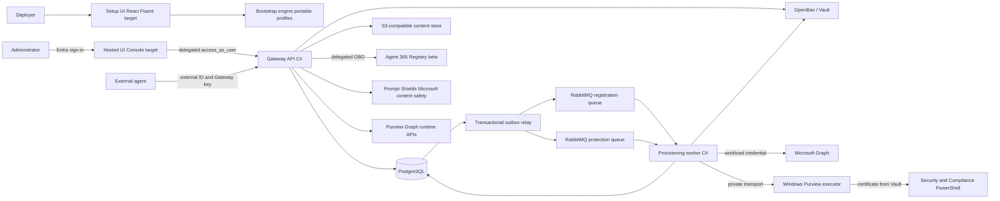

# A365 Custom Gateway architecture

How the system is built. For **why** it exists, scope, UI platform, and
**portable runtime** requirements, see the [product brief](../spec/product-brief.md).

## Objective (architecture view)

The Gateway is a control plane whose **sole purpose** is connecting independently
hosted agents to **Entra, Graph, Agent 365, Purview, and Prompt Shields**. Each
registration binds:

- a generated external agent ID;
- a reusable Agent Identity blueprint;
- a distinct child Entra Agent ID;
- a Gateway credential lifecycle.

External agents keep hosting and model calls. The Gateway owns registration,
ingress credentials, evaluate/ingest receipts, durable provisioning, and
Purview / Prompt Shields administration.

**Product logic stays intact.** The **running environment** has **zero Microsoft
infrastructure dependence** — same containers on AWS, GCP, or on-prem must work
without Azure SQL, Service Bus, Key Vault, Container Apps, ACR, or Blob.

This guide describes the **target** architecture and notes where the legacy Azure
infra profile still exists in source.

## Infrastructure (zero Microsoft dependence)

| Concern | Target technology | Role |
|---|---|---|
| Relational state | **PostgreSQL** | Authoritative Gateway state (EF Core) |
| Local/dev DB option | **SQLite** | Single-node developer convenience only |
| Messaging | **RabbitMQ** | Registration + protection work queues after transactional outbox |
| Secrets | **OpenBao** / **HashiCorp Vault** | Certificates, connection material, non-Entra secrets |
| Content store | **S3-compatible** (MinIO or cloud S3/GCS/Blob-via-S3) | Protected interaction content |
| Compute | **Docker Compose** and/or **Kubernetes** | API, worker, Console, optional Purview executor |
| Images | Any **OCI** registry | Immutable digests |
| Telemetry mirror | **OpenTelemetry** | Optional sanitized monitoring export |
| Ingress | Standard TLS reverse proxy / cloud LB | HTTPS termination; trusted proxy CIDRs |

### Essential Microsoft product services (not infrastructure)

| Integration | Why it is essential |
|---|---|
| Entra ID / MSAL | Operator sign-in and API authorization |
| Microsoft Graph + Agent 365 Registry | Identity blueprints, child Agent IDs, Registry |
| Agent 365 observability | Default sanitized activity export |
| Purview + Windows executor | Microsoft 365 DLP/KYD and runtime evidence |
| Prompt Shields | Pre-model prompt-attack evaluation |

These are SaaS/API dependencies for the product's purpose. They do **not** put
the Gateway's database, bus, secrets, or compute on Microsoft infrastructure.

### Legacy Azure infrastructure profile (transitional)

Existing Bicep/bootstrap assets may still provision Azure SQL, Service Bus, Key
Vault, Container Apps, ACR, and Blob. That is **legacy infrastructure only** —
not the product end state. Target: Compose/Kubernetes with zero Microsoft infra.
See [infrastructure](../../infrastructure/README.md) and
[bootstrap](../../bootstrap/README.md).

## System context

```mermaid
flowchart LR
    Operator[Administrator] -->|Entra sign-in| Ui[Hosted UI Console target]
    Deployer[Deployer] --> Setup[Setup UI React Fluent target]
    Setup --> Bootstrap[Bootstrap engine portable profiles]
    Ui -->|delegated access_as_user| Api[Gateway API C#]
    External[External agent] -->|external ID and Gateway key| Api
    Api --> Db[(PostgreSQL)]
    Db --> Relay[Transactional outbox relay]
    Relay --> RegistrationQueue[RabbitMQ registration queue]
    Relay --> ProtectionQueue[RabbitMQ protection queue]
    RegistrationQueue --> Worker[Provisioning worker C#]
    ProtectionQueue --> Worker
    Worker --> Db
    Api --> Vault[OpenBao / Vault]
    Worker --> Vault
    Api --> Objects[S3-compatible content store]
    Worker -->|workload credential| Graph[Microsoft Graph]
    Api -->|delegated OBO| Registry[Agent 365 Registry beta]
    Api --> Shield[Prompt Shields Microsoft content safety]
    Api --> Purview[Purview Graph runtime APIs]
    Worker -->|private transport| Executor[Windows Purview executor]
    Executor -->|certificate from Vault| Compliance[Security and Compliance PowerShell]
```

## Identity and authority

One Gateway manages many registrations; a blueprint can be shared. Each
registration has its own child identity and ingress key. External callers present
the Gateway key and external ID; they do not choose a cloud managed identity.

| Actor | Authentication and boundary |
|---|---|
| Administrator in hosted UI | Entra OpenID Connect; API enforces delegated scope, tenant, user, role |
| API to Registry | User-only on-behalf-of token with reviewed Registry scopes |
| Worker to Graph | Workload credential (Vault/K8s/cloud WI) with reviewed application-role allowlist |
| External agent | Gateway credential bound to one registration |
| API to Prompt Shields | Workload credential to the configured provider |
| Purview runtime | Prepared workload credential and exact runtime binding |
| Worker to Windows executor | Dedicated application role and exact caller binding |
| Windows executor to compliance | Certificate resolved from Vault/OpenBao (not Azure Key Vault as a requirement) |

Gateway keys are ingress credentials. Clear value returned once; storage keeps a
salted verifier. UI role visibility never replaces API authorization.

The API admits forwarded scheme information only from reviewed trusted proxy
networks (`GatewayIngress:TrustedProxyNetworks`), before authentication. Empty
lists trust no forwarded scheme; direct HTTPS remains supported. See the
[HTTPS ingress contract](../api/api-contract.md#https-ingress).

### UI clients (current vs target)

| Client | Role |
|---|---|
| **React Console** | **Portable default** hosted operator UI (`web/console` on Compose `:5081`) |
| **Blazor Admin UI** | Legacy hosted UI still present on the Azure profile only |
| **Guided Setup** | Legacy Setup app → React + Fluent over portable bootstrap |

See [UI design](../console/design.md).

### Legacy Admin UI behavior (still in source)

Blazor InteractiveServer details, Getting started, circuit-only key acknowledgement,
and `pendingExternalId` recovery URL behavior remain documented for the legacy UI
until Console cutover. Target Console IA: registration name → blueprint → key;
Prompt Shields on the agent; DLP under Data protection.

## Deployment and lifecycle

Bootstrap implements Plan, Apply, Resume, and Verify against the **selected
deploy profile** (portable Compose/Kubernetes target; Azure PaaS profile
transitional). Prompt Shields and Purview remain independently selectable.
Setup prepares capabilities; tenant policy configuration belongs to the
authenticated application.

Registration and protection remain separate lifecycles:

1. Persist the registration, provisioning job and outbox work.
2. Resolve or create the reusable blueprint and principal, configure federation,
   create the child identity, assign observability access.
3. Pause for the signed-in Administrator's delegated Registry completion.
4. Reverify identity, federation, observability and token mapping before Active.
5. Configure optional protection through reviewed application operations.

The seven persisted registration stages stay independent of protection
administration. The worker never creates a Registry registration. Before its one
delegated POST, the API persists a creator-bound planned Registry ID. Unknown
outcomes permit exact-ID readback only. Registry acceptance queues final
verification rather than repeating creation.

Registry beta remains a gated development capability; staging and production
admission stay closed.

Bootstrap and maintenance authorize different lifecycles. Neither may adopt a
deliberately deleted environment by editing checkpoint fields.

## Registration and shared protection

Registration may carry explicitly reviewed Purview configuration. For a new
blueprint, policy work waits in **AwaitingBlueprint** until Active, then continues
with original consent checks. Know Your Data uses the fixed tenant-wide Group
`ee1680d0-702f-4090-b26c-c49091e86531`. DLP uses the blueprint application as an
Individual location. Configuration, simulation, disabled state, and verified
enforcement remain distinct. See [protection guide](protection-settings-plan.md).

Legacy Admin UI Settings task flows and companion paste paths remain transitional
UI detail; Console Data protection is the long-term home. Protection mutations
still use review → confirm → start with HTTP 202 and exact readback recovery.

## Data plane and prompt receipts

The API authenticates the Gateway credential before trusting the external ID.
Registration-scoped idempotency and database locks protect repeated submissions.
Approved interaction content goes to the configured **S3-compatible** content
store; observability and queue records contain sanitized metadata only.

Prompt evaluation before the model, allow-receipt binding, single-use consumption,
and fail-closed enforcement semantics are unchanged. Simulation does not claim
enforcement; offline processing cannot establish response-side blocking.

## Durability and operational boundaries

**PostgreSQL** (target) owns Gateway state. State transitions and dispatch records
use a transactional outbox. Logical queues remain:

- registration: `gateway-provisioning-v3`
- protection administration: `gateway-protection-admin-v1`

Transport target is **RabbitMQ**; consumers stay duplicate-safe and recover
uncertain provider outcomes by exact readback. Legacy Azure Service Bus bindings
are profile-specific, not the product end state.

Approved runtime sample tests keep ephemeral raw samples; durable operations keep
consent hashes and sanitized outcomes.

Telemetry has a narrower delivery guarantee than the outbox. An OpenTelemetry
mirror (target) or legacy Azure Monitor mirror may record a durable attempt marker
before emission; a local span is not remote delivery proof. Agent 365 acceptance
does not establish every Microsoft 365 / DSPM / XDR destination.

Upgrade/maintenance for the legacy Azure profile is documented in
[gateway-upgrade.md](../../operations/gateway-upgrade.md). Portable-profile
maintenance follows Compose/Kubernetes image+schema contracts without Azure
What-If as a requirement.

## Current management and ingestion boundaries

Agent listing cursor/filter semantics, role boundaries, and activity intake
limitations are unchanged. Custom activity may be supported by the OTel/Monitor
mirror path but not necessarily by the Agent 365 exporter. Duplicate new IDs in
one batch can still hit uniqueness constraints.

## Security invariants

- Workload credentials and delegated Entra access are least-privilege.
- Delegated Administrator-only Registry completion with one POST per lineage.
- Reviewed confirmation, concurrency, and exact scope checks for shared policy.
- No clear credentials, tokens, or raw content in logs, queues, or operational receipts.
- Secrets live in Vault/OpenBao (target), not in config files or images.
- Safe RFC 9457 errors and correlation IDs.
- Fail-closed enforcement when required provider proof is missing or stale.
- No required dependency on Azure PaaS for database, bus, secrets, or compute.

See the [data model](data-model.md), [API contract](../api/api-contract.md),
[provider contracts](microsoft-capabilities.md) and
[Windows execution boundary](purview-windows-executor.md).
