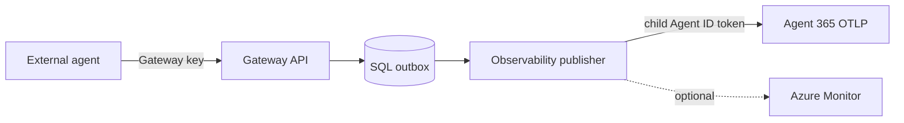

# Agent 365 observability

Agent 365 observability is enabled by default for new registrations. The Gateway
uses the mapped child Agent ID to acquire an Agent 365 token and exports sanitized
OpenTelemetry data to the documented Agent 365 OTLP endpoint. Azure Monitor
mirroring is independent and off by default.

## Architecture

## Required identity

The child Agent ID needs `Agent365.Observability.OtelWrite`. The provisioning worker
assigns and verifies that access before Registry completion, and final verification
rechecks it. The worker itself does not export registration telemetry.

The Gateway API/observability runtime must use the stored registration-to-child
mapping. Never accept a child identity identifier from an ordinary external caller.

## Configure

For a fresh deployment, keep the recommended defaults in
`bootstrap/config.json`. In the Admin UI, each registration can select:

- Agent 365 observability: on by default;
- Azure Monitor mirror: off by default.

No Agent 365 access token or OTLP authorization header belongs in configuration,
SQL, logs, or documentation.

## Verify

1. Run `./gateway verify` and confirm the core deployment is healthy.
2. In the Admin UI, confirm the registration is `Active` and Agent 365
   observability is enabled.
3. Use the external sample from the root README. It submits an activity and
   interaction using the registration's Gateway key.
4. Confirm the Gateway returns HTTP 202 and a safe correlation ID.
5. Confirm the outbox publishes without a terminal failure.
6. If tenant access permits, verify delayed Agent 365 landing independently. HTTP
   202 from Gateway or HTTP 200 from OTLP transport is not proof of downstream
   inventory/reporting visibility.

## Diagnose

| Symptom | Check |
|---|---|
| Gateway rejects the request | Registration/key binding, external ID, schema, idempotency key |
| Publisher cannot acquire a token | Child mapping, federation, token audience, OtelWrite assignment |
| Repeated transport failure | Endpoint, DNS, egress, throttling, retry classification |
| Transport succeeds but data is not visible | Tenant eligibility, processing delay, attribution, downstream query scope |
| Azure Monitor is empty | Registration mirror setting and independent Azure Monitor exporter health |

Use correlation IDs and sanitized activity identifiers only. Do not log prompt,
response, token, or provider body content while diagnosing.

## Failure behavior

Transport failures are retried through the outbox policy. They do not silently
change a registration to a success state. A terminal failure remains visible to
operators and requires a reviewed recovery decision. Service Bus or outbox cleanup
is not part of this runbook.
