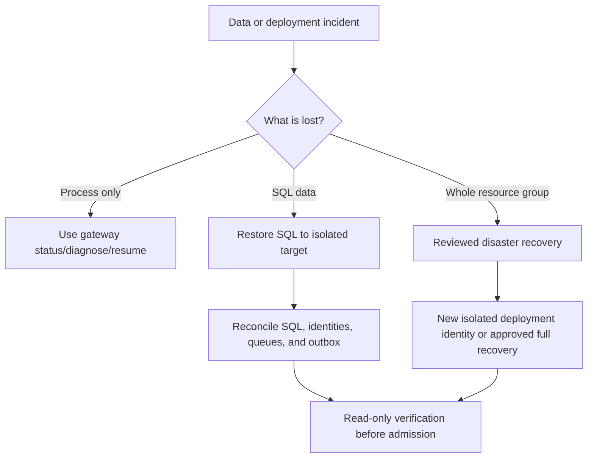

# Backup and recovery

This runbook covers Gateway-owned data and configuration. It does not authorize
deleting identities, replaying Registry creation, receiving dead-letter messages,
or rebuilding a deleted completed deployment from stale bootstrap state.

## Recovery inventory

| Asset | Protection | Recovery concern |
|---|---|---|
| Azure SQL | Azure point-in-time/long-term retention as configured | Registration, operation, credential verifier, idempotency, outbox consistency |
| Blob content store | Storage redundancy, soft delete/versioning as configured | Encrypted content and retention metadata |
| Key Vault | Soft delete and purge protection | Admin UI credential, automation certificate metadata |
| Container Registry | Immutable digests and source fingerprint | Reproducible workload deployment |
| Entra/Agent identities | Exact identifiers in SQL/bootstrap evidence | External lifecycle; not restored by SQL alone |
| Service Bus | Durable queue state | Duplicate delivery and ordering relative to SQL outbox |
| `.bootstrap/` | Operator-controlled local backup | Reconciliation authority; safe identifiers only |

## Backup policy

1. Configure Azure SQL retention to meet the approved RPO/RTO.
2. Enable the approved Storage and Key Vault recovery controls.
3. Preserve immutable image digests and source commit provenance.
4. Back up the ignored `.bootstrap/` directory to an approved encrypted operator
   location. Never add it to Git.
5. Record tenant, subscription, resource group, database, vault, storage, queue,
   application, and managed-identity identifiers without recording secrets.
6. Test restore in an isolated environment on a schedule approved by the owner.

## Recovery decision



## Interrupted bootstrap

For an existing intact resource group:

```bash
./gateway status
./gateway diagnose
./gateway resume
./gateway verify
```

Correct the reported cause first. Do not edit state, mark steps complete, replay
tenant operations manually, or start another bootstrap against the same target.

## SQL restore

1. Close registration admission and stop affected worker processing through the
   reviewed deployment control.
2. Capture read-only SQL, outbox, job, queue, image, and identity evidence.
3. Restore to a new database/server name first; do not overwrite the only copy.
4. Verify schema fingerprint and migration history.
5. Reconcile every nonterminal job with Microsoft-side state using read-only calls.
6. Reconcile outbox rows with queue delivery state. Assume duplicate delivery is
   possible.
7. For a Registry attempt with an unknown POST outcome, retain GET-only recovery.
8. Verify credential verifier/revocation state; do not attempt to recover clear keys.
9. Run application health and exact deployment verification against the isolated
   restore.
10. Promote only after an operator approves the reconciliation report.

## Deleted resource group

A completed resource group's credentials and its tenant objects have different
lifecycles. Preserved bootstrap state deliberately refuses to recreate missing
resource-group assets in place. Choose one:

- create a new isolated Gateway deployment with a new project/resource-group
  identity, then migrate through a reviewed procedure; or
- execute an independently designed disaster-recovery plan that binds every tenant
  object, identity, key lifecycle, database, and queue to the restored resources.

Do not delete `.bootstrap/` to bypass this boundary.

## Service Bus and outbox

Never purge, receive, settle, or replay a dead-letter message merely to make counts
look clean. Preserve the message and its SQL job/outbox binding until an incident
procedure determines whether it is evidence, recoverable work, or safely
disposable. A v3 worker must never attach to an older queue.

## Recovery acceptance

Recovery is complete only when:

- exact Azure, Entra, image, database, queue, and endpoint readbacks pass;
- all nonterminal jobs have a classified safe recovery path;
- no external create can be repeated after an unknown outcome;
- Gateway keys remain verifier-only and correct revocation state is preserved;
- admission/processing settings match the approved environment;
- the final report contains no secret or raw content.
