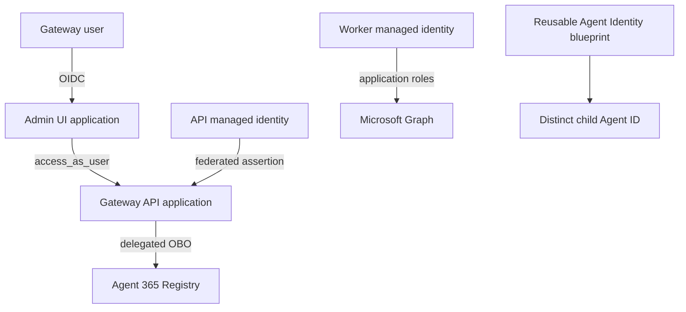

# Entra and Agent Identity setup

Fresh deployments should let `./gateway setup` create and verify the Entra objects.
This runbook explains the resulting contract and how to diagnose it; it is not a
second installer.

## Identity map



## Gateway API application

The API application:

- is single-tenant and uses v2 access tokens;
- exposes `access_as_user` below its project-scoped identifier URI;
- defines the reviewed Gateway control-plane app roles;
- has admin-consented delegated Registry scopes;
- has no password credential;
- uses one federated identity credential whose issuer is the tenant v2 issuer,
  subject is the API Container App managed-identity principal, and audience is only
  `api://AzureADTokenExchange`.

The API exchanges the signed managed-identity assertion during OBO. Never add a
client-secret fallback.

## Admin UI application

The Admin UI uses a confidential web-app credential stored in Key Vault and exact
HTTPS redirect/logout URIs for the deployed Container App. It requests only the
Gateway API's delegated `access_as_user` scope. Gateway role assignment is separate
from delegated consent.

## Provisioning worker

The v3 worker managed identity has exactly these Graph application roles:

1. `Application.Read.All`
2. `AppRoleAssignment.ReadWrite.All`
3. `AgentIdentityBlueprint.Create`
4. `AgentIdentityBlueprint.AddRemoveCreds.All`
5. `AgentIdentityBlueprintPrincipal.Create`
6. `AgentIdentityBlueprint.Read.All`
7. `AgentIdentity.Create.All`
8. `AgentIdentity.Read.All`

Registry delegated scopes must not be assigned as worker application roles.

## Blueprint and child identities

Bootstrap creates or selects a typed Agent Identity blueprint and verifies
`managerApplications` compatibility. Each registration creates one child Agent ID
under the selected blueprint. Equality between provider object/client IDs does not
make their resource types interchangeable.

## Reviewed manager applications

Setup asks for `Reviewed manager application ID(s), comma-separated` and stores the
answer as `agent365.reviewedManagerApplicationIds`. These are Microsoft first-party
application IDs that hold manager authority over every Agent ID created under the
blueprint, so bootstrap treats them as an authorization decision rather than a
discovered fact.

List the candidate IDs the provider currently reports:

```bash
az rest --method GET --url 'https://graph.microsoft.com/v1.0/applications/microsoft.graph.agentIdentityBlueprint?$select=id,appId,displayName,managerApplications'
```

Quote the URL with single quotes. They are literal in both `bash` and PowerShell, so
the same command works unchanged on Windows and macOS; double quotes would let
PowerShell expand `$select`.

Reviewing means confirming each returned ID against Microsoft's published first-party
application IDs for your tenant and provider version, then entering the IDs you
confirmed. Echoing discovery back is not a review: the check exists so that a
blueprint which silently gains a manager cannot grant that manager authority just by
being read.

Bootstrap accepts one to ten distinct GUIDs and requires the configured set to equal
the blueprint's `managerApplications` exactly. A mismatch fails with
`The seed blueprint managerApplications do not exactly match the independently
reviewed configuration.` Re-run the command above and compare before changing
configuration; a set that grew since the last run is a change to authority and
deserves a fresh review, not a wider allowlist.

## Read-only verification

Run:

```bash
./gateway verify
pwsh ./operations/test-provisioning-prerequisites.ps1 \
  -Environment dev \
  -ExpectedSubscriptionId YOUR-SUBSCRIPTION-ID \
  -ExpectedTenantId YOUR-TENANT-ID \
  -ResourceGroup YOUR-RESOURCE-GROUP \
  -ProjectName YOUR-PROJECT \
  -ContainerAppsEnvironmentName YOUR-CONTAINER-APPS-ENVIRONMENT
```

Supply the additional exact parameters requested by the script for the deployed
configuration. Do not weaken a failed assertion; compare the live object to the
bootstrap state and current source.

Verify:

- one API and one Admin UI application with exact ownership tags;
- exact redirect URI, logout URI, roles, scopes, and consent grants;
- exact API federation tuple;
- exact worker role allowlist;
- no client secrets on the API or worker path;
- blueprint type and `managerApplications` compatibility;
- user assignment to the intended Gateway role.

## Common failures

| Failure | Resolution |
|---|---|
| Admin UI access denied | Assign the user to a Gateway app role on the Admin UI enterprise app; sign out and back in |
| OBO claims challenge | Complete required consent/Conditional Access and retry as the same authorized user |
| Wrong token audience | Keep scope base URI for requests and bare API client ID for v2 token validation |
| Worker 403 | Compare Graph role IDs/values and managed-identity principal; allow documented propagation time |
| Blueprint rejected | Select a typed compatible blueprint; do not convert or reuse an ordinary application |
| Unknown Registry outcome | Preserve the planned ID and use exact GET recovery only; never repeat POST |

Tokens, assertions, grants containing sensitive values, and authorization headers
must never be pasted into issues or documentation.
