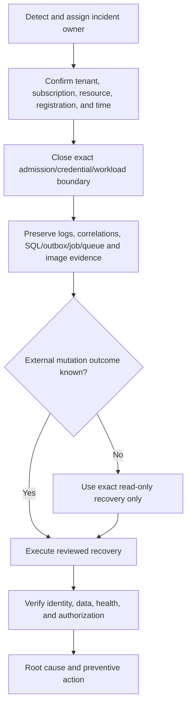

# Incident response

This runbook applies to security, availability, identity, data, credential,
provisioning, and dependency incidents affecting the Gateway.

## Priorities

1. Protect people and tenant data.
2. Contain the exact affected authority without broad destructive cleanup.
3. Preserve safe evidence and unknown-outcome recovery state.
4. Restore a verified service boundary.
5. Record root cause and prevention without publishing secrets or content.

## Response flow

## Detect and scope

Record only safe facts:

- detection time and reporter;
- tenant/subscription/resource group;
- affected registration, operation, credential ID, revision/digest, and correlation
  IDs;
- symptom and business impact;
- whether admission, worker execution, data plane, or optional provider is affected.

Do not paste keys, tokens, authorization headers, managed-identity assertions,
prompts, responses, certificate values, or provider bodies.

## Containment

Choose the narrowest reversible action:

- revoke one Gateway key;
- close registration admission;
- disable one optional provider;
- scale/stop one affected worker receiver through reviewed deployment controls;
- disable one compromised app credential/certificate;
- block one affected network path.

Do not delete a resource group, Entra application, blueprint, child identity, SQL
database, queue, or evidence merely to contain uncertainty.

## Preserve evidence

Capture safe read-only evidence for:

- API/Admin UI/worker revisions and immutable digests;
- health/readiness and sanitized logs;
- registration, operation, job, Registry-attempt, idempotency, and outbox state;
- Service Bus active/scheduled/dead-letter counts without receiving messages;
- exact role assignments, federation tuple, and policy configuration;
- audit events and correlation IDs.

Keep clocks/time zones explicit. Hash exported evidence and store it in the approved
incident location, not in public documentation.

## Unknown external outcomes

If a create/update call timed out or returned an ambiguous result, do not repeat it.
Use the provider-specific discover/read contract:

- Registry: exact GET of the persisted creator-bound planned ID only;
- Entra/Agent Identity: exact object/application/FIC readback before any create;
- Purview: exact policy readback; never infer runtime propagation;
- Gateway key: reconcile key ID/lifecycle before issuing another credential.

If safe discovery is unavailable or mismatched, require manual intervention.

## Common incident classes

| Class | Immediate action |
|---|---|
| Compromised Gateway key | Revoke exact key ID, preserve audit, issue replacement after scope review |
| Admin credential/certificate exposure | Disable exact credential, rotate through approved path, review sign-in/audit logs |
| OBO/Registry ambiguity | Close completion action, preserve planned ID, exact GET only |
| SQL integrity/availability | Close mutation paths, preserve backup and current state, follow recovery runbook |
| Queue backlog/dead-letter growth | Stop unsafe consumers if needed; compare SQL/outbox/job state; do not purge |
| Prompt Shields/Purview failure | Disable affected optional adapter, keep core path policy-compliant, preserve safe correlations |
| Suspected content exposure | Contain storage/access path, preserve access logs, follow privacy/legal notification policy |

## Restore and verify

Before reopening a boundary:

1. correct the root technical condition;
2. run focused local tests and reviewed read-only live checks;
3. verify exact identities, roles, federation, images, database, queues, and endpoints;
4. reconcile every nonterminal/ambiguous operation;
5. confirm old credentials are revoked and new ones are in use;
6. perform one approved harmless use check;
7. obtain incident-owner approval.

## Post-incident record

Write a durable summary with impact, root cause, detection gap, containment,
correction, recovery implications, test coverage, and prevention. Keep detailed
timelines/evidence in the restricted incident system. Update public docs only when
the product contract or operator instructions changed.
