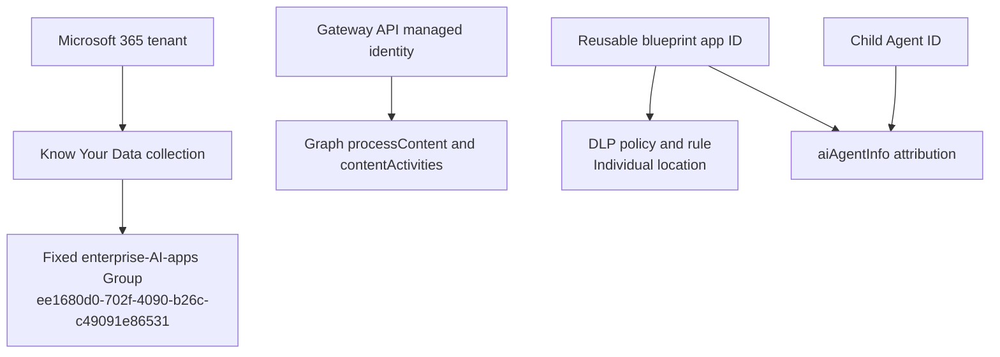

# Microsoft Purview setup

Purview is an optional Gateway runtime feature, not a prerequisite for deploying or
using the core Gateway. Configure and validate it after the base deployment is
healthy. Keep `Purview__Enabled=false` until every runtime prerequisite below is
verified.

## Scope model



The policy locations are not interchangeable:

| Purpose | Location | Source | Type | Enforcement plane |
|---|---|---|---|---|
| Know Your Data | `ee1680d0-702f-4090-b26c-c49091e86531` | Entra | Group | Application |
| DLP | reusable blueprint application/client ID | Entra | Individual | Application |

The Gateway API managed identity is the integrated caller. Child and blueprint IDs
are carried as `aiAgentInfo` attribution; the child is not the DLP policy location.

## Prerequisites

- tenant licensing and availability for the selected Purview capabilities;
- Security & Compliance PowerShell access;
- a Windows workstation for optional SIT inventory and policy authoring;
- an approved certificate-authenticated automation application when Gateway-managed
  profiles are enabled;
- certificate PFX stored in the reviewed Key Vault secret path;
- the narrow compliance RBAC required for FeatureConfiguration and DLP cmdlets;
- API managed-identity Graph application roles for runtime processing;
- an allowed sensitive-information type and policy mode approved for the tenant.

The FeatureConfiguration cmdlets are Public Preview and may be unavailable in some
organizations.

The core Gateway bootstrap runs on Windows, macOS, and Linux. This optional Purview
path is Windows-only: Microsoft currently documents `Connect-IPPSSession`, and
therefore Security & Compliance PowerShell, as unavailable in PowerShell 7 on
[macOS and Linux](https://learn.microsoft.com/powershell/exchange/exchange-online-powershell-v2?view=exchange-ps#supported-operating-systems-for-the-exchange-online-powershell-module).
On macOS or Linux, leave Purview disabled or run Purview selection and bootstrap
from Windows. Setup and the terminal initializer reject Purview selection before
Microsoft Graph, Security & Compliance, or sensitive-information-type inventory
calls. Purview-enabled Up, Apply, Resume, and Verify also stop before Azure, Graph,
or compliance-provider access; the installer never substitutes a static list.

Microsoft does not publish a cmdlet-specific least-privilege role mapping for
`Get-DlpSensitiveInformationType`. Security & Compliance PowerShell imports only
the commands permitted by the signed-in account's RBAC. Setup therefore tests the
real command and inventory and stops if authorization cannot be proven; do not grant
a broader role merely to bypass that check.

## Select a sensitive information type

On Windows, Guided Setup and terminal `init` use the same tenant-backed contract:

1. verify the exact Azure subscription and tenant selected for deployment;
2. resolve the signed-in work account through Azure CLI and Microsoft Graph `/me`,
   require Graph `userType=Member`, then open the official `Connect-IPPSSession`
   browser sign-in for that same account in the selected tenant; a `Guest` result
   or mismatched Security & Compliance session is rejected;
3. call no-argument `Get-DlpSensitiveInformationType` and project only the exact
   `Id`, Unicode `Name`, and `Publisher` fields within a bounded inventory;
4. require the administrator to choose an organizationally approved type through
   an explicit no-default selection keyed by `Id`; and
5. store the GUID together with its exact current name.

There is no bundled list and no free-text fallback. Before configuration publication
or policy mutation, the selected GUID is queried again, filtered to exactly one
matching `Id`, and required to retain the exact stored name. This extra filtering is
required because Microsoft's cmdlet documents that null or nonexistent `-Identity`
values can return every object. A rename, removal, duplicate, malformed response,
authorization failure, timeout, or target change invalidates the selection and
requires a fresh load.

## Author policies

Use the bootstrap's optional Purview configuration or the reviewed automation script
in `src/Gateway.Purview/Automation`. Never put the certificate, password, token, or
Gateway key in command arguments, environment variables, state, or logs.

The intended PowerShell shapes are:

```powershell
$enterpriseAiAppsGroup = 'ee1680d0-702f-4090-b26c-c49091e86531'
$collectionLocations = @"
[{"Workload":"Applications","Location":"$enterpriseAiAppsGroup","LocationSource":"Entra","LocationType":"Group","Inclusions":[{"Type":"Tenant","Identity":"All"}]}]
"@

New-FeatureConfiguration `
  -FeatureScenario KnowYourData `
  -Name 'A365 Gateway enterprise AI apps collection' `
  -Mode Enable `
  -ScenarioConfig $reviewedCollectionScenario `
  -Locations $collectionLocations

$blueprintApplicationId = 'YOUR-BLUEPRINT-APPLICATION-ID'
$dlpLocations = @"
[{"Workload":"Applications","Location":"$blueprintApplicationId","LocationSource":"Entra","LocationType":"Individual","Inclusions":[{"Type":"Tenant","Identity":"All"}]}]
"@

New-DlpCompliancePolicy `
  -Name 'A365 Gateway DLP' `
  -Mode Enable `
  -Locations $dlpLocations `
  -EnforcementPlanes @('Application')
```

Create the DLP rule with the selected tenant-returned sensitive-information-type
GUID/name pair, activities, and actions. The documented rule syntax uses the exact
current name, while typed readback must also match the selected classifier GUID. Do
not copy an example identifier into a real policy without tenant inventory review.

## Exact readback

Before runtime enablement, verify:

1. exactly one intended KYD collection, with the fixed Group and Application plane;
2. exactly one intended DLP policy/rule set, with the blueprint Individual location
   and Application plane;
3. no unintended location replacement or broadening;
4. exact sensitive-information-type GUID and name pairs, activities, actions, mode,
   and distribution status;
5. exact automation application, certificate metadata, Key Vault scope, and
   compliance RBAC;
6. exact API managed-identity principal and required Graph app-role assignments.

Readback proves configuration, not propagation or a runtime verdict.

## Managed-identity token readiness

Microsoft documents caching of managed-identity access tokens by resource URI.
After adding Graph roles, directory assignments can be correct while the current
token still lacks them. Do not print or persist the token. Use a safe claim-only
attestation that checks audience, tenant, subject, and required role names in memory.
If roles are absent, leave the adapter disabled and wait for propagation.

## Runtime verification

Use a nonproduction registration and organization-approved synthetic content:

1. verify the core Gateway with `./gateway verify`;
2. confirm the API token-role attestation contains the required Purview roles;
3. enable Purview on the API and one registration only;
4. submit benign `uploadText` and require the exact nonblocking decision;
5. submit approved synthetic sensitive `uploadText` and require the expected block;
6. submit `downloadText` and honor the provider's returned offline mode;
7. confirm sanitized audit/observability metadata and absence of raw content in logs;
8. disable the feature again if any transport, auth, schema, execution-mode, or
   policy result is ambiguous.

Do not claim response-side inline enforcement when the policy returns offline
processing. The completed interaction route is not a pre-model response gate.

## Failure handling

- HTTP 401/403: verify principal, role values, consent, token audience, and
  propagation; do not add broad permissions.
- HTTP 500/unknown Graph error: keep the adapter disabled, preserve correlation
  evidence, and verify token roles before changing policy.
- Policy mismatch: fail before child creation for profile-backed registrations;
  never silently substitute the blueprint into the KYD collection.
- Offline decision: submit the activity without waiting for a synchronous body.
- Ambiguous provider result: fail closed and suppress provider bodies.

Official contracts are summarized in
[Microsoft capability validation](../architecture/microsoft-capabilities.md).
