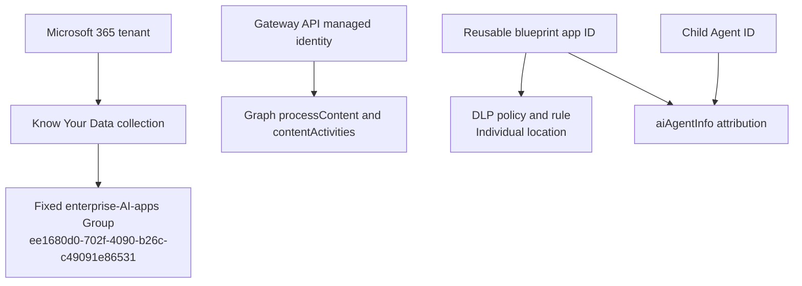

# Microsoft Purview setup

Purview is an optional Gateway runtime feature, not a prerequisite for deploying or
using the core Gateway. Configure and validate it after the base deployment is
healthy. Leave Purview disabled in the bootstrap configuration until every runtime
prerequisite below is verified; bootstrap derives `Purview__Enabled` from that
configuration once the policy objects pass exact typed readback, so the flag is
never set by hand.

## Scope model



The policy locations are not interchangeable:

| Purpose | Location | Source | Type | Enforcement plane |
|---|---|---|---|---|
| Know Your Data | `ee1680d0-702f-4090-b26c-c49091e86531` | Entra | Group | Application |
| DLP | reusable blueprint application/client ID | Entra | Individual | Application |

The Gateway API managed identity is the integrated caller. Child and blueprint IDs
are carried as `aiAgentInfo` attribution; the child is not the DLP policy location.

## Prerequisites

- tenant licensing and availability for the selected Purview capabilities;
- Security & Compliance PowerShell access;
- a Windows workstation for optional SIT inventory and policy authoring;
- a certificate-authenticated automation application **only** when the Gateway
  itself must author policy for a newly created protected blueprint; registering
  an agent against an existing blueprint never uses it;
- certificate PFX stored in the reviewed Key Vault secret path;
- the narrow compliance RBAC required for FeatureConfiguration and DLP cmdlets;
- API managed-identity Graph application roles for runtime processing;
- an allowed sensitive-information type and policy mode approved for the tenant.

The FeatureConfiguration cmdlets are Public Preview and may be unavailable in some
organizations.

The core Gateway bootstrap runs on Windows, macOS, and Linux. This optional Purview
path is Windows-only: Microsoft currently documents `Connect-IPPSSession`, and
therefore Security & Compliance PowerShell, as unavailable in PowerShell 7 on
[macOS and Linux](https://learn.microsoft.com/powershell/exchange/exchange-online-powershell-v2?view=exchange-ps#supported-operating-systems-for-the-exchange-online-powershell-module).
On macOS or Linux, leave Purview disabled or run Purview selection and bootstrap
from Windows. Setup and the terminal initializer reject Purview selection before
Microsoft Graph, Security & Compliance, or sensitive-information-type inventory
calls. Purview-enabled Up, Apply, Resume, and Verify also stop before Azure, Graph,
or compliance-provider access; the installer never substitutes a static list.

Microsoft does not publish a cmdlet-specific least-privilege role mapping for
`Get-DlpSensitiveInformationType`. Security & Compliance PowerShell imports only
the commands permitted by the signed-in account's RBAC. Setup therefore tests the
real command and inventory and stops if authorization cannot be proven; do not grant
a broader role merely to bypass that check.

## Enable Purview on an existing deployment

Purview is reconcilable input rather than deployment identity, so enabling it is
a configuration change and not a teardown. Whether that change can be applied to
an existing deployment depends on a second, independent condition: bootstrap
refuses to mix source generations inside one deployment state. Establish which
case you are in before doing anything, because the two paths differ completely.

```powershell
.\gateway.cmd plan
```

If `plan` refuses with *"Bootstrap source changed after durable state evidence was
recorded"*, the working tree no longer matches the source that provisioned the
deployment, and no in-place path exists. Use case B.

Run either case on Windows. The Purview authoring step cannot run on macOS or
Linux for the reason given above, and it cannot run unattended.

### Case A — the source is unchanged

Deployment identity is exactly `subscriptionId`, `tenantId`, `environment`,
`location`, `projectName`, and `resourceGroupName`. Keep all six as recorded, or
bootstrap treats the run as a different deployment and provisions a separate one
beside the existing gateway. Both initializers offer the recorded project name and
resource group back as defaults whenever the subscription, tenant, and environment
already match, and state which deployment they are reconfiguring; accepting those
defaults is the reconciling path.

1. Rewrite the configuration with Purview enabled, selecting the sensitive
   information type through the tenant-backed picker described in
   [Select a sensitive information type](#select-a-sensitive-information-type):

   ```powershell
   .\gateway.cmd init
   ```

   Guided Setup (`.\gateway.cmd setup`) presents the identical contract in the
   browser. Either is acceptable; do not hand-edit `bootstrap/config.json` to
   insert a sensitive-information-type GUID, because an unverified GUID fails
   closed mid-run after the deployment steps have already restarted.

2. Apply the change:

   ```powershell
   .\gateway.cmd up --config bootstrap/config.json
   ```

   Bootstrap reopens `Purview policies` and `Gateway runtime deployment`. The
   first authors the collection, DLP policy, and DLP rule over an interactive
   `Connect-IPPSSession` sign-in and verifies them by exact typed readback; the
   second redeploys the API and worker with the adapter enabled. Stay at the
   terminal: the compliance sign-in is a browser handoff that the run waits on,
   and `--non-interactive` makes the run fail closed at the Purview step rather
   than authoring policy without a signed-in operator.

   Reopening is safe here only because the recorded completion was a no-op. A
   step that completed while Purview was disabled records `configured: false`,
   which is written before any tenant object is created, so there is nothing to
   repeat and bootstrap simply runs it. Evidence from a run that *did* author
   policy is treated differently: it fails closed rather than replaying a
   mutation, and the run stops with the step preserved for exact reconciliation.
   If that happens, review the tenant policies named in the configuration before
   resuming; do not delete `.bootstrap/` state to clear it.

Then continue with the registration and runtime checks below.

### Case B — the source has changed

This is the normal case whenever pending source corrections are waiting to ship,
and it is the only supported path then. There is no in-place application upgrade,
and none should be added: mixing source generations inside one deployment state is
exactly what the guard prevents. Do not delete `.bootstrap/` state to force the
in-place path, and do not point fresh state at an existing resource group.

Provision a new deployment with Purview enabled from the start, which also lands
every pending correction in the same cycle:

1. Run `.\gateway.cmd init` (or `.\gateway.cmd setup`) and enter a **new** project
   name rather than accepting the recorded one. The wizard states which
   deployment the defaults would reconfigure, so read that line before pressing
   Enter. Enable Purview and select the sensitive information type through the
   tenant-backed picker described in
   [Select a sensitive information type](#select-a-sensitive-information-type).

2. Run `.\gateway.cmd up --config bootstrap/config.json` and stay at the terminal
   for the interactive compliance sign-in. Purview is authored during the run
   rather than reopened afterwards, so no replay boundary is involved.

3. Retire the superseded deployment only after the new one is verified, and only
   under a fresh explicit authorization for that specific resource group.

Then continue with the registration and runtime checks below.

### Register and verify

1. Enable Purview on exactly one registration. In the Admin UI, register an agent
   against an **existing** blueprint and select **Enable Microsoft Purview**. That
   path requires no protection profile and no automation application; profile
   provisioning is reached only when creating a *new* protected blueprint, where
   the worker must author policy unattended.

2. Exercise the runtime with the sample external agent, which carries the Entra
   user object ID that Purview evaluation requires:

   ```powershell
   dotnet run --project src/ExternalAgent.Sample -- `
     --api-base-url https://YOUR-GATEWAY-API `
     --external-agent-id YOUR-EXTERNAL-AGENT-ID `
     --tenant-user-object-id YOUR-ENTRA-USER-OBJECT-ID `
     --message "benign text"
   ```

   The sample accepts only those four arguments and rejects any other. It reads
   the Gateway key from stdin or a non-echoing prompt by design; never pass the
   key as an argument, where it would land in shell history and process listings.

   Repeat with organization-approved synthetic sensitive content matching the
   selected type. Both outcomes are required: the benign call must return the
   exact nonblocking decision, and the sensitive call must return the expected
   block. A block on its own does not distinguish enforcement from a
   misconfigured deny.

Until both outcomes are observed on the deployed build, the feature is enabled but
unproven. Bootstrap records `propagationStatus = PendingLiveVerification` for
precisely this reason: exact typed readback proves the policy objects exist, never
that the managed identity's token carries the Graph roles or that the policy has
propagated. See [Exact readback](#exact-readback) and
[Managed-identity token readiness](#managed-identity-token-readiness) below.

## Select a sensitive information type

On Windows, Guided Setup and terminal `init` use the same tenant-backed contract:

1. verify the exact Azure subscription and tenant selected for deployment;
2. resolve the signed-in work account through Azure CLI and Microsoft Graph `/me`,
   require Graph `userType=Member`, then open the official `Connect-IPPSSession`
   browser sign-in for that same account in the selected tenant; a `Guest` result
   or mismatched Security & Compliance session is rejected;
3. call no-argument `Get-DlpSensitiveInformationType` and project only the exact
   `Id`, Unicode `Name`, and `Publisher` fields within a bounded inventory;
4. require the administrator to choose an organizationally approved type through
   an explicit no-default selection keyed by `Id`; and
5. store the GUID together with its exact current name.

There is no bundled list and no free-text fallback. Before configuration publication
or policy mutation, the selected GUID is queried again, filtered to exactly one
matching `Id`, and required to retain the exact stored name. This extra filtering is
required because Microsoft's cmdlet documents that null or nonexistent `-Identity`
values can return every object. A rename, removal, duplicate, malformed response,
authorization failure, timeout, or target change invalidates the selection and
requires a fresh load.

## Author policies

Use the bootstrap's optional Purview configuration or the reviewed automation script
in `src/Gateway.Purview/Automation`. Never put the certificate, password, token, or
Gateway key in command arguments, environment variables, state, or logs.

The intended PowerShell shapes are:

```powershell
$enterpriseAiAppsGroup = 'ee1680d0-702f-4090-b26c-c49091e86531'
$collectionLocations = @"
[{"Workload":"Applications","Location":"$enterpriseAiAppsGroup","LocationSource":"Entra","LocationType":"Group","Inclusions":[{"Type":"Tenant","Identity":"All"}]}]
"@

New-FeatureConfiguration `
  -FeatureScenario KnowYourData `
  -Name 'A365 Gateway enterprise AI apps collection' `
  -Mode Enable `
  -ScenarioConfig $reviewedCollectionScenario `
  -Locations $collectionLocations

$blueprintApplicationId = 'YOUR-BLUEPRINT-APPLICATION-ID'
$dlpLocations = @"
[{"Workload":"Applications","Location":"$blueprintApplicationId","LocationSource":"Entra","LocationType":"Individual","Inclusions":[{"Type":"Tenant","Identity":"All"}]}]
"@

New-DlpCompliancePolicy `
  -Name 'A365 Gateway DLP' `
  -Mode Enable `
  -Locations $dlpLocations `
  -EnforcementPlanes @('Application')
```

Create the DLP rule with the selected tenant-returned sensitive-information-type
GUID/name pair, activities, and actions. The documented rule syntax uses the exact
current name, while typed readback must also match the selected classifier GUID. Do
not copy an example identifier into a real policy without tenant inventory review.

## Exact readback

Before runtime enablement, verify:

1. exactly one intended KYD collection, with the fixed Group and Application plane;
2. exactly one intended DLP policy/rule set, with the blueprint Individual location
   and Application plane;
3. no unintended location replacement or broadening;
4. exact sensitive-information-type GUID and name pairs, activities, actions, mode,
   and distribution status;
5. exact automation application, certificate metadata, Key Vault scope, and
   compliance RBAC;
6. exact API managed-identity principal and required Graph app-role assignments.

Readback proves configuration, not propagation or a runtime verdict.

## Managed-identity token readiness

Microsoft documents caching of managed-identity access tokens by resource URI.
After adding Graph roles, directory assignments can be correct while the current
token still lacks them. Do not print or persist the token. Use a safe claim-only
attestation that checks audience, tenant, subject, and required role names in memory.
If roles are absent, leave the adapter disabled and wait for propagation.

## Runtime verification

Use a nonproduction registration and organization-approved synthetic content:

1. verify the core Gateway with `./gateway verify`;
2. confirm the API token-role attestation contains the required Purview roles;
3. enable Purview on the API and one registration only;
4. submit benign `uploadText` and require the exact nonblocking decision;
5. submit approved synthetic sensitive `uploadText` and require the expected block;
6. submit `downloadText` and honor the provider's returned offline mode;
7. confirm sanitized audit/observability metadata and absence of raw content in logs;
8. disable the feature again if any transport, auth, schema, execution-mode, or
   policy result is ambiguous.

Do not claim response-side inline enforcement when the policy returns offline
processing. The completed interaction route is not a pre-model response gate.

## Failure handling

- HTTP 401/403: verify principal, role values, consent, token audience, and
  propagation; do not add broad permissions.
- HTTP 500/unknown Graph error: keep the adapter disabled, preserve correlation
  evidence, and verify token roles before changing policy.
- Policy mismatch: fail before child creation for profile-backed registrations;
  never silently substitute the blueprint into the KYD collection.
- Offline decision: submit the activity without waiting for a synchronous body.
- Ambiguous provider result: fail closed and suppress provider bodies.

Official contracts are summarized in
[Microsoft capability validation](../architecture/microsoft-capabilities.md).
