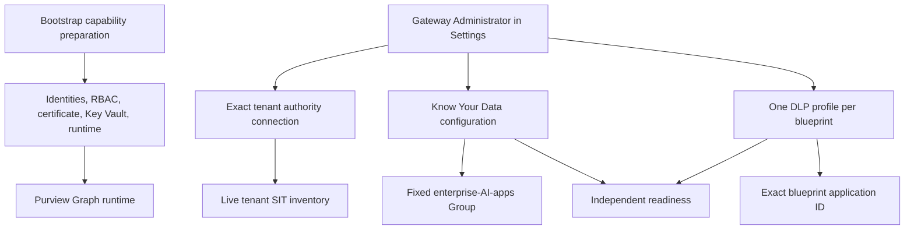

# Microsoft Purview setup and readiness

Status: beta.2 platform correction open; Purview is not live-ready.

Last updated: 2026-09-06 (Asia/Seoul).

Purview is optional. Bootstrap prepares capability prerequisites; role-aware
Gateway Settings owns tenant connection, SIT selection, policy configuration,
propagation, readiness, defaults, and ongoing changes. The source passed integrated
tests, fresh independent review, and clean-export validation. Exact results are in
the [implementation checkpoint](../implementation-status.md).

Current live readiness and the next action are recorded in the deployment
checkpoint. Live authority remains specific to the operator session and exact
target; it does not transfer through Git or documentation. Honor existing session
authorization for deployment and synthetic E2E, including its reviewed policy
scope. Retiring earlier environments still requires separate exact-target cleanup
authority. Do not reuse an older deployment state with changed source.

Settings authors the supported UploadText Block restriction in either policy mode.
AuditOnly uses TestWithoutNotifications and takes no enforcement actions. Only an
Enforce profile can satisfy the independent runtime allow/block readiness gate.
See the [architecture plan](../architecture/protection-settings-plan.md).

## Scope model



The policy locations are independent:

| Purpose | Location | Source | Type | Enforcement plane |
|---|---|---|---|---|
| Know Your Data | `ee1680d0-702f-4090-b26c-c49091e86531` | Entra | Group | Application |
| DLP | one reusable blueprint application/client ID | Entra | Individual | Application |

Never add a blueprint ID to the Know Your Data Group. Child and blueprint IDs are
carried separately as `aiAgentInfo` attribution; a child ID is not a policy
location.

## Authority boundary

Before any Microsoft 365, Purview, Graph, Azure, Entra, Key Vault, policy, or
deployment action:

1. read the current
   [deployment checkpoint](development-deployment-status.md);
2. verify the exact tenant, subscription, Gateway deployment, and requested action;
3. obtain current user authority for that exact target and action; and
4. preserve `.bootstrap/`, existing policies, provider identifiers, and retained
   evidence.

Deployment approval does not authorize policy authoring. Policy creation does not
authorize replacement or deletion. Read-only inventory does not authorize a write.
Cleanup, certificate rotation, and scope broadening each require separate explicit
authority.

## Bootstrap capability preparation

Bootstrap may prepare:

- the API managed identity and the narrow Graph application roles required for
  protection-scope computation, content processing, and activity submission;
- the policy-automation application and narrow Security & Compliance RBAC;
- certificate metadata and its private Key Vault storage/reference;
- runtime and worker configuration needed to reach the supported provider
  boundaries; and
- exact non-secret readback showing whether those prerequisites are installed,
  unavailable, or pending propagation.

Ordinary bootstrap does **not**:

- connect a user's Security & Compliance session;
- enumerate or select a SIT;
- create, update, replace, or delete Know Your Data configuration;
- create, update, replace, or delete a DLP policy/rule;
- attach a policy profile to a blueprint or registration; or
- claim propagation, token-role readiness, or a runtime verdict.

Core bootstrap and capability preparation remain supported on Windows, macOS, and
Linux. Provider operations using `Connect-IPPSSession` require Windows for both
interactive and unattended certificate authentication. The current Linux worker
incorrectly hosts authoritative connection verification and policy automation.
A supported Windows provider executor is being prepared; a successful companion
submission cannot bypass this missing independent execution boundary.
ExchangeOnlineManagement 3.10.1 also requires PowerShell 7.6 or later.

For the exact thirteen-completed-stages/failed-prerequisite boundary, follow the
[bounded prerequisite recovery runbook](purview-prerequisite-recovery.md).
Ordinary Resume cannot grant missing roles or create the missing certificate for
a previously started stage. The explicit recovery preserves its original evidence
and admits only one attempt per missing prerequisite.

## Gateway Settings workflow

Only a signed-in `Gateway.Administrator` may perform the mutating steps below. UI
role checks are advisory; every API call rechecks the user, tenant, delegated scope,
role, operation, target, and reviewed payload.

### 1. Inspect prerequisites

Open **Settings → Protection capabilities** and distinguish:

- bootstrap capability installation;
- tenant connection and authorization;
- provider configuration readback;
- propagation and managed-identity token roles; and
- bounded runtime verdict readiness.

One green state never implies another. In particular, Azure resource existence,
directory role assignment, and platform `Running` do not prove Purview runtime
readiness.

### 2. Connect tenant authority

Start a bounded connection operation for the exact tenant. Where Microsoft requires
Security & Compliance PowerShell:

1. use the exact Windows companion command shown by Settings;
2. complete the official interactive sign-in as the same work account and tenant
   shown in Settings;
3. require Microsoft Graph `/me` to report the expected member account;
4. reject a guest, wrong tenant, wrong account, unavailable cmdlet, or missing role;
   and
5. return only typed, bounded identity, authorization, inventory, and readback facts
   to the Gateway.

The companion is an execution bridge, not a second settings authority. Settings
offers the canonical script as an explicit download from the immutable Admin UI
image and displays an exact short-lived local command. The browser never auto-runs
it. The user uploads a text file containing only its single
`A365GW_CONNECTION_RESULT:` line. The companion never returns a token,
authorization header, certificate, provider body, prompt, response, or credential
to the UI or ledger. Restart, timeout, account change, or tenant change invalidates
the connection operation.

Microsoft currently documents Security & Compliance PowerShell as unavailable in
PowerShell 7 on
[macOS and Linux](https://learn.microsoft.com/powershell/exchange/exchange-online-powershell-v2?view=exchange-ps#supported-operating-systems-for-the-exchange-online-powershell-module).
Do not substitute a static catalog or an unvalidated REST endpoint.

### 3. Load and select a SIT

The connected Windows operation:

1. calls no-argument `Get-DlpSensitiveInformationType`;
2. projects only bounded `Id`, exact Unicode `Name`, and `Publisher` values;
3. binds the inventory to the exact tenant, administrator, operation, generation,
   and expiry; and
4. displays no default selection.

The Administrator explicitly chooses an organizationally approved item keyed by
its canonical GUID. Preserve its exact current name without trimming, case folding,
translation, or Unicode normalization. Re-resolve the GUID before policy mutation
because Microsoft documents that a null or nonexistent `-Identity` can return the
entire inventory. A missing, renamed, duplicated, malformed, unauthorized, stale,
or oversized result invalidates the choice.

### 4. Configure Know Your Data

Review and confirm the tenant-wide operation separately from any blueprint profile.
The confirmation must show:

- the exact tenant;
- the fixed enterprise-AI-apps location;
- `LocationSource=Entra`;
- `LocationType=Group`;
- `EnforcementPlanes=Application`;
- selected activities and SIT; and
- whether the action creates, updates, or only reads back configuration.

Persist intent before mutation. Discover exact state, make at most the reviewed
change, and require exact typed readback. Existing reviewed locations are preserved;
an unexpected location or duplicate fails closed.

### 5. Configure a blueprint DLP profile

Select one resolved reusable blueprint from the typed catalog. Review and confirm:

- the exact blueprint application/client ID and display name;
- `LocationSource=Entra`;
- `LocationType=Individual`;
- `EnforcementPlanes=Application`;
- the selected SIT GUID and exact name;
- mode, activities, and actions; and
- the intended create, update, or read-only reconciliation.

One profile belongs to one blueprint. A new blueprint first completes the core
registration lifecycle; policy authoring is not a hidden registration stage. After
the blueprint exists, create and verify its profile in Settings, then enable Purview
for the registration only when that exact profile is Ready.

### 6. Prove readiness

Exact policy readback proves configuration only. Before reporting Ready:

1. verify the independent KYD and DLP readbacks;
2. attest the API managed-identity token audience, tenant, subject, and required
   roles in memory without printing or persisting the token;
3. wait for provider propagation when the current token or policy is stale;
4. submit approved synthetic benign `uploadText` and require the exact nonblocking
   result;
5. submit approved synthetic sensitive `uploadText` and require the expected block;
6. preserve the provider's inline or offline execution mode per activity;
7. confirm child and blueprint attribution plus sanitized observability; and
8. mark only that exact profile Ready.

A block alone does not prove correct enforcement; it can also indicate a
misconfigured deny. `downloadText` may be offline, so never claim response-side
inline blocking.

### 7. Apply defaults and per-registration settings

Settings may enable the Purview default only when its dependency rules can be
satisfied for a registration's selected blueprint. A registration without a Ready
profile remains usable on the core path but cannot use Purview. Prompt Shields is
independent and follows its own installed-capability and per-agent setting.

Existing registration feature fields remain compatible. Changing a default does
not silently reconfigure existing registrations. Every ongoing mutation is audited.

## Runtime check

After the exact profile is Ready, use a nonproduction registration and
organization-approved synthetic input:

```powershell
dotnet run --project src/ExternalAgent.Sample -- `
  --api-base-url https://YOUR-GATEWAY-API `
  --external-agent-id YOUR-EXTERNAL-AGENT-ID `
  --tenant-user-object-id YOUR-ENTRA-USER-OBJECT-ID `
  --message "benign text"
```

The sample reads the Gateway key from standard input or a non-echoing prompt. Never
pass it as an argument, where it would enter shell history and process listings.
Repeat with the approved synthetic sensitive input and require both the expected
allow and block.

## Recovery

- A stopped operation remains durable. Reload Settings and inspect its exact safe
  next action; do not create a second operation against the same scope.
- After timeout or an unknown outcome, read back the persisted provider identifiers
  before any retry. Never blindly repeat a create.
- A restarted browser cannot reuse an interactive sign-in or confirmation. Reconnect
  or reconfirm as directed.
- A changed tenant, inventory generation, SIT name, blueprint, mode, activities,
  actions, capability readback, or row version invalidates pending confirmation.
- A mismatched provider object remains blocked for manual review. Do not overwrite
  or delete it to make a check pass.
- Preserve `.bootstrap/`, database operation state, provider objects, and safe
  evidence. The absence of transferable deployment state after Git transfer means
  the deployment cannot be resumed from source alone.
- On 401/403, verify exact principal, role values, consent, audience, and
  propagation; never add broad permissions as a shortcut.
- On an ambiguous Graph or compliance-provider response, keep the affected profile
  non-Ready and suppress the provider body.

## Postponed end-to-end gate

The required clean-deployment E2E uses two newly created blueprints and one external
agent per blueprint. Both must reach provider-verified `Active`, then independently
prove Agent 365 observability, Prompt Shields allow/block behavior, and Purview DLP
allow/block behavior with the exact scope and attribution.

That exercise is postponed until final offline gates and release-candidate security
and UI acceptance pass. It then requires fresh authority for the exact tenant,
subscription, resource group, provider changes, and approved synthetic content.
Earlier authorization for another or stopped target does not carry. The full definition is in the
[Protection capability and Gateway Settings plan](../architecture/protection-settings-plan.md).

Official contracts and links are maintained in
[Microsoft capability validation](../architecture/microsoft-capabilities.md).
