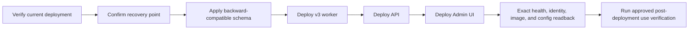

# Upgrade strategy

Upgrades preserve API compatibility, database recoverability, identity boundaries,
and exact external-mutation recovery. Fresh installation uses `./gateway setup`;
this runbook applies to an existing verified deployment.

## Release inputs

An upgrade candidate must have:

- a clean reviewed source diff;
- full Release build and test results;
- compiled Bicep and SQL migration validation;
- immutable API, worker, Admin UI, and migrator image digests;
- source fingerprint and deployment ownership binding;
- current backup/recovery evidence;
- a compatibility statement for API, database, queues, and persisted workflow state.

## Deployment order

The exact order may change when the compatibility statement requires it, but no
step may expose code to a schema or message shape it cannot read.

## Database changes

- Prefer additive migrations.
- Deploy code that stops using a field before a later release removes it.
- Keep old readers/writers compatible throughout the rollout window.
- Validate the schema fingerprint and migration history after execution.
- Run SQL changes only through the reviewed private-network execution path.
- Never initialize or overwrite a nonempty unknown database.

## Queue compatibility

Current workflow source uses `gateway-provisioning-v3`. Do not attach a v3 receiver
to v1/v2 queues or attach two workflow generations to one queue. A new incompatible
message contract needs a new queue and explicit publisher/consumer cutover.

Dead-letter state is evidence and is not an upgrade input. Do not purge or replay it
during deployment.

## Application rollout

1. Run `./gateway verify` and capture safe current evidence.
2. Confirm the target subscription/resource group and immutable image digests.
3. Close or bound mutation surfaces when the compatibility plan requires it.
4. Apply the database migration and verify exact schema state.
5. Deploy the worker and verify identity, image, queue, environment, and health.
6. Deploy the API and verify image, health/readiness, federation, and admission
   configuration.
7. Deploy the Admin UI and verify health, redirect/logout URIs, sign-in, and
   delegated API access.
8. Run `./gateway verify` again.
9. Perform the approved post-deployment use check with an existing or new isolated
   registration, without weakening key or Registry safeguards.
10. Update the concise implementation and deployment checkpoints.

For a bootstrap-owned Admin UI, use `./gateway upgrade-admin-ui` only when its
preflight accepts the exact completed deployment. Do not update the Container App
directly.

## Rollback

Rollback is permitted only to code compatible with the current database and message
state. Before changing traffic or revisions:

1. classify whether any external mutation crossed an irreversible boundary;
2. preserve operation, planned Registry ID, outbox, and correlation evidence;
3. select the previous immutable digest, never a mutable tag;
4. restore API/worker/UI revisions in a compatibility-safe order;
5. run exact readback and health verification;
6. leave ambiguous operations in their safe recovery/manual state.

Rollback never authorizes a second Registry POST or reissuance of a one-time secret.

## Acceptance

An upgrade is accepted when all exact readbacks pass, queue/outbox/job state is
classified, no unknown provider outcome was replayed, the Admin UI and API authorize
correctly, the post-deployment use check succeeds, and the checkpoint names the
deployed digests and remaining limitations without secret material.
